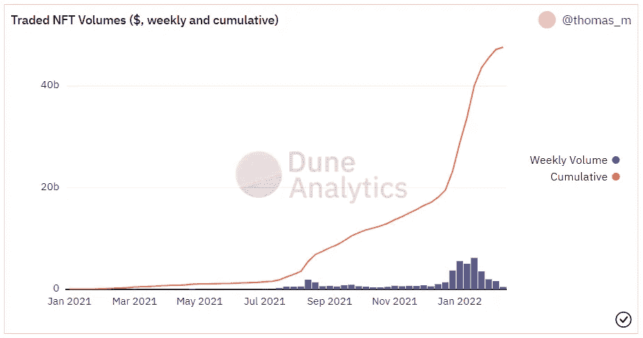

# NFT 和分析:1

> 原文：<https://medium.com/coinmonks/nft-and-analytics-1-d465cb9d857f?source=collection_archive---------12----------------------->

自 2021 年年中以来，我们一直在与一个小型数据科学团队在区块链空间研究**不可替代令牌***【NFT】***分析**。由于我们的工作已经达到了一定的成熟水平，我想尽可能在简短的博客中分享其中的一些成果。我想在第一篇文章开始时，先介绍一下 NFTs 的基本概念、NFT 市场及其分析视角。由于该领域仍然非常幼稚，对 NFT 市场数据的分析研究仍在共享探索性的统计数据*(甚至这些统计数据在我们开始时也很难找到)*。然而，我们可以很容易地说，在未来几年里，将对这些主题进行更深入的研究，甚至可能在这一领域形成具体的学术文献。因为 NFT 生态系统，凭借其独特的动力和**“数据广度”，**看起来像一个新的多学科研究领域的实验实验室，在这里，基础文献如*客户分析*和*行为经济学*将与深度学习应用如*自然语言和图像处理*相融合。

# 什么是 NFT？

由于这个问题的答案现在甚至可以在 clickbait 新闻网站的图片库中找到，我不喜欢回答这个问题，但我仍然不想在没有介绍这个概念的情况下开始。**不可替代令牌** *(NFT)* 是多个令牌标准 *(ERC-721、ERC-1155、ERC-998 等)的通称。)*区块链上的代表。与标准加密货币相比，这些资产的不可替代性源于其**【独特性】特征。因此，举例来说，美元是可替代的，因为每 1 美元与另 1 美元价值相同*(不包括根据其序列号具有收藏价值的硬币)*。与加密货币类似，比特币或以太币代币也是可替代的。另一方面，一般来说，NFT 类似于我刚刚在括号中排除的具有收藏价值的美元，尽管发行它们的“中央银行”是相同的，但由于它们的结构差异，它们的价值也不同。今天，NFT 与*艺术品*联系在一起的主要原因就是这种不可替代的结构。**

# **什么是 NFT 标准？**

**到目前为止，我们一直在谈论 NFTs 是独一无二的，但实际上并非如此。是的，NFT 合约的标准允许每个代币都是唯一的，但在实践中，每个 NFT 不必是唯一的。因此，如果您在区块链上创建两个相同的映像作为 NFT，它们将不会是唯一的。此时，我们可以根据其预期用途来讨论两个基本的 NFT 智能合约标准:**

*   **ERC-721: 该标准通常用于生产具有预定和有限供应量的真正独特的非功能性食品。绝大多数计算机生成的集合使用这个标准。由于这些集合中的供应是固定的，因此集合中不会出现通货膨胀。一旦藏品在区块链上生产，不仅合同持有者，甚至**卡玛拉·哈里斯**都不能改变藏品的供应。**
*   ****ERC-1155:** 在这个标准中，唯一的令牌生成仍然是可能的，但是可替换的令牌生成也是可能的。因此，可以说这是一个混合标准。有了 ERC-1155，就可以保证供应是无限的。因此，具有提供诸如*网站会员*等好处的效用的集合通常使用 ERC-1155 标准。这些不直接用经典的可替换令牌标准 **ERC-20、**产生的原因是，由于 NFT 标准，NFT 的元数据(图像、特征、链接等。)也可以记录在块中。ERC-20 没有这种可能性。**

# **如何衡量 NFTs 的价值**

**NFT 通常是通过智能合约提供的多个令牌的 NFT 集合的一部分。一般来说，收藏代币被创造出来后，会通过区块链上的**【铸造】**活动*随机*以*的单一价格*卖给它们的第一个主人。然后，这些 NFT 被它们的所有者列在流行的在线市场上，如 [Opensea](http://opensea.io/) 、 [Rarible](http://rarible.com/) 、 [LooksRare](http://looksrare.org/) ，以期望的价格出售，自由市场经济就此形成。继续这个标题为*的寓言，“NFT 是什么？”*我们可以把**【中央银行】**或者国家看作 NFT 集合。正如每个国家的货币相对于其他国家的货币有一个基于其经济实力，潜力和可靠性的价值，每个 NFT 收藏与其他收藏相比有一个相对的整体价值。你可以想象，这个价值是由制作藏品的人或机构的潜力、可靠性和受欢迎程度决定的；或者与藏品的质量、实用性和经济性*(如总供应量)*。我们可以从三个主要特征来审视当今市场上的 NFT 系列:**

*   ****艺术收藏:**这些是真正艺术家制作的 NFT，往往供应量很低*(我的意思是低，比如 5，10，50)* 。这些收藏品的价值和艺术家的价值是一样的。与现实中一样，集合中的令牌的值也是艺术地确定的。**
*   ****实用程序集合:**这种类型的 NFT 可以被认为是*证明令牌*，它向持有者提供各种特权或功能。例如，使用会员系统的网站可以向其用户出售作为 NFT 进入网站所需的令牌，并且只能接受其加密钱包中有该令牌的用户。这些类型的集合用于不同的实用程序，例如 web 应用程序的成员权限、音乐会门票、允许将付费电子书或报告下载到计算机的一次性密码等。自然，这些代币的价值是与其效用并行确定的。**
*   ****电脑生成的藏品:**属于这些藏品的代币，由电脑生成，硬币图像之间有随机差异**(性状)**，高供应量*(如 8888，10000，20000)* 。就数量而言，今天计算机生成的收藏拥有最大的市场份额。迄今为止，这些藏品的价值通常取决于它们的“先行者”特征和创作者的受欢迎程度。我说的先发制人指的是间接的受欢迎程度，因为一些技术特征首次在区块链上实现，例如**“第一个令牌可以交互的集合”** *(例如，两个 NFT 可以“耦合”产生一个新的“宝贝”NFT)* 、**“第一个背景颜色可以动态变化的集合”** *(例如，晚上暗，白天亮)，或者* **“第一个集合完全分布在当然，由于这种技术应用需要深入了解智能合约编码，我们谈论的是**ur ahin**的受欢迎程度，而不是 Instagram 影响者的受欢迎程度。但当然，也有一些系列由于影响者而获得价值，但实际上并没有任何特色…****

****

**The cheapest token of the Bored Ape Yacht Club is now for 83.69 ETH ([https://opensea.io/assets/0xbc4ca0eda7647a8ab7c2061c2e118a18a936f13d/4227](https://opensea.io/assets/0xbc4ca0eda7647a8ab7c2061c2e118a18a936f13d/4227))**

**电脑生成的系列通常是通过在基本插图上随机添加各种配件元素来创建的。例如，最著名的收藏之一**“百无聊赖的猿猴俱乐部”***【BAYC】*收藏，在市场上的总交易额为 **400，000 ETH** *【约 12 亿美元】*，是根据一只猴子的插图创作的，上面有 *10，000* 种不同肤色、嘴部结构、服装、眼镜和帽子的不同组合。由于这种多样性，同一收藏中的代币形成了不同的货币价值。传统经济中的供求曲线也适用于 NFT 经济，收藏品中越稀有的东西越有价值。再次举一个 BAYC 的例子，在我写作的时候，收藏最便宜的令牌列为 89.9 ETH，而头上戴着五颜六色队长帽的猴子最便宜的令牌列为 169 ETH。我将在我的下一篇博客中详细介绍这个话题。**

# **NFT 现在有多大价值？**

**到目前为止，持有任何 NFT 的加密货币钱包数量已经超过 300 万个。截至 2022 年 1 月，每周有超过 **20 万个**钱包在积极交易 NFT，我可以说这些 NFT 的市场价格在**0.12-0.17 ETH**之间(按今天的价格计算为 360-510 美元)。累计来看，NFT 市场的总交易额已经达到了 500 亿美元。今天，硬币供应量为 5-2 万枚的 NFT 邪教收藏的作品可以定价在 5-100 ETH 之间。因此，我们谈论的是一个相当大的市场，并且仍在继续其指数增长曲线*(随着加密市场最近的下跌，这条曲线已经有点断裂)。***

****

**[https://dune.xyz/thomas_m/NFT-stats](https://dune.xyz/thomas_m/NFT-stats)**

**未完待续。**