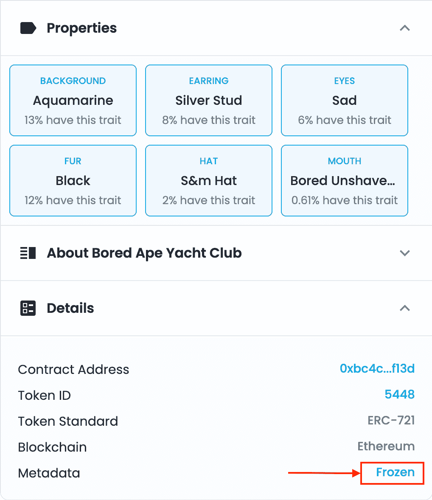
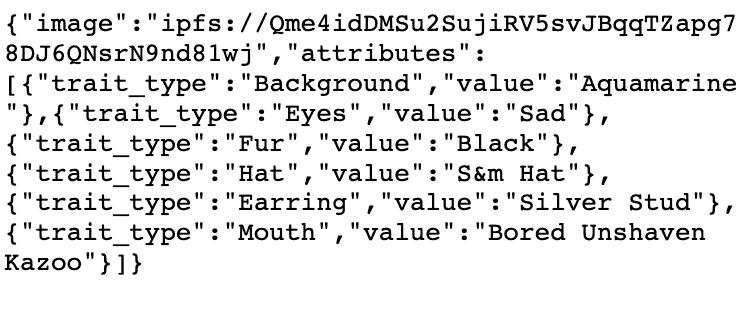
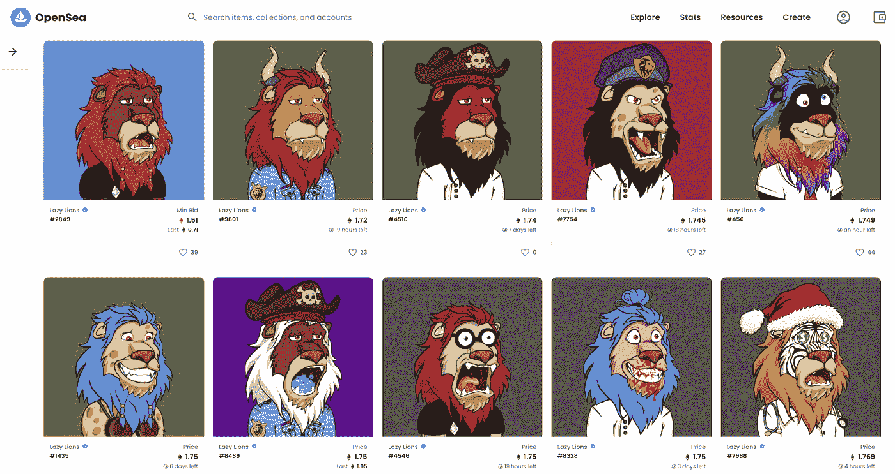
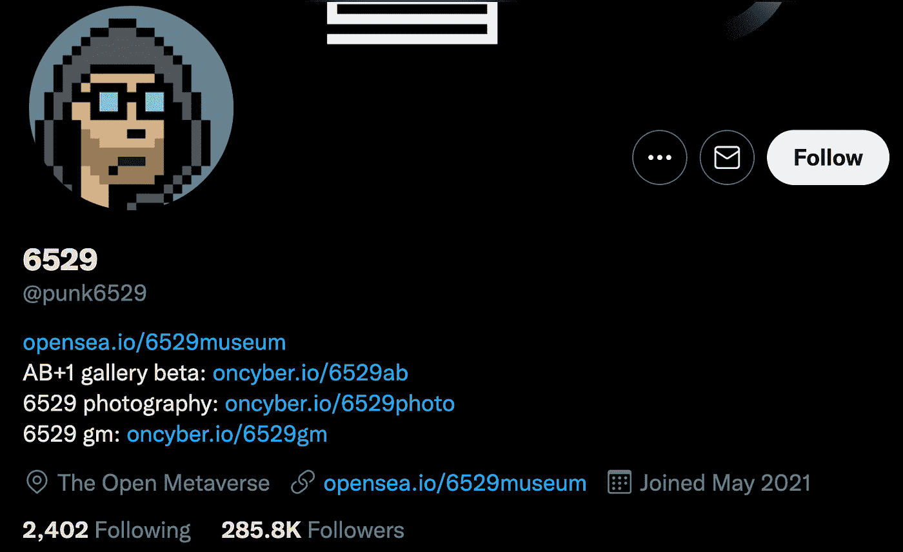
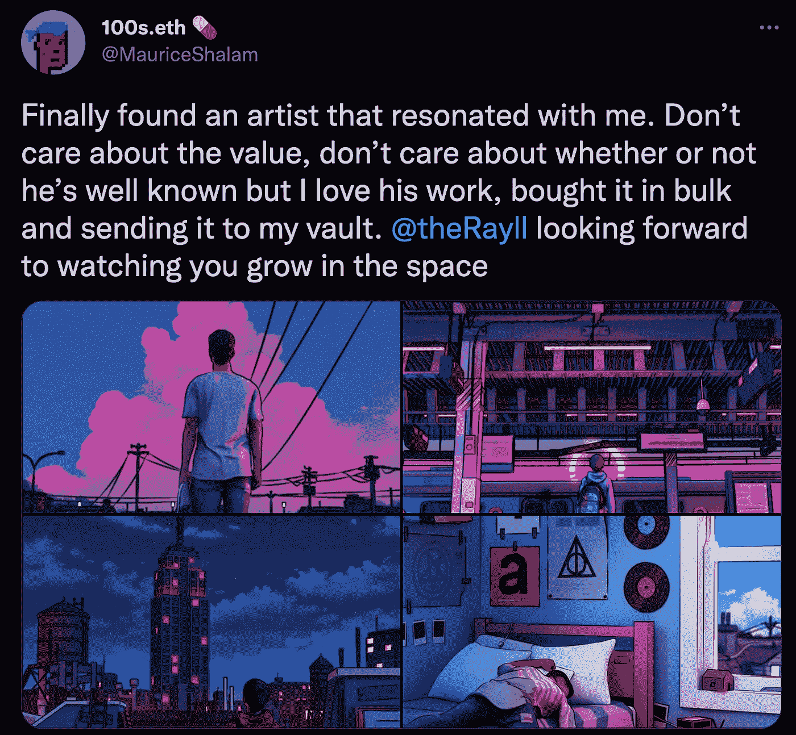
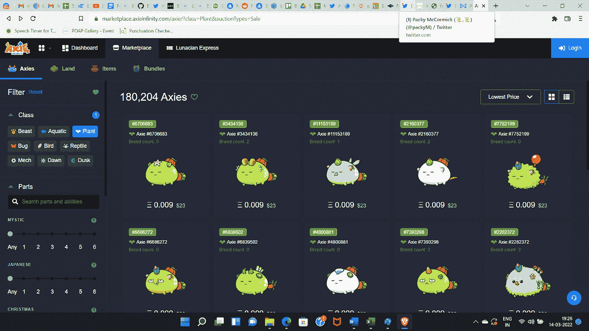

# NFT 及其使用案例

> 原文：<https://medium.com/coinmonks/nft-and-its-use-cases-51f7a1839787?source=collection_archive---------30----------------------->

***用*** [*写成【舒瓦姆拉纳】*](https://medium.com/u/a156fb3a8cab?source=post_page-----51f7a1839787--------------------------------)

# 什么是 NFT？

NFT 是一种区块链标准，用于表示唯一的项目。NFT 的所有权代表物品的所有权。拥有一幅 NFT 就像拥有一张邮票、一张契约或一个头衔。NFT 可以代表任何类型的物理或数字所有权。每个 NFT 都有一个唯一的 ID 和[元数据](https://en.wikipedia.org/wiki/Metadata)；物品的相关信息存储在区块链上。项目或项目的数字证书可以参考元数据存储在分散存储系统中。每个区块链都有自己定义的非功能性测试标准。创造一个 NFT 的过程叫做铸造。一旦创建，NFT 可以通过市场进行交易；人们不需要亲自了解买方/卖方来交易 NFTs(无信任交易)，这使得 NFTs 比其他集合更具流动性。如今，NFTs 的主要用途是内容(艺术、音乐甚至写作)。另一方面，NFT 可以代表任何改变所有权的独特物品。如果项目是物理的，可以用 NFT 进行数字表示(类似于证书),使所有权转移变得透明和容易。

# NFT 标准

最常见的 NFT 标准是 ERC 721。每个 ERC 721 令牌都有一个 unit256 (uint256 是一个 256 位以下的非负整数)ID 和元数据。根据 ERC721 标准，“这对(合同地址，uint256 tokenID)将成为以太坊链上特定资产的全球唯一且完全合格的标识符。”大多数 NFT 还包含“元数据”,它提供了 NFT 的更多细节。这包括一个永久文件存储系统的 URL，例如 [IPFS](https://hackernoon.com/a-beginners-guide-to-ipfs-20673fedd3f) 或 [Arweave](https://arweave.medium.com/what-is-arweave-explain-like-im-five-425362144eb5) (因为在区块链上存储文件太贵了)和 NFT 的客观属性(例如:背景颜色)。一旦文件被上传到带有“内容标识符”(CID)的 IPFS 或永久存储系统上，如果不更改 CID，其内容将无法更改。NFT 平台还提供了一个创建 CID 并在 IPFS 上保存文件的接口，并提供了一个选项[冻结元数据](https://support.opensea.io/hc/en-us/articles/1500012270982-What-is-Freezing-Metadata-)。

来源:[https://opensea . io/assets/0 xbc 4 ca 0e da 7647 A8 ab 7 c 2061 C2 e 118 a 18 a 936 f13d/5448](https://opensea.io/assets/0xbc4ca0eda7647a8ab7c2061c2e118a18a936f13d/5448)

[计]元数据

以太坊社区进行了一项调查并最终确定了术语“NFT”来代表独特数字资产的标准。

# NFT 用例

虽然非功能性测试的使用案例在不断发展，但这些是截至 2022 年 3 月最常见的案例:

1.  **NFTs for causes** :当今社会的许多问题都是企业无法解决的，而且会被忽视，因为企业要么需要即期利润，要么需要基于未来现金流贴现预测的估值才能起飞。国家森林小组越来越成为聚集社区支持和/或资助这类倡议的首选模式。用于公益事业的非捐赠基金比捐赠基金更好，因为虽然基金可以像捐赠一样投入使用，但当捐赠者需要流动资金时，他/她可以在流动市场(如果项目受欢迎)套现。

*   《福布斯》的一篇文章解释了一些非技术企业如何创造社会价值。
*   METKAT 是 NFT 在瓦济克斯的一个项目，艺术家将收益的 25%捐赠给流浪动物事业。
*   [饥饿的人类](https://nft.wazirx.org/collection/The-Hungry%20Human)是瓦济克斯的一个 NFT 项目，在这个项目中，艺术家向需要帮助的人类同胞捐赠一个 NFT 的价格，作为对收藏者的回报，艺术家会发放一个额外的 NFT。
*   [数字慈善艺术](https://www.digitalcharityart.co.nz/)展示 NFT 慈善项目，包括海洋保护
*   一个名为“再生密码经济学”的全新领域正在兴起，它涉及到通过 web 3 直接并主要致力于社会的积极成果。
*   以太坊生态系统建造者 GitcoinDAO 设计的[最伟大的 LARP](https://greatestlarp.com/) 使用 NFT 为公益项目筹集资金。

2.**收藏品**:类似于集邮。有一些罕见的邮票，我们小时候就准备用它们交换多种常见的邮票。也类似于挂在你墙上或装饰在你架子上的画-根据一个人的消费意愿，一个人可能会买几百卢比到几百万卢比不等的画/工艺品。大多数购买这些收藏品的人直到他们厌倦了才会离开，但是一旦他们厌倦了，总会有一个流动市场供他们出售。一些喜欢冒险的收藏者能够发现有价值的收藏品，并将其转化为投资。是的，这些人大部分时间都在网上，有多个画廊来展示他们的收藏。

*   [beyondlife.club](https://www.beyondlife.club/) 有多种收藏品，包括印度宝莱坞明星[阿米塔布·巴昌的 NFTs](https://amitabh.beyondlife.club/) ，印度宇航员和第一位印度裔女性晚去太空[卡尔帕纳·楚拉的 NFTs](https://marketplace.beyondlife.club/kalpana-chawla-NFT) 。
*   第一个漫威数字漫画[收藏品](https://www.marvel.com/articles/gear/first-ever-marvel-digital-comic-collectibles-nft-veve)出现在 VeVe 上。

3.**俱乐部会员**:类似狮子会、扶轮社、演讲会。有 NFTs 的人可以进入俱乐部。一些俱乐部为一项事业而工作，而另一些则在特定领域工作，如时尚、电影和建立品牌。全球俱乐部会员通常限制在 10k 以内。俱乐部几乎总是有一个路线图，包括将所有 NFT 交易的 x%投资于社会事业，y%投资于 NFT 持有者，z%用于发展(在大多数情况下是元宇宙申请)，这使得 NFT(俱乐部)更加有用和有价值。如果俱乐部起飞，更多的人会想进入，会员人数有限，NFT 的价格上涨。NFT 持有者(俱乐部成员)还可以获得多次空投(免费或低价分发新代币)。

*   [CSS 俱乐部](https://www.css.club/)就是这样一个电影迷俱乐部。该俱乐部计划在沙盒元宇宙中开发一个应用程序来模拟电影明星的生活。该俱乐部可能会建立公用事业，提供绳索，甚至从电影行业的名人。
*   [拥抱](https://twitter.com/thehugxyz)是女性主导的加密项目的加速器。genesis NFTs 提供加速器会员通行证和代币赢取机会。
*   无聊猿游艇俱乐部是 NFT 最成功的俱乐部之一。

4. **PFP** :资料照片；随着人们将大部分时间花在网上，他们不再去买漂亮的衣服，而是去买漂亮的个人照片。问问那些在游戏中买背心、帽子的玩家。

来源:[https://www.lazylionsnft.com/](https://www.lazylionsnft.com/)

5.**化名身份**:一些 NFT 持有者在社交媒体上的 NFT 个人资料拥有大量粉丝。没有人知道他们到底是谁，很少有人关心。

资料来源:https://twitter.com/punk6529

6.品牌:品牌与精明的 NFT 客户群建立了根深蒂固的关系。投资 NFT 项目也是(I)对冲消费从实体世界向数字世界的转移，尤其是对时尚和奢侈品牌而言;( ii)在没有付费媒体的情况下，在 NFT 社区中获得免费客户——社区然后负责社交媒体的营销。

报道:[阿迪达斯计划如何统治元宇宙](https://www.inputmag.com/style/adidas-bored-ape-yacht-club-nft-collection-metaverse-nfts-digital-sneakers-shoes-clothes)

7.对艺人的投资:有些人只是为了鼓励艺人而购买。

来源:[https://Twitter . com/Maurice shalam/status/1461100687119556609](https://twitter.com/MauriceShalam/status/1461100687119556609)

8.**任何实物/数字资产的部分所有权**:房地产、设备、电影、专辑、农场、森林、游戏甚至公司(DAO)。

1.  [威瑞树](https://www.veritree.com/)
2.  [Zo 世界](https://zo.xyz/)
3.  [通用艺术](https://gen.art/)

9.**出席协议证明(**[**POAP**](https://poap.xyz/)**)**:poap 类似于参与证书或徽章。有些 POAPs 用于收集/接收未来空投的奖励，有些可能只是作为一个简历点，以证明一个人的技能或对某项事业的承诺。

10.游戏内工具 : Axie infinity 是迄今为止最成功的 P2E 游戏之一。NFT 市场提供多种物品，可以在游戏中进行游戏，或者用包括美元在内的任何货币兑现 NFT。每一笔市场交易都需要缴纳 5%的费用，这笔费用归社区国库所有。

*快照* [*阿协市场*](https://marketplace.axieinfinity.com/)

优雅大象社是《我的世界》通过与《我的世界》NFT 世界的游戏构建平台合作建立的早期 P2E。

# 当今典型的货币化方法:

1.  创始人/艺术家/开发者从首次销售中获得一定比例的利润，并从二次销售(当买家转手时)中获得版税。
2.  收藏者通过获得该项目建造的公用设施，在某些情况下空投加密令牌，空投衍生 NFT，以及在 NFT 价值升值的情况下通过销售来赚钱。

**参考文献:**

1.[https://ether eum . org/en/developers/docs/standards/tokens/ERC-721/](https://ethereum.org/en/developers/docs/standards/tokens/erc-721/)

2.[https://github . com/以太坊/EIPs/blob/master/EIPS/EIP-721 . MD](https://github.com/ethereum/EIPs/blob/master/EIPS/eip-721.md)

3.[https://docs.opensea.io/docs/metadata-standards](https://docs.opensea.io/docs/metadata-standards)

4.[https://docs.ipfs.io/concepts/immutability/](https://docs.ipfs.io/concepts/immutability/)

5.[https://support . opensea . io/HC/en-us/articles/1500012270982-什么是冻结-元数据-](https://support.opensea.io/hc/en-us/articles/1500012270982-What-is-Freezing-Metadata-)

> 加入 Coinmonks [电报频道](https://t.me/coincodecap)和 [Youtube 频道](https://www.youtube.com/c/coinmonks/videos)了解加密交易和投资

# 另外，阅读

*   [如何匿名购买比特币](https://coincodecap.com/buy-bitcoin-anonymously) | [比特币现金钱包](https://coincodecap.com/bitcoin-cash-wallets)
*   [瓦济里克斯 NFT 评论](https://coincodecap.com/wazirx-nft-review)|[Bitsgap vs Pionex](https://coincodecap.com/bitsgap-vs-pionex)|[Tangem 评论](https://coincodecap.com/tangem-wallet-review)
*   [如何使用 Solidity 在以太坊上创建 DApp？](https://coincodecap.com/create-a-dapp-on-ethereum-using-solidity)
*   [币安 vs FTX](https://coincodecap.com/binance-vs-ftx) | [最佳(索尔)索拉纳钱包](https://coincodecap.com/solana-wallets)
*   [如何在 Uniswap 上交换加密？](https://coincodecap.com/swap-crypto-on-uniswap) | [A-Ads 评论](https://coincodecap.com/a-ads-review)