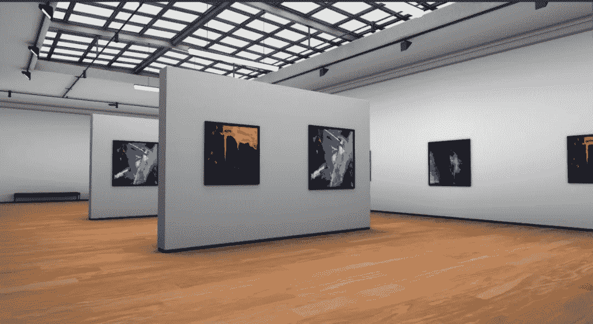

# NFT 艺术博物馆来到元宇宙

> 原文：<https://medium.com/coinmonks/nft-art-museum-coming-to-the-metaverse-cf3278c408e?source=collection_archive---------33----------------------->

想象一下，在舒适的家中漫步卢浮宫，沐浴在达芬奇、莫奈和范艾克的杰作中。Pixlr Genesis 旨在提供这一点。NFT 艺术经历了一次大繁荣，艺术家们通过新媒体一夜成名。Pixlr 一直在为艺术家创作工具来出版他们的作品，并希望通过为他们在元宇宙建立一个家来继续支持艺术。