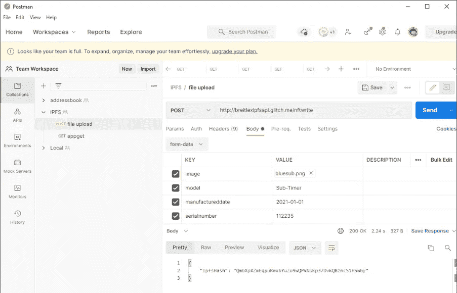
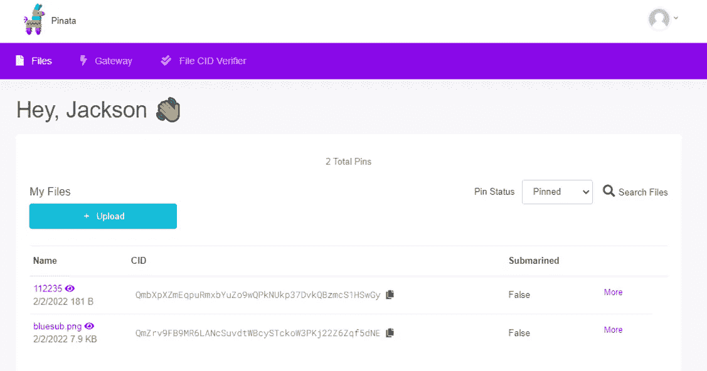

# NFT 的豪华手表证书:解释 IPFS JSON 网络服务

> 原文：<https://medium.com/coinmonks/nft-based-luxury-watch-certificate-explaining-the-ipfs-json-web-service-50a2bbbd3746?source=collection_archive---------5----------------------->

这是系列文章的第 3 部分，也是最后一部分，旨在展示[不可替代代币(NFTs)](https://en.wikipedia.org/wiki/Non-fungible_token) 如何取代手表等奢侈品的纸质真品证书。


Photo by [David Bruno Silva](https://unsplash.com/@brlimaproj?utm_source=unsplash&utm_medium=referral&utm_content=creditCopyText) on [Unsplash](https://unsplash.com/s/photos/files?utm_source=unsplash&utm_medium=referral&utm_content=creditCopyText)

参考[第 1 部分](/coinmonks/nft-based-luxury-watch-certificate-how-it-works-71d715914006)学习业务逻辑，参考[第 2 部分](/coinmonks/nft-based-luxury-watch-certificate-decentralized-app-demo-c37582861a74)走过 [DApp](https://ethereum.org/en/developers/docs/dapps/) 。

百年灵 DApp 将手表的元数据和图片保存在[星际文件系统](https://ipfs.io/) (IPFS)中。这是通过我在 [Glitch](https://glitch.com/) 上运行的基于 JSON 的 API 服务对 [Pinata](https://pinata.cloud/) 进行 API 调用来完成的。

开发者可以在我的 [Github 库](https://github.com/jacksonng77/NFT-Based-Luxury-Watch-Certificate)上访问这个项目的源代码。

在这一部分中，我将逐步使用 Pinata 存储每个 NFT 到 IPFS 的元数据和照片。

**皮纳塔**

Pinata 是一个 IPFS pinning 服务，允许用户上传和分享他们的内容到 IPFS 网络。我们将使用 Pinata 的 API 将 NFT 的 JSON 元数据和手表的图像保存到 IPFS。Pinata 有多种替代品，包括:

1.  [因富拉 IPFS](https://infura.io/docs/ipfs)
2.  永恒
3.  还是[主持自己的](https://ipfs.io/)！

要深入了解 IPFS，以及为什么它比存储 NFT 的元数据和图像更“永久”，比如说，在谷歌云上，请阅读[这个](https://docs.ipfs.io/concepts/what-is-ipfs/)。

首先，注册一个免费的 Pinata 账户。


在您的个人资料中，单击 API 密钥。


创建一个具有管理员访问权限的新 API 密钥。复制 API 密钥和 API 秘密，并将其保存在某个地方。我们将在下一步中使用它。


**JSON Web 服务**

*(这组代码是参考* [*Pinata 的服务 API 文档*](https://docs.pinata.cloud/api-pinning/pinning-services-api) *开发的)*

这个基于 NodeJS 的 JSON Web 服务允许调用 Pinata 将新的 NFT 元数据和图片固定到 IPFS。我在 [Glitch](https://glitch.com/) 上托管网络服务，并从[百年灵 DApp](https://jacksonng.org/codetest/nft/) 对其进行调用。

JSON Web 服务的源代码可以在这里找到。

```
const pinataSDK = require('@pinata/sdk');
const multer = require('multer');
const express = require('express');
const streamifier = require('streamifier');
const app = express();
const pinata = pinataSDK('your key', 'your secret');
const port = 3000;
const storage = multer.memoryStorage();
const upload = multer({ storage: storage });
const ipfsuri = "https://ipfs.io/ipfs/";
const cors=require("cors");
```

JSON Web 服务的这一部分导入所需的库，如下所示:

*   [Pinata](https://docs.pinata.cloud/) :进行 API 调用，将内容锁定到 IPFS
*   [Multer](https://www.npmjs.com/package/multer) :上传文件
*   [Express](https://www.npmjs.com/package/express) : NodeJS 的 web 框架
*   将一个缓冲区转换成一个可读的流
*   [Cors](https://www.npmjs.com/package/cors) :将对这个 JSON web 服务的调用限制到特定的源

将'`your key`'和'`your secret`'替换为您在`const pinata = pinataSDK('your key', 'your secret')`保存的各自的 Pinata API 密钥和 API 秘密。

```
app.use(cors({
  credentials: true,
  origin: ["http://localhost:8080", "https://jacksonng.org"]
}));
```

这个 CORS 设置限制从本地主机和我在[jacksonng.org](https://jacksonng.org)的网站调用 JSON API。

```
app.post('/nftwrite', upload.single('image'), function (req, res, next) {
```

定义了路由方法`nftwrite`。

```
const mystream = streamifier.createReadStream(req.file.buffer);//file more than 1MB? Drop and exit!
if (Buffer.byteLength(req.file.buffer)>= 1000000){
    res.status(500).send('Too big. Please keep to files below 1MB.');
    return;
}
```

它读取 NFT 图像的文件缓冲区，检查其大小是否超过 1 兆字节。如果图像文件太大，它会退出并显示一条错误消息。

```
mystream.path = req.file.originalname;
const options = {
    pinataMetadata: {
        name: req.file.originalname,
    },
    pinataOptions: {
        cidVersion: 0
    }
};//pin the picture
pinata.pinFileToIPFS(mystream, options).then((result) => {
    //construct the metadata
    const body = {
        "model": req.body.model,
        "manufactured-date": req.body.manufactureddate,
        "serial-number": req.body.serialnumber,
        "photo": ipfsuri + result.IpfsHash
    };
    const options = {
        pinataMetadata: {
            name: req.body.serialnumber,
        },
        pinataOptions: {
            cidVersion: 0
        }
    };
```

如果一切顺利，就给`pinata.pinFileToIPFS`打个电话，把图像钉在 IPFS 身上。它还构建了一个 JSON 结构`body`,由以下部分组成:

*   `req.body.model`:手表的型号，在调用此方法时从请求(`req`)中提取。
*   `req.body.manufactureddate`:手表的生产日期，在调用此方法时从请求(`req`)中提取。
*   `req.body.serialnumber`:手表的序列号，在调用这个方法时从请求中提取(`req`)。
*   `ipfsuri + result.IpfsHash`:手表图像的 URL，通过连接 IPFS 的 URL 和手表图像成功锁定到 IPFS 时 Pinata 返回的`IpfsHash`来构建。

```
pinata.pinJSONToIPFS(body, options).then((result) => {
    //ok done, return the hash to caller
    console.log(result);
    res.json({ IpfsHash: result.IpfsHash });
}).catch((err) => {
    //handle error here
    res.status(500).send('Something broke!')
    console.log(err);
    return;
});
```

最后，通过调用`pinata.pinJSONToIPFS`，将`body`的 JSON 内容固定到 IPFS。然后，它将 JSON 内容的 IPFS 散列`result.IpfsHash`返回给调用者。

使用 [Postman](https://www.getpostman.com/) 测试 API 调用，如下所示:



返回到 Pinata 的文件管理器。如果上传成功，您固定到 IPFS 的图像和 JSON 元数据将出现在这里。



**去中心化 App**

当用户按下[Mint]按钮为新制造的手表铸造 NFT 时，百年灵的分散式应用程序会调用 JSON Web 服务。在这一过程中，他还提供了手表的型号、生产日期、序列号和图片。

参考项目 [Github 库](https://github.com/jacksonng77/NFT-Based-Luxury-Watch-Certificate/blob/main/dapp/app/src/index.js)上的去中心化 App 的源代码。

```
var data = new FormData();
var fileInput = document.getElementById("file-watchpic").files[0];
data.append("image", fileInput, fileInput.name.toString());
data.append("model", document.getElementById("txt-model").value);
data.append("manufactureddate", document.getElementById("txt-manufactured-date").value);
data.append("serialnumber", document.getElementById("txt-serial-number").value);
```

手表的图片被传输到`fileInput`变量。连同用户对`model`、`manufactureddate`和`serialnumber`的输入，这些被保存到一个`data`变量中。

```
xhr.open("POST", "https://breitlexipfsapi.glitch.me/nftwrite");
xhr.send(data);
```

`data`然后被发送到 JSON Web 服务的`nftwrite`方法。

```
xhr.addEventListener("readystatechange", (event)=> {
     console.log(event.target.readyState);
     if (event.target.readyState === 4)  {
```

事件侦听器被声明为侦听“`readystatechange`”。`readystatechange`当手表的图片及其 JSON 元数据被成功地固定到 IPFS 并返回 IPFS 散列时，从 JSON Web 服务接收。DApp 现在准备用收到的 IPFS 哈希码铸造新的 NFT 令牌。

```
var myipfsURI = ipfsURI + JSON.parse(event.target.responseText).IpfsHash;
console.log(myipfsURI);
this.breitlexNFTContract.methods.mint(this.account, myipfsURI).send({from: this.account})
      .on('error', function(error, receipt) {
```

它读取 JSON Web 服务方法`nftwrite`返回的`IpfsHash`,并使用它来执行智能合约调用`mint`,为手表铸造 NFT，并将手表的 JSON 元数据的 IPFS 散列保存为 NFT 的 URI。

**结论**

虽然炒作的对象是 NFT 的数字艺术，但我认为，NFT 的杀手级应用在于这种技术能够创造出不可改变的数字实体资产双胞胎，即使在创造者去世很久之后，它们仍然存在。这使得 NFT 非常适合取代那些本应代代相传的纸质奢侈品证书——比如那块百达翡丽手表，你永远不会真正拥有它，而只是为下一代保管。

*“你永远不会真正摧毁一个 NFT，它只是比你活得久而已。”*

这就完成了 NFT 奢华腕表认证系列:

1.  [总部位于 NFT 的豪华手表证书:如何运作](/coinmonks/nft-based-luxury-watch-certificate-how-it-works-71d715914006)
2.  [NFT 高档手表证书:去中心化 App 演示](/coinmonks/nft-based-luxury-watch-certificate-decentralized-app-demo-c37582861a74)
3.  NFT 的豪华手表证书:解释 IPFS JSON 网络服务(这一部分)

如果您喜欢本教程，也许您也希望阅读:

*   [介绍以太坊开发环境](/coinmonks/introducing-the-ethereum-development-environment-part-1-bed0a273e55):一个逐步的指南，为在以太坊中构建去中心化的应用程序设置开发环境。
*   [自由职业者智能合约](/coinmonks/the-freelancers-smart-contract-how-it-works-fda5e1fddf8d):自由职业者和他的客户之间的一个支付系统，以确保交付和支付。
*   [Ropsten 以太坊水龙头](/coinmonks/ropsten-ethereum-faucet-web-app-cc9a50ee45fd):我在 Ropsten 网络上做了一个以太坊水龙头发出 ETH。
*   [区块链投票](/coinmonks/voting-on-a-blockchain-how-it-works-3bb41582f403):以太坊投票 DApp 的实现。
*   [使用 Kaleido 在 10 分钟内部署一个私有以太坊区块链](/coinmonks/deploy-a-private-ethereum-blockchain-in-10-minutes-with-kaleido-73c21a26d5bb):瞬间启动并运行一个私有以太坊区块链。
*   [演示解释智能合约](/coinmonks/smart-contract-explained-by-demonstration-93b06e938474):托管服务智能合约 DApp 的演示——在我看来，这是向外行人解释区块链是什么的最快方式。
*   [彩票作为智能合约](/coinmonks/lottery-as-a-smart-contract-the-business-logic-3bd22d3a6c4e):去中心化彩票，在以太坊区块链上构建彩票系统的尝试。​

> 加入 Coinmonks [电报频道](https://t.me/coincodecap)和 [Youtube 频道](https://www.youtube.com/c/coinmonks/videos)了解加密交易和投资

## 也阅读

[](/coinmonks/best-crypto-tax-tool-for-my-money-72d4b430816b) [## 加密税务软件——五大最佳比特币税务计算器[2021]

### 不管你是刚接触加密还是已经在这个领域呆了一段时间，你都需要交税。

medium.com](/coinmonks/best-crypto-tax-tool-for-my-money-72d4b430816b) [](https://coincodecap.com/crypto-to-buy-in-2022) [## 9 个 2022 年最值得购买的密码| CoinCodeCap

### 9 个 2022 年最值得购买的加密产品阅读加密产品评论和比较，了解比特币交易和…

coincodecap.com](https://coincodecap.com/crypto-to-buy-in-2022) [](https://coincodecap.com/best-hardware-wallet-bitcoin) [## 存储比特币的最佳加密硬件钱包 2022 | CoinCodeCap

### 硬件钱包是我们存储加密资产的唯一可靠选择。在本文中，我们将讨论 8 个…

coincodecap.com](https://coincodecap.com/best-hardware-wallet-bitcoin) [](/coinmonks/pionex-review-exchange-with-crypto-trading-bot-1e459d0191ea) [## Pionex 评论 2021 |免费加密交易机器人和交换

### Pionex 是为交易自动化提供工具的后起之秀。Pionex 上提供了 9 个加密交易机器人…

medium.com](/coinmonks/pionex-review-exchange-with-crypto-trading-bot-1e459d0191ea) [](/coinmonks/top-3-telegram-channels-for-crypto-traders-in-2021-8385f4411ff4) [## 2022 年密码交易员的三大电报渠道

### 加密信号是来自专业交易者的交易想法，以特定的价格或价格买卖特定的加密货币

medium.com](/coinmonks/top-3-telegram-channels-for-crypto-traders-in-2021-8385f4411ff4) [](https://coincodecap.com/free-crypto-portfolio-trackers) [## 2022 年 5 个最佳免费加密投资组合追踪器

### 在这篇文章中，我们将带你通过一些最好的免费加密投资组合追踪器，让你选择最好的…

coincodecap.com](https://coincodecap.com/free-crypto-portfolio-trackers)