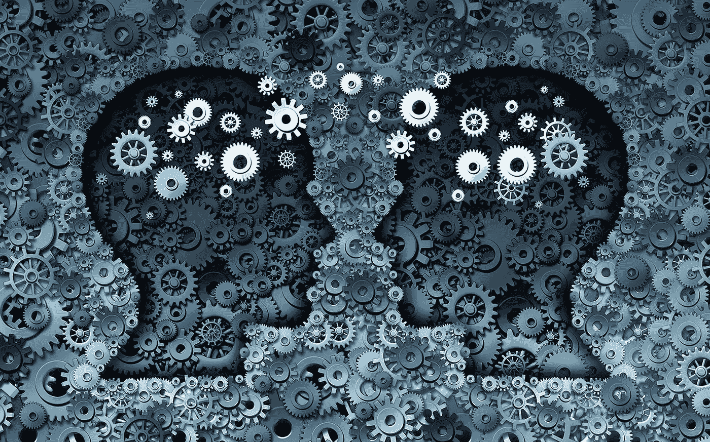
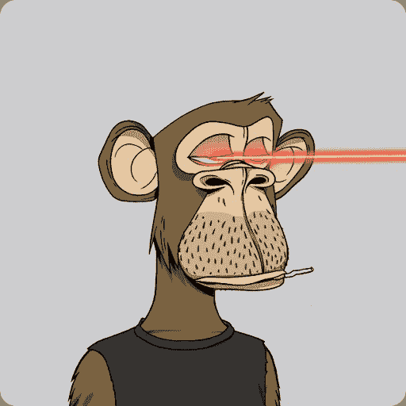
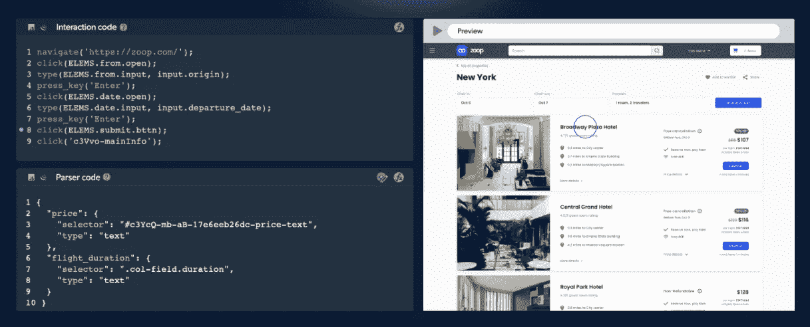

# NFT 基础:为你的 GAN 项目收集网络数据

> 原文：<https://medium.com/coinmonks/nft-basics-collecting-web-data-for-your-gan-project-ad978779dfa0?source=collection_archive---------12----------------------->

(Image Licensed from Shutterstock)

当大多数人想到**不可替换令牌** (NFTs)时，他们通常会想到艺术品，这已经成为 NFT 技术的一个流行用例。换句话说，NFT 是一个位于区块链**的**系统，允许个人或组织宣称任何数字项目的所有权，包括音乐、代码和艺术

有些人可能熟悉 [**百无聊赖的猿游艇俱乐部**](https://boredapeyachtclub.com/#/) ，这个项目产生了一万件独特的数字艺术作品，而其他人则熟悉[**crypto 朋克**](https://www.larvalabs.com/cryptopunks) ，这是由幼虫实验室制作的一个受欢迎的 NFT 艺术收藏。

(CryptoPunks sample Licensed courtesy of Shutterstock)

无聊的猿类可能看起来只不过是一个笑话，但在真实的经济条件下，整个收藏价值超过 10 亿美元——一些单个猿类的售价超过 200 万美元。

然而，故事并没有就此结束。一群参与 Bored Ape 项目的人决定应用**生成对抗网络** (GANs)技术来实现他们自己的想法。

在计算机编程中使用 [**GAN**](https://github.com/hindupuravinash/the-gan-zoo) 来创建/生成人类的无监督输出。由此产生了甘百无聊赖的猿系列。

Source: [**@boredapebot**](https://twitter.com/boredapebot)

# 数据在创建 GAN 中的作用

GAN 由一个“**发生器**和一个“**鉴别器**构成生成器根据提供给算法的训练数据生成新数据，如图片或文本。鉴别器负责辨别新生成的数据集和真实世界数据之间的差异。鉴别器只识别与真实数据高度可比的数据集。这意味着，当试图构建或训练能够产生高价值输出的 GAN 时，获得准确、高质量的数据至关重要。

# 如何为您的 GAN 项目收集 web 数据

如果你想开始使用 GANs，web 数据是一个很好的资源，因为它是可扩展的。收集 web 数据的方法有很多，但是我们将集中讨论两种特定的方法: **web 数据抓取工具和 web API**。

# Web 数据抓取工具

有几种 web 数据抓取工具可供使用。一些工具，如浏览器抓取插件，易于使用，适合小规模数据收集，而另一些工具需要大量的技术知识和编程技能，如 Python BeautifulSoup 和 Pandas 库。

一些网站有复杂的结构，需要复杂的脚本来解释它们。其他人可能会大量使用 JavaScript，使数据收集变得困难，除非你使用自动化浏览器，如 [**Selenium 或**](https://www.quora.com/Which-one-is-better-Selenium-or-Puppeteer) 。许多网站，如电子商务网站和社交媒体平台，都很好地防止了数据抓取，使其更加困难，并需要更先进的 [**数据抓取**](https://brdta.com/3n4zsP3) 解决方案，其中包括旋转代理和用户代理。

您可以订阅的一些比较流行的网络抓取平台有:

1.  **数据采集器**
2.  **刮蜂**
3.  **Parsehub**
4.  **幽灵特工**
5.  **Apify**

(Data Collector IDE — Image courtesy of Bright Data)

无论你选择哪种解决方案，无论是雇佣一个网络抓取自由职业者还是订阅一个 SaaS 网络数据收集平台，确保要求一个 **POC** (概念证明)和一个现场演示，以确保你可以成功地从你的目标资源收集公共网络数据。

如果你担心网络抓取的合法性，不用担心——2019 年 9 月，在一项 [**前所未有的决定**](https://law.justia.com/cases/federal/appellate-courts/ca9/17-16783/17-16783-2019-09-09.html) 中，一家美国法院已经证实，从网络上收集公共可用数据是绝对合法的。

一旦你收集了数据，你就可以用它来训练你的 GAN。

**另一方面，网站 API**提供对基于网络的数据的编程访问。许多网站都提供 API，允许您请求特定格式的数据，从而在 GAN 培训中轻松使用。一个流行的 API 是 [**IMDB API**](https://imdb-api.com/) ，它允许您为您的项目从 IMDB 电影和电视标题中收集数据。但是，请记住，这些公共 API 中有许多是有限的，因此，如果您想加快这个过程，您可以选择 web 抓取路径。

# 关税同盟对企业还有什么好处？

假设 GAN 是一个孤立的发展，只与那些参与、crypto 和艺术品交易市场的人相关，那是错误的。

人工智能机器学习 GAN 技术有可能彻底改变商业思维过程，从整个商业想法到产品和代码行。

你可能已经开始看到开始暗示业务能力的案例，如果实施得当，可能会对整个行业产生广泛的影响，如音乐、电影、图形等等。

自出道以来，GANs 有了显著的发展。当它们刚被开发出来时，它们只能产生人眼可以识别的**数字和图像。**

Source: [**@towardsdatascience**](https://towardsdatascience.com/)

从那以后，GAN 机器学习方法有了显著的进步。即便如此，它还有待完善。如果企业选择成为早期采用者，它们可能会**委派他们的 DevOps 团队**在各自的行业中获取开源 web 数据并构建独特的 GAN 模型。像这样的玩家有机会成为行业领导者，不仅是通过提出人类思维从未想象过的概念，而且通过利用**尖端技术来打破常规。**

> 加入 Coinmonks [电报频道](https://t.me/coincodecap)和 [Youtube 频道](https://www.youtube.com/c/coinmonks/videos)了解加密交易和投资

# 另外，阅读

*   [如何在 FTX 交易所交易期货](https://coincodecap.com/ftx-futures-trading) | [OKEx vs 币安](https://coincodecap.com/okex-vs-binance)
*   [CoinLoan 评论](https://coincodecap.com/coinloan-review) | [YouHodler 评论](/coinmonks/youhodler-4-easy-ways-to-make-money-98969b9689f2) | [BlockFi 评论](https://coincodecap.com/blockfi-review)
*   《XT.COM 评论》的[《币安评论》的](https://coincodecap.com/profittradingapp-for-binance)|
*   [SmithBot 评论](https://coincodecap.com/smithbot-review) | [4 款最佳免费开源交易机器人](https://coincodecap.com/free-open-source-trading-bots)
*   [比特币基地僵尸程序](/coinmonks/coinbase-bots-ac6359e897f3) | [AscendEX 审查](/coinmonks/ascendex-review-53e829cf75fa) | [OKEx 交易僵尸程序](/coinmonks/okex-trading-bots-234920f61e60)
*   [如何在印度购买比特币？](/coinmonks/buy-bitcoin-in-india-feb50ddfef94) | [瓦济克斯评论](/coinmonks/wazirx-review-5c811b074f5b)