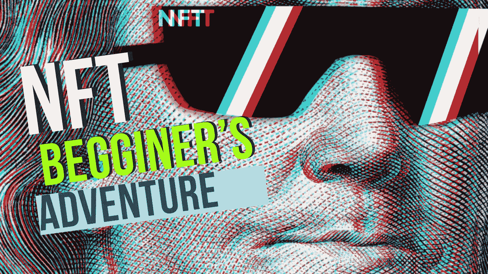
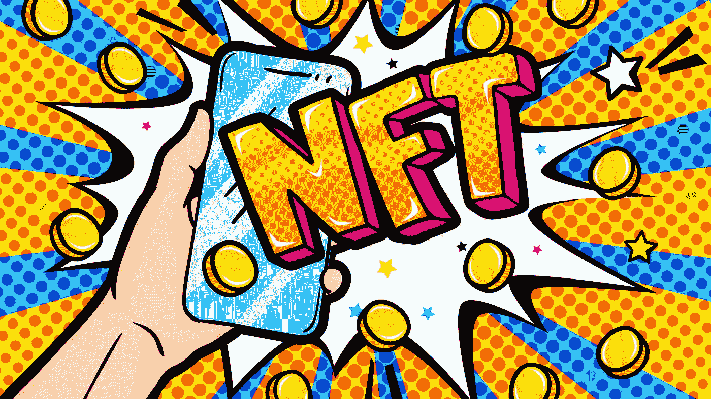

# NFT 初学者冒险记

> 原文：<https://medium.com/coinmonks/nft-beginners-adventures-74ac48d27746?source=collection_archive---------56----------------------->

NFT 已经成为市场上非常重要的数字标准，从而确立了它开始建立新的经济惯例。

起初，对于大多数营销人员(和普通大众)来说，整个 NFT 事件似乎令人困惑。一个 JPEG 文件怎么可能卖到几十万美元甚至更多？

正如我们将看到的，说服某人以 100 美元购买电子产品需要一个详细的策略，包括深思熟虑的漏斗、市场研究、营销技巧、清晰详细的内容，偶尔还需要运气。

这就是为什么简单的照片在互联网上可以卖到超过六位数的价格，这在我们看来似乎令人难以置信。

所以，如果你不明白 NFT 是如何工作的，你并不孤单。当 Tiktok 刚刚起步时，我们所有人都觉得它不寻常，尽管有些人比其他人更不寻常，可以肯定地说，非功能性测试将会一直存在下去。

这就是为什么营销人员需要了解 NFTs 的基础知识，并开始考虑如何营销这样一种新产品并进入该行业。

# 那么什么是 NFT 呢？

不可替代令牌，或简称为 NFT，是一种不可替代的唯一令牌，具有独特的内在价值。它可以是音乐、文本、图像、3D 对象，或者任何可以通过 NFT 出售的东西。

每一个这样的 NFT 代币都是独一无二的，它证明了所有者对该产品的所有权。NFT 代币的购买者(或作者)可以自行决定如何处置它，相关信息记录在区块链中。

信不信由你，NFT 市场正在蓬勃发展。根据 [NFT 统计:NFT 市场洞察、趋势、](http://nft-stats.com/)和最畅销的[NFT](http://nft-stats.com/)，平均每天售出 50，000 件 NFT，产生 1.362 亿美元的交易量。每周，最伟大的 NFT 项目都能卖出数百万美元的价格，最高成交额为 6900 万美元。

数字是一个快速增长的行业，在这个行业中，出现了一系列新的活动，所有这些都提醒我们创新的力量，特别是在学习像众所周知的 NFT 这样的概念时。

在过去的两年里，世界范围内非艺术团体在艺术界的对话越来越多。最终，它是一种激励艺术家采用区块链技术为他们的艺术提供动力的媒介。由于这场流行病，数字圈内人士和拍卖行正在拥抱数字世界，这一事实导致了艺术市场新分支的兴起。

# NFT 铸币厂

一般来说，当我们谈论数字资产时，我们指的是数字资产。NFT 铸造简单地说就是在*区块链*上制造。

什么可能是 NFT？基本上，我们在数字空间拥有的一切。它可以是一条推文，一件数字艺术品，甚至是一张音乐专辑，但我们在 2021 年看到的最成功的是艺术收藏。

在 T2 区块链 T3 技术的帮助下，世界各地的艺术家都可以联系艺术收藏家，安全地出售他们的作品。最棒的是，任何人都可以创作并学习如何出售 NFT 艺术品

但是，标记数字资产或铸造 NFT 的过程会招致一笔可怕的汽油费。大部分都是在[以太坊](https://es.beincrypto.com/precio/ethereum/)上铸造的，所以我们就说说以太坊上的铸造。但是大众网在燃气交易和费用方面有一个很大的劣势，一般都是高额的燃气费。

虽然制造 NFT 的过程与向流媒体平台上传内容没有太大区别，但汽油费并不是一个微不足道的数额，而且会随着时间的推移而波动。我建议在创建和执行交易之前，先在以太扫描上查看以太坊汽油费的当前价格[。](https://etherscan.io/gastracker)

为了造币和手工艺，你需要一个加密货币钱包，如 [MetaMask](https://es.beincrypto.com/aprende/metamask-guia-completa/) ，以及一些乙醚(ETH)来支付汽油费。然而，在本指南中，我们将向您展示如何使用以太坊和多边形*区块链*免费创建和销售 NFT，我们将在我的下一篇博客中对此进行更多讨论。

# 当你买了一个 NFT，你会得到什么？

对一些非技术人员来说，好处就是拥有一项他们认为会像购买股票一样升值的数字资产。比如 Twitter 的联合创始人兼首席执行官杰克·多西，他将自己的第一条推文变成了 NFT，并以 290 万美元的价格出售。

对于其他 NFT，好处可能是访问在线社区、现场活动、实物产品或任何与创作者一致的东西。例如，内容创建者可以使用 NFT 作为“凭证”，这样他们的追随者就可以参加他们的主要公开露面，可以进入绿色房间，让创建者加入他们的播客，甚至可以进行虚拟直播。一个小时的问答时间。

如果这个 NFT 的价值增加，购买它的人可以出售它以获利，并将效用(访问 keynote、播客采访或问答)提供给他们的另一个追随者。

# 如果你给一个 NFT 截图，是不是意味着它现在是你的了？

简单的回答是没有。

这正是非功能性测试如此重要的原因。你可以在手机上放一张 NFT 的截图作为保护，但除非你拥有原件，否则你不会从交易和增值中赚钱。

非常欢迎您来享受 NFTs，就像非常欢迎您来欣赏埃菲尔铁塔一样。但这并不意味着你拥有这栋楼。区块链验证你不是所有者，尽管你可能有所有的照片。

> 加入 Coinmonks [电报频道](https://t.me/coincodecap)和 [Youtube 频道](https://www.youtube.com/c/coinmonks/videos)了解加密交易和投资

# 另外，阅读

*   [Bookmap 点评](https://coincodecap.com/bookmap-review-2021-best-trading-software) | [美国 5 大最佳加密交易所](https://coincodecap.com/crypto-exchange-usa)
*   最佳加密[硬件钱包](/coinmonks/hardware-wallets-dfa1211730c6) | [Bitbns 评论](/coinmonks/bitbns-review-38256a07e161)
*   [新加坡十大最佳加密交易所](https://coincodecap.com/crypto-exchange-in-singapore) | [购买 AXS](https://coincodecap.com/buy-axs-token)
*   [红狗赌场评论](https://coincodecap.com/red-dog-casino-review) | [Swyftx 评论](https://coincodecap.com/swyftx-review) | [CoinGate 评论](https://coincodecap.com/coingate-review)
*   [投资印度的最佳密码](https://coincodecap.com/best-crypto-to-invest-in-india-in-2021)|[WazirX P2P](https://coincodecap.com/wazirx-p2p)|[Hi Dollar Review](https://coincodecap.com/hi-dollar-review)