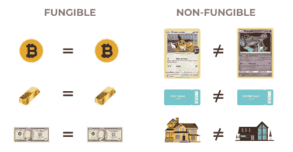

# CSC 上的 NFT 集合部署

> 原文：<https://medium.com/coinmonks/nft-collection-deployment-on-csc-6d41ce988a40?source=collection_archive---------22----------------------->

嘿嘿嘿！

大家好，0Xlive 在这里😃

在本教程中，我们将讨论 NFT 的 CRC721，以及如何使用 hardhat 在 CSC 上部署我们的 NFT

**NFT**



[Difference between fungible and non fungible resources](https://www.learningcryptos.com/non-fungible-token/)

NFT 代表不可替代令牌，这是一种使用区块链技术的独一无二的数字资源。第一批 NFT 是在该术语存在之前的 2017 年制作的。不久之后，密码猫和密码鲨鱼在市场上建立了这个术语，甚至规范了智能合约。

不可替代意味着独特和不可替换。NFT 是独一无二的；每一个都不一样。每个令牌都有独特的特征和价值。

**CRC721**

CRC-721 是 CSC 网络上不可替代的标准。它与 ERC-721 相同。

> “ERC-721 是一个免费的开放标准，它描述了如何在以太坊区块链上构建不可替换的或唯一的令牌。虽然大多数令牌都是可替换的(每个令牌都是相同的)，但 ERC-721 令牌都是唯一的。”[https://erc721.org](https://erc721.org/)

ERC-721 是一个开放标准，描述了如何在 EVM(以太坊虚拟机)兼容的区块链上构建不可替换的令牌；它是不可替换令牌的标准接口

让我们开始吧😃

首先，我们需要为我们的项目制作一个目录

```
mkdir crc721
```

然后将目录更改为 crc721，并用 npm 初始化一个项目

`cd hardhat-tutorial
npm init --yes`

现在我们要安装安全帽

```
npm install --save-dev hardhat
```

安装完成后，使用 npx 运行 hardhat

```
npx hardhat
```

选择`"Create a basic sample project”` 并输入“是”😃

注意:它会问你关于`hardhat-waffle , ethereum-waffle and hardhat-ethers`的问题，顺便说一下，你可以按照下面的说明手动安装它们:

```
npm install --save-dev @nomiclabs/hardhat-waffle ethereum-waffle chai @nomiclabs/hardhat-ethers ethers
```

并按下回车键

我们将使用 openzeppelin 库来简化它

```
npm install @openzeppelin/contracts
```

我们会在 NFT.sol 中编写一些代码

```
// SPDX-License-Identifier: MIT
pragma solidity ^0.8.10;

// Import the openzepplin contracts
import "@openzeppelin/contracts/token/ERC721/ERC721.sol";

// GameItem is  ERC721 signifies that the contract we are creating imports ERC721 and follows ERC721 contract from openzeppelin
contract nft is ERC721 {

    constructor() ERC721("simple nft", "NFT") {
        // mint an NFT to yourself
        _mint(msg.sender, 1);
    }
}
```

让我们破解上面的代码

```
// SPDX-License-Identifier: MIT
```

在第一行代码中，我们将 MIT 设置为机器可读格式的许可证

```
pragma solidity ^0.8.10;
```

它告诉编译器用 0.8.10 版编译

```
import "@openzeppelin/contracts/token/ERC721/ERC721.sol";
```

我们已经从 openzeppelin 库导入了 ERC721.sol

```
contract nft is ERC721 {

    constructor() ERC721("simple nft", "NFT") {
        // mint an NFT to yourself
        _mint(msg.sender, 1);
    }
}
```

主要部分在这里。在可靠性方面，我们的代码必须在合同之下

我们设定简单的 nft 作为我们合同的名称和 NFT 作为符号

现在是编译的时候了！

```
npx hardhat compile
```

如果没有错误，我们将开始部署:)

# 安全帽配置

首先，在`scripts`文件夹下新建一个名为`run.js`的文件

将这段代码放在 run.js 中:

```
const { ethers } = require("hardhat");

async function main() {
  /*
A ContractFactory in ethers.js is an abstraction used to deploy new smart contracts,
so nftContract here is a factory for instances of our GameItem contract.
*/
  const nftContract = await ethers.getContractFactory("NFT");

  // here we deploy the contract
  const deployedNFTContract = await nftContract.deploy();

  // print the address of the deployed contract
  console.log("NFT Contract Address:", deployedNFTContract.address);
}

// Call the main function and catch if there is any error
main()
  .then(() => process.exit(0))
  .catch((error) => {
    console.error(error);
    process.exit(1);
  });
```

现在，hardhat.config.json 应该是这样的:

```
require("[@nomiclabs/hardhat-waffle](http://twitter.com/nomiclabs/hardhat-waffle)");// This is a sample Hardhat task. To learn how to create your own go to
// [https://hardhat.org/guides/create-task.html](https://hardhat.org/guides/create-task.html)
task("accounts", "Prints the list of accounts", async (taskArgs, hre) => {
  const accounts = await hre.ethers.getSigners();for (const account of accounts) {
    console.log(account.address);
  }
});module.exports = {
  solidity: "0.8.10",
  networks: {
    csc: {
      url: "[https://testnet-rpc.coinex.net](https://testnet-rpc.coinex.net)",
      accounts: ["YOUR-PRIVATE_KEY"],
    }
  }
};
```

要部署合同，请在您的终端中键入:

```
npx hardhat run scripts/run.js --network csc
```

祝贺🥳

您在 CSC 网络上部署了第一台 NFT

我们会更进一步，做一些很酷的东西

> 加入 Coinmonks [电报频道](https://t.me/coincodecap)和 [Youtube 频道](https://www.youtube.com/c/coinmonks/videos)了解加密交易和投资

# 另外，阅读

*   [如何在 Uniswap 上交换加密？](https://coincodecap.com/swap-crypto-on-uniswap) | [A-Ads 审核](https://coincodecap.com/a-ads-review)
*   [WazirX vs coin dcx vs bit bns](/coinmonks/wazirx-vs-coindcx-vs-bitbns-149f4f19a2f1)|[block fi vs coin loan vs Nexo](/coinmonks/blockfi-vs-coinloan-vs-nexo-cb624635230d)
*   [本地比特币审核](/coinmonks/localbitcoins-review-6cc001c6ed56) | [加密货币储蓄账户](https://coincodecap.com/cryptocurrency-savings-accounts)
*   [什么是保证金交易](https://coincodecap.com/margin-trading) | [美元成本平均法](https://coincodecap.com/dca)
*   [支持卡审核](https://coincodecap.com/uphold-card-review) | [信任钱包 vs MetaMask](https://coincodecap.com/trust-wallet-vs-metamask)
*   [Exness 回顾](https://coincodecap.com/exness-review)|[moon xbt Vs bit get Vs Bingbon](https://coincodecap.com/bingbon-vs-bitget-vs-moonxbt)