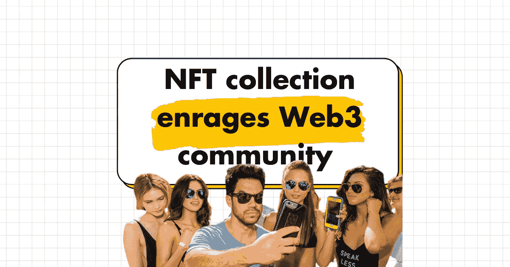
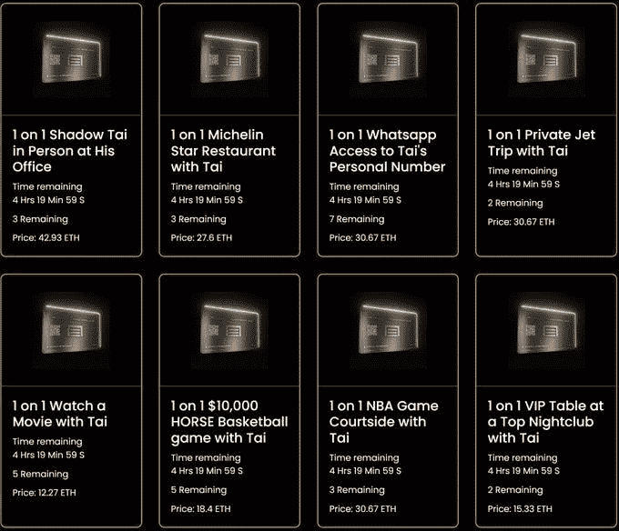

# NFT 收藏激怒了 Twitter 上的 Web3 社区

> 原文：<https://medium.com/coinmonks/nft-collection-enrages-web3-community-on-twitter-4e0b747ff2eb?source=collection_archive---------20----------------------->

这个泰·洛佩兹·NFT 的故事很有趣，但为什么没有人谈论这对他有多不利。

# 泰·洛佩兹是谁？

> 泰·洛佩兹在 Instagram 上有 290 万粉丝，在脸书上有 620 万粉丝，在 YouTube 上有 100 万订户，在 Twitter 上有 120 万粉丝。
> 
> 他是 20 多家数百万美元企业的投资者、合伙人和顾问。通过他广受欢迎的读书俱乐部和播客，Tai Lopez Show 与 40 个国家的 140 万人分享了如何实现健康、财富、爱情和幸福的建议。《泰·洛佩兹秀》每月有 80 万次下载。
> 。
> 来自[泰洛佩兹](https://www.tailopez.com/blog/about-tai-lopez)

# 他的 NFT 收藏是关于什么的？

一系列 NFT 以提供独占访问。但是什么？

# 实际卖出了多少？

总共有 18，300 辆 NFT 要出售，其中只有 2，000 辆真正铸造出来了！

这仅仅是 10%，并且只有 1 张黑卡被铸造(1 对 1 facetime)。

> 根据以太网扫描，130 万美元被筹集，这听起来是一个很大的数目，直到你意识到泰已经承诺购买一家酒店，夜总会和餐厅，专为 NFT 持有者。

这里的经济状况毫无意义，而泰将不得不经营一家能容纳 560 人的酒店、餐厅和夜总会。

# 要吸取的教训

*   在最好的情况下，泰·洛佩兹不只是带着钱跑了，他将不得不在今年大部分时间都将死去的 3 家企业上花大价钱，因为客户群太小了。
*   永远不要过度承诺你的 NFT 路线图。
*   建立信任，尽早与合适的人建立联系，以避免在你启动时出现反弹。
*   问问你的社区他们想要什么，并提供更多——不要假设你知道他们想要什么。
*   把 NFTs 想象成更广阔的 Web3 运动中的一个乐高或一块拼图——把它想象成一个品牌和一些将会持续的东西，而不是快速的现金攫取。
*   了解 NFT 营销和正确的策略，因为它不同于网络 2。[这里的](https://pooria.gumroad.com/l/ultimate-guide-for-nft-launch)是帮助你做到这一点的指南*(使用“mediumfam”打五折)*

# Web3 社区反应

[Farokh](https://medium.com/u/9b8f8d67d7ac?source=post_page-----4e0b747ff2eb--------------------------------) said:

# 结论

总之，什么是一个巨大的现金攫取企图泰已成为一个清醒的噩梦，因为社会理所当然地忽视了这个铸币厂。Tai 的客户群少得可怜。

我很难过，我们不得不经历这一切，但有必要让更多的人接受非功能性甲状腺炎治疗。并希望在此过程中了解更多关于 NFT 教育的知识。

# 👇请评论泰·洛佩兹在 NFT 的发布会上还犯了什么错误。

> 👋**在[媒体](/@pooriaarab)—[LinkedIn](https://www.instagram.com/pooria.arab/)—[Twitter](https://twitter.com/pooria_arab)—[insta gram](https://www.instagram.com/pooria.arab/)—[抖音](https://www.tiktok.com/@pooria.arab)**
> 
> 更多关于 Web3，Crypto，NFTs，DeFi 等的好东西…
> 
> 点击获取 NFT 发布战略