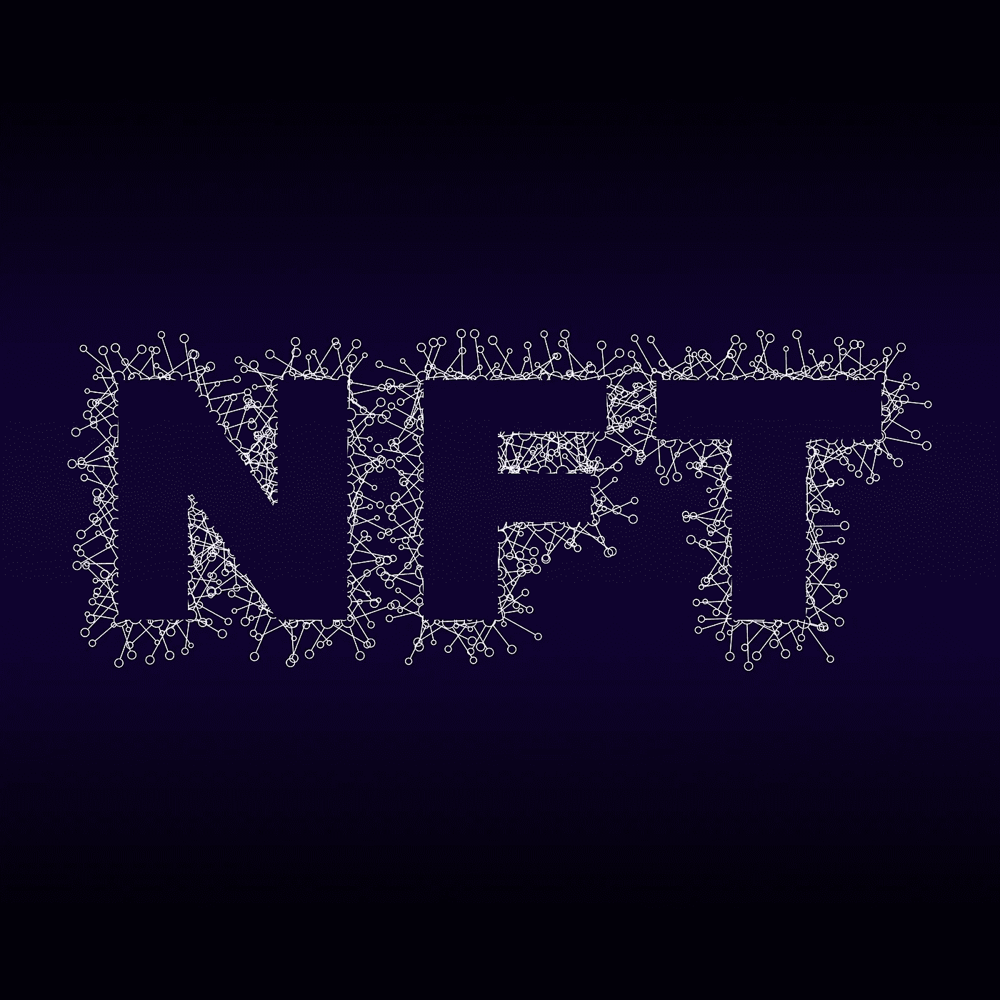

# NFT 热:下一个大事件还是数字时尚？

> 原文：<https://medium.com/coinmonks/nft-craze-the-next-big-thing-or-a-digital-fad-4dfee2a65e41?source=collection_archive---------27----------------------->

[Image by Pete Linforth from Pixabay](https://cdn.pixabay.com/photo/2021/12/06/10/20/non-fungible-token-6849846_1280.jpg)

NFT 热:下一个大事件还是数字时尚？

很难阅读新闻而不看到另一个关于“NFTs”的故事

有人花了近 600 万美元购买了埃隆·马斯克(Elon Musk)的前合伙人格里姆斯(Grimes)的数字艺术品。很明显，有人提出为杰克·多西付费，他是推特的首席执行官，第一个以 NFT 身份发推特的人。NFTs 有什么大不了的？

每天都有数千笔价值数百万美元的 NFT 交易。据估计，在 2021 年第一季度，约有 20 亿美元用于非食物疗法。

很明显，NFT 如何改变了艺术、游戏和数字收藏品领域，但 NFT 并不局限于这些行业。这些只是迅速转向利用 NFTs 价值的行业。

更广泛地说，NFT 有能力颠覆众多行业。任何数字化有价值的行业都是使用 NFTs 进行权利交换的潜在目标。

世界上最知名的品牌正在竞争，以虚拟方式将全球各地的人们聚集在一起，创造更忠诚的消费者群体，并从购买和转售 NFT 中获得新的收入流。这对品牌和他们的顾客来说是双赢的。

NFTs 有三个特性使其成为任何行业的强大工具:

1.NFT 是可以转移的。

2.NFTs 不能被拷贝或复制。

3.区块链可以通过智能合约识别和追踪所有权。

> *加入 Coinmonks* [*电报频道*](https://t.me/coincodecap) *和* [*Youtube 频道*](https://www.youtube.com/c/coinmonks/videos) *了解加密交易和投资*

# 另外，阅读

*   [有哪些交易信号？](https://coincodecap.com/trading-signal) | [Bitstamp vs 比特币基地](https://coincodecap.com/bitstamp-coinbase) | [买索拉纳](https://coincodecap.com/buy-solana)
*   [ProfitFarmers 点评](https://coincodecap.com/profitfarmers-review) | [如何使用 Cornix 交易机器人](https://coincodecap.com/cornix-trading-bot)
*   [十大最佳加密货币博客](https://coincodecap.com/best-cryptocurrency-blogs) | [YouHodler 评论](https://coincodecap.com/youhodler-review)
*   [MyConstant Review](https://coincodecap.com/myconstant-review) | [8 款最佳摇摆交易机器人](https://coincodecap.com/best-swing-trading-bots)
*   [MXC 交易所评论](/coinmonks/mxc-exchange-review-3af0ec1cba8c) | [Pionex vs 币安](https://coincodecap.com/pionex-vs-binance) | [Pionex 套利机器人](https://coincodecap.com/pionex-arbitrage-bot)