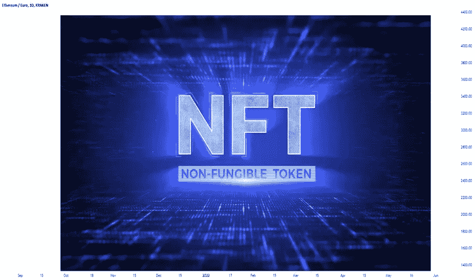
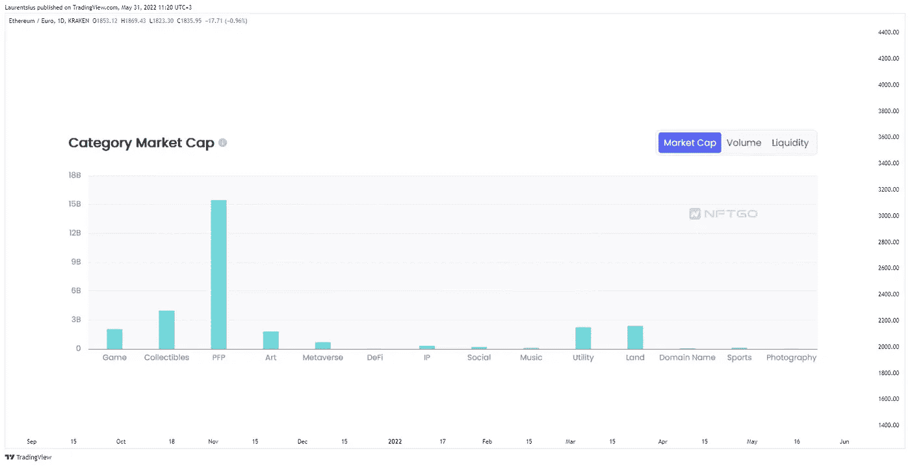
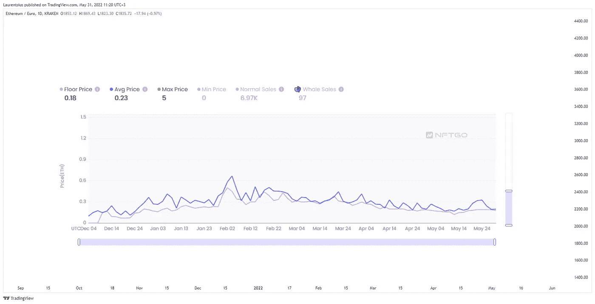

# 非同质化通证

> 原文：<https://medium.com/coinmonks/nft-d3e5aedceb97?source=collection_archive---------37----------------------->

# 嗨，交易者们——我希望你们都过得很好，尽管有熊市🐻

# 距离我的上一篇帖子已经有一段时间了，但由于 NFT 话题在 TradingView 中基本没有被发现，我想我应该把一些东西放在一起。在过去的几个月里，我一直在了解这个领域，以下是我的发现。我把我的写作分为三章:

# 1)研究
2)游戏和 NFT
3)密码步行者

# 这样更有条理，也更容易阅读。

# **1。研究**

# 在过去的 6 个月里，我一直在研究 NFT 空间，我的一些结论如下:

*   从音乐到土地所有权，NFT 可以有无限的用例
*   非专利技术将继续存在，并将成为一种市值非常高的资产类别
*   许多知名公司都对非功能性测试表现出兴趣
*   可以期待在这个领域有很多创新
*   投资者/交易者有机会

比特币基地首席执行官 Brian Armstrong 对彭博说:“不可替代代币的市场可能会与公司的加密货币业务相匹敌，甚至更大。”(2021 年 10 月 11 日)
我不知道是不是这样，但 NFTs 有很大的潜力。根据 CoinMarketCap 的数据，加密技术的总市值为 1.27 万亿美元，非加密技术的总市值为 114 亿美元(2022 年 5 月 30 日)。这使得 NFT 的市场资本总额占整个加密行业的 0.9%。这些数字表明我们还很早。

> 交易新手？尝试[加密交易机器人](/coinmonks/crypto-trading-bot-c2ffce8acb2a)或[复制交易](/coinmonks/top-10-crypto-copy-trading-platforms-for-beginners-d0c37c7d698c)

在我的研究中，我有:

*   深入到不和谐的服务器(每个 NFT 项目都有它的服务器)。我在那里一直很活跃——提出问题和建议。有趣的是，你通常不知道你是在和一个 15 岁的年轻人还是 60 岁的老人说话。
*   铸造的 NFT
*   在二级市场上买卖 NFT
*   投资失败的项目

对我来说，投资 NFT 项目与投资初创公司非常相似——你主要投资创始人和团队。这个想法也很重要——同样重要的是当某些东西不工作时能够做出改变。此外，请记住，许多创业公司都会失败，我猜这个数字在 NFTs 中会更高。在熊市之前，NFT 市场被极度炒作，如果你是一个优秀的营销者，你可以用微软的颜料画一头牛，然后以 3 ETH 的价格卖出。现在情况不再是这样了。目前，有时即使是好项目也很难卖出去。

总的来说，我认为熊市对 NFT 的生态系统有好处。它将清除一些空气和薄弱的项目将失败。正如著名投资家沃伦·巴菲特所说:“只有当潮水退去，你才能发现谁在裸泳？“强劲的项目将会成功，因为它们会继续建设，这为新的市场周期奠定了更好的基础。这也将教育投资者，因为在某些时候，当投资者有一个制造事件的白名单时，这意味着有保证的利润。市场不可能永远这样运行。我的意思是，你仍然可以通过非金融交易赚钱，但在这些市场条件下，这要困难得多，还需要做更多的工作。

以下是不同 NFT 类别的简要概述(尽管有时很难对它们进行分类):

举例来说，有时 NFT 属于多个类别，像 [PFP](https://www.tradingview.com/symbols/LSE-PFP/) (个人资料图片)项目与 P2E(发挥赚取)力学。我相信随着整个 NFT 市场的发展，这些分类将会更加精确。最有趣的领域之一是区块链博彩。这个话题在 Gemini 的文章中有很好的解释，我把它复制到这里(下面是完整的链接)。

# **2。游戏和非功能游戏**

虽然全球游戏产业在所有市场都在继续增长，但它的结构仍然主要有利于游戏开发商，并使单向价值流永久化，玩家花钱解锁游戏内资产和游戏配置。相比之下，区块链制造的游戏和分散应用程序(dApps)使
玩家能够更有效地获取游戏内购买和资产收购的效用和价值。

游戏中的区块链技术由不可替代的令牌(NFT)驱动，这是一种代表游戏内容的数字资产。这些代币是唯一的、稀有的、不可分割的，而支撑 NFT 的区块链网络促进了玩家所有权、可证明的稀缺性、互操作性和不变性。总之，这些优势有可能推动主流采用和更加公平的价值模式。

尽管在游戏世界中采用 NFTs 带来了好处，但它也带来了需要克服的重大障碍。最值得注意的是，非功能性测试需要对主流消费者更有吸引力和更直观，这些消费者可能不是技术导向型的。由于非金融资产具有内在价值，因此存在一些非金融资产被主要用作投机资产的风险。这种潜力可能会促使玩家购买游戏中的资产，并希望出售它们以获取未来的利润，而不是按计划使用游戏生态系统中的资产。

尽管存在这些挑战，但游戏行业的潜在利润将激励更多非区块链品牌尝试 NFTs，可能通过与拥有实现其愿景所需技术专长的第三方区块链项目建立合作伙伴关系。与此同时，游戏 dApps 的广泛成功可能会进一步推动 NFT 基础设施的改善，并推动创新解决方案的发展，从而推动主流应用。

点击这里阅读全文:[https://www.gemini.com/cryptopedia/nft-b...](https://www.gemini.com/cryptopedia/nft-blockchain-gaming-industry)

# **3。隐行者**

Cryptowalkers 是一个独特的集合了所有 3D 行走角色的游戏，旨在生活在元宇宙。所有的角色都有完整的身体(和定制的 3D 背景),供它的主人在各种元宇宙环境中使用。

这个项目的主要目标之一是开发一个 P2E 射击游戏，它应该在 2023 年 2 月推出(日期可能会改变，特别是在加密，但这是一个粗略的估计)。

开发进展顺利，团队发布了游戏的一些视频剪辑——这是我迄今为止见过的最先进的[区块链](https://www.tradingview.com/symbols/FWB-BLZ/)P2E 游戏之一。我认为 NFTs、P2E 和元宇宙将会成为密码领域的大事件。尽管现在还为时过早，但有迹象表明，这位球员将很快成为顶级球员之一。自从他们的铸造活动(2021 年 12 月)以来，我一直是他们社区的一员，对这个项目感到非常[乐观](https://www.tradingview.com/ideas/bullish/)。我印象最深的是这个项目的管理有多专业。

一个有能力的团队是成功的关键，而我们就有这样一个团队。他们从零开始(0！)营销预算但是这件小事并没有打扰到他们。他们设法在短时间内建立了一个强大的社区。当一个团队可以用有限的资源做事情时，你可以想象当有一些钱支持他们的愿景时会发生什么。今年 2 月，Outlier Ventures 作为投资者和战略合作伙伴加入。在那之后，对他们来说没有关闭的门。正如我之前提到的，投资强队是明智的。在熊市中尤其如此。

其次，我相信这些隐行者有一些我无法描述的 X 因素。这也是区分好歌和好歌的因素。老实说，当我第一次看到它们的时候，我觉得它们有点奇怪😀现在我喜欢那些步行者… X-factor 在起作用。

这是一张密码步行者价格走势图([https://nftgo.io/collection/cryptowalker...](https://nftgo.io/collection/cryptowalkers-official/overview))

目前的底价是 0.18 ETH。最高底价为 0.5 ETH (02.02.2022)。当前条目比这低 50%以上。由于市场情况，有廉价进入的可能。
我认为，如果交易者希望在 NFT 市场有所投资，这可能是一个非常好的选择。

CryptoWalkers 的网站是:[https://cryptowalkers.io/](https://cryptowalkers.io/)

一如既往，DYOR！

谢谢你，祝你愉快。干杯。

> 加入 Coinmonks [电报频道](https://t.me/coincodecap)和 [Youtube 频道](https://www.youtube.com/c/coinmonks/videos)了解加密交易和投资

# 另外，阅读

*   [3 商业评论](/coinmonks/3commas-review-an-excellent-crypto-trading-bot-2020-1313a58bec92) | [Pionex 评论](https://coincodecap.com/pionex-review-exchange-with-crypto-trading-bot) | [Coinrule 评论](/coinmonks/coinrule-review-2021-a-beginner-friendly-crypto-trading-bot-daf0504848ba)
*   [莱杰 vs n rave](/coinmonks/ledger-vs-ngrave-zero-7e40f0c1d694)|[莱杰 nano s vs x](/coinmonks/ledger-nano-s-vs-x-battery-hardware-price-storage-59a6663fe3b0) | [币安评论](/coinmonks/binance-review-ee10d3bf3b6e)
*   [密码交易机器人](/coinmonks/crypto-trading-bot-c2ffce8acb2a) | [Bingbon 评论](https://coincodecap.com/bingbon-review)
*   [Bybit Exchange 审查](/coinmonks/bybit-exchange-review-dbd570019b71) | [Bityard 审查](https://coincodecap.com/bityard-reivew) | [Jet-Bot 审查](https://coincodecap.com/jet-bot-review)
*   [3 commas vs crypto hopper](/coinmonks/3commas-vs-pionex-vs-cryptohopper-best-crypto-bot-6a98d2baa203)|[赚取加密利息](/coinmonks/earn-crypto-interest-b10b810fdda3)