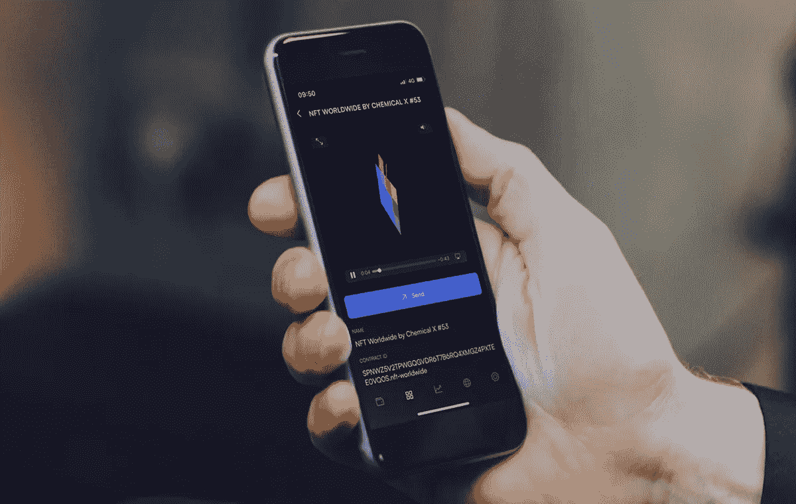
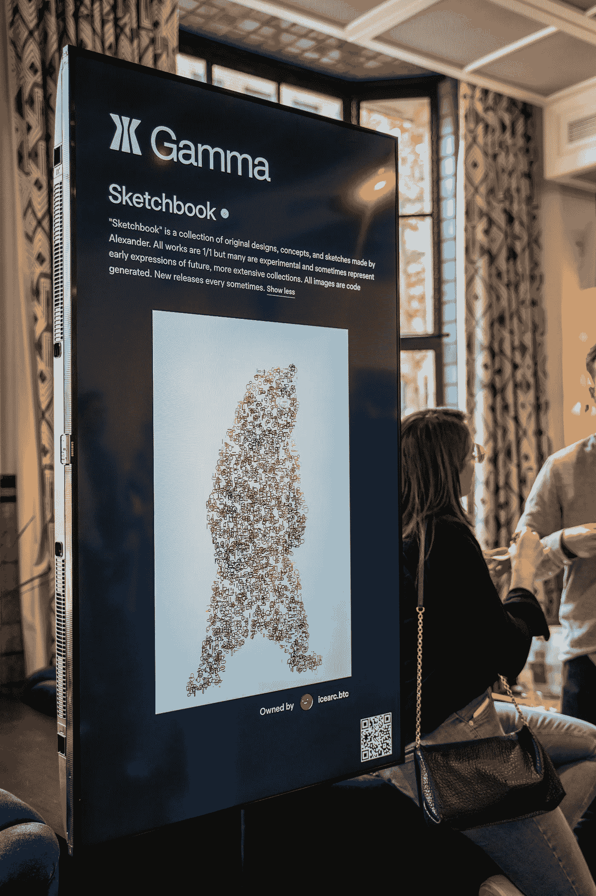
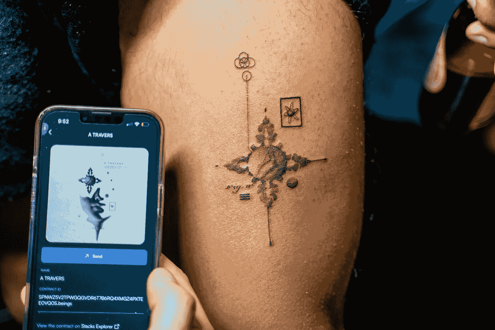

# NFT 活动票务:连接数字和现实世界

> 原文：<https://medium.com/coinmonks/nft-event-ticketing-bridging-the-digital-and-physical-world-d8e77e430a9a?source=collection_archive---------19----------------------->

## 现场活动回来了，并成为越来越受欢迎的参与加密社区的方式。

Web3 教育小组、加密会议网络活动和专属会员俱乐部聚会已经恢复，但与会者正在采用新的方式利用区块链技术进入这些现场活动。**进入 NFT 票务:这是一种革命性的方式，避免了传统票务** [**的许多中断**](https://beincrypto.com/nft-tickets-how-it-will-transform-the-web2-stagnant-ticketing-swamp/) **并同时将 crypto 好奇带入 Web3。**

上个月在 Soho House Amsterdam 举办的首届 NFT 全球活动就是一个很好的例子，该活动专注于赋予艺术家、创作者和品牌以新的创作者经济。通过使用[**Xverse crypto wallet**](https://www.xverse.app/)，活动主办方能够无缝利用 NFT 票务，因此与会者可以持有他们的第一个 NFT 获得入场券。所有与会者在下载 Xverse wallet 并与活动组织者分享他们的地址后，都会收到 ThisIsNumberOne 与 Chemical X 合作的 NFT 奖，Chemical X 是一位英国当代艺术家，他喜欢匿名，此前曾与班克斯&达明安·赫斯特合作过艺术项目。

一个行业专家小组包括来自特斯拉、[创意公司](https://www.thecreativecorporation.com/)的代表，这是一家屡获殊荣的机构，其顶级客户包括凯蒂·佩里(Katy Perry)、约翰·列侬& Spotify 和克里斯汀·弗劳尔(Khristian Flohr)，数字艺术家和 videOrbit Studio 的创始人伊莎贝尔·乌多(Isabelle Udo)——以粒子收集和班克斯的《爱在空中》的[特别 NFT 项目而闻名](https://www.rollingstone.co.uk/culture/news/banksys-love-is-in-the-air-made-into-10000-nfts-7185/)，以及拥有超过 130 万粉丝的 BAYC 成员和内容创作者，他们深入研究了如何重新想象与 NFTs 的交互以及如何在下操作

客人们还享受了著名纹身艺术家 Maxime Etienne 的免费 NFT 纹身课程，DJ Cliff de Zoete 的 beats，以及由 [**Gamma.io**](https://gamma.io/) 设计的 NFT 画廊，这是一个由 Stacks 提供动力的比特币 NFT 开放市场。“这是艺术家和社区之间的一次精彩合作，吸引了热情周到的观众。

> 通过 Xverse 移动钱包持有 NFT 门票是与会者体验的一个极好的用例，展示了我们在 Gamma 坚信的东西:NFT 在数字和物理世界的价值。- Jamil Dhanani，Gamma.io 创始人

Xverse 很高兴能参加一项活动，让人们能够拥抱这个新的数字领域。

如果您对即将到来的活动的 NFT 票务感兴趣，我们鼓励您通过 [events@xverse.app](http://events@xverse.app) 与我们联系。

## **关于 Xverse**

Xverse wallet 是你在比特币上进入 web3 的门户。它允许您收集和访问您的所有比特币和堆栈 NFT，并轻松地将它们转移到您的朋友或市场。

下载应用程序，并通过 [**不和谐**](https://discord.gg/8ucAwxHepZ) 与我们联系——我们采取用户至上的方法，欢迎任何反馈。

 [## 比特币上的 web3 门户。

### 访问构建在堆栈上的比特币 web3 应用的世界。

www.xverse.app](https://www.xverse.app/) 

> *加入 Coinmonks* [*电报频道*](https://t.me/coincodecap) *和* [*Youtube 频道*](https://www.youtube.com/c/coinmonks/videos) *了解加密交易和投资*

# 另外，阅读

*   [Bookmap 点评](https://coincodecap.com/bookmap-review-2021-best-trading-software) | [美国 5 大最佳加密交易所](https://coincodecap.com/crypto-exchange-usa)
*   最佳加密[硬件钱包](/coinmonks/hardware-wallets-dfa1211730c6) | [Bitbns 评论](/coinmonks/bitbns-review-38256a07e161)
*   [新加坡十大最佳加密交易所](https://coincodecap.com/crypto-exchange-in-singapore) | [购买 AXS](https://coincodecap.com/buy-axs-token)
*   [红狗赌场评论](https://coincodecap.com/red-dog-casino-review) | [Swyftx 评论](https://coincodecap.com/swyftx-review) | [CoinGate 评论](https://coincodecap.com/coingate-review)
*   [投资印度的最佳密码](https://coincodecap.com/best-crypto-to-invest-in-india-in-2021)|[WazirX P2P](https://coincodecap.com/wazirx-p2p)|[Hi Dollar Review](https://coincodecap.com/hi-dollar-review)