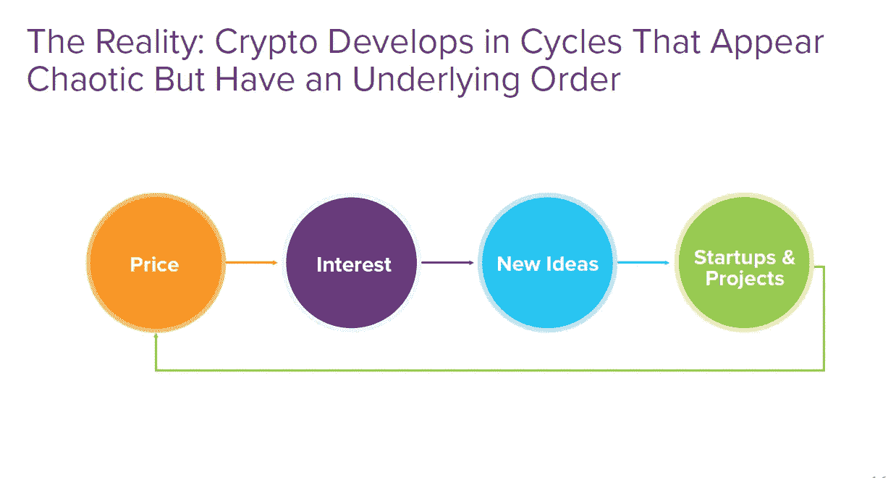
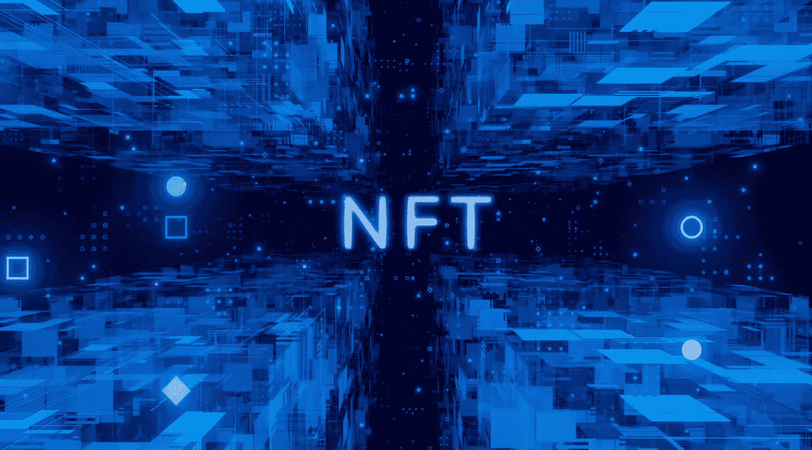
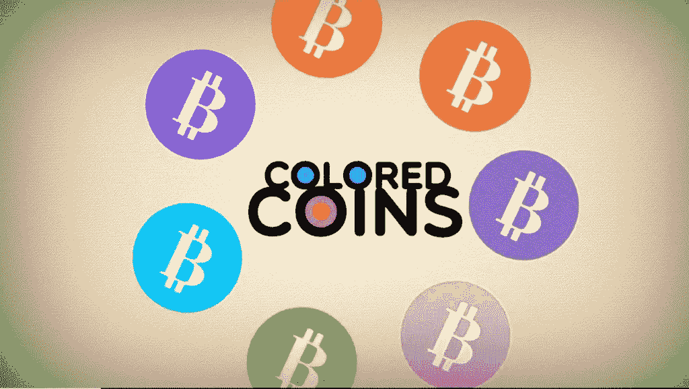
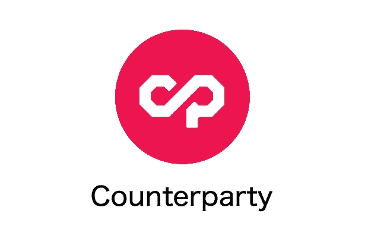
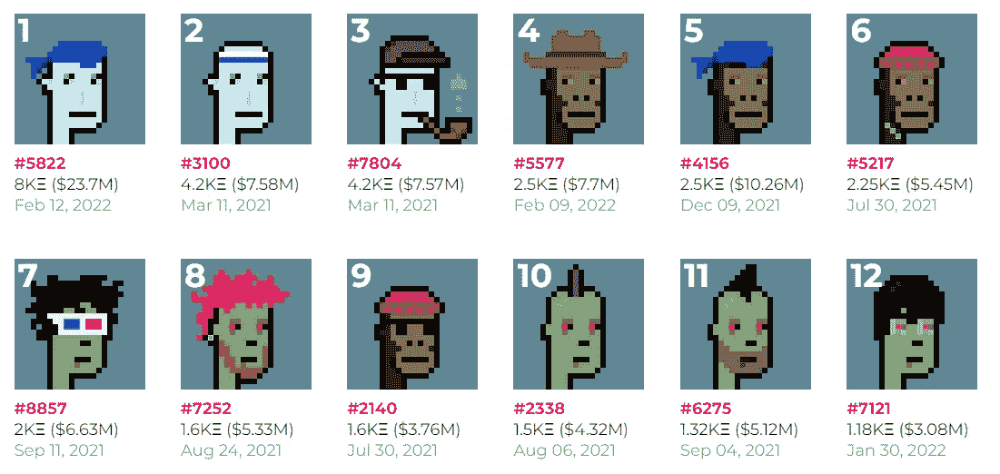
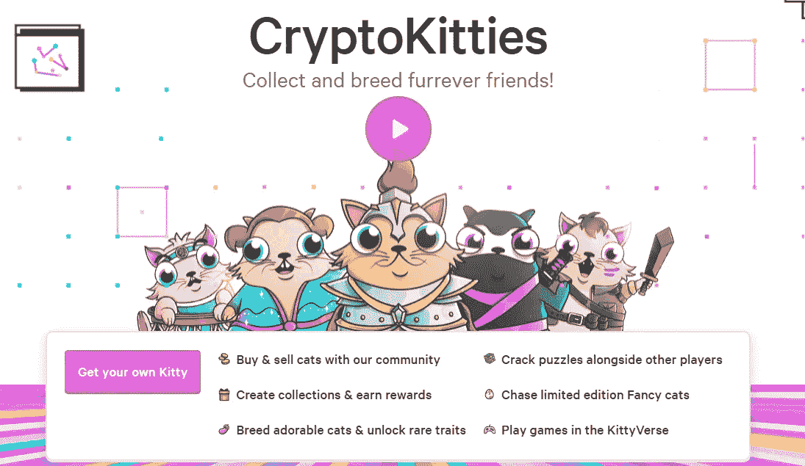

# NFT 解释道

> 原文：<https://medium.com/coinmonks/nft-explained-7b973d34b32d?source=collection_archive---------19----------------------->

如果你和我一样好奇，那么我肯定你已经问过这个问题了；什么是 NFT？或者是 NFT 的什么让它们如此主流。虽然 NFT 已经存在了很长一段时间，但它是由 Beeple、Cryptopunks 和 Bored Ape 游艇俱乐部将这项新技术公之于众的。从那以后，阿迪达斯、耐克、迪斯尼和许多名人都加入了 NFTs。就像我们看到的克里斯·迪克森解释的加密的发展周期一样；

Chris Dixon’s on Cryptonetworks and why they matter via a16z

它始于引起兴趣的价格，然后新的想法爆发，然后我们有了与之相关的启动项目，我们看到了价值的进一步增长和价格的直接成比例增长。

NFT 病可能很难理解，然而，它们越是成为头条新闻，我们就越有理由去理解它到底是什么。

什么是 NFT？

先说一个定义。扩展首字母缩略词。它仅仅意味着不可替换的令牌。详细说明这一点；

代表不可替代令牌的 NFT 只是一个用于描述独特的数字资产的术语，其所有权在区块链上被跟踪。

这可能是一组非常广泛的资产。

*   独一无二的数字艺术品
*   数字收藏品
*   一篇文章
*   虚拟棒球交易卡
*   游戏中的物品
*   一首音乐
*   一个视频

这些数字资产通常通过加密货币在线买卖。为了更容易理解，NFT 只是一种使数字文件成为可拥有的方式。你现在可以拥有一个 JPEG 或 MP3。因此，当你说你创建了一个 NFT，你是在比喻“上传”文件到区块链，这样任何人都可以跟踪其出处和属性。

**是什么让不可替换的令牌如此重要？**

重点是单词可替换的，在简单的字典中意思是可改变的，可替换的，可互换的，你明白了。可替代的东西仅仅意味着它可以被改变和替代。例如，当你想到 1 美元时，它是可替代的，甚至一个 BTC 也是可替代的，因为它可以被替换。意味着它保持相同的值。

***为了进一步解释这一点，我们先来讲一下 NFT 和加密货币有什么不同；***

NFT 代表不可替代的令牌。它通常是使用与加密货币相同的编程来构建的，如比特币或以太坊，但相似之处也仅此而已。

实物货币和加密货币是“可替代的”，这意味着它们可以相互交易或交换。它们在价值上也是相等的——一美元总是值另一美元；一个比特币总是等于另一个比特币。加密的可替代性使其成为区块链上进行交易的可信手段。

NFT 不一样。每一个都有一个数字签名，使得 NFT 不可能互相交换或相等(因此是不可替换的)。例如，一个 NBA 顶级投篮片段并不等于每天，因为它们都是 NFT。(就此而言，一个 NBA 最佳投篮片段甚至不一定等于另一个 NBA 最佳投篮片段。)NFT 的值是唯一的，每个都有不同的值。

**NFTs 简史**

在以太坊出现之前，总是有 NFT。

**2012 年:彩色硬币**

NFTs 的概念于 2012 年在**推出，当时 **Meni Rosenfeld** 的一篇论文介绍了比特币区块链上发行的“彩色硬币”的概念。这篇论文的题目是 [***彩色硬币概述***](https://bitcoil.co.il/BitcoinX.pdf) 。“彩色硬币”一词大致描述了一类用于表示和管理比特币区块链上真实世界资产的方法，可用于证明这些资产的所有权。彩色硬币有助于未来进一步实验的基础。这是我们起源故事的开始。**

**2014–2016:交易对手**

在这些年里，大量的开发和实验发生在基于比特币区块链的平台上。这是以太坊统治 NFTs 的开始。最值得注意的是允许创建数字资产的 [***交易对手***](https://counterparty.io/) 平台。后来， [***创世纪的法术***](https://spellsofgenesis.com/) 跟随对手的脚步，通过其平台开创了发行游戏资产的先河。

交易对手是一个点对点金融平台和开源的分布式互联网协议，构建于比特币区块链之上。它是早期比特币 2.0 平台之一，为用户提供了一种创建可交易货币或资产的方式。2016 年，随着[稀有 Pepes NFTs](https://rarepepes.com/) 的发布，它被用于 meme 交易等。这是 NFTs 向以太坊区块链转移的开始。

**NFTs 上市时间:2017–2021 年**

NFT 在以太坊找到更好的家

随着以太坊区块链在 2014 年的推出及其平台在 2015 年 7 月 30 日的上线，NFTs 的新时代开始了。以太坊区块链引入了一套令牌标准，允许开发者创建令牌。简而言之，令牌标准是智能合约标准的附属。对于支持智能合约的区块链，通常包含令牌标准来告诉人们如何创建、发行和部署基于其底层区块链的新令牌。

**2017:隐朋克**

在稀有的佩佩目录等受欢迎程度的基础上，创意技术专家 John Watkinson 和 Matt Hall 在以太坊区块链上创建了一组 10，000 个独特的角色，其中没有两个是相同的。这 10，000 名密码朋克很快被抢购一空，并在网上交易。

Source: Larvalabs

[**密码朋克**](https://www.larvalabs.com/cryptopunks) 项目的影响帮助启发了 NFT ERC-721 标准，并建立了当前的密码艺术运动。

**2017–2018:隐猫**

CryptoKittiesis 是一款基于区块链的虚拟游戏，允许玩家从他们的钱包中安全地收养、繁殖和交易虚拟猫。它是由温哥华一家名为 Axiom Zen 的公司发布的，并在世界上最大的以太坊生态系统黑客马拉松上推出。有超过 400 名开发者参加，这是介绍游戏的最佳地点。这个项目很快就火了。它如此受欢迎，以至于人们通过交易这些猫获得了疯狂的利润。

Source:Cryptokitties

此外，活跃程度如此之高，以至于 [**CryptoKitties**](https://www.cryptokitties.co/) 总体上阻塞了以太坊区块链，这使得它更加突出。在目睹了这次活动后，人们开始意识到 NFTs 的真正力量和潜力。

**NFT 博彩:2018–2020 年**

从这一时期到未来，NFTs 缓慢但肯定地引起了公众的注意，最肯定的是通过 NFT 游戏和元宇宙项目。第一个进入这个领域的是分散式以太坊虚拟现实平台。在 [**分散地**](https://decentraland.org/) 中，游戏玩家可以探索、建造、玩游戏、收集物品等等。想象一下《我的世界》，但是无论你在那里建造了什么，找到了什么，赚到了什么，你都拥有了。

不久之后，带有 [**【金恩币】**](https://enjin.io/) 的平台和游戏开始出现，这是一个位于区块链的平台，允许开发者在以太坊上标记游戏中的物品。通过使用 ENJ，它可以支持那些具有真实世界价值的项目。同样，[**Axie Infinity(AXS)**](https://axieinfinity.com/)浮出水面，这是一款总部位于区块链的交易和战斗游戏，由玩家部分拥有和运营。所有这些平台都是在许多人的关注下，通过秘密的冬天(熊市)发展起来的。直到 2021 年，NFTs 成为主流。

**未来如何:2021 年**

**NFT 爆炸 2021**

2021 年，对 NFTs 的兴趣增加。其他区块链如 [**卡尔达诺**](https://cardano.org/)[**索拉纳**](https://solana.com/)[**泰佐斯**](https://tezos.com/)[**流**](https://www.onflow.org/) 等。开始使用他们的 NFTs 版本进入游戏，建立新的标准以确保所代表的数字资产是真正独一无二的。具体来说，在今年第二季度初，购买潮如此惊人，以至于主流媒体经常呼吁一个即将破裂的巨大泡沫。同样，第四季度显示了 NFT 需求的大幅增长，尤其是在脸书公司宣布更名为 Meta 并迁至元宇宙后的元宇宙油田。

**2021 年及以后**

不可替换令牌的历史比大多数人意识到的要长得多。随着我们开始从实验时代走向主流，未来将会有无限的机会。尽管我们最近经历了大规模增长，但我相信这个领域仍然年轻，而且增长只会继续。我相信，随着越来越多的人意识到 NFTs 在我们当前的大多数领域中的影响，NFT 的空间将会增长。为了更深入地了解 NFTs 的历史，你可以看看这篇由 Andrew Steinwold 写的文章。

什么是 NFT 造币厂？

铸造一个 NFT 需要上传一个数字艺术文件，比如图像、gif 或者视频，然后把它放到区块链网络上。一旦 NFT 进入分散式网络，它将永远存在，无法移除或修改。

无论是谁把 NFT 带到区块链，他们的加密钱包地址都会被标记到 NFT。这意味着，即使一幅 NFT 在 200 多人之间买卖，它的出处也可以追踪到它的最初创造者/所有者。

听起来可能很复杂，但大多数市场( [**Opensea**](https://opensea.io/) 、 [**Rarible**](https://rarible.com/) 、 [**Foundation**](https://foundation.app/) 、 [**MakersPlace**](https://makersplace.com/) )都简化了这个过程。市场是你可以制造和出售你的 NFT 的地方。当我分享如何铸造 NFT 的几个步骤时，我会更多地谈论市场。

**NFTs 是如何工作的？**

NFTs 存在于区块链上，这是一种记录交易的分布式公共分类账。你可能最熟悉的是区块链，它是使加密货币成为可能的基础过程。

具体来说，NFT 通常在以太坊区块链举行，尽管其他区块链也支持 NFT。

NFT 由代表有形和无形项目的数字对象创建或铸造，包括:

艺术

gif

视频和体育集锦

收藏品

虚拟化身和视频游戏皮肤

名牌运动鞋

*   音乐

甚至推特也算。Twitter 的联合创始人杰克·多西[*以 NFT*](https://www.marketwatch.com/story/twitter-ceo-jack-dorsey-is-selling-his-first-tweet-bidding-is-at-2-5-million-11615226262) 的身份出售了他的第一条推文，售价超过 290 万美元。

本质上，NFT 就像实物收藏家的项目，只是数字。因此，买家得到的不是挂在墙上的真正的油画，而是一个数字文件。他们还获得独家所有权。是啊！NFTs 一次只能有一个所有者。NFT 的独特数据使得验证其所有权和在所有者之间转移令牌变得容易。所有者或创建者也可以在其中存储特定的信息。例如，艺术家可以通过在 NFTs 元数据中包含他们的签名来签署他们的作品。

**结论**

从本质上来说，NFT 在世界上仍然是一个非常新的发展，但加密空间正在快速发展，并且在 NFT 中已经有了很多发展，因此它们提供了更多的用途，而不仅仅是图像，例如为所有者提供独特的体验。

这是一个不可避免的技术故事，你给人们工具，事情就会发生——所以当我们在这个领域不断创新时，看看会发生什么会很有趣。

> 加入 Coinmonks [电报频道](https://t.me/coincodecap)和 [Youtube 频道](https://www.youtube.com/c/coinmonks/videos)了解加密交易和投资

# 另外，阅读

*   [如何在 FTX 交易所交易期货](https://coincodecap.com/ftx-futures-trading) | [OKEx vs 币安](https://coincodecap.com/okex-vs-binance)
*   [CoinLoan 评论](https://coincodecap.com/coinloan-review) | [YouHodler 评论](/coinmonks/youhodler-4-easy-ways-to-make-money-98969b9689f2) | [BlockFi 评论](https://coincodecap.com/blockfi-review)
*   [XT.COM 评论](https://coincodecap.com/profittradingapp-for-binance)币安评论 |
*   [SmithBot 评论](https://coincodecap.com/smithbot-review) | [4 款最佳免费开源交易机器人](https://coincodecap.com/free-open-source-trading-bots)
*   [比特币基地僵尸程序](/coinmonks/coinbase-bots-ac6359e897f3) | [AscendEX 审查](/coinmonks/ascendex-review-53e829cf75fa) | [OKEx 交易僵尸程序](/coinmonks/okex-trading-bots-234920f61e60)