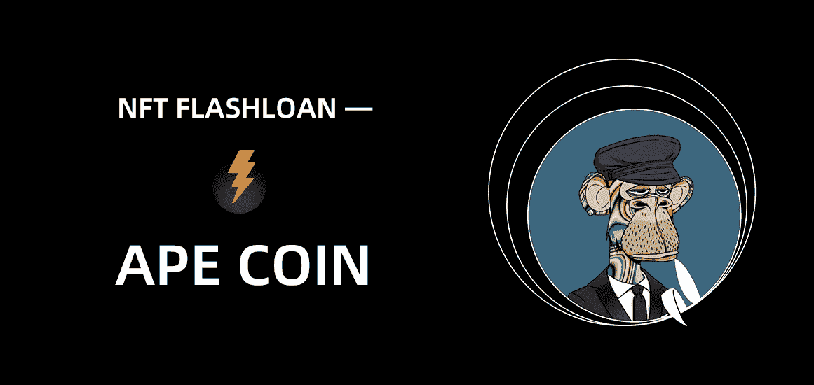
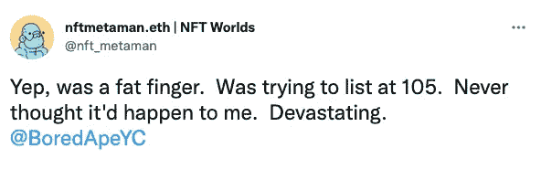
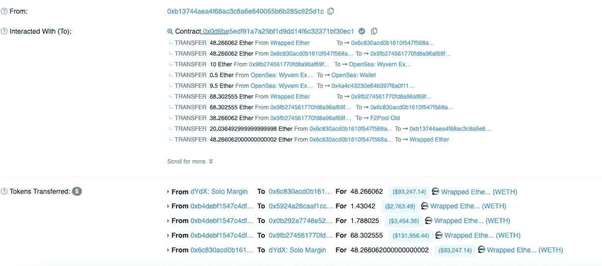
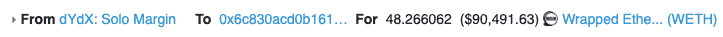
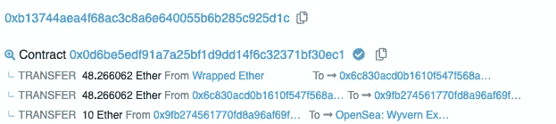
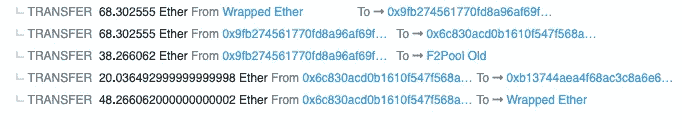
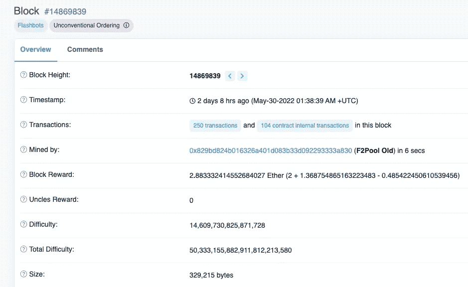
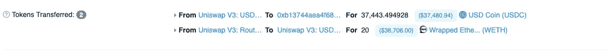

# NFT 闪贷— —猿币

> 原文：<https://medium.com/coinmonks/nft-flashloan-ape-coin-d6065c7dd956?source=collection_archive---------5----------------------->

区块链和去中心化金融(DeFi)是相对较新的技术。这意味着两者在安全成熟度上都有一定的欠缺。最近，针对 Defi 项目的黑客攻击已经变得司空见惯，通常会给攻击者带来大量的加密货币。Flashloan 攻击是一种有利于黑客充分利用 DeFi world 的流行方法。

5 月 30 日，一只很有吸引力的 NFT 无聊猿以 10 ETH 的价格售出。买方在同一笔交易中以 71 便士的价格出售了猿猴，但最终只放弃了 20 便士。为什么他们的利润如此之低，他们是如何做到的？

**0x01 首先让我们回顾一下闪贷攻击**

简而言之，这是一种不用拿自己的钱冒险就有可能获得可观收益的方式。

有时，前所未闻的快速贷款是有道理的。

快速贷款可用于:

*   **套利**:交易员可以通过寻找多个不同交易所的价格差异来赚钱。假设两个市场对披萨饼的定价不同。它在交易所 A 的定价为 1 美元，在交易所 b 的定价为 2 美元。用户可以使用闪贷，并调用一个单独的智能合约，在交易所 A 以 100 美元购买 100 个 pizzacoins，然后在交易所 b 以 200 美元出售它们。然后借款人偿还贷款，并将差额装入口袋。
*   **抵押品互换**:快速将支持用户贷款的抵押品换成另一种类型的抵押品。
*   更低的交易费用:从某种意义上说，快速贷款将通常需要几笔交易合并成一笔。每笔交易都要收费，因此快速贷款可能意味着更低的费用。
*   **自我清算**

**0x02 这是怎么回事？**

根据受害者说，他试图在 105 列表，非常不幸的是，这种情况发生了，但在一天结束时，在加密的世界里，有很多未知的危险，如果你不小心无情的地方。

下面是交易明细显示:

**这里有很多信息，所以让我们来分解一下，看看发生了什么。**

[https://ethers can . io/tx/0x 841 C2 ebe 79887 f 86246354297298 E3 ef 6d 156 D1 e 78 a 0965019556 e 7c 32 c 41 e 41](https://etherscan.io/tx/0x841c2ebe79887f86246354297298e3ef6d156d1e78a0965019556e7c32c41e41)

为了更清楚，让我们注意这些代表什么

*   0x9fb274 **:** 才是真正的买家
*   0x6c830a:是他们用来在一个事务中执行所有操作的契约
*   dydx:是一个基于以太坊的去中心化借贷平台。它为加密用户提供借贷和赌博工具。
*   F2 是一个采矿池

首先，他们试图从 dydx 获得一笔快速贷款。因为闪贷是在同一笔交易中借了又还的贷款。它们经常被用于 MEV 进行无风险套利，并且只有在使用智能合约时才有可能。MEV:即使区块生产商根据最高天然气价格订购交易，也可以提取 MEV。然而，MEV 可以被视为区块生产者可以提取多少价值的上限，因为他们最终控制着区块内的最终交易排序。

买家从 dydx 拿了 48 wETH 的闪贷(用 0x6C8)。

买方随后通过智能合同将 wet 转换为 ETH。然后合同将 48 ETH 转移到他们实际的钱包里。然后他们以 10 埃特的价格买下了这只无聊的猿猴。

在这之后，他们通过 LooksRare 以 71 wETH 的价格将这只无聊的猿卖给了出价最高的人。买方将 wETH 转换为 ETH。

在所有这些交易之后，买方有 106 个 ETH (48 个快速贷款-10 个购买+ 68 个 LR 销售)。然后，他们将 68 个 ETH 移回他们的智能合约(0x6C8 ),并将剩余的 38 个 ETH 转移到 F2Pool。你可能会问他们为什么要转移 38 个 ETH？

F2Pool 是一个采矿池，这是一个矿工的协作，每个人都贡献一些计算机能力来发现区块。F2Pool 又名 Discus Fitch，于 2013 年推出，目前是全球五大矿池之一。

通过贿赂矿商，买方可以保证他们的交易是该区块中执行的第一笔交易。

眼下，用户的钱包现在有 0 ETH，他们的智能合约有 68。他们通过将 48 ETH 转换为 wETH 并偿还 dydx 来完成快速贷款。这给 SC 留下了 20 个 ETH，然后他们将这些 ETH 转移到另一个钱包中

[https://ethers can . io/address/0xb 13744 aea4 f 68 AC 3c 8 a6 e 640055 b 6 b 285 c 925 D1 c](https://etherscan.io/address/0xb13744aea4f68ac3c8a6e640055b6b285c925d1c)

在另一项交易中，我们的套利者使用 uniswap 将 20 ETH 转换为 37K USDC:

[https://ethers can . io/tx/0xa 8e 78391142217 BF 5 CDF 8 a 46 DBE 83 a 07 e 8286 e 88 b 46 f 0a 1 c 58d 7 AAF 922 f 31 BBB](https://etherscan.io/tx/0xa8e78391142217bf5cdf8a46dbe83a07e8286e88b46f0a1c58d7aaf922f31bbb)

我不得不说密码世界是疯狂的:)