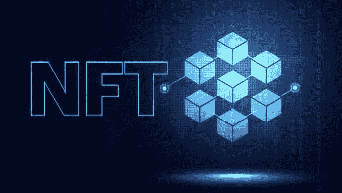

# NFT:从粉丝到社会标志

> 原文：<https://medium.com/coinmonks/nft-from-fandom-to-social-token-11ce829d16de?source=collection_archive---------17----------------------->

## 超越艺术

NFTs 首先作为数字艺术的技术进入公共话语，随着疫情封锁期间世界各地艺术机构的关闭，这个利基市场的人气飙升。人们对艺术无处可去，因此把他们的注意力转向一些虚拟的东西。大约在繁荣后的 18 个月，NFT 已经比他们最初通过 CryptoKitties 和后来的 Beeples 风格的艺术获得关注的地方发展得更远。

目前，一个 NFT 和一个在有点部落化的粉丝俱乐部中独家流通的会员资格没什么不同。过去，你可以通过实体卡获得健身房会员资格，而现在，你可以获得由同一家健身房发行的 NFT。

但是，这里的主要区别是什么呢？这种新的数字会员是一种货币化的工具。ETH、SOl、甚至 ADA——构建 NFT 的基础链的固有标记——的价格波动影响了我们如何将 NFT 视为具有投机前景的媒介。

宇迦实验室支持的 Bored Apes 游艇俱乐部是众多名人支持的最著名的 NFT 项目之一。它通过其 DAO 的本机令牌 ApeCoin 位于细分所有权的关键点，并利用了无聊猿 NFT 的值。正如我在之前的[文章](/coinmonks/yuga-labs-apecoin-and-the-future-of-web-3-0-corporate-structure-b65cc1462fb3)中所说的，那些买不起无聊的猩猩的人可以投资 ApeCoin 来体验一下。

## NFT 作为粉丝的杠杆

NFT 不只是 JPEGs 图片(有过吗？);相反，它们是释放粉丝经济潜力的杠杆。

NFTs 作为一种数字会员的形式自然地进入了 fandom，这是一种基于成员或用户对社区的承诺来区分他们的通行证。如果一个人相信他订阅的道，他会直觉地购买原生 NFT，以解锁更多专属于 NFT 持有者的活动。这是 NFT 公用事业扩展到日常应用的敲门砖。

至少目前，大多数 Dao 的运作方式类似于 fandom，但民主化程度更高。细分令牌组学的引入让融资变得更加容易和透明，初创公司的“粉丝”或支持者可以影响决策过程。

Web 3 的理想主义是建立在数字世界和物理世界无缝融合的基础上的。如果 NFT 像虚拟世界的签证文件一样作为“自定义检查站”存在，那么 NFT 的财务价值将不限于艺术和数字会员资格。NFT 被定位为一种技术工具，赋予数字项目以加密命名的价值，这是一种虚拟资产，如果需要，可以通过令牌发行来替代，它很可能被用作粉丝货币化的杠杆。

让我们来看几个例子，看看 NFTs 如何进入离线空间，而不仅仅是数字艺术文件。

## 社交代币？

Flyingclub.io 是一个与 100 多家亚洲顶级酒吧合作的组织。其发行的 NFT paper plane 总供应量高达 1 万份，每份售价约为 0.18 美分。他们将 NFT 称为通行证，允许持有者在合作酒吧中获得所有独特和罕见的鸡尾酒。当然，成员们会聚在一起，培养一种团体意识。

这正是[【FWB】](/@jayzhuang_1059/on-the-wave-of-dao-24e293be8e9a)一年来一直在做的事情。尽管如此，不同之处在于 FWB 选择发行可互换代币，要求会员至少持有 75%的本地代币 FWB 才有资格成为会员。从根本上来说，它们都是按照同样的剧本运作的。

由于密码作家 Net Eliason 已经写了大量关于将 Dao 融入现实生活应用程序的文章，所以我不会重复他已经阐述过的内容。通过他提供的案例研究，我们可以一窥 Dao、tokenomics 和 NFTs 如何整合到一个新的商业模型中。

埃利亚松使用了一个名为 CoffeeDao 的例子，这是一个直接隶属于线下实体咖啡馆的在线 Dao。起初，DAO 只是作为一个筹款中心运作。对在特定地点开咖啡馆感兴趣的人可以通过购买 NFT 咖啡来资助这个项目。有了从这些 NFT 中筹集的资金，领导项目的人可以支付租金，购买咖啡机和咖啡豆，雇佣咖啡师，并开始为咖啡馆创造收入。

NFT 持有者作为 cafe 的利益相关者，有资格对运营和财务计划进行投票。主要由 NFT 持有者组成的 DAO，可以将未分配的资金押注于 Defi 协议，以赚取被动收入。在一定的时间内，NFT 持有者可以从咖啡馆创造的利润中获得一定比例的红利——更不用说“仅限会员”的服务、折扣和俱乐部会员专属的社区活动了。理想情况下，成员聚集在咖啡馆周围，咖啡馆是组织的物理中枢。

但是，除了在 Kickstarter 中不可复制的赌注部分，它与其他主流众筹平台有什么区别？去中心化？透明度？

拥有 160 万粉丝的 Youtuber 网站霍马理工大学(Bernstein Tech)最近通过在索拉纳区块链上收集自制的 NFT，在 42 秒内筹集了 2.34 万美元。这位脸书和谷歌的前雇员是许多有影响力的人之一，他们发布自己的 NFT，从他们的支持者那里筹集资金。通过将他的频道从以技术为导向转向以戏剧为导向，这一转变旨在实现他有一天成为电影导演的目标，霍马说他将使用这笔钱来创作更多反映他试图向观众讲述的内容，这些观众也是他的投资者、客户和粉丝。

[https://twitter.com/jomaoppa/status/1515353698964283408](https://twitter.com/jomaoppa/status/1515353698964283408)

“我现在必须用 NFT 拍卖会筹集的钱来制作我想拍的电影，”他说，“因为当我制作普通的 Youtube 视频时，赞助商经常会限制我制作视频的方式。”

粉丝资助创作者的梦想；作为交换，创作者为他的 VIP 粉丝量身定制内容。霍马邀请他的 NFT 持有者作为临时演员参加他的拍摄，并在实体影院观看他尚未发布的视频。这些奖金优先给那些用现金资助他梦想的人。

## 社会标志的困境

上述例子都面临着潜在的流动性危机问题。如果有一天，这些项目失去了吸引新粉丝的动力——咖啡馆因管理不善而破产，或者只是项目负责人决定放弃一切并消失——会发生什么？

人们会尽快卖掉他们的 NFT。NFT 市场的流动性不足使得持有者很难撤出。炒作过后，没有人会试图接住落下的刀子。

在现阶段，非功能性测试是通过社会和文化共识来验证的。为了避免潜在的流动性危机，一位 NFT 创作者需要将他的项目作为一种现象进行营销，在这种现象中，酝酿中的网络效应被证明是持续增长的。但这几乎是不可能的。没有一个 NFT 项目能够不断招募铁杆粉丝，从而推高对其非功能片的需求。可信度决定了一个项目能在多大程度上接触到新的人群。

对于发布自己的 NFT 的 Youtubers 来说，通过制造更多的炒作来保持项目的可持续性，然后将人群吸引到项目中是必须的。如果供给保持不变，高需求会刺激价格飙升。在霍马决定发行其 [Vaxxed Doggos NFT](https://twitter.com/VaxxedDoggos) 的情况下，如果霍马不能定期上传新的和有吸引力的内容，该项目的受欢迎程度将会下降。效用代币的核心思想是，任何数字化的东西都是可以货币化的，无论是可替代的还是不可替代的，只要故事证明你向观众出售的东西是合理的。

以非功能性技术和令牌经济学为标志的创造者经济可能会产生一种有点奇怪的商业模式，这种模式基于“寻找你可以向其倾销非功能性技术的后来者”的竞争。原则上，它与 Defi farms 如何提供高得离谱的 API 给[以激励用户作为流动性提供者存放资产](/coinmonks/high-yields-in-cryptocurrency-explained-a3c494824038)有着共同之处。

项目负责人——一个有影响力的人或企业创始人——控制着 NFT 项目的流通供应，因此可以设定顶端在哪里，从而预先计划他的退出策略。可替代性和不可替代性之间的区别在这里变得无关紧要。NFT 也可以像可替换的社交/粉丝代币一样发挥作用。

## 摘要

我是否对 NFTs 的未来过于悲观了？一点也不。

相比之下，我认为 NFTs 将越来越有利于内容创作者和小企业。随着创作者经济超过 1000 亿美元，像 OpenSea 和 looks rare[m](https://dappradar.com/nft/marketplaces)这样的 NFT 市场日交易量超过 1 亿美元，NFTs 可能是创作者将他们的创作才华货币化的一个极好的工具。

然而，对于任何发布 NFT 的影响者或实体来说，关键是制定一个透明的策略计划，并指定令牌的确切供应。无论是作为捐赠还是投资，投资者或粉丝都必须问自己，在这种情况下，NFT 是否是可替代的。如果不是，为什么资助他们心爱的明星或者商业创意是必须的？

随着创造者经济在后大流行时代的持续增长，像 Patreon 和 Kickstarter 这样的集中式筹资平台面临的挑战风险最高，这些平台受到了区块链技术的挑战，这些技术支持点对点交易，没有中介机构向双方收取费用。如果链上交易的汽油费可以大幅降低，而不损害基础链的安全性，人们自然会更愿意通过代币接受捐赠，而无需中间人从中提成。

> 加入 Coinmonks [电报频道](https://t.me/coincodecap)和 [Youtube 频道](https://www.youtube.com/c/coinmonks/videos)了解加密交易和投资

# 另外，阅读

*   [Bookmap 评论](https://coincodecap.com/bookmap-review-2021-best-trading-software) | [美国 5 大最佳加密交易所](https://coincodecap.com/crypto-exchange-usa)
*   最佳加密[硬件钱包](/coinmonks/hardware-wallets-dfa1211730c6) | [Bitbns 评论](/coinmonks/bitbns-review-38256a07e161)
*   [新加坡十大最佳加密交易所](https://coincodecap.com/crypto-exchange-in-singapore) | [购买 AXS](https://coincodecap.com/buy-axs-token)
*   [红狗赌场评论](https://coincodecap.com/red-dog-casino-review) | [Swyftx 评论](https://coincodecap.com/swyftx-review) | [造币厂评论](https://coincodecap.com/coingate-review)
*   [投资印度的最佳密码](https://coincodecap.com/best-crypto-to-invest-in-india-in-2021)|[WazirX P2P](https://coincodecap.com/wazirx-p2p)|[Hi Dollar Review](https://coincodecap.com/hi-dollar-review)
*   [加拿大最佳加密交易机器人](https://coincodecap.com/5-best-crypto-trading-bots-in-canada) | [库币评论](https://coincodecap.com/kucoin-review)