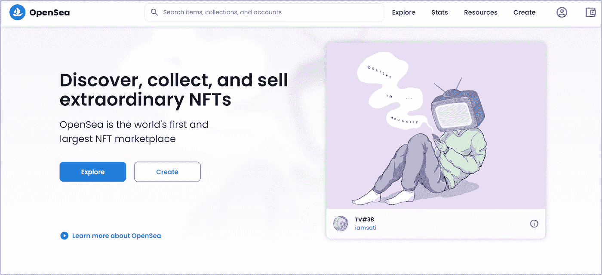

# NFT 新手词汇

> 原文：<https://medium.com/coinmonks/nft-glossary-for-newbies-c4e8ed968a9e?source=collection_archive---------9----------------------->

## NFT 系列

## NFT 术语词典——你应该知道的 NFT 术语

在本文的上下文中，我们试图收集所有与非功能性测试相关的术语。既然 NFT 在大肆宣传，为什么我们不关注它的术语呢？


## 魔力

[Alchemy](https://docs.alchemy.com/alchemy/) 是一个中间件，它使得开发人员的区块链通信更加容易。Alchemy 提供了节点提供者和 API 来与区块链通信。


image credit: *Alchemy*

## 区块链

区块链是一种去中心化的数字账本，它以一种无法被篡改或更改的方式记录每一笔交易。区块链可以被描述为一个记录的集合，这些记录相互链接，并受到密码学的保护。区块链网络上的每个人都有一本账本。因此，没有一个人可以更改分类账，因为其他人都会将其标记为无效。


image credit: [IG EN](https://www.ig.com/en/trading-strategies/what-is-blockchain-technology--200710)

## 燃烧 NFT

NFT 不能删除，但可以刻录。焚烧本质上是指个人销毁他们的 NFT 令牌并使其失效。焚烧 NFT 意味着将 NFT 发送到一个无法访问的地址，使其从流通中消失。这个燃烧的过程是不可逆的。通常燃烧是为了控制 NFT 的供应，这反过来增加了市场的需求。

## 加密货币

加密货币是一种基于区块链技术的数字或虚拟货币。他们对伪造免疫。它们不需要中央权威机构，并且受到强大而复杂的加密算法的保护。比特币、莱特币和以太币是最常见的可用加密货币。


image credit: [Corporate Compliance Insights](https://www.corporatecomplianceinsights.com/regulatory-oversight-cryptocurrency/)

## 加密钱包

保存加密货币交易的私钥和公钥的软件。他们从不储存真正的硬币或代币。公钥是密码形式的钱包地址，可以共享它来接收加密货币。私钥对你来说是非常保密的，因为它用于授权通过你的钱包进行的任何交易。

有 3 种类型的加密钱包:

1.  **基于交易所的软件钱包—** 钱包内置在 Vauld 和 CoinDCX 等中央交易所内。
2.  **硬件钱包—** 仅通过将 USB 物理连接到计算机来访问加密内容。莱杰，崔佐
3.  **基于浏览器的软件钱包—** 我们可以控制、安装在我们的系统上并保存私钥。它们是通向 Web3.0 和 NFTs 世界的大门。例如:Metamask、比特币基地和信托钱包


image credit: [Finextra Research](https://www.finextra.com/blogposting/21140/cryptocurrency-wallet-development--a-quick-guide-for-crypto-wallet-creation)

## Dapps

Dapps 代表分散式应用。它们是基于智能合同网络的应用程序，如以太坊区块链。整个操作都存储在区块链上，并且是开源的，以便其他人可以访问它。


image credit: [Crypto Adventure](https://cryptoadventure.com/5-blockchain-platforms-that-will-dominate-the-dapp-ecosystem-in-2020/)

## 分散

去中心化是将信任交给一群人而不是一个单一的中央实体的过程，整个团队将跟踪你的交易。


image credit: [AsianPolyGlotView](https://asianpolyglotview.com/2021/04/viewpoint-how-technology-is-driving-decentralization-and-benefiting-us.html)

## 不调和

Discord 是一个数字平台，在这里你可以属于一个世界范围的艺术社区。它们被组织成基于不同主题的渠道，您可以在其中进行协作和分享。


image credit: [DlPure](https://dlpure.com/android/discord/)

## ERC-721 和 ERC-1155

ERC 代表**以太坊请求评论**。ERC-721 & ERC-1155 是密码行业最常用的两种令牌标准。

ERC-721 是创建 NFTs 的第一个标准化接口。它包含了一组 NFT 的规则，将它们定义为一种唯一地标识某些东西的方式。它基于为每个令牌类型或集合部署单独的智能合约。

ERC-1155 是支持不可替换和可替换令牌的唯一令牌。它可以使用一个合同来制作各种类型的非功能性测试。


image credit: [Altcoin Buzz](https://www.altcoinbuzz.io/bitcoin-and-crypto-guide/the-difference-between-erc721-vs-erc1155/)

## 以太币

加密货币 Ether 的缩写。

## 醚

以太是以太坊区块链的燃料。以太坊平台的原生加密货币。

## 以太坊

以太坊是一个开放的分散式公共软件平台，位于区块链，促进智能合同和分散式应用程序(称为 dapps)。


image credit: [Forbes](https://www.forbes.com/advisor/investing/what-is-ethereum-ether/)

## Ethers.js

[Ethers.js](https://docs.ethers.io/v5/) 是一个允许我们与以太坊区块链互动的库。

## 以太扫描

[以太扫描](https://etherscan.io/)是以太坊使用最广泛的区块链浏览器，我们可以在这里查看所有的交易。我们可以搜索地址或交易散列，它会显示诸如 ETH 余额、交易费、汽油费以及进出该地址的交易总数等信息。


[Etherscan](https://etherscan.io/)

## EVM

EVM 代表以太坊虚拟机。它是由世界各地的计算机运行的软件，用来执行我们的智能合同。

## 加纳切

Ganache 是一个可以在本地安装的区块链模拟器。dapps 可以通过 Ganache 进行开发、测试和部署。


image credit: [Tutorialspoint](https://www.web3.university/article/how-to-mint-an-nft-with-ethers-js)

## 气体

燃气是指在以太坊区块链上成功进行交易所需的费用。它需要购买或出售 NFT，出价，并将 NFT 转移到不同的钱包。通常以 GWei 为单位。


image credit: [Master Ingeniería Blockchain](http://Master Ingeniería Blockchain)

## 气体极限

汽油限额是指交易中花费的最大汽油量。

## 天然气价格

气价是指用户愿意在每单位气上花费的 GWei 的数量。

## 圭

GWei 是以太单位之一，代表千兆位。GWei 通常用于跟踪以太坊区块链的交易成本。

```
1GWei = 10⁹ Wei = 1ETH/10⁹
```

## 建筑工人

Hardhat 是一个智能合约框架，我们可以用它来编译、部署、测试和调试我们的智能合约。


image credit: [OpenZeppelin Forum](https://www.google.com/url?sa=i&url=https%3A%2F%2Fforum.openzeppelin.com%2Ft%2Fhelp-setting-up-bignumbers-tests-with-test-helpers%2F19230&psig=AOvVaw2gW4M-N-1zTs2mVgHzJeuz&ust=1643728286630000&source=images&cd=vfe&ved=0CAkQjhxqFwoTCMjg_pij3PUCFQAAAAAdAAAAABAS)

## IPFS

[IPFS](https://ipfs.io/) 代表星际文件系统。它是一个类似 torrent 的点对点协议。它分散了整个文件托管过程。文件可以在多个节点上存储和共享，每个节点都成为一个服务器，这样就没有人能够下载文件。


image credit: [IETF Datatracker](https://datatracker.ietf.org/meeting/interim-2020-dinrg-01/materials/slides-interim-2020-dinrg-01-sessa-an-overview-of-the-interplanetary-file-system-ipfs.pdf)

## 懒惰铸币

一种创建 NFTs 的方法，可避免天然气费用。

## 马蒂奇

与以太坊中的 ETH 一样，MATIC 是多边形网络中的原生令牌。

## 内存池

Mempool 是节点软件中未确认交易的中转区。在事务被验证并复制到区块链上的其余节点之前，它实际上是一个事务等候室。内存池的大小取决于区块链及其活动。内存池越大，网络使用率越高，等待时间越长。


image credit: [Science Direct](https://www.google.com/url?sa=i&url=https%3A%2F%2Fwww.sciencedirect.com%2Fscience%2Farticle%2Fpii%2FS2667295221000349&psig=AOvVaw3XXcgjdP4ixAhqn2I7Su1O&ust=1643728702545000&source=images&cd=vfe&ved=0CAkQjhxqFwoTCMjZw-Gk3PUCFQAAAAAdAAAAABAP)

## [计]元数据

元数据本质上是关于数据的信息。NFT 的元数据只是 NFT 的属性，如名称、描述和影像。


NFT Metadata

## 铸造

铸造是将 NFT 首次放入区块链的过程。铸造受到交易费的限制。


image credit: [The Motley Fool](https://www.google.com/url?sa=i&url=https%3A%2F%2Fwww.fool.com%2Finvesting%2F2021%2F04%2F12%2Fthe-nyse-is-now-minting-its-own-nfts%2F&psig=AOvVaw3vTwiVHBcA_CwIO0Z7rWwc&ust=1643728768906000&source=images&cd=vfe&ved=0CAkQjhxqFwoTCKDj9f-k3PUCFQAAAAAdAAAAABAD)

## 道德

[Moralis](https://admin.moralis.io/servers) 提供了连接交叉链的最简单易行的方法。它是一个软件或中间件，帮助我们快速构建跨链 dapps。使用 moralis，我们可以在以太坊、多边形、Solana、BSC 和 Avalanche 等任何区块链上构建和部署 dapps。Moralis 还提供 API 和快速节点来连接链。


image credit: [Moralis](https://www.google.com/url?sa=i&url=https%3A%2F%2Fmoralis.io%2Fhow-to-connect-to-polygon-nodes%2F&psig=AOvVaw33XLSdJEnu0IOBx0BEOYG1&ust=1643728937962000&source=images&cd=vfe&ved=0CAkQjhxqFwoTCKjTwc6l3PUCFQAAAAAdAAAAABAD)

## 非同质化通证

NFT 是代表一件艺术品的数字资产。让 NFT 独一无二的是它由区块链技术公司创造的数字签名。它定义了可以用真实货币或加密货币买卖的资产的所有权。NFT 不可互换，因为它代表特定人员拥有的独特资产。


image credit: [JackOfAllTechs.com](https://www.google.com/url?sa=i&url=https%3A%2F%2Fjackofalltechs.com%2F2021%2F08%2F12%2Ftroop-of-bored-ape-nfts-rises-above-the-competition-bayc-donates-200k-in-eth-to-orangutan-outreach%2F&psig=AOvVaw0wzgeR52i5Ght6v-l9KKYD&ust=1643728970927000&source=images&cd=vfe&ved=0CAkQjhxqFwoTCKDHiN6l3PUCFQAAAAAdAAAAABA-)

## NFT 市场

一个我们可以买卖 NFT 的数字平台。OpenSea、Rarible 和 Mintable.app 是常见的市场。


image credit: [NFTX-NFT Art Exhibition](https://www.google.com/url?sa=i&url=https%3A%2F%2Fnftartexhibition.net%2Fblog%2F2021%2F11%2F02%2Fthe-latest-comparison-of-major-nft-marketplaces%2F&psig=AOvVaw3eBT5p463k-qDKX98mPNEh&ust=1643729052033000&source=images&cd=vfe&ved=0CAkQjhxqFwoTCJC-6omm3PUCFQAAAAAdAAAAABAJ)

## OpenSea

[OpenSea](https://opensea.io/) 是最大也是最常见的 NFT 市场，每个人都用它来交易他们的非功能性交易。



Opensea Marketplace

## 皮纳塔

Pinata 是 IPFS 的一个接口，它使得在 IPFS 上存放文件变得更加容易。我们可以上传文件和 JSON 元数据。


Pinata

## 多边形

多边形只是以太坊的一个侧链。它是一个第二层(L2)扩展平台，为以太坊用户提供低交易费用、更高吞吐量和更好的选择。

## 多边形扫描

[Polygonscan](https://polygonscan.com/) 类似于以太坊的以太扫描，我们可以在其中验证交易、钱包余额和所有令牌信息。


[Polygonscan](https://polygonscan.com/)

## 稀有的

像 OpenSea 一样， [Rarible](https://rarible.com/) 是一个基于以太坊的市场，我们可以在这里买卖我们的 NFT。


Rarible Marketplace

## 再搅拌

Remix 是一个 web IDE，可以用来编写、部署和测试智能合约。区块链初学者可以用 Remix IDE 轻松开始 Solidity 中的编码。


Remix IDE

## 版税

版税是 NFT 创作者从二级市场销售中获得的百分比。二级市场是在 NFTs 被购买一次后再购买它的市场。每当 NFT 被转售，NFT 的创造者将得到一个百分比。


image credit: [Cyber Scrilla](https://www.google.com/url?sa=i&url=https%3A%2F%2Fcyberscrilla.com%2Fnft-royalties-what-are-they-and-how-do-they-work%2F&psig=AOvVaw0Ak24g1hSvrBXj9D3Tk7Dy&ust=1643729209493000&source=images&cd=vfe&ved=0CAkQjhxqFwoTCLDglM-m3PUCFQAAAAAdAAAAABAD)

## 智能合同

智能合约允许用户在不需要中介的情况下交换价值。它们是有明确条款和协议来执行的协议。与用人类语言编写的传统合同不同，智能合同是用计算机可以执行的代码编写的。


image credit: [Moralis](https://www.google.com/url?sa=i&url=https%3A%2F%2Fmoralis.io%2Fcreate-a-reddit-clone-for-web3-step-by-step-guide%2F&psig=AOvVaw0HqrWeUqOE4VqwRjYYCx0J&ust=1643728808180000&source=images&cd=vfe&ved=0CAkQjhxqFwoTCNjCopOl3PUCFQAAAAAdAAAAABAb)

## 固态

[Solidity](https://docs.soliditylang.org/en/v0.8.12/) 是一种用于编写智能合同的编程语言。

## 松露

[Truffle](https://trufflesuite.com/) 是编写、部署和测试智能合同最流行的框架之一。它支持以太坊、多边形、币安智能链等 EVM 区块链。


image credit: [CoinTrust](https://www.google.com/url?sa=i&url=https%3A%2F%2Fwww.cointrust.com%2Fmarket-news%2Ftruffle-to-introduce-new-range-of-tools-for-corda-hyperledger-fabric-tezos&psig=AOvVaw2INBlsFmqxg365eVRaBtPy&ust=1643729271230000&source=images&cd=vfe&ved=0CAkQjhxqFwoTCIDfivCm3PUCFQAAAAAdAAAAABAJ)

## Web3.js

Web3.js 是一个用于与以太坊区块链互动的库。


image credit: [Blockchain Expert](https://www.google.com/url?sa=i&url=https%3A%2F%2Fwww.blockchainexpert.uk%2Fblog%2Fwhat-is-web3js-blockchain-decentralized-web&psig=AOvVaw2TVBEFGHXv55AMnuU4Fpcl&ust=1643729315376000&source=images&cd=vfe&ved=0CAkQjhxqFwoTCKCmm4Kn3PUCFQAAAAAdAAAAABAD)

## 魏

卫也是乙醚单位之一，是乙醚的最低命名。

```
1Wei = 1 ETH/10¹⁸
```

## WETH

加密货币 Wrapped Ethereum 的缩写。它可以用来进行预授权的投标，这些投标可以在以后的某个日期履行。ETH 和 weh 可以具有相同的值，并且可以相互转换。


image credit: [Pinterest](https://www.google.com/url?sa=i&url=https%3A%2F%2Fwww.pinterest.com%2F4uredrose%2F%25D8%25B4%25D8%25AE%25D8%25B5%25D9%258A%25D8%25A7%25D8%25AA%2F&psig=AOvVaw1n3rj5bcPO32ZjqB2R_JBj&ust=1643729408694000&source=images&cd=vfe&ved=0CAkQjhxqFwoTCKDAsq-n3PUCFQAAAAAdAAAAABAN)

## 谢谢:)

> *加入 Coinmonks* [*电报频道*](https://t.me/coincodecap) *和* [*Youtube 频道*](https://www.youtube.com/c/coinmonks/videos) *了解加密交易和投资*

# 另外，阅读

*   [有哪些交易信号？](https://coincodecap.com/trading-signal) | [Bitstamp vs 比特币基地](https://coincodecap.com/bitstamp-coinbase) | [买索拉纳](https://coincodecap.com/buy-solana)
*   [ProfitFarmers 回顾](https://coincodecap.com/profitfarmers-review) | [如何使用 Cornix Trading Bot](https://coincodecap.com/cornix-trading-bot)
*   [十大最佳加密货币博客](https://coincodecap.com/best-cryptocurrency-blogs) | [YouHodler 评论](https://coincodecap.com/youhodler-review)
*   [MyConstant 点评](https://coincodecap.com/myconstant-review) | [8 款最佳摇摆交易机器人](https://coincodecap.com/best-swing-trading-bots)
*   [MXC 交易所评论](/coinmonks/mxc-exchange-review-3af0ec1cba8c) | [Pionex vs 币安](https://coincodecap.com/pionex-vs-binance) | [Pionex 套利机器人](https://coincodecap.com/pionex-arbitrage-bot)
*   [我的加密副本交易经历](/coinmonks/my-experience-with-crypto-copy-trading-d6feb2ce3ac5) | [比特币基地评论](/coinmonks/coinbase-review-6ef4e0f56064)
*   [CoinFLEX 评论](https://coincodecap.com/coinflex-review) | [AEX 交易所评论](https://coincodecap.com/aex-exchange-review) | [UPbit 评论](https://coincodecap.com/upbit-review)
*   [AscendEx 保证金交易](https://coincodecap.com/ascendex-margin-trading) | [Bitfinex 赌注](https://coincodecap.com/bitfinex-staking) | [bitFlyer 审核](https://coincodecap.com/bitflyer-review)