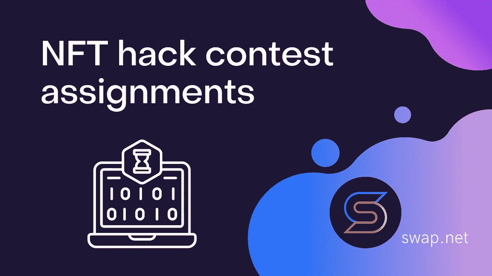
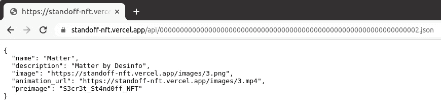
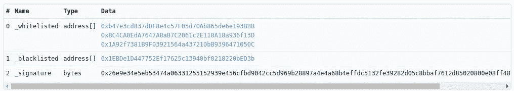
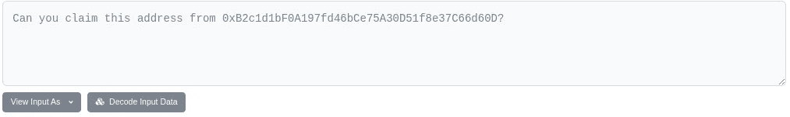

# NFT 黑客大赛作业“对峙数字艺术”

> 原文：<https://medium.com/coinmonks/nft-hack-contest-assignments-the-standoff-digital-art-aa29ebf7b6a1?source=collection_archive---------45----------------------->

## 11 月 15 日至 16 日，一年一度的网络战[对峙](https://standoff365.com/)在莫斯科举行，汇集了最好的防御者和攻击者团队。全球信息安全会议举办了一场名为[对峙数字艺术](https://nft.standoff365.com/)的 NFT 黑客大赛。



为竞赛准备了 ERC1155 标准智能合同。藏品中每一件 NFT 的主人(总共有 6 件)都是一份特别准备的易受攻击的智能合约。当每个智能合同被成功利用时，攻击者就获得了 NFT 的所有权(在测试网络中)。每一次成功的黑客攻击都有现金奖励。那么，有哪些漏洞呢？

# 孵卵器

🎨[T5【阿特姆特卡奇】T6](https://www.instagram.com/tkach_tem/)


在 [**智能合约**](https://rinkeby.etherscan.io/address/0x3222310f6FC2da7a29b86293af740Bed994bb739#code) 中，我们看到三个外部函数:mint()、allowMinting()和 addToWailist()。目标是让智能合约通过 mint()函数进行 NFT 转换，但是 canMint 变量在构造函数中被声明为 false。为了解锁 mint()函数，存在 allowMinting()，但是它仅对智能合约的所有者可用。

如果我们仔细研究第三个函数 addToWailist()，我们会发现它声明了一个未初始化的动态地址列表。在 Solidity 中，如果在初始化期间没有为 array、mapping 或 struct 之类的复杂数据类型赋值，那么在使用关键字“storage”时，变量将简单地覆盖 smart contract 的第一个存储槽。

然而，Solidity 的开发者并没有忽视这种语言的“特性”,并在四年前修复了编译器，以便在这种情况下会返回一个错误。然而，编译器并不总是看到存储的覆盖。

因此，如果调用 addToWaitlist()，那么存储 canMint 变量值的第一个存储元素将被覆盖。之后，通过调用 mint()函数，攻击者获得了 NFT。

# 我的

🎨 [**元礼**](https://taplink.cc/meta_rite)


在该任务中， [StandoffNFT_2](https://rinkeby.etherscan.io/address/0xD1802259E2Eb09CA8861A6B89f446770F4645a9d#code) 智能协定继承了 Ownable 协定，这是一种常见的模式。您可能会注意到，在主智能契约的构造函数中，变量 owner 被分配了发送者的地址。将所有权转移给 NFT 的 withdraw()函数有一个 onlyOwner 修饰符，只允许调用智能合约的所有者。唯一所有者代码本身也是标准的:

```
modifier onlyOwner() {
	require(owner == msg.sender);
	_;
}
```

但是当 onlyOwner()被调用时，owner 将等于什么？对，它等于 0，因为赋值发生在 StandoffNFT_2 契约中，而不是在 Ownable 中。当我们继承时，Ownable 中的所有者值将保持不变。换句话说，没有什么可以阻止我们调用 setOwner()，然后成功地执行 retract()。

# 物质

🎨[Desinfo](https://linktr.ee/desinfo)

在 [**智能合约**](https://rinkeby.etherscan.io/address/0x5c95b14A411a5E2A1c2fc181c3A05318997DeD5A#code) 的源代码中，我们看到了函数 unlock()，当条件满足时，该函数将所有权转移给 NFT:

```
require(
	**bytes32**(
  	0x8d8056f94c32675006872f854a6757279eb9a1070660e871535fc7231dc18b30) ==
  	keccak256(**preimage**), "invalid preimage"
);
```

还要注意注释*“我们有非常安全的元数据”*，它清楚地说明了在哪里可以找到**原映像**。集合的 [**智能契约**](https://rinkeby.etherscan.io/address/0x1EBDe1D447752Ef17625c13940bf0218220bED3b#code) 为我们提供了存储元数据的地址:

```
**constructor**() **ERC1155**("https://standoff-nft.vercel.app/api/{}.json") {
```

传递给 ERC1155 函数的地址是令牌 URI，即它是像 OpenSea 这样的 NFT 市场 [**获取每个令牌集合的元数据的地址。看起来你需要做的就是用{}代替令牌标识符。然而，当访问/api/3.json 时，我们得到一个 404 错误。有什么问题？**](https://docs.opensea.io/docs/metadata-standards)

[**ERC 1155 文档**](https://eips.ethereum.org/EIPS/eip-1155#metadata) 可以给你答案:

> *被替换的十六进制 ID 的字符串格式必须是小写字母数字:[0–9a-f]，没有 0x 前缀。*
> 
> *被替换的十六进制 ID 的字符串格式必须是前导零，必要时填充到 64 个十六进制字符长度。*

换句话说，TOKEN_ID 必须转换为十六进制形式，并转换为长度为 64 个带零的字符。我们应该查询/api/3.json，而不是/API/3 . JSON:



通过将原图像值发送给 unlock()函数，我们得到了 NFT。

# 大乌鸦

🎨 [**沃尔沃 _ 胜利**](https://linktr.ee/volv_victory)


在智能合约 的 [**源代码中，我们看到两个黑名单和白名单的映射，带有集合地址。还有 addCollections 函数，它接受这些映射作为输入，并接受一个签名来验证映射是否由智能协定的所有者签名。**](https://rinkeby.etherscan.io/address/0x810976E5D20d2d9e704dd75b09BE73D9d9d4BA8c#code)

查看 EtherScan 上的交易历史，我们发现一个带有正确签名的 [**addCollections 调用**](https://rinkeby.etherscan.io/tx/0x08443771ed957d8b3aef063cb3a3afe3785d802aaab2ff844ba9a780335b6aa1) 。



Standoff 数字艺术收藏的黑名单地址。这意味着我们不能调用传送 NFT 的 transfer()，因为它具有以下条件:

```
require(**whitelisted**[_collection], "collection is not allowed");
```

但是，如果您仔细检查 addCollections()中如何检查签名，这就不是问题了:

```
bytes32 hash = keccak256(abi.encodePacked(_whitelisted, _blacklisted));
address signer = hash.toEthSignedMessageHash().recover(_signature);
require(signer == owner, "only owner can add NFT collections");
```

使用 abi.encodePacked()将两个映射“粘合”在一起，得到的映射用于读取 keccak-hash，签名从该 hash 中读取。这里的错误是使用了 abi.encodePacked()而不是 abi.encode()。两者有一个显著的区别:abi.encodePacked()在序列化过程中不存储关于元素数量的信息。这意味着 abi.encodePacked([1，2，3]，[4])和 abi.encodePacked([1，2]，[3，4])将返回相同的结果，因此返回相同的 keccak-hash。关于 abi.encodePacked()导致的哈希冲突的更多细节可以在 [**这篇文章**](/swlh/new-smart-contract-weakness-hash-collisions-with-multiple-variable-length-arguments-dc7b9c84e493) 中找到。

因此，攻击者可以重用智能合约所有者的签名来更改黑名单和白名单变量中集合地址的位置。换句话说，不是调用:

```
addCollections(
	[0xb47e3cd837dDF8e4c57F05d70Ab865de6e193BBB
	0xBC4CA0EdA7647A8aB7C2061c2E118A18a936f13D
	0x1A92f7381B9F03921564a437210bB9396471050C],
	[0x1EBDe1D447752Ef17625c13940bf0218220bED3b], // адрес standoff в blacklisted
	signature
)
```

打电话:

```
addCollections(
	[0xb47e3cd837dDF8e4c57F05d70Ab865de6e193BBB
	0xBC4CA0EdA7647A8aB7C2061c2E118A18a936f13D
	0x1A92f7381B9F03921564a437210bB9396471050C,
	0x1EBDe1D447752Ef17625c13940bf0218220bED3b],
	[], // blacklisted теперь пустой
	signature
)
```

签名将是相同的，现在我们可以成功地转移()！

# 转换

🎨 [**安诺玛利特凯特**](https://anomalitkate.com/en/)

一个 [**智能合约**](https://rinkeby.etherscan.io/address/0x13874C3906394Dc6824a48ed53cfB4485E576cDd#code) 中只有一个外部 transfer()函数将 NFT 转移到交易的发送方，但它只能被智能合约的所有者调用，这个函数是在构造函数中设置的。游戏结束了？

反正看老版本的 Solidity 编译器，0.4.25。在那个版本中，当声明一个构造函数时仍然有可能出错，也就是说把构造函数变成一个普通的函数。

✅右语法:构造函数(IERC1155 _collection) {}

🛑错误语法:函数构造函数(IERC1155 _collection) {}

留给最快、最专心的参与者去做的就是发送一个调用带有集合地址的构造函数()的事务，然后执行 transfer()。

# 再充电

🎨 [**Loit**](https://lynkfire.com/loiterkiddd)


转到 [**NFT 地址**](https://rinkeby.etherscan.io/address/0xda7288a9E54F788A27A8C278408466EbC9b1f64D) ，我们看不到智能合约的源代码，但是在交易历史中有一个很好奇的信息:



在指定的 [**地址**](https://rinkeby.etherscan.io/address/0xB2c1d1bF0A197fd46bCe75A30D51f8e37C66d60D#code) 有一个任务。它必须以某种方式允许获得 NFT 所属的地址。阅读源代码，我们可以看到 deploy()函数，它将 4 个字节长的“salt”参数作为输入。它从 OpenZeppelin 的 Create2 模块中调用同名函数:

```
**address** addr = Create2.deploy(0, salt, getInitCode());
```

这个调用使用 CREATE2 操作码向网络发布一个新的智能契约，create 2 操作码最近出现在 EVM(以太坊虚拟机)中，作为 Constantinople hard fork 的一部分。

以前，只有 CREATE 操作码；两者之间的区别在于，使用普通 CREATE 创建的新智能合约的地址取决于 nonce，这是一个随着每个新的 CREATE 调用而增加的数字，而使用 CREATE2 创建的智能合约的地址取决于用户控制的 salt 值，这使得新智能合约的地址提前已知。

可以通过这种方式存放的智能合约称为 NFTOwner。它有一个构造函数，其中所有者是 tx.origin，即事务的原始发送者，还有一个传递 NFT 的 transfer()函数。所有这些都清楚地表明，我们需要猜测盐，并将合同放在拥有 NFT 的确切地址。

这项任务很简单，因为我们只需要遍历 4 个字节。暴力破解的结果是“aZy5”。通过用这个值调用 deploy()，我们得到了 NFT。

# 结果

在比赛开始后的最初几个小时内，多达 5 个 NFT 被 [**阿列克谢·拜恩**](https://twitter.com/caffeinum) 破解。最后一个 NFT 奖颁给了阿列克谢·叶戈罗夫，他解决了限制战略武器条约的挑战。

> 加入 Coinmonks [电报频道](https://t.me/coincodecap)和 [Youtube 频道](https://www.youtube.com/c/coinmonks/videos)了解加密交易和投资

# 另外，阅读

*   [如何在 FTX 交易所交易期货](https://coincodecap.com/ftx-futures-trading) | [OKEx vs 币安](https://coincodecap.com/okex-vs-binance)
*   [CoinLoan 审查](https://coincodecap.com/coinloan-review) | [YouHodler 审查](/coinmonks/youhodler-4-easy-ways-to-make-money-98969b9689f2) | [BlockFi 审查](https://coincodecap.com/blockfi-review)
*   XT.COM 评论[币安评论](https://coincodecap.com/profittradingapp-for-binance) |
*   [SmithBot 评论](https://coincodecap.com/smithbot-review) | [4 款最佳免费开源交易机器人](https://coincodecap.com/free-open-source-trading-bots)
*   [比特币基地僵尸程序](/coinmonks/coinbase-bots-ac6359e897f3) | [AscendEX 审查](/coinmonks/ascendex-review-53e829cf75fa) | [OKEx 交易僵尸程序](/coinmonks/okex-trading-bots-234920f61e60)
*   [如何在印度购买比特币？](/coinmonks/buy-bitcoin-in-india-feb50ddfef94) | [瓦济克斯审查](/coinmonks/wazirx-review-5c811b074f5b)