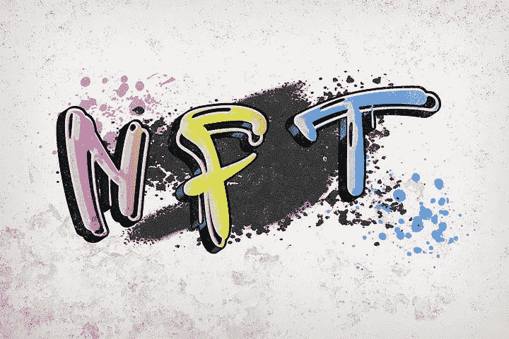

# NFT:你听到最新消息了吗？

> 原文：<https://medium.com/coinmonks/nft-have-you-heard-the-latest-a4eeaa0e664?source=collection_archive---------62----------------------->

istock

去年是 NFT(不可替代的代币)这个，NFT 那个。头条新闻刊登了一个又一个 NFT 数百万的销量。但是 2022 年呢？cryptoverse 的这一部分会与去年 400 亿美元的销售额竞争吗？是的，会的。

截至 2022 年 4 月，NFT 的销售额约为 370 亿美元。所以，除非世界很快结束，否则 2022 年很有可能会比…