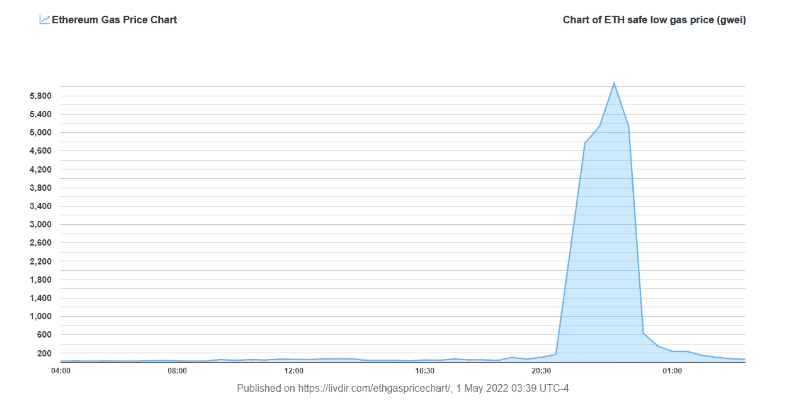
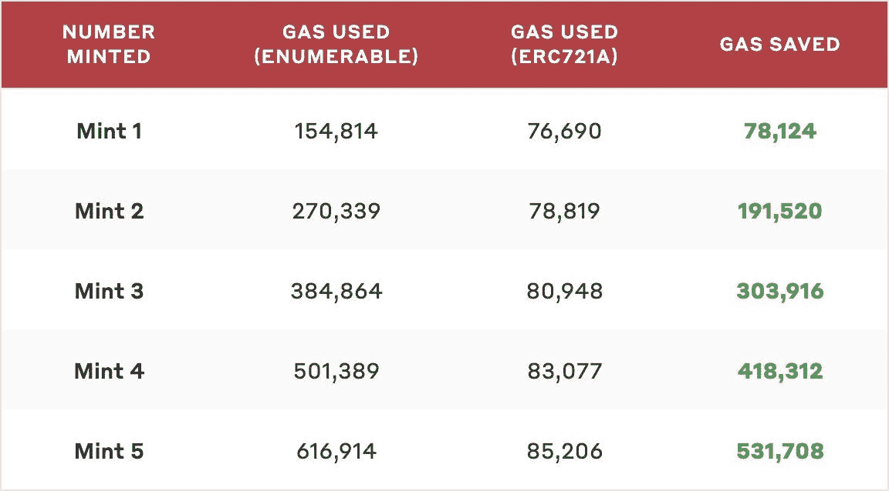

# NFT:两个简单的优化如何节省 1 亿美元

> 原文：<https://medium.com/coinmonks/nft-how-2-simple-optimizations-could-have-saved-100m-usd-b006b3546678?source=collection_archive---------18----------------------->

Source: [https://www.britannica.com/topic/money](https://www.britannica.com/topic/money)

由宇迦实验室发布的 Otherside mint event 的另一个行为至少可以说有点混乱。区块链以太坊的天然气价格在几分钟内飙升至前所未有的水平。仅在交易费用上就花费了超过 1 亿美元的价值。整个以太坊网络在很大程度上瘫痪了。

人们可以把启动策略作为一个原因，但主要因素是缺乏**合同优化**。每笔铸造交易使用的天然气量可以减少 70%以上，这将节省价值数千万美元的交易费用。传输 NFT 的事务也没有得到优化。所以这里有**两个简单的修正**会产生巨大的影响。

ETH safe low gas price (gwei) during the mint event of Otherdeed for Otherside

## ERC 721 可数

Otherdeed 的智能契约使用了 [ERC721Enumerable](https://github.com/OpenZeppelin/openzeppelin-contracts/blob/master/contracts/token/ERC721/extensions/ERC721Enumerable.sol) 扩展，它允许直接在链上存储和跟踪 NFTs 的所有权。这种扩展大大增加了事务中使用的 gas 量，因为它增加了必须在每次生成和转移调用时更新的昂贵的数据结构。我们正在讨论下面的变量:

Variables added and updated by the ERC721Enumerable extension

考虑到这个扩展提供的功能可以很容易地使用交易历史离线实现，并且在链上实现它没有实际的好处，所以在您的智能契约中绝对应该避免使用 ERC721Enumerable。

## ERC721A

[ERC721A](https://github.com/chiru-labs/ERC721A) 是由 [AZUKI](https://www.azuki.com/) 开发的 IERC721 标准的新实现。其主要优势在于，在一次交易中铸造多个 NFT 时，可显著减少气体用量(参见下图，该图比较了 ERC721A 和 ERC721A 的多种实施方式)。

Gas usage comparison (source: [https://github.com/chiru-labs/ERC721A](https://github.com/chiru-labs/ERC721A))

Otherdeed smart 合同没有使用 ERC721A，因为该项目允许分批造币，所以它有利于他们的天然气优化。

注意:使用 ERC721A 的副作用是，它稍微增加了传输交易中使用的气体。也就是说，与铸造时节省的钱相比，这是微不足道的。

## 结论

见证 NFT 空间变得如此之大是不真实的。最大的项目现在可以在几分钟内完全破坏整个以太坊网络。Otherdeed for Otherside mint 活动的最大收获是，合同优化不仅会影响项目，还会影响整个生态系统。幸运的是，我们有简单的解决办法，它们可以为整个 NFT 社会带来巨大的变化。

> 加入 Coinmonks [电报频道](https://t.me/coincodecap)和 [Youtube 频道](https://www.youtube.com/c/coinmonks/videos)了解加密交易和投资

# 另外，阅读

*   [交易信号是什么？](https://coincodecap.com/trading-signal) | [Bitstamp vs 比特币基地](https://coincodecap.com/bitstamp-coinbase) | [买索拉纳](https://coincodecap.com/buy-solana)
*   [ProfitFarmers 回顾](https://coincodecap.com/profitfarmers-review) | [如何使用 Cornix Trading Bot](https://coincodecap.com/cornix-trading-bot)
*   [十大最佳加密货币博客](https://coincodecap.com/best-cryptocurrency-blogs) | [YouHodler 评论](https://coincodecap.com/youhodler-review)
*   [my constant Review](https://coincodecap.com/myconstant-review)|[8 款最佳摇摆交易机器人](https://coincodecap.com/best-swing-trading-bots)
*   [MXC 交易所评论](/coinmonks/mxc-exchange-review-3af0ec1cba8c) | [Pionex vs 币安](https://coincodecap.com/pionex-vs-binance) | [Pionex 套利机器人](https://coincodecap.com/pionex-arbitrage-bot)