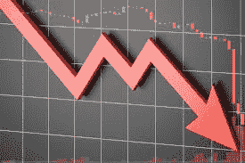

# NFT 投资衰落的以太网市场

> 原文：<https://medium.com/coinmonks/nft-investing-in-a-declining-eth-market-a3405146bcfd?source=collection_archive---------5----------------------->

*理性市场如何应对本币波动*

最近，美元和瑞士法郎之间的汇率非常不稳定，瑞士法郎在过去几个月里下跌了 50%以上。ETH 仍然是支撑 NFT 市场的主要货币。分析 ETH、USD 和突出的 NFT 之间的关系可以让我们洞察这个市场到底有多理性。

让我们先来看看现实世界是如何应对法定货币的波动的。具体来说，当一个经济体的基础货币崩溃时，市场中商品和服务的价格会发生什么变化。

**IRL 发生了什么**

2001 年 12 月，我去南非开普敦度长假。在我到达前一周，南非兰特暴跌了近 30%。对我和那个星期每个来度假的游客来说，这是一笔意外之财。酒店、餐厅和景点都是以兰特计价的，它们的价格没有进行调整，以反映本币相对贬值的情况。我在那里度假三周，花费只是我计划花费的一小部分。我结束了这次旅行，把一箱好酒运回了美国。很难抗拒汇率！兰特如此便宜，如果不是我的旅伴劝我放弃，我还差点在开普敦买了一处海滨房产，在一个名叫 Franschhoek 的美丽地区买了一个葡萄酒庄园。

在南非的案例中，企业没有调整其商品和服务的价格，因为当时他们的大部分消费者都是本国人。或许在一个分散的市场中，企业所有者也很难迅速做出大规模的价格调整来应对这种情况。最终，随着相对价格的下降，在寻求垄断局面的游客的推动下，需求大幅上升。

几年后，我去墨西哥旅行时也遇到了类似的情况，但结果却不同。针对外国人的酒店、餐馆、奢侈品和服务立即做出调整，以反映比索的大幅贬值——就好像比索与美元挂钩一样。如果本币贬值 20%，酒店房价就会上涨 20%。参观者被剥夺了从这种情况中获益的机会。许多第三世界和新兴经济体以一种更隐蔽的方式这样做——他们将自己的货币与美元挂钩，或者直接用美元报价，以避免波动。

**当前形势**

快进到 2022 年 6 月，加密相对于法定货币自由落体。人们可能会期待理性的消费者群体会像我在南非那样做出反应——将此视为一个扫清蓝筹项目的机会，因为他们现在可以根据转换率以半价购买他们的非专利技术。需求的激增将迅速推高这些非金融资产的价格，并最终使其与汇率差额相对持平。一旦发生这种情况，事情将调整到正常的市场水平。

> 交易新手？试试[加密交易机器人](/coinmonks/crypto-trading-bot-c2ffce8acb2a)或者[复制交易](/coinmonks/top-10-crypto-copy-trading-platforms-for-beginners-d0c37c7d698c)

然而，这并没有发生。不仅蓝筹股 NFT 的相对价格(美元)低了近 50%，它们的 ETH 价格也下跌了，这创造了更大的折扣，并放大了想要投资的买家的机会。同样，这应该会推动巨大的需求，从而使市场回到基于隐含价值的均衡状态。但 NFT 市场似乎不理性，因为这并没有发生。原因有两个。首先，ETH 的本土经济还没有完全发展起来。人们将 ETH 视为第三世界的货币，并调整他们的服务费率和商品价格，以反映等值的美元。在 Game of Silks (silks.io)，我们不断雇佣供应商、承包商和新员工来支持我们快速增长的项目，没有哪一天会有人竞争与我们合作的机会，拿着胡萝卜说“我甚至愿意在 ETH 拿工资”。如果他们真正的意思是，他们愿意在调整后的汇率基础上以美元支付，那么这意味着什么都不是。谢谢，但是那是一个没有意义的姿态。除非 NFT 的生态系统采用 ETH 作为人们在不考虑汇率的基础上获得报酬的方式，否则情况不会改变。如果供应商和员工用美元购买食品和支付租金，他们不会接受这种方式！

市场行为不理性的第二个原因是基于这样一个事实，即投资者对 NFT 空间的信念与 crypto 的价值和稳定性联系在一起，更具体地说是与 ETH 联系在一起。他们不能把 ETH 的价值和项目的价值分开。这是一个重大问题，如果不解决，会威胁到整个市场。

**一线希望**

幸运的是，并不是所有的 NFT 项目都是平等创造的。丝绸游戏(帛书. io)在 4 月底发行了它的造币厂，就在崩溃开始之前。六周后，他们的创世纪头像的底价几乎是铸币价格的 3 倍，面对激烈的熊市，底价不断上涨，而其他所有蓝筹股都在自由下跌。丝绸是 NFT 在公海上的头号体育项目，领先于数百个同类项目。这怎么可能呢？为什么丝绸市场的反应方式与月鸟、克隆、其他公司和其他蓝筹股完全不同？

原因很简单。丝绸游戏是一个有真实的、非通货膨胀的经济的项目，由真实的资产支持。出售或转售其数字资产所产生的每一美元要么用于开发该项目，要么存入储备基金，造福社区。当我说每一美元时，我真正指的是每一个联邦医疗保险，这是用来购买丝绸资产的货币。如果您购买的资产是由该资产的本币支持的，那么从短期来看，其相对价值是微不足道的。想想南非的房主，他的房子可以在兰特崩溃后的第二天以美元价值的一半购买。房主急于卖掉他的房子吗？不——可能是因为他们相信自己的货币将在未来某个时候复苏。他们是否因为价格下跌而改变了他们的消费行为——可能没有——至少不是因为国内生产的产品，因为汇率对国内产品没有影响。这是因为生产商品和提供服务的员工都是用他们的母语支付工资的。你可能看到的唯一变化是国外产品和国际旅行的消费减少。

丝绸游戏在 ETH 交易。平台上的土地、建筑、头像、马匹和所有数字资产都与联邦医疗保险挂钩，而非美元。最重要的是，美联储持有联邦医疗保险。如果他们的经济天生是秘密的，那么汇率就无关紧要了——除了允许新进入者在短期内以折扣进入——这不仅支持了其资产的下限，还推动了对它们的需求增加，并增加了其所有资产对现有持有人的价值。

当 ETH 倒闭时，Silks 社区以财政理性的方式行事——就像我在 Rand 倒闭时买了一容器最好的南非葡萄酒一样。他们利用短期意外收获，购买更多。当观察今天的市场时，寻找像丝绸这样有基本面的项目。具有自然反应的 NFT 的项目，面对不断下降的汇率，其下限不断上升。这是一个领先的指标，你可以用来找到一个 NFT 项目建立在一个健全和理性的经济，将经受住密码的易变性，并可能长期存在。

丹·尼桑诺夫是《丝绸游戏》的首席执行官，这是世界上第一部赢得元宇宙奖的衍生游戏。他是国际公认的二级市场经济、技术和商业领域的专家。丹是 5X 一家初创科技企业的企业家，也是畅销书作家。