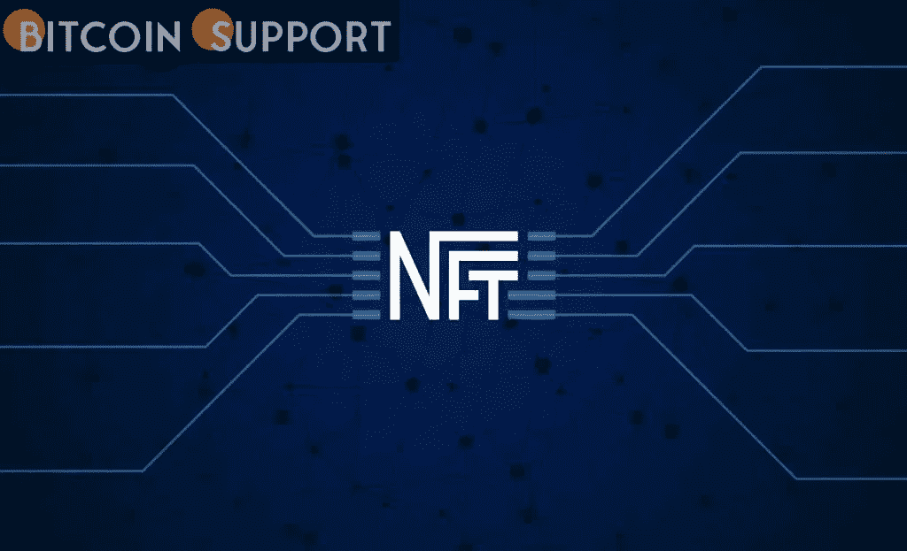
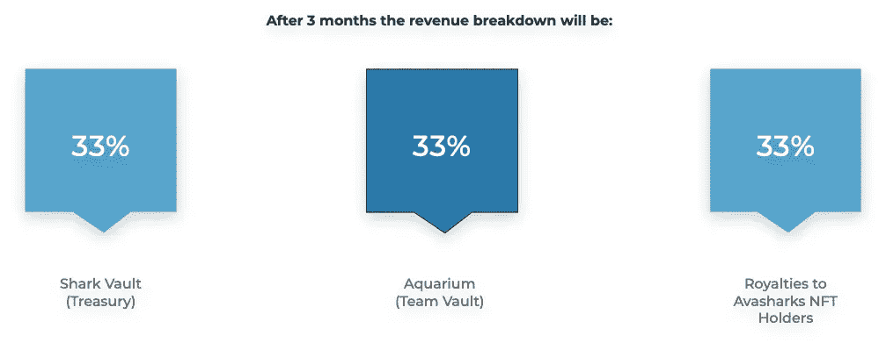

# NFT 不仅仅是另一张侧面照片；这也是被动收入的来源

> 原文：<https://medium.com/coinmonks/nft-isnt-just-another-profile-picture-it-s-also-a-source-of-passive-income-98deca66cd65?source=collection_archive---------65----------------------->

**Visit our website:-** [**https://bitcoinsupports.com/**](https://bitcoinsupports.com/)

买赚策略是一个让你在投资的同时赚钱的概念。AvaSharks 也不例外，雪崩区块链上的大多数 NFT 都有版税支付。然而，通过引入“购买赚取”或“B2E”的概念，我们选择了一种稍微不同的方式。你所要做的就是买入并持有一只鲨鱼 NFT，这听起来就像是真的。

不会有打桩，存放，或者最重要的是，重复任务(像复合，升级，冲洗，重复)。就这么简单:铸造一条鲨鱼，只要你把鲨鱼 NFT 放在钱包里，你就会从二级市场销售中获得一定比例的版税。这还没有结束:你还会从亚特兰蒂斯之门赚取的费用中得到一部分，这将是我们游戏平台的未来之家。

所以没有跑马圈地？不是那么容易吗？是的，但很可能什么都没有。

“以股份换收入”已经成为 DeFi 领域的一个主要趋势，越来越多的 NFT 计划将它纳入其中。当每个人都在追求最新的趋势时，AvaSharks 却在用 B2E 的概念以一种完全不同的方式对待被动收入。我们正在把我们自己的 AvaSharks 自旋放在一个屡试不爽的版税激励计划上。

**随着亚特兰蒂斯大门的开启，B2E 现在成为了现实。**

Atlantis Gate 是雪崩区块链上的第一个博彩平台，将举办我们收集的 10，000 场完全操纵的 3D 拟人化鲨鱼 NFT。

AvaSharks 生态系统的支柱是亚特兰蒂斯之门。我们都知道互联网赌博是多么受欢迎和有利可图，但 Avalanche 还没有看到一个基于区块链的赌博和游戏网络出现。在雪崩中，亚特兰蒂斯之门将是第一个。

**Avasharks 的时代已经到来**

我们的目标是将 Atlantis Gate 变成一个“一站式”游戏平台，帮助 Avalanche 成为区块链领先的博彩目的地。这个平台卑微的开端将从一个抛硬币游戏开始，在这个游戏中，玩家们相互竞争。

随着我们员工和收入流的增长，我们将能够提供各种独特和有趣的博彩游戏和平台，如鲨鱼赛跑、轮盘赌、吃角子老虎机等等。

**收益分成方案**

前三个月运营情况如下:

三个月每个月，项目收益 100%平均分配给所有 AvaShark 持有人，意味着只要持有 NFT，AvaShark 持有人就能从被动收益中获利。

**在前三个月之后，**

收入份额将在大约 90 天后减少到更可持续的数额，如下所述。

**Visit our website:-** [**https://bitcoinsupports.com/**](https://bitcoinsupports.com/)

**售后商品销售**

水族馆将获得 2.5%的版税，而鲨鱼持有者将获得 2.5%。

**彩票**

每季度都会举行一次抽奖，将银行金库的一定比例分给鲨鱼和彩票持有者。彩票持有者将提供新的资金来源。彩票的分配将受到稀有程度的影响，详见我们的白皮书。

**造币规格**

不要错过成为 AvaSharks 和亚特兰蒂斯之门赌博平台一份子的机会。一旦第二代发布，所有持有人将收到 1:1 的 Gen2 AvaShark 空投，这将立即开始收集被动收入(每周空投)。在我们的造币厂于世界协调时 2 月 26 日晚上 9 点关闭后，所有剩下的鲨鱼将被永久焚化。所有被烧毁的 AvaShark NFTs 将从抽奖中删除，增加鲨鱼持有者社区赢得季度抽奖活动的机会！

**访问我们的网站:-**[**https://bitcoinsupports.com/**](https://bitcoinsupports.com/)

**免责声明:以上为作者观点，不应视为投资建议。读者应该自己做研究。**

> *加入 Coinmonks* [*电报频道*](https://t.me/coincodecap) *和* [*Youtube 频道*](https://www.youtube.com/c/coinmonks/videos) *了解加密交易和投资*

# 另外，阅读

*   [3 商业评论](/coinmonks/3commas-review-an-excellent-crypto-trading-bot-2020-1313a58bec92) | [Pionex 评论](https://coincodecap.com/pionex-review-exchange-with-crypto-trading-bot) | [Coinrule 评论](/coinmonks/coinrule-review-2021-a-beginner-friendly-crypto-trading-bot-daf0504848ba)
*   [莱杰 vs n rave](/coinmonks/ledger-vs-ngrave-zero-7e40f0c1d694)|[莱杰 nano s vs x](/coinmonks/ledger-nano-s-vs-x-battery-hardware-price-storage-59a6663fe3b0) | [币安评论](/coinmonks/binance-review-ee10d3bf3b6e)
*   [Bybit 交易所评论](/coinmonks/bybit-exchange-review-dbd570019b71) | [Bityard 评论](https://coincodecap.com/bityard-reivew) | [Jet-Bot 评论](https://coincodecap.com/jet-bot-review)
*   [3 commas vs crypto hopper](/coinmonks/3commas-vs-pionex-vs-cryptohopper-best-crypto-bot-6a98d2baa203)|[赚取加密利息](/coinmonks/earn-crypto-interest-b10b810fdda3)
*   最好的比特币[硬件钱包](/coinmonks/hardware-wallets-dfa1211730c6) | [BitBox02 回顾](/coinmonks/bitbox02-review-your-swiss-bitcoin-hardware-wallet-c36c88fff29)
*   [block fi vs Celsius](/coinmonks/blockfi-vs-celsius-vs-hodlnaut-8a1cc8c26630)|[Hodlnaut 审核](/coinmonks/hodlnaut-review-best-way-to-hodl-is-to-earn-interest-on-your-bitcoin-6658a8c19edf) | [KuCoin 审核](https://coincodecap.com/kucoin-review)
*   [Bitsgap 审查](/coinmonks/bitsgap-review-a-crypto-trading-bot-that-makes-easy-money-a5d88a336df2) | [Quadency 审查](/coinmonks/quadency-review-a-crypto-trading-automation-platform-3068eaa374e1) | [Bitbns 审查](/coinmonks/bitbns-review-38256a07e161)
*   [加密复制交易平台](/coinmonks/top-10-crypto-copy-trading-platforms-for-beginners-d0c37c7d698c) | [Coinmama 评论](/coinmonks/coinmama-review-ace5641bde6e)