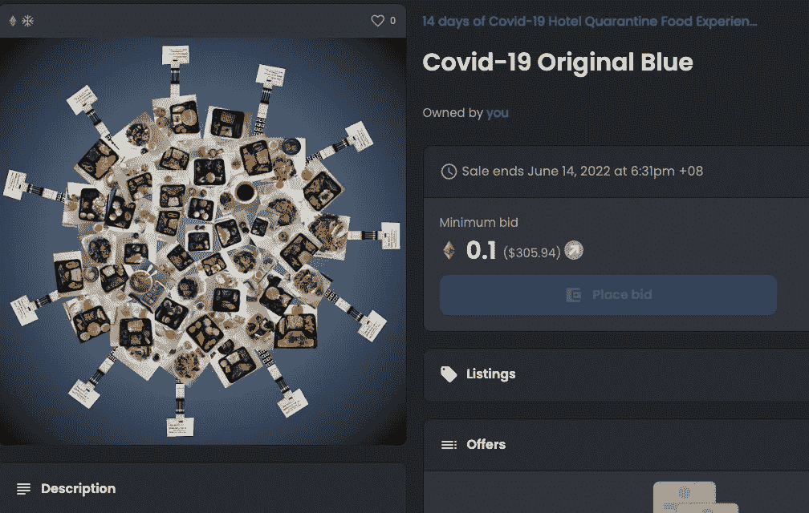
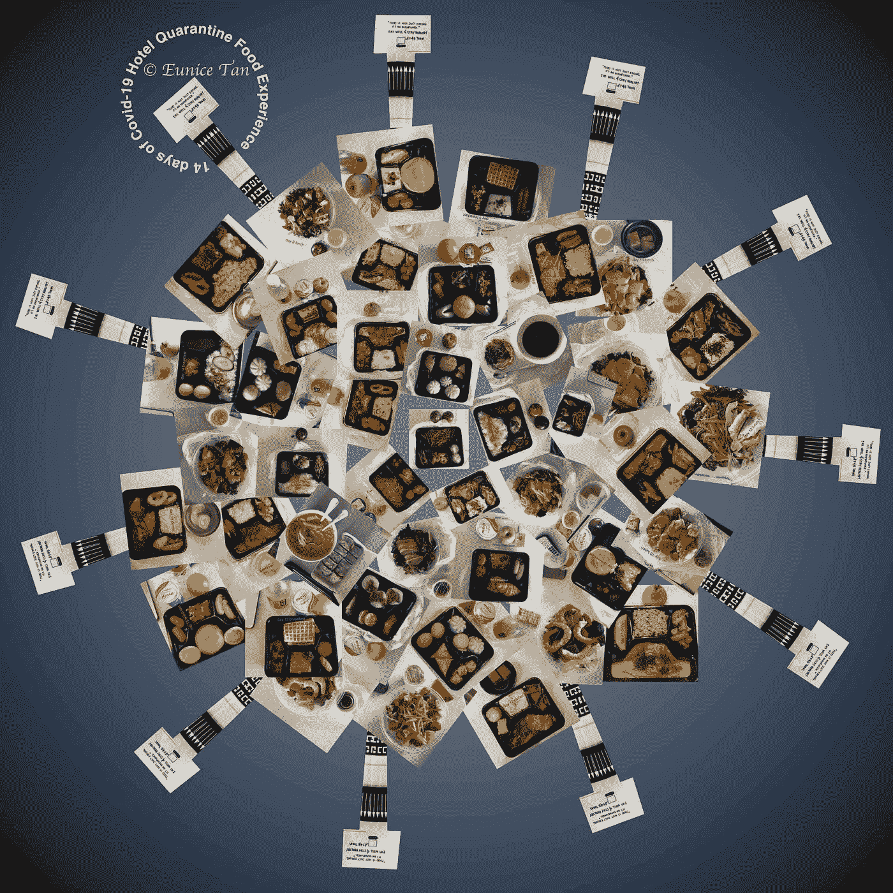
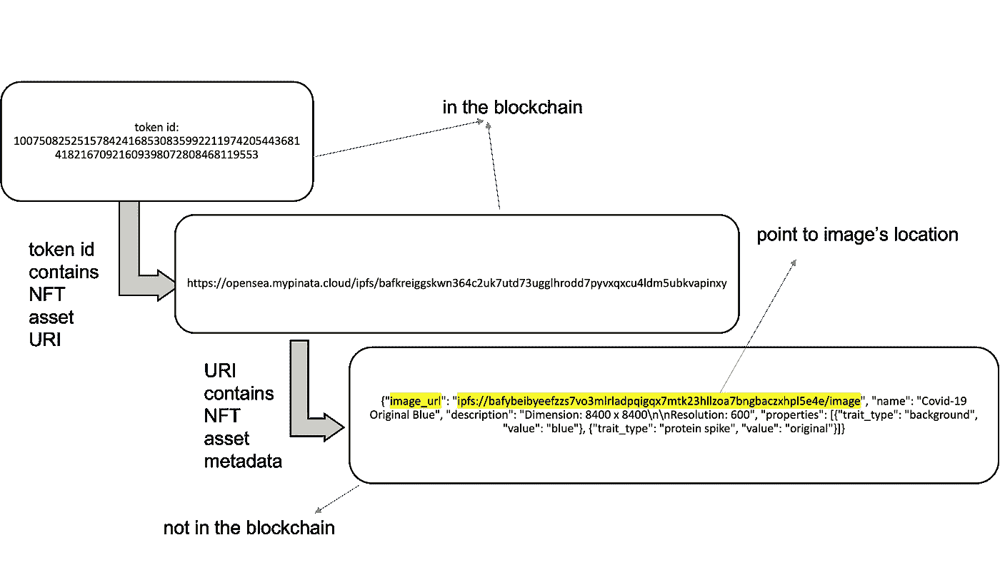
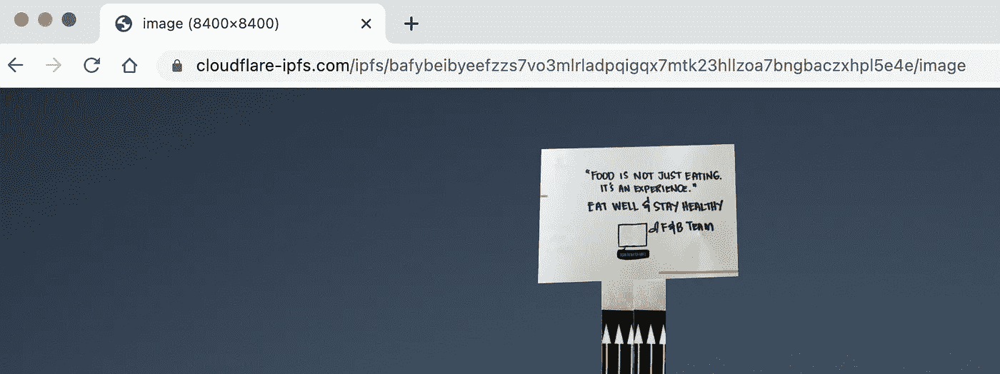

# NFT 之旅第 1 部分——NFT 会把我的图像切成块存储在区块链中吗？

> 原文：<https://medium.com/coinmonks/nft-journey-part-1-does-nft-slice-my-image-into-chunks-to-store-it-in-blockchain-455f9524d811?source=collection_archive---------26----------------------->

NFT Listing in OpenSea.io

NFT，这不是“没有进一步的文字”

NFT 是“不可替代令牌”的首字母缩写这个术语听起来非常深奥，常常让许多人望而却步。谷歌搜索 NFT 会返回:

NFT 与区块链以太坊联系在一起

NFT 是一笔数字资产

NFT 不可兑换

NFT 是独特的

所有这些解释并没有确切地告诉你什么是 NFT？它是如何将数字艺术、图像、音乐、域名甚至音乐会门票等数字项目转变为数字资产的？更重要的是，将图像转换成 NFT 是否意味着图像将被分割成小块以适合区块链事务块的大小？请听我说，我希望一个一个地回答这些问题。

**我们如何保护一件实物艺术品？**

你听说过“出处”这个词吗？在花一大笔钱买一件艺术品之前，你最好熟悉这个术语。出处是记录艺术品来源和所有权历史的文件。出处也为潜在买家提供了保证，艺术品是真实的，艺术家的作品是可信的。

尽管如此，出处并不像你希望的那样简单。首先，记录出处并不总是一致的。它可以包括销售收据、鉴定专家的真品印章，甚至是展览目录。除了采取多种形式，出处可以被伪造，从而使艺术鉴定极具挑战性。尽管有缺点，但有出处总比手头什么都没有强。

步入 21 世纪，艺术不再被画布上的颜料和纸张所束缚。艺术在数字世界中呈现出一种新的形式，数字艺术家正在得到认可和赞誉。然而，生活在数字世界的便利带来了图像盗用和图像盗窃的后果。有时，用户并不知道一个简单的“右击并将图像另存为”的行为是侵犯版权的。

**我们如何保护互联网上的数字艺术，比如图像？**

有许多方法可以防止图像被无意中使用。诸如给图像加水印、降低图像分辨率、压缩图像以降低图像质量以及在图像元数据中添加版权信息之类的操作起到了阻止无意使用图像的作用。然而，归根结底，图像仍然可以从互联网上下载，更不用说水印、降低图像分辨率和压缩图像会给原始图像带来失真。

A low resolution, High compression, Watermarking, © image

至于图像元数据中嵌入的版权信息，只需做一点额外的工作就可以修改或删除它的元数据。十多年来，我们在数字艺术保护方面一直束手无策，直到 **NFT** 出现并席卷全球。

**引擎盖下的 NFT 是什么？**

NFT 可以被视为一个出处的数字表示，它追踪区块链数字艺术的原创性和所有权历史。一件典型的 NFT 作品( **minting** )需要:

**令牌标准**

智能合约使用的一组规则。

**智能合约地址**

智能合同是在区块链中运行的计算机程序。它通常在满足某个条件时触发。例如，创建唯一令牌 id、销售交易或所有权转移的需要。智能合同地址是计算机程序在区块链的位置。

**区块链**

比如以太坊。用于记录交易。比如“令牌 id 123 由用户 A 创建”、“令牌 id 123 由用户 A 以 0.1 ETH 的价格出售给用户 B”等。

**数字艺术/图像**

需要所有权证明的物品。

**唯一令牌 id**

uint256(非负整数)。由智能合同生成以表示数字作品。例如:*“110075082525157842416853083599221197420544368141821670921609398072808468119553”*

**所有者**

数字艺术的原创者

本质上，当代表数字艺术的唯一令牌 id(又名**令牌 id** )被生成并通过在区块链执行智能合同被分配给所有者时，NFT 被创建。

通过给数字艺术品贴上令牌 id 标签并将其与所有者配对，我们已经将数字艺术品转化为数字资产，从而可以通过 NFT 追踪其所有权和销售历史。应用令牌标准可以最小化 NFT 创建和销售执行中的不一致性。使用区块链将防止伪造 NFT 交易，因为区块链是众所周知的防篡改。从本质上讲，一幅 NFT 作品是一个带有所有权证明的真迹印章。

我的 NFT 形象在哪里？

我经常遇到的对 NFT 的误解是:

“区块链存储 NFT 及其数字艺术的交易历史，”或者“图像存储在 NFT 内。”

与这种想法相反，数字图像在区块链甚至在 NFT 都找不到。实际上，NFT 交易只涉及用户之间的**令牌 id 交易。如果图像不在区块链，那么图像到底在哪里，我们如何获得它？开门见山地说，线索在于令牌 id。请参考下图进行总结。**

NFT Image Whereabout

注:URI 统一资源标识符

因此，NFT 艺术品被存储在区块链之外的分散或集中的服务器中。在图表的例子中，NFT 图像存储在分散的文件存储器中，称为 **IPFS** (星际文件系统)。

Actual Image Location of an NFT

谁拥有 NFT 的权利？

这是围绕 NFT 最有争议的话题。在一个典型的 NFT 环境中，买家拥有原始的数字艺术品，加上拥有 NFT 的吹嘘权，而创作者保留基础艺术品的所有版权和复制权。此外，每当转售 NFT 时，版税可以支付给创作者。

**NFT 只适合数字艺术/图像吗？**

任何可以被数字化并需要所有权证明的东西都可以被铸造成 NFT，包括艺术、照片、音乐、域名、音乐会门票、元宇宙土地等。然而，NFT 是一个新手，很少有人了解，更不用说 NFT 的合法性尚未得到权威机构如政府机构的承认，如果发生纠纷。诸如“拥有作为 NFT 的数字化汽车契约等同于拥有实体汽车吗？”仍然没有答案。尽管 NFT 有许多灰色和不确定的地方，我仍然相信 NFT 有潜力被大规模采用，并且不能等待每个人都拥有 NFT 的那一天。

请让我知道你是否有任何问题或者是否有任何你想要我写的东西；下面留个**评论**。感谢阅读，我希望你喜欢这篇文章。