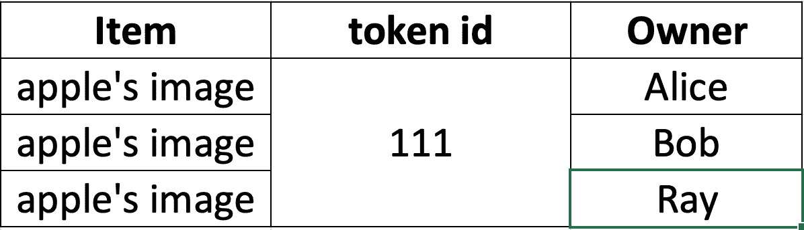
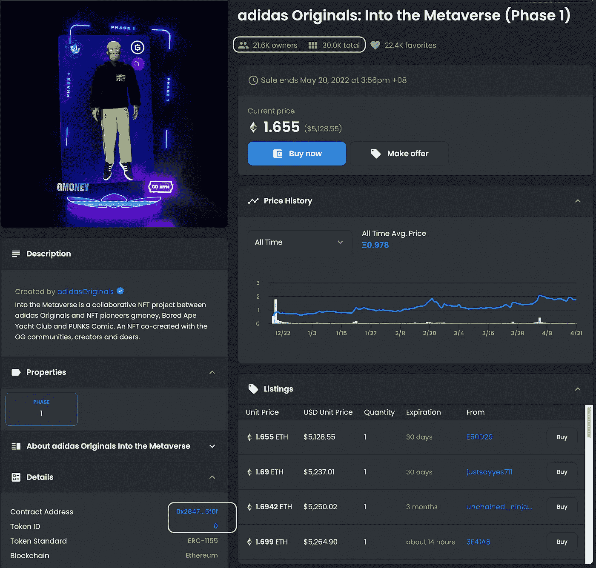

# NFT 之旅第 2 部分-NFT 是独一无二的吗？

> 原文：<https://medium.com/coinmonks/nft-journey-part-2-is-nft-unique-9f0a61a2b9b7?source=collection_archive---------27----------------------->

在我们开始之前，让我们先来研究以下两个 NFT 上市公司，然后再深入讨论是什么让 NFT 独一无二。

NFT- Sunflower in Winter № 1

**NFT 上市:** [冬日里的向日葵#1](https://opensea.io/assets/matic/0x2953399124f0cbb46d2cbacd8a89cf0599974963/110075082525157842416853083599221197420544368141821670921609398061813351841793)

**合同地址:** OpenSea 智能合同

令牌 ID:11007508252515784241685308359922119742054436814182167092160939806181351841793

NFT- Sunflower in Winter № 7

**NFT 清单:** [冬日里的向日葵#7](https://opensea.io/assets/matic/0x2953399124f0cbb46d2cbacd8a89cf0599974963/110075082525157842416853083599221197420544368141821670921609398068410421608449)

**合同地址:** OpenSea 智能合同

**令牌 ID:**11007508252515784241685308359922119742054368141821670921609398068410421608449

参考 [NFT 之旅第一部分](/coinmonks/nft-journey-part-1-does-nft-slice-my-image-into-chunks-to-store-it-in-blockchain-455f9524d811)来回顾一下 NFT 是什么以及它的 token id 的重要性。

**观察:**

你有没有注意到，即使“冬天的向日葵#1”和“冬天的向日葵#7”有不同的令牌 id，NFT 的项目是相同的？当我第一次冒险去 NFT 的时候，我有些困惑，

*   “难道 NFT 不应该是独一无二的吗？”
*   "什么是 ERC-1155 令牌标准？"

给了我一个巨大的谷歌搜索。因此，我在这篇文章中的目标是简洁地回答这些问题。

什么是 ERC-721？

ERC 代表**以太坊** **征求意见，**它是指导在以太坊区块链撰写智能合同的一套文档。任何驻留在以太坊区块链或以太坊兼容的区块链的 NFT 都由 ERC 令牌标准，即 ERC-721，一个众所周知的 NFT 令牌标准来管理。根据 ERC-721， **(1)** 一个物品，不管它是可收集的还是唯一的，都将被给予 **(2)** 一个唯一的令牌 id 作为与所有者 **(3)** 匹配的标识符。这是 NFT 的基础。

然而，如上所述，在开放海上新铸造的 NFT 中使用的令牌标准不是 ERC-721，而是 ERC-1155；因此，什么是 ERC-1155，它与 ERC-721 有什么不同？

什么是 ERC-1155？

ERC-1155 是一个多令牌标准，支持“**可替换令牌**和“**不可替换令牌**具有“可替换令牌”和“不可替换令牌”属性的组合被称为“**半可替换**这一令牌标准于 2018 年推出，旨在为现有 NFT 增加灵活性，以支持更广泛的应用，如游戏 NFTs 甚至元宇宙。当 ERC-1155 满足不可替换的标准时，它被视为 NFT，这意味着一个映像映射到一个令牌 id 和一个所有者。ERC-1155 令牌映射可能相当复杂。例如，它可以将同一项目的多个实例映射到一个令牌 id 和一个所有者，也可以将项目的多个实例映射到一个令牌 id 和多个所有者，等等。

让我们看看下图，这是许多 ERC-1155 令牌映射可能性中的一种:

adidas Originals: Into the Metaverse

**NFT 清单:** [**阿迪达斯原件:进入元宇宙**](https://opensea.io/assets/0x28472a58a490c5e09a238847f66a68a47cc76f0f/0)

**合同地址:** AdidasOriginals 智能合同

**令牌 ID :** 0

**观察:**NFT 列表有一个令牌 id，映射到阿迪达斯图像的 30，000 个实例，有超过 20，000 个所有者使用由阿迪达斯智能合同管理的 ERC-1155 令牌标准。

由于 ERC-1155 的多功能性，ERC-1155 取代 ERC-721 成为 NFTs 的默认令牌标准只是时间问题。

**分数 NFTs (F-NFTs)**

就像“分时度假”一样，房产被分割成部分所有权，F-NFTs 也试图将 NFT 分割成部分所有权。他们正在这一领域进行开发，以支持这一应用。然而，F-NFT 并不是 ERC 72，1 中所特有的，在 ERC-1155 中也没有精确地说明。

NFT 是独一无二的吗？

在 ERC-721 和 ERC-1155 令牌标准下，如果物品被映射到唯一的令牌 id 并链接到所有者，则 **NFT 被认为是唯一的**，即使物品是相同的。总之，NFT 唯一性仅基于 **1:1:1 比率**的数字映射，NFT 交易仅基于令牌 id。

**注:**以下文章基于以太坊区块链令牌标准，即 NFT 平台上的 [ERC-721](https://ethereum.org/en/developers/docs/standards/tokens/erc-721/) 和 [ERC-1155](https://ethereum.org/en/developers/docs/standards/tokens/erc-1155/#top) ， [OpenSea.io](https://opensea.io/) 。多边形区块链是一个旨在减轻以太坊拥塞问题的侧链，目前在 OpenSea.io 中受支持。在多边形或以太坊上创建的 NFT 符合以太坊令牌标准。

订阅 g [*et 通知*](/subscribe/@eunicetzc) *每当我发布的时候都会通过邮件通知。*

*还不是中等会员？注册* *每月只需 5 美元。你的会员资格直接支持像我这样的作家，而且你可以在媒体上看到所有的故事。*

如果您有任何问题，或者您希望我概括地写些什么，请告诉我；下面留个 ***评论*** *。感谢阅读，我希望你喜欢这篇文章。*

> 加入 Coinmonks [电报频道](https://t.me/coincodecap)和 [Youtube 频道](https://www.youtube.com/c/coinmonks/videos)了解加密交易和投资

# 另外，阅读

*   [TraderWagon 回顾](https://coincodecap.com/traderwagon-review) | [北海巨妖 vs 双子星 vs BitYard](https://coincodecap.com/kraken-vs-gemini-vs-bityard)
*   [如何在 FTX 交易所交易期货](https://coincodecap.com/ftx-futures-trading) | [OKEx vs 币安](https://coincodecap.com/okex-vs-binance)
*   [OKEx vs KuCoin](https://coincodecap.com/okex-kucoin) | [摄氏替代品](https://coincodecap.com/celsius-alternatives) | [如何购买 VeChain](https://coincodecap.com/buy-vechain)
*   [ProfitFarmers 回顾](https://coincodecap.com/profitfarmers-review) | [如何使用 Cornix 交易机器人](https://coincodecap.com/cornix-trading-bot)
*   [如何匿名购买比特币](https://coincodecap.com/buy-bitcoin-anonymously) | [比特币现金钱包](https://coincodecap.com/bitcoin-cash-wallets)