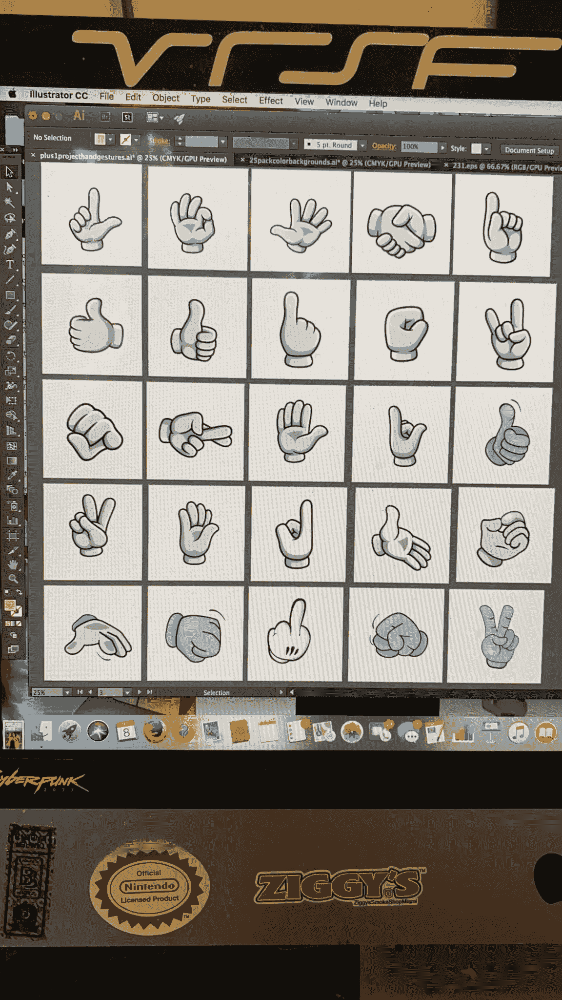

# NFT 发布——成功投放所需了解的一切🚀

> 原文：<https://medium.com/coinmonks/nft-launch-everything-you-need-to-know-for-a-successful-drop-d766a7373594?source=collection_archive---------5----------------------->

MetaDads NFT Collection

大多数参与 NFT/加密领域的人都曾参与过其他人的项目，或者想要启动他们自己的 NFT 项目，主要是出于财务盈利的原因…一个项目应该不仅仅是钱，而是每个人自己的…

在本指南中，我将教你如何利用以太坊网络上的 OpenSea 来发布你自己的生成性艺术 NFT 收藏。

_______________________________________________________

**跟随我们的加密/NFT/区块链/元宇宙之旅，努力建立地球上第一个 NFT/以加密为中心的酿酒厂和离网社区🌱**

> [*推特*](https://www.twitter.com/metadadsxyz)[*不和*](https://discord.gg/Cv8v2Ert8m)[*YouTube*](https://www.youtube.com/channel/UC7pbtSBs9nRJHK6coMhCR8g)[*抖音*](https://www.tiktok.com/@thedudescrypto)[*insta gram*](https://www.instagram.com/metadadsxyz)[*Spotify 播客*](https://open.spotify.com/episode/5U8vXE9HDAsGbSbebw9p62?si=2rZIigw-Tw2pCxjxmkbYzQ)

________________________________________________________

# 必需品:

1- **艺术家**为您的 NFT(音乐家、数字艺术家、诗人等)创作艺术作品
2- **智能合约开发者**为您的 NFT 系列创作智能合约。如果你不做生成艺术，也没有推出日/造币厂，那么你可能不一定需要智能合同或开发商…

事实上，这两个人(或一个人)就是你创建自己的 NFT 系列所需要的全部。

但实际上，如果没有适当的营销或特别棒的艺术，你可能不会卖出任何一幅 NFT 的作品

> 尽管推出你自己的 NFT 系列的必要性微乎其微，但实际销售 NFT 系列却完全是另一回事。

# 营销:

一个好的 NFT 收藏团队通常由 1-2 名聪明的合同开发人员/前端开发人员、1 名艺术家和 2-3 名营销人员组成。

销售你的 NFT 系列的关键(现在)是通过市场营销和社会证明。如果人们看到别人谈论你的项目，他们自己也会对它更感兴趣。

你需要成为一名营销人员或者雇佣一个优秀的营销人员团队…

你基本上需要利用 Twitter 和 Discord 作为主要的社交渠道。你也可以选择使用其他“不太受欢迎”的社交网站，比如抖音、T2、YouTube、Instagram、甚至播客、LinkedIn 和社交网站

> 在我看来，让你的项目获得销售的最好方法是利用有影响力的人和“阿尔法小组”来宣传口碑。

有了良好的营销、售出的后端基础、吸引人的艺术和良好的用户体验，你也许能卖出一些你的 NFT，因为这真的不像你想象的那么容易…

# 示例:

## 第一步:

假设我们想推出一个名为“Dope Dogs”的 10k 生殖艺术 NFT 收藏，支持拯救狗的生命，使其免受安乐死，并给流浪狗一个家…

我们需要做的第一件事是找到一个艺术家。既然我们的收藏被称为“Dope Dogs”，我们应该尝试在所有社会阶层中寻找一位艺术家，通过口头传播。我们应该找一个画“毒品”外观艺术的人，可能不是儿童漫画家。艺术家也应该知道生成艺术需要“分层”,意思是身体是一层，头是另一层，耳朵，鼻子，配件等等…

一旦我们有了艺术家并委托他为我们的 10k NFT 系列创作生成性/分层艺术，我们需要找到一个聪明的合同开发者/前端开发者/ Web3 全栈开发者。

理想情况下，开发人员可以利用 Metamask 为您创建具有铸造功能的网站，能够对生成艺术进行编码，以便艺术层随机分配稀有特征，还可以创建视觉上令人惊叹/吸引观众的网站。如果你想要一个白名单或预售，确保编码器也能做到这一点。

编码器/程序员对你的 NFT 项目的功能非常重要，所以要确保程序员有启动这些生成性艺术收藏的经验，并且以前编码过 web3 Dapps(允许使用加密货币/NFT 的)

现在我们有了两个必需品；“Dope”艺术家和令人惊叹的程序员，我们可以开始项目的其余部分…

## 后续步骤:

我们需要决定我们希望我们的 NFT 生活在什么样的区块链，什么样的 NFT 市场。最常见的是 NFT 市场上的以太坊区块链。这也是我们要利用的。

我们现在应该开始设置我们将要使用的所有社交账户。Twitter 很简单。不和谐可能需要帮助，你可以雇佣好的帮手来建立、保护并教你如何操作，费用相当低廉

我们还必须决定什么时候我们认为所有这些都可以完成，我们有足够的观众来进行合适的发布。也许离现在还有 2mo

这将给我们 2 个月的时间来完成艺术，部署智能合同，创建一个铸造网站，通过 socials 开发社区，并普遍获得成功发布的牵引力。

我们还应该找到合作伙伴，不仅与其他 NFT 收藏，但与动物收容所和诊所，以履行我们的“拯救狗”的使命。

在我看来，这个项目最难的部分是沟通的一致性，向潜在买家/朋友伸出手，并为你的项目赢得观众。

就是这样！所有这些听起来可能并不太难，但我向你保证，在这个拥挤的市场中，这是…

这个指南教你最基本的启动你自己的艺术 NFT 收藏。

如果你想了解更多关于如何出售你的艺术，或者如何发展一个社区，请务必在下面的链接中查看我的博客！

___________________________________________________________________

**永远小心！！！⚠️**

*我怎么强调都不为过！保持高度警惕，注意你点击的每一个链接，你做的每一笔交易，和你交往的每一个人，因为骗子在这个领域是大量的，最好的项目也会被取消。*

点击所有链接之前，要再三检查，确保它们是你要找的官方链接。在给自己或他人发送任何有价值的东西之前，也要仔细检查所有的钱包地址。

> **跟随我们的加密/NFT/区块链/元宇宙之旅，努力打造地球上首个 NFT/以加密为中心的酿酒厂和离网社区🌱**
> 
> [*推特*](https://www.twitter.com/metadadsxyz)[*不和*](https://discord.gg/Cv8v2Ert8m)[*YouTube*](https://www.youtube.com/channel/UC7pbtSBs9nRJHK6coMhCR8g)[*抖音*](https://www.tiktok.com/@thedudescrypto)[*insta gram*](https://www.instagram.com/metadadsxyz)[*Spotify 播客*](https://open.spotify.com/episode/5U8vXE9HDAsGbSbebw9p62?si=2rZIigw-Tw2pCxjxmkbYzQ)
> 
> *请将 Polygon Matic 发送到这个 Eth 地址或 Eth 令牌:
> 0xb 53b 3978333 e 11 c 382 ab 619 f 02 f 469 A8 c 70750 af*

___________________________________________________________________

感谢阅读:]

干杯，
***Ty 又名【哥们儿】***

**我们其他的一些博文:**
[5 个失败的 Web3](/coinmonks/5-downfalls-of-web3-cd5dc8ade4fd)
[5 + 5 个不和谐的战术](/coinmonks/5-tips-for-a-better-discord-nft-crypto-edition-ff9b039d0359)
[Crypto 101:一个初学者指南](/coinmonks/crypto-101-a-beginners-guide-345d440bd163)
[NFT 最佳实践(营销&社区成长)](/coinmonks/top-5-nft-best-practices-marketing-and-community-growth-7025e26eb50c)
[Web3 基础知识](/coinmonks/web3-basics-252121357f33)

> 加入 coin monks[Telegram group](https://t.me/joinchat/Trz8jaxd6xEsBI4p)并了解加密交易和投资