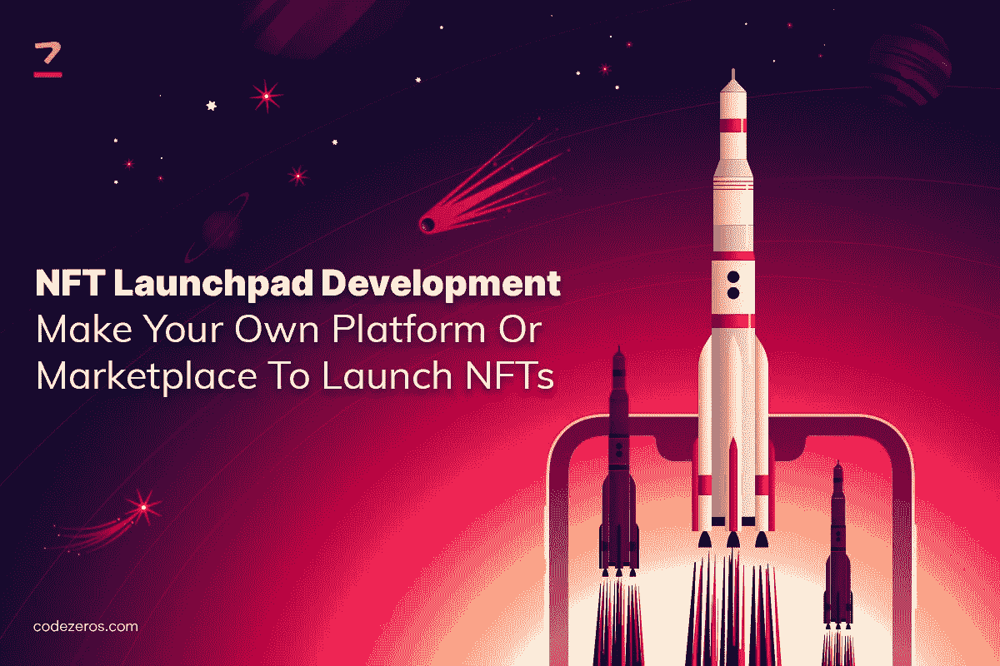

# NFT 发射台开发|打造您自己的平台或市场来发布 NFTs

> 原文：<https://medium.com/coinmonks/nft-launchpad-development-make-your-own-platform-or-marketplace-to-launch-nfts-b3cf49fee71e?source=collection_archive---------26----------------------->

NFT 为企业和企业家提供了大量的好处。他们试图染指非功能性技术，以便在市场上占据上风，同时提高利润率。NFT 发射台是一个数字平台，让企业家在 NFT 市场寻找机会。

独特艺术品的稀有性通过非功能性艺术展示了一个商机无限的世界。由于这个原因，NFT 的受欢迎程度在短时间内飙升，大量企业家投资 NFT。通过 [**NFT 发射台开发**](https://www.codezeros.com/services/launchpad-development-services) ，企业可以创建和推广他们的 NFT 市场平台。

NFT Launchpad Development | Make Your Own Platform Or Marketplace To Launch NFTs

**NFT 发射台是如何工作的？**

让我们更深入一点，了解 NFT 发射台的工作情况，以了解如何使用 NFT 发射台开发服务。

**提案**

企业可以带着详细的项目建议书与 NFT 发展公司接洽。他们可以将他们的期望告知公司，公司将在验证是否为正版后创建项目的原型。

**了解您的客户审查流程**

一旦你提交建议书，公司将启动严格的审查程序。这将有助于他们了解你的项目的真实性。

**项目入职**

如果你的项目是创新的，并且有成功的潜力，公司会继续你的项目。

**征求专家意见**

launchpad 公司将向其专家寻求建议，以使该项目更有前途，并确保其成功。

**白皮书起草**

下一步是白皮书起草。在此过程中，公司概述了项目任务、将使用的技术和策略、营销流程以及项目的其他重要细节。

**工程清单**

完成上述步骤后，该公司将在 launchpad 平台上创建您的个人资料，其中包含项目详情和白皮书。它将吸引投资者，并作为上市前的宣传。

**资助**

您可以为您的 NFT 项目选择所需的资金类型。向下滚动到下面，获得更多关于资金和筹款类型的信息。

**项目营销**

你的项目需要接触尽可能多的投资者和买家，以提高它的知名度。他们将使用 SEO 营销策略和社交媒体平台向其他人介绍你的项目。

**众筹**

最初，众筹优先考虑购买代币的投资者。后来，他们向所有投资者开放。

**项目启动**

在众筹过程的高潮，你准备启动你的 NFT 项目。

**不同类型的筹款模式**

你可以从几种筹资模式中进行选择，以利用你的 NFT 项目。以下是筹资模式的基础。

**首次公开发行股票(IDO)**

IDO 是一种受欢迎的 NFT 筹款方法，确保投资者的高度参与。该模式的上市费用较低，使其更加可靠，并提供快速交易。由于该模式分享项目的管理和所有权，它提高了 NFT 的增长率。

**初始硬币发行(ICO)**

这是加密初创公司和风险企业的首选模式。ICO 帮助您以固定价格交易代币。早期参与的投资者可以获得项目权利，以控制决策并改善其整体功能。它还提高了 NFT 项目的可访问性。

**首次公开募股(IEO)**

IEO 提高了你的 NFT 项目的质量和可信度，因为它将被一个交流平台仔细审查。一旦他们批准这个项目，它将吸引更多的买家和投资者。作为最值得信赖的筹资技术之一，你可以汇集更多的投资者来提高知名度和盈利能力。

**首次农业发行(IFO):**

尽管 IFO 包括了其他筹资方式的所有特征，但它比其他筹资方式更有优势。您可以在预发布阶段提供 NFT 进行交易。您的 NFTs 在被托管到 IFO 之前也将经过严格的审查过程。此外，你必须为非金融资产提供流动性。

**谁可以使用 NFT Launchpad 开发服务？**

任何拥有独特产品的人都可以使用 [**launchpad 开发解决方案**](https://www.codezeros.com/services/launchpad-development-services) 。下面的列表会让你知道谁能从中获益。

**音乐家**

音乐家和创作者可以通过联系买家和投资者来展示他们的才华。这使他们能够扩大自己的影响范围，并期望自己的努力获得最高回报。

**摄影师**

使用 launchpad development 捕捉独特的瞬间，并在 NFT 市场上销售。摄影师可以利用 NFTs 赚取巨额利润，否则这似乎是一个困难的壮举。他们可以很方便地为自己的原创作品创造销量。

**游戏玩家**

游戏玩家可以通过出售他们的游戏资产来换取代币，从而利用该平台。他们可以利用 NFT 发射台获取巨额利润。

**影响者**

有影响力的人有一个已经拥有大量粉丝的优势。他们可以利用它来货币化他们的创造力，并通过标记内容来增加他们的增长。

**艺术家**

艺术品是你进入非艺术作品世界的主要途径。Launchpad development 为艺术家提供了一个安全可靠的平台，让他们可以出售自己独特的作品并接触到更广泛的受众。

**为什么选择专业的 Launchpad 开发服务？**

[**launchpad 开发服务**](https://www.codezeros.com/services/) 提供了一些关键因素。让我们简单看一下基本特性。

**高投资回报率**

一个有效的启动平台服务将通过认可你的 NFT 的独创性和所有权来提高他们在市场中的潜力。这将使你的销售迅速增长，以提高市场对非功能性食物的需求。

> 加入 Coinmonks [电报频道](https://t.me/coincodecap)和 [Youtube 频道](https://www.youtube.com/c/coinmonks/videos)了解加密交易和投资

**快速启动**

不可替代的令牌开发服务可确保从提议到发布的过程顺畅而迅速。这将有助于企业家将他们在 NFT 的企业迅速推向市场。

**可承受的交易费用**

NFT 平台的汽油费可以在你的口袋里烧一个洞。使用创新战略和最新技术，以合理的价格提高 NFTs 的效率，是确定合适的发射台公司的关键因素。

**结论**

一家 [**whitelabel launchpad 开发公司**](https://www.codezeros.com/services/launchpad-development-services) 将提供出色的客户支持和具有成本效益的方法，让您的 NFTs 更上一层楼。他们由经验丰富的专业人员组成的团队将在 NFT 项目的每一步帮助你，让它变得不同凡响。