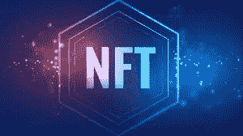
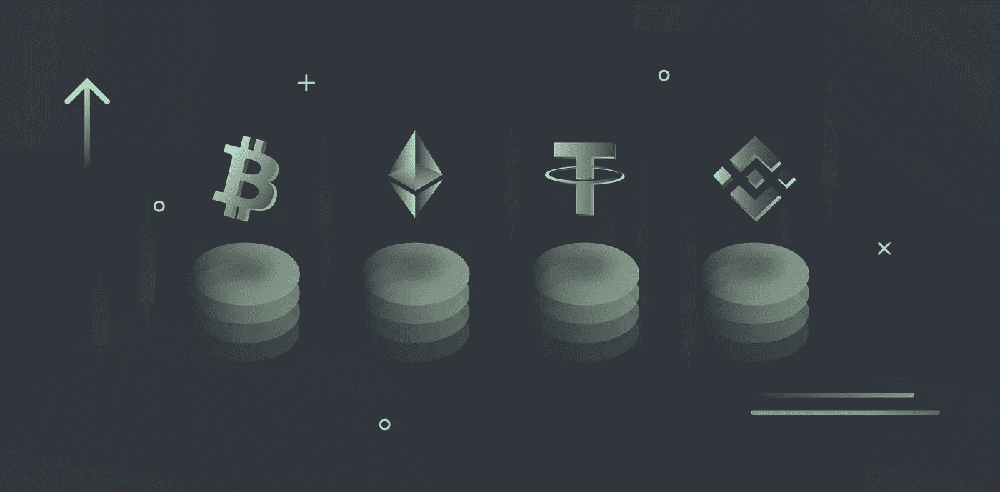
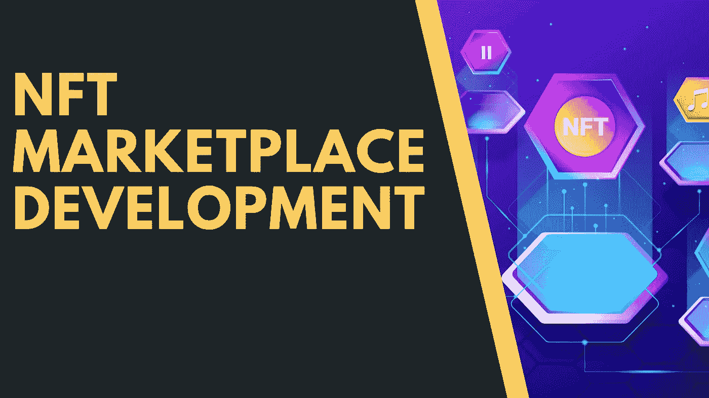

# 到 2027 年，NFT 市场估值将提升至 130 亿美元以上

> 原文：<https://medium.com/coinmonks/nft-market-valuation-to-ascend-to-more-than-13-billion-by-2027-c456458b549e?source=collection_archive---------33----------------------->

总之
*1。另一份 MarketsandMarkets 报告预测，到 2027 年，NFT 市场将发展成为一个价值 136 亿美元的行业。*

*2。该报告预计，在估计的时期内，亚洲将有最高的发展速度。*

*3。来自南森的另一份报告称，到 2025 年，NFT 市场将发展到 800 亿美元。*

**Non-Fungible Token**

研究公司 MarketsandMarkets 的一份报告显示，到 2027 年底，不可替代的 token (NFT)地区的价值可能超过 130 亿美元。

“不可替代的代币市场，通过提供商业技术计划，NFT 创造，董事会，NFT 舞台-商业中心，终端客户，如媒体和娱乐，游戏，地点是美洲，欧洲，中东和非洲，APAC-2027 年全球推测，”该公司表示，假设金融支持者之间的溢价继续发展，市场规模可能在几年内增加。

根据审查公司，NFT 空间目前 30 亿美元的估值将达到 136 亿美元，鉴于建设年增长率(CAGR)为 35.0%。

**导致发展的因素**

勘探公司认识到对 NFT 地区的发展至关重要的三个主要因素。根据该报告，在标准力量作品附近的游戏本地区域的发展是不可忽视的，对高级美术的兴趣将有助于推动空间比以往任何时候都高。

MarketsandMarkets 注意到，这三个因素在最近两年里帮助该地区实现了标准状态，特别是超级明星对 NFTs 的扩大接受支持了它的吸引力。

**Development in Cryptocurrency**

尽管如此，该公司注意到，伴随的元素将同样有助于帮助空间的发展。这结合了设计、零售和商店网络中更多最新的使用案例。

**亚洲被认为是 NFTs 接收发展最快的地区**

虽然美国目前在 NFT 市场的整个行业中占有最大的份额，但在估计的时间框架内，亚洲应该具有最值得注意的发展速度。

在亚洲的长期发展是因为亚太金融支持者的溢价，正如谷歌在当地对 NFT 相关主题的扫描模式所证明的那样。报告中有一段写道，“APAC 国家正朝着事件的一致发展，商业中心在给定市场中为制造商和购买者提供同等的机会。”

**不同报告显示 NFT 市场发展**

来自不同协会的一些报告间接提到了 NFT 市场的发展。

一份新的 BeinCrypto 报告发现，尽管传统媒体报道的案例违反了规范，但该行业的交易仍然稳固。根据这份报告，NFTs 的消亡被极大地歪曲了。

一份报告同样表示，今年迄今为止，NFT 地区已经击败了更广泛的加密市场。这家区块链有见地的公司预计，到 2025 年，NFTs 的估值可能会高达 800 亿美元。

[# coindcxpathbaker](https://keep.google.com/u/0/#label/CoinDCXPathbreaker)

> *加入 Coinmonks* [*电报频道*](https://t.me/coincodecap) *和* [*Youtube 频道*](https://www.youtube.com/c/coinmonks/videos) *了解加密交易和投资*

# 另外，阅读

*   [Bookmap 评论](https://coincodecap.com/bookmap-review-2021-best-trading-software) | [美国 5 大最佳加密交易所](https://coincodecap.com/crypto-exchange-usa)
*   最佳加密[硬件钱包](/coinmonks/hardware-wallets-dfa1211730c6) | [Bitbns 评论](/coinmonks/bitbns-review-38256a07e161)
*   [新加坡十大最佳加密交易所](https://coincodecap.com/crypto-exchange-in-singapore) | [购买 AXS](https://coincodecap.com/buy-axs-token)
*   [红狗赌场评论](https://coincodecap.com/red-dog-casino-review) | [Swyftx 评论](https://coincodecap.com/swyftx-review) | [CoinGate 评论](https://coincodecap.com/coingate-review)
*   [投资印度的最佳密码](https://coincodecap.com/best-crypto-to-invest-in-india-in-2021)|[WazirX P2P](https://coincodecap.com/wazirx-p2p)|[Hi Dollar Review](https://coincodecap.com/hi-dollar-review)