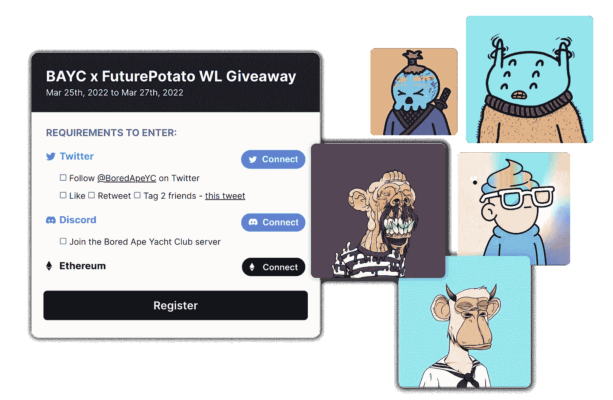
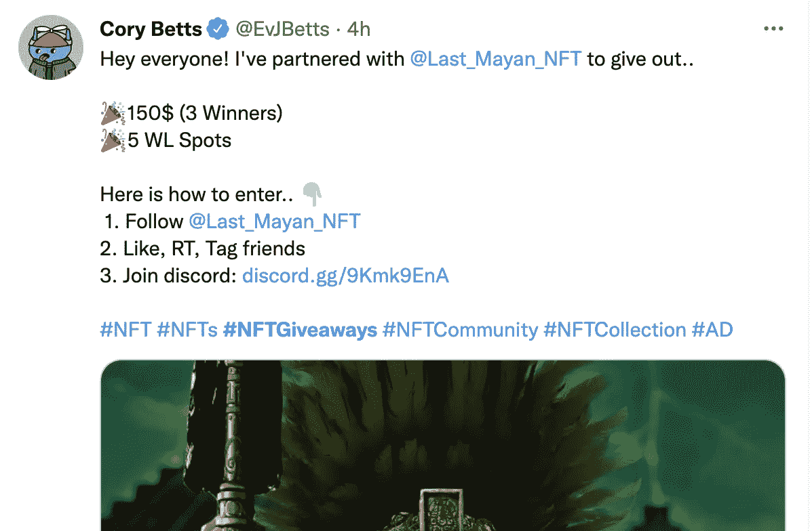
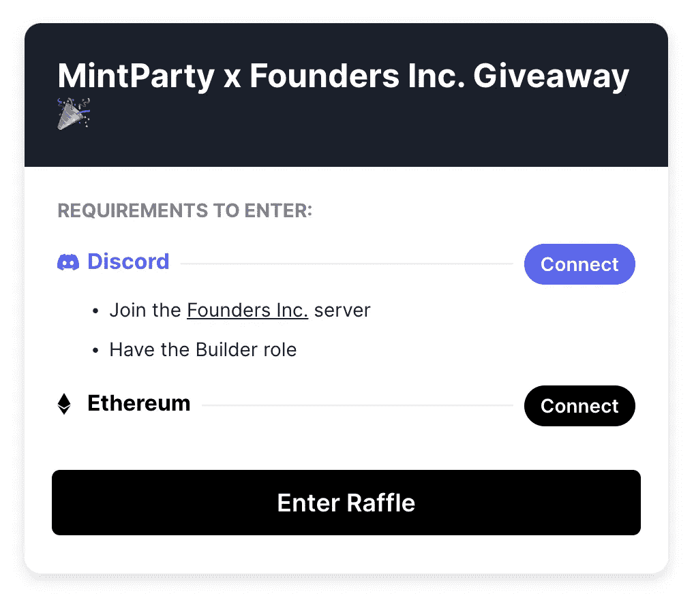
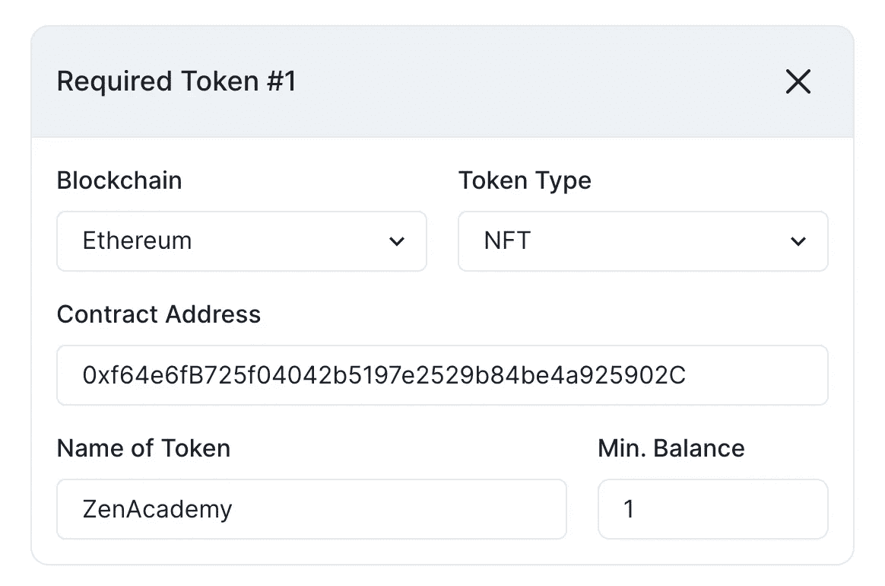
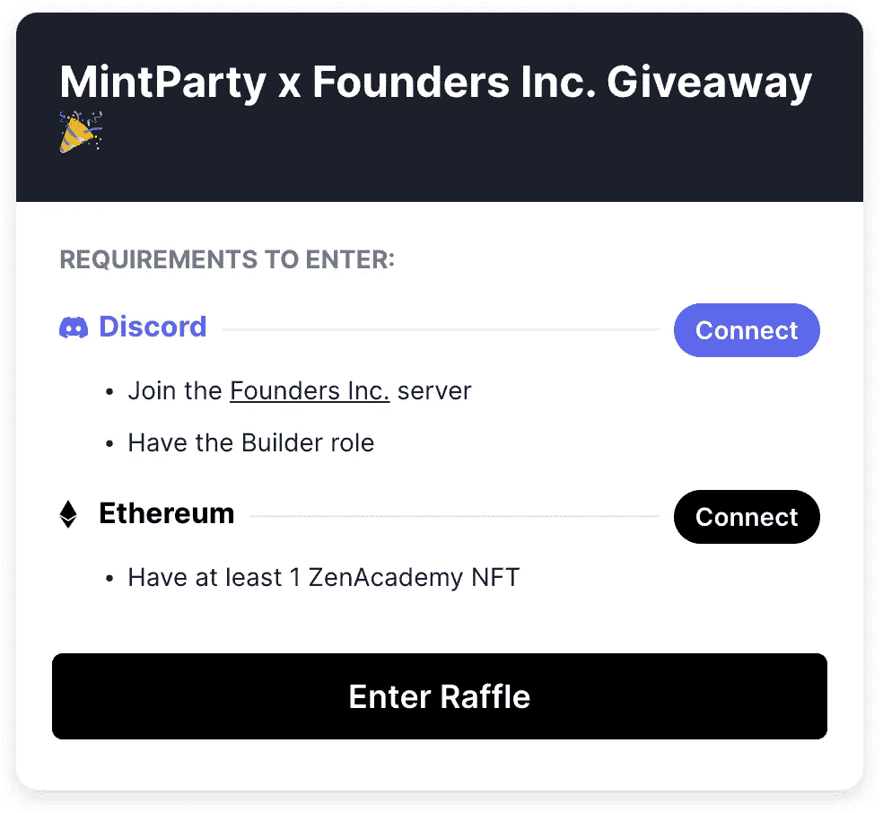

# NFT 营销——为什么以及如何使用 MintParty 开展赠品活动

> 原文：<https://medium.com/coinmonks/nft-marketing-why-and-how-to-use-mintparty-for-giveaway-campaigns-20b7a4fd2f46?source=collection_archive---------16----------------------->

当你准备推出一个 PFP 系列，并开始建立一个社区时，你可能会开始思考——“我如何奖励早期支持者，并确保他们在我们开放时获得 mint？公开销售也会引发天然气大战……我该如何应对？🤔"

嗯，很多项目实现这一点的一种方式是通过**早期支持者的允许名单**(或者你可能听说过白名单这个术语，意思是一样的)。

当一个人收到允许列表时，他们的钱包地址会上传到项目的智能合同中，因此当他们在预售期间连接钱包时，钱包会被“允许”铸造 NFT。否则，大多数人将不得不等到公开销售，这意味着他们不能保证一个薄荷。(有时，如果一个项目收集的钱包地址比他们预售的多，他们也可以在此期间售罄！🚀).

> 给那些从一开始就支持你的社区成员提供售前位置是非常好的，因为这让他们感到被认可和认可。🥳
> 
> 赠品也通过合作在不同的社交媒体平台和其他项目上产生了大量的**参与度**。

# ‍
项目实际上是如何给出允许列表的？

很多不同的方法！这是每个项目都可以真正发挥创造力的地方！🥳

大多数情况下，它们属于以下三类:

1.  Twitter 赠品
2.  不和谐赠品(竞赛、游戏、比赛)
3.  与其他项目的合作

当您运行赠品时，您希望收集他们的 Discord ID(这样您就可以给他们 Discord 中的一个角色)和钱包地址(上传到智能合约上)。

让我们将这三个类别分开，看看目前是如何做到的，以及 MintParty 如何提供帮助。😊

# **推特赠品🐦**

你可能会看到的最常见的活动形式是类似 this:‍的 Twitter 赠品

You’ve probably seen a bunch of these on Twitter — if you haven’t, then you need to be on Twitter more 😂

在这些赠品中，他们有 **3 项要求**:

1.  关注一个 Twitter 账户
2.  喜欢和转发，标记朋友
3.  加入纷争

大多数人现在是如何做的通常是非常非常手动的。他们一件一件的检查所有的东西(或者他们根本不检查！)然后逐个 DM 中奖者，获取他们的钱包地址！😫

‍With MintParty，您可以在您的赠品活动中设置要求，用户只需连接他们的 Twitter、Discord 和 Wallet 即可参加抽奖，MintParty 将为您检查一切并为您存储信息。就这么简单！✨

# **不和谐的赠品**

第二种形式的赠送是在不和谐中进行的。有很多活动继续给出允许列表，如游戏(gartic，扑克，royale rumble，trivia)，参加活动，提交比赛的粉丝艺术和许多其他活动！

当有人获胜时，他们通常会在 Discord 中获得一个**特殊角色，以表明他们赢得了允许列表**。通常会发生的是——一旦你收到可以输入你的钱包地址的角色，一个带有消失消息的**特殊通道**就会打开。

> 这个管用…而是手动将地址复制并粘贴到电子表格中。最终，您将不必担心查看不同的电子表格来交叉引用钱包地址和不一致的 id。

在这种情况下，您可以为 discord 中的特定角色创建一个 MintParty 活动，我们将检查以确保他们在进入活动之前拥有该 allowlist 角色。

Example of a Discord Requirement for the Builder role at Founders Inc.

在这种情况下，MintParty 将为您挑选 X 名获奖者，而不是抽奖——您可以设置它，以便每个以该角色进入的人都是“获奖者”,如果他们有这些要求的话。

# **与其他项目合作赠送**

最后一种赠品是与另一个项目的合作。

如果您正在与另一个项目合作，您可能希望为持有特定 NFT 的成员提供 allowlists。

MintParty 使得检查某些人是否持有某些 NFT 或令牌变得非常容易。

你所需要做的就是插入项目的合同号，设置他们需要持有多少——我们会为你检查。

例如，假设你给了 50 个持有 ZenAcademy 的 allowlists。您将插入与该 NFT 相关联的合同地址，并将其设置为需求之一。

或者，如果你想让用户在钱包里持有最低数量的 ETH，你也可以设置为一个要求。

> 协作是很棒的，因为你所做的事情本质上是通过为他们的社区成员提供对你的项目的早期访问来支持其他项目！🤩

这是一个很好的方式去认识其他优秀项目的创始人，和他们一起工作，互相支持。你甚至可以通过与 AMA、推特空间、其他领域的游戏等建立更深层次的合作伙伴关系来更进一步。(在后面的帖子中会有更多关于这方面的内容！).

# 之后会发生什么？

一旦您完成了所有这些活动并为售前做好准备，您将能够在项目的“列表”选项卡中找到所有活动的所有获奖者。

之后，您需要做的就是下载 CSV 文件，并将其上传到您的智能合同中——就这样！

# 那我该怎么报名呢？

要查看 MintParty，您只需:

*   在我们的[网站](https://mintparty.xyz)上注册(https://mintparty.xyz)
*   请填写表格，我们会尽快回复您！

在 Twitter[上关注我们的旅程，了解功能更新、公告和新闻！](https://twitter.com/mintpartyxyz)

有没有其他方法可以让项目给出我们忽略的所有列表？项目还以其他什么方式回报他们的早期支持者？

我们总是在吸收新的建议——欢迎发送电子邮件至 gm@mintparty.xyz 或在 Twitter 上给我们发 DM！🐦

> *加入 Coinmonks* [*电报频道*](https://t.me/coincodecap) *和* [*Youtube 频道*](https://www.youtube.com/c/coinmonks/videos) *了解加密交易和投资*

# 另外，阅读

*   [Bookmap 评论](https://coincodecap.com/bookmap-review-2021-best-trading-software) | [美国 5 大最佳加密交易所](https://coincodecap.com/crypto-exchange-usa)
*   最佳加密[硬件钱包](/coinmonks/hardware-wallets-dfa1211730c6) | [Bitbns 评论](/coinmonks/bitbns-review-38256a07e161)
*   [新加坡十大最佳加密交易所](https://coincodecap.com/crypto-exchange-in-singapore) | [购买 AXS](https://coincodecap.com/buy-axs-token)
*   [红狗赌场评论](https://coincodecap.com/red-dog-casino-review) | [Swyftx 评论](https://coincodecap.com/swyftx-review) | [CoinGate 评论](https://coincodecap.com/coingate-review)
*   [投资印度的最佳密码](https://coincodecap.com/best-crypto-to-invest-in-india-in-2021)|[WazirX P2P](https://coincodecap.com/wazirx-p2p)|[Hi Dollar Review](https://coincodecap.com/hi-dollar-review)
*   [加拿大最佳加密交易机器人](https://coincodecap.com/5-best-crypto-trading-bots-in-canada) | [库币评论](https://coincodecap.com/kucoin-review)