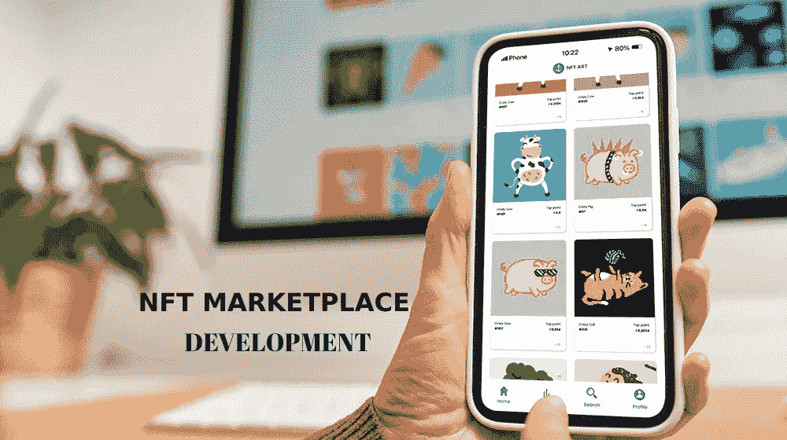
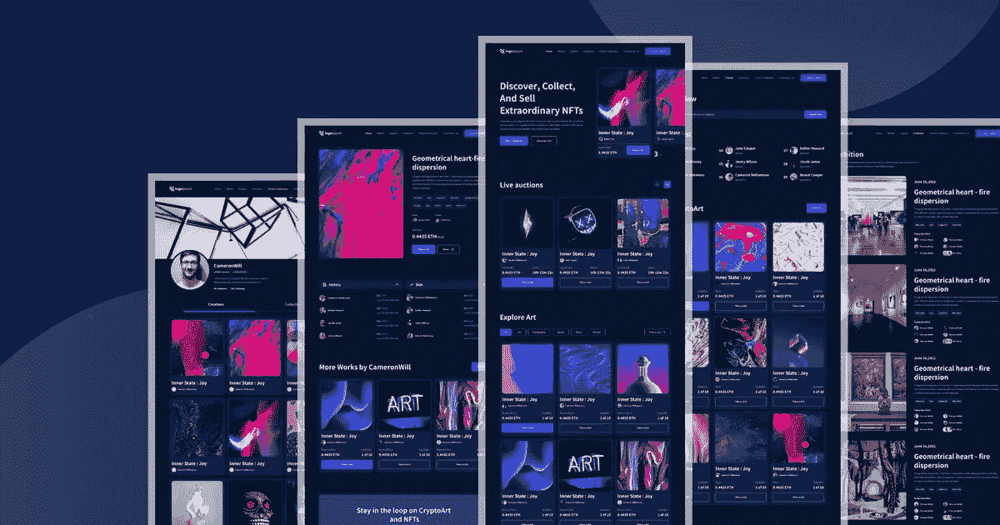

# NFT 市场发展——数字空间的未来

> 原文：<https://medium.com/coinmonks/nft-marketplace-development-the-future-of-digital-space-ad1d7974094d?source=collection_archive---------15----------------------->

近年来，英国《金融时报》的市场一直在实现他们的愿望。每天都有技术进步和其他进化，他们甚至是那些进化的一部分。其中一个进步就是 Web 3.0。它为包括 NFT 市场在内的许多企业提供了一系列商业机会。自成立以来，NFT 市场在短短几年内已经从几百万美元发展到十亿美元的市场，而且峰值仍在上升。这导致了世界各地许多 NFT 市场的发展演变。

世界上最好的市场包括 **Opensea、Rarible、SuperRare** 等。他们被认为是商业界的佼佼者，也是密码界的潮流人物。

然而，就市值和交易量而言，Opensea 是全球最大的市场。看到他们的进步和记录，他们中的许多人决定建立一个这样的市场，以看到利润并在几年内取得成功。但是，他们不确定市场发展的过程。

在这里，我们涵盖了你想知道的关于[**创造一个世界级的市场**](https://bit.ly/3y3mxlx) 就像 Opensea 市场一样。

## **NFT 市场开发涉及的步骤**

**✔** 准备你的利基市场

**✔** 评选最佳区块链及其标准

**✔** 选择开发技术建造一个

**✔** 接触最好的市场开发公司

✔设计你的用户界面/用户体验

**✔** 整合功能

**✔** 智能合约生成

**✔** 测试和部署

这些是 NFT 市场开发中涉及的步骤。但是，让我简单地解释一下。

## **准备你的利基**

为了有一个成功的企业，你需要最好的想法被执行。它包括从所有可能的角度进行规划，如技术、目标受众、竞争对手等。

重要功能包括选择区块链及其标准。

## **选择最佳区块链和标准**

选择最好的区块链及其标准是重中之重。在加密领域有许多区块链和标准可用。以下是一些最流行的区块链和 NFT 标准的列表。

☀以太坊— ERC721 和 ERC1155

☀创 trc721

☀币安智能链— BEP721

## **选择开发技术构建一个:**

建立 NFT 市场的最佳方式是通过以下任一方式搭建平台:

✅ [**从头建起一个市场**](https://bit.ly/3y3mxlx)

**✅** 白标解决方案

## **从头开始建立一个市场**

从头开始建立一个 NFT 市场包括从一开始就通过部署市场平台所需的所有功能和其他东西来划分市场。因为它从头到尾包括所有的步骤，所以需要大量的时间。你可以陈述你的要求，并要求他们根据你的选择建立一个市场。

## [**白标解决方案**](https://bit.ly/3AdcDk8)

白标解决方案是一个现成的平台，可以根据需求进行定制。既然是现成的软件，那么在市场上就很容易推出。

选择正确的技术和最快的方式来建立一个 NFT 市场。

## **接触最佳市场开发公司:**

选择建立 NFT 市场的最佳方式是多么重要；选择合适的 NFT 市场开发公司来获得他们的解决方案也很重要。

因此，选择最可靠的市场解决方案提供商来建立一个令人难以置信的市场选择。

> 他们采取所有步骤为完美的交易编写完美的平台，并嵌入所有的功能。

## 设计你的用户界面/UX

选择正确的用户界面/UX 让用户走向你的市场。吸引人的用户界面是产生流量的关键。因此，选择最用户友好的设计来完成工作。

## **集成特性**

特色是让你的市场从竞争中脱颖而出的要素。它们是市场穿着的秘密服装，目的是以一种更加诱人的方式来覆盖用户。

以下是一些功能:

➤店面

➤滤波器

➤出价和购买

➤列表创建

➤钱包

➤ NFT 代币铸造

➤高流动性 API

➤评级与评论

➤多重支付集成

➤多语言援助

➤管理面板

➤先进的安全功能等。

## [**智能合约生成**](https://bit.ly/3OQAD0i)

智能合约可以让您轻松完成工作，而无需手动部署。然而，智能合约只能由高端开发人员根据您的需求生成。因此，选择最好的服务提供商可以很容易地解决这个问题。

## **测试和部署**

这是你的市场被送去测试的最后阶段。测试人员执行所有的测试，并确保它们没有错误。这也是检验市场质量表现的一个阶段。

一旦市场没有 bug，它就被部署了。市场的成功很容易由交易的种类和非金融交易的数量来决定。可以通过它获得的流量来验证。

## **结论**

最后，你处于一个阶段，你的市场可以没有任何麻烦地独自建立起来。现在，你所要做的就是雇佣一家 NFT 市场开发公司，让你的市场符合你的期望。你可以陈述你的要求，他们会按照你的意愿来塑造它们。与 NFT 市场服务提供商建立一个帝国。

> 加入 Coinmonks [电报频道](https://t.me/coincodecap)和 [Youtube 频道](https://www.youtube.com/c/coinmonks/videos)了解加密交易和投资

# 另外，阅读

*   [加密货币储蓄账户](/coinmonks/cryptocurrency-savings-accounts-be3bc0feffbf) | [YoBit 审核](/coinmonks/yobit-review-175464162c62)
*   [Botsfolio vs nap bots vs Mudrex](/coinmonks/botsfolio-vs-napbots-vs-mudrex-c81344970c02)|[gate . io 交流回顾](/coinmonks/gate-io-exchange-review-61bf87b7078f)
*   [CoinFLEX 评论](https://coincodecap.com/coinflex-review) | [AEX 交易所评论](https://coincodecap.com/aex-exchange-review) | [UPbit 评论](https://coincodecap.com/upbit-review)
*   [AscendEx 保证金交易](https://coincodecap.com/ascendex-margin-trading) | [Bitfinex 赌注](https://coincodecap.com/bitfinex-staking) | [bitFlyer 点评](https://coincodecap.com/bitflyer-review)
*   [Bitget 回顾](https://coincodecap.com/bitget-review)|[Gemini vs block fi](https://coincodecap.com/gemini-vs-blockfi)cmd |[OKEx 期货交易](https://coincodecap.com/okex-futures-trading)
*   [AscendEx Staking](https://coincodecap.com/ascendex-staking)|[Bot Ocean Review](https://coincodecap.com/bot-ocean-review)|[最佳比特币钱包](https://coincodecap.com/bitcoin-wallets-india)