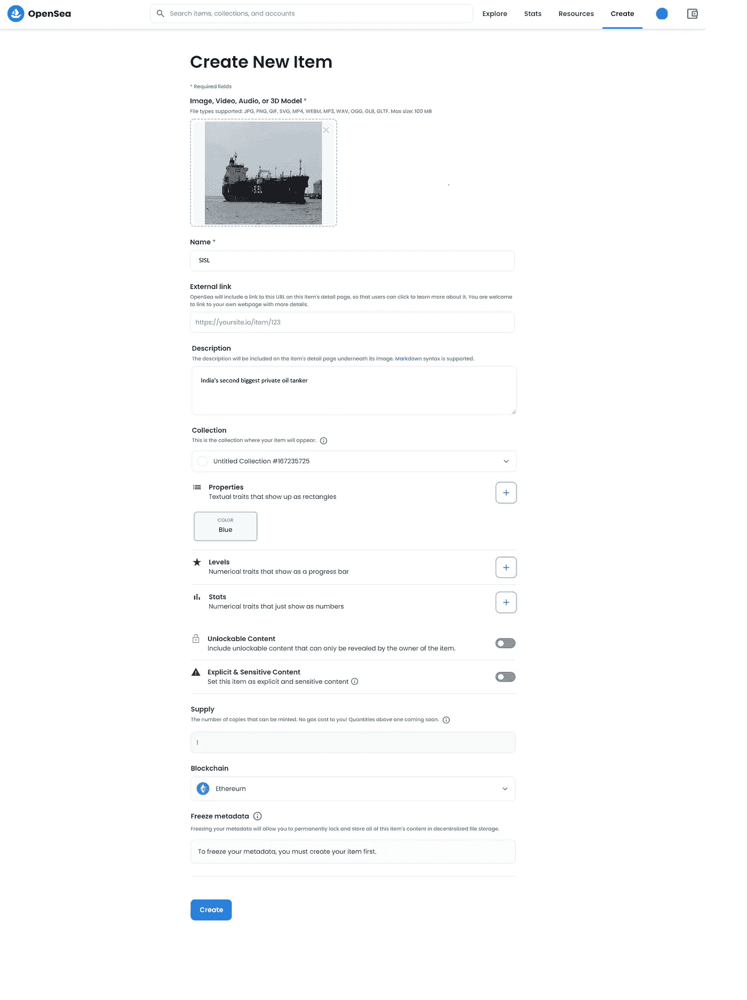
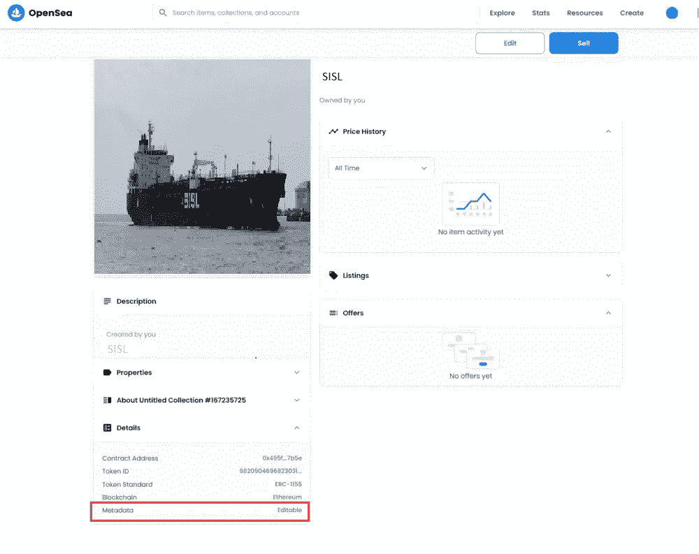
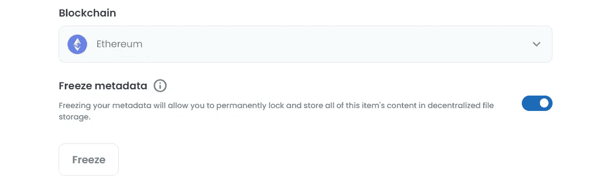
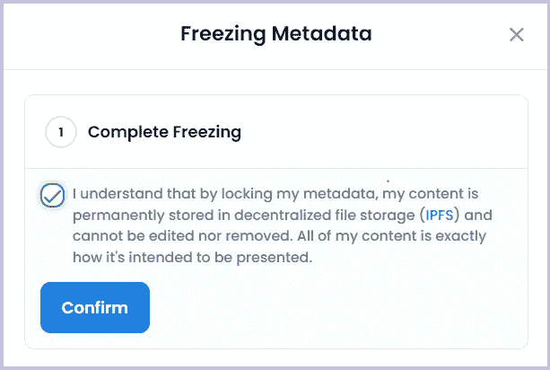
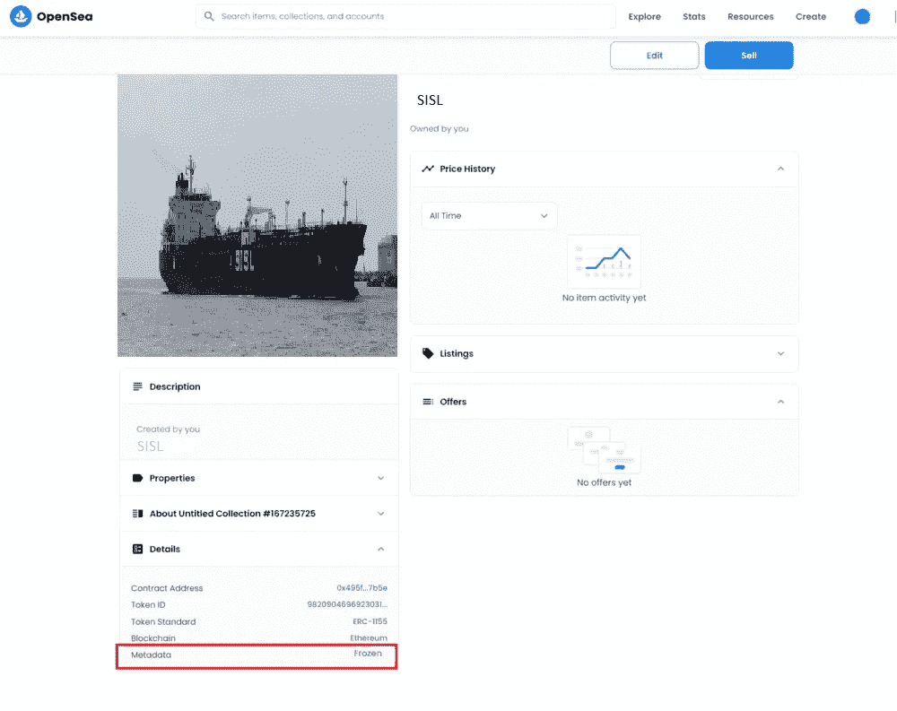
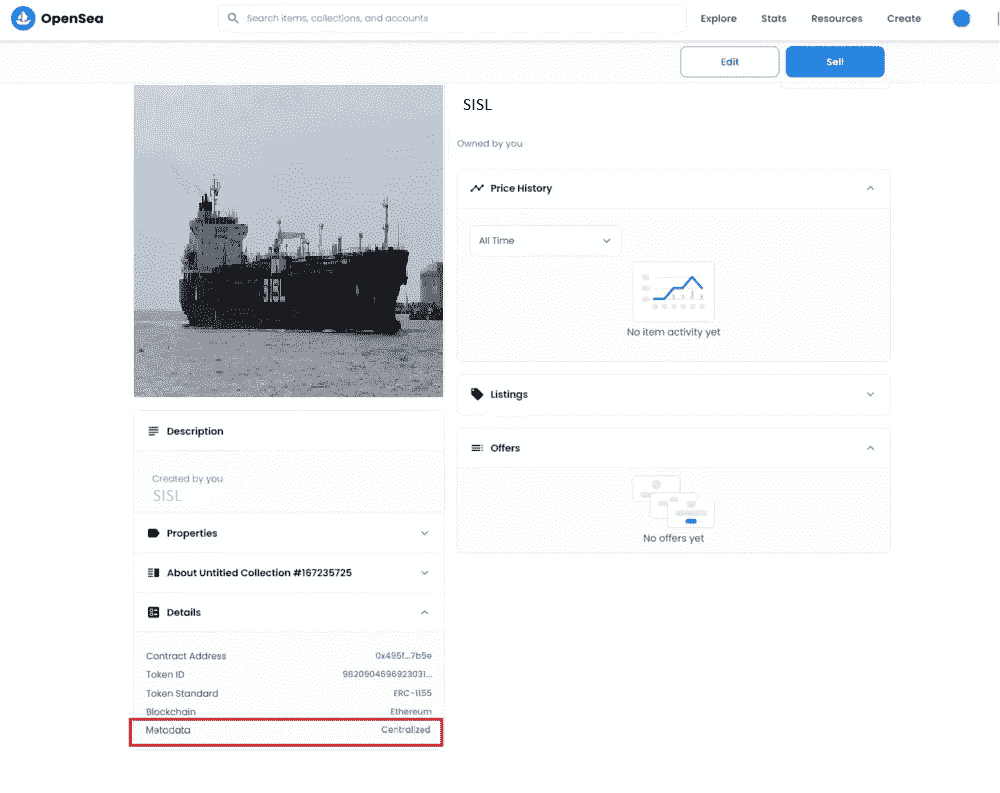

# OpenSea 市场上的 NFT 元数据类型

> 原文：<https://medium.com/coinmonks/nft-metadata-types-on-opensea-marketplace-aaea1ff5987c?source=collection_archive---------3----------------------->

## NFT 系列

## 在 OpenSea 市场上先睹为快不同类型的 NFT 元数据。

本文体现了 NFT 元数据和 OpenSea Marketplace 上不同类型的元数据。

**元数据**本质上是关于数据的信息。NFT 的元数据只是 NFT 的属性，如名称、描述、影像和其他属性。

在我们可以交易 NFT 的 OpenSea Marketplace 中，我们可以找到不同类型的 NFT 元数据，如下所示:

1.  **可编辑**
2.  **冻结**
3.  **集中式**

## 1.可编辑元数据

当我们在 OpenSea 上直接创建我们的 NFT 而没有任何自定义智能合约(通过 lazy minting)时，这样的 NFT 元数据将被视为可编辑的，其创建者可以在以后更新其属性。

直接在 OpenSea 上创建您的 NFT，如下所示:

创建 NFT 后，您可以将元数据类型验证为**可编辑。**

Editable Metadata

## 2.冻结的元数据

冻结元数据是指存储在分散存储平台中的元数据。在 OpenSea 中，当我们冻结我们的元数据时，它被存储在一个分散的文件系统中，其他用户也可以使用它。我们必须支付汽油费来冻结元数据。这种元数据是安全的，因此单个用户无法获取。一旦被冻结，其元数据将无法进一步编辑。

***如何在 OpenSea 上冻结元数据？***

1.  首先，您需要在 OpenSea 上创建您的 NFT。
2.  转到编辑您的 NFT，您可以在其中找到冻结元数据的选项，如下所示:

Freeze Metadata on OpenSea

3.点击冻结后，你会得到一个提示，确认完全冻结如下:

Confirm Freeze on OpenSea

元数据冻结后，可以验证元数据类型为**冻结。**

Frozen Metadata

## 3.集中式元数据

当我们通过 OpenSea UI(通过惰性铸造)创建一个 NFT 时，元数据将首先是可编辑的。随着第一次购买或转让该 NFT，元数据将被托管在 OpenSea 的服务器上，它将变得集中，因此其创建者将无法编辑其属性。

例如，当我们将 NFT 从创建者的钱包转移到其他钱包时，元数据类型变成**集中式**。

Centralized Metadata

image credit: [Design Bundles](https://www.google.com/url?sa=i&url=https%3A%2F%2Fdesignbundles.net%2Fsaydung89%2F920349-wall-art-a-girl-standing-reading-a-book&psig=AOvVaw1tqQplfF2eIwEZoSKGCf0r&ust=1643794154690000&source=images&cd=vfe&ved=0CAkQjhxqFwoTCLCvsceY3vUCFQAAAAAdAAAAABAD)

> 加入 Coinmonks [电报频道](https://t.me/coincodecap)和 [Youtube 频道](https://www.youtube.com/c/coinmonks/videos)了解加密交易和投资

## 另外，阅读

*   [MoonXBT 副本交易](https://coincodecap.com/moonxbt-copy-trading) | [阿联酋的加密钱包](https://coincodecap.com/crypto-wallets-in-uae)
*   [雷米塔诺评论](https://coincodecap.com/remitano-review)|[1 inch 协议指南](https://coincodecap.com/1inch) | [购买 Floki](https://coincodecap.com/buy-floki-inu-token)
*   [MoonXBT vs Bybit vs 币安](https://coincodecap.com/bybit-binance-moonxbt) | [Arbitrum:第二层解决方案](https://coincodecap.com/arbitrum)
*   [买 PancakeSwap(蛋糕)](https://coincodecap.com/buy-pancakeswap)|[matrix export Review](https://coincodecap.com/matrixport-review)
*   [最佳免费加密信号](https://coincodecap.com/free-crypto-signals) | [YoBit 评论](/coinmonks/yobit-review-175464162c62) | [Bitbns 评论](/coinmonks/bitbns-review-38256a07e161)
*   [OKEx 评论](/coinmonks/okex-review-6b369304110f) | [Kucoin 交易机器人](/coinmonks/kucoin-trading-bot-automate-your-trades-8cf0ca2138e0) | [期货交易机器人](/coinmonks/futures-trading-bots-5a282ccee3f5)
*   [AscendEx Staking](https://coincodecap.com/ascendex-staking)|[Bot Ocean Review](https://coincodecap.com/bot-ocean-review)|[最佳比特币钱包](https://coincodecap.com/bitcoin-wallets-india)
*   [霍比审核](https://coincodecap.com/huobi-review) | [OKEx 保证金交易](https://coincodecap.com/okex-margin-trading) | [期货交易](https://coincodecap.com/futures-trading)
*   [比特币基地赌注](https://coincodecap.com/coinbase-staking) | [Hotbit 评论](/coinmonks/hotbit-review-cd5bec41dafb) | [KuCoin 评论](https://coincodecap.com/kucoin-review)
*   购买 Dogecoin 的 7 种最佳方式 | [ZebPay 评论](https://coincodecap.com/zebpay-review)