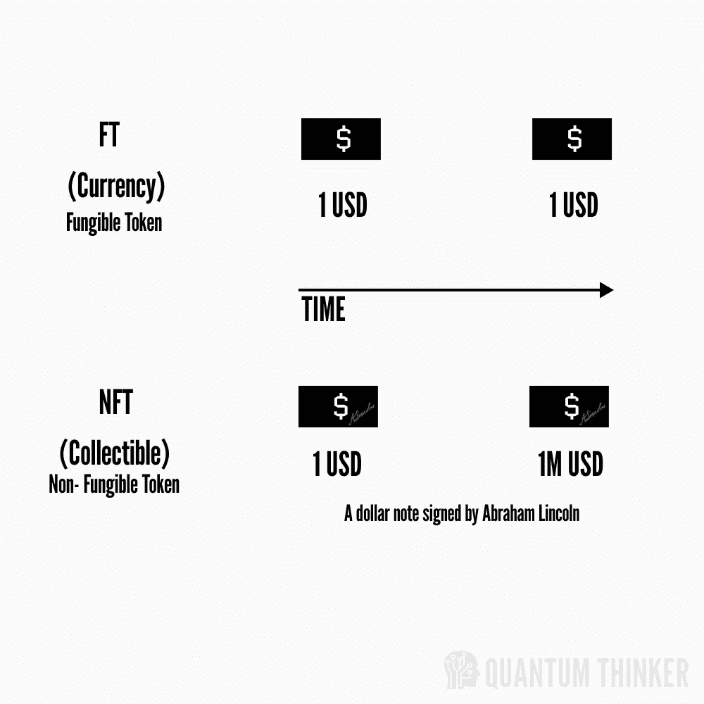
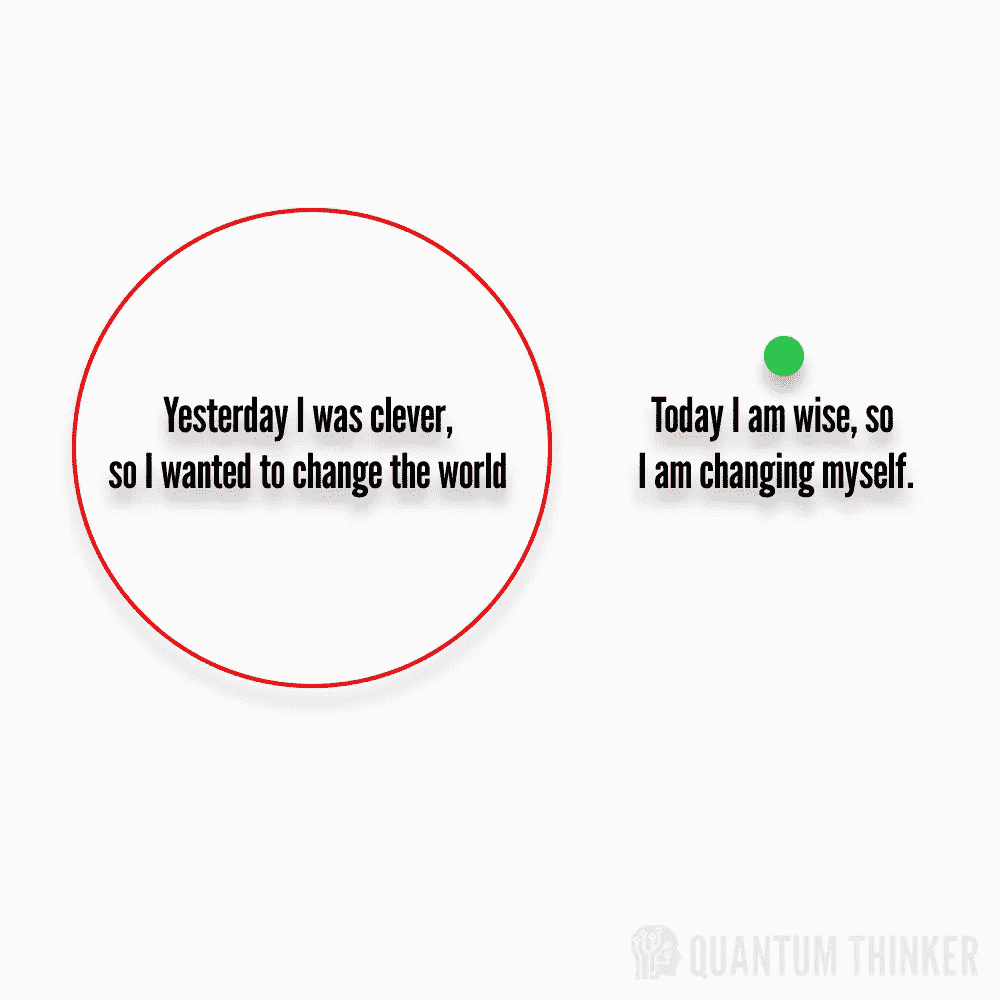

# NFT——NFT 无处不在，你如何通过我的镜头找到它们来改善你的生活？

> 原文：<https://medium.com/coinmonks/nft-most-favourite-term-in-crypto-f15f70d4b2f2?source=collection_archive---------82----------------------->

***“向一家 NFT 投资数百万美元比向一家初创公司投资更容易，这对社会是有害的。”—山姆·奥特曼***

自 2021 年初以来，我们不断受到加密新闻和新成立的术语的轰炸。其中之一是 NFT，每个人都在谈论 NFT。

```
NFT is a Non-Fungible Token – A unique token which cannot be replicated in 
a given [blockchain](/@quantumthinker/ai-and-blockchain-two-key-technologies-of-the-future-706ee33b6c53) network.
```

但是了解 NFT 有什么好处呢？为此，我们需要理解可替换令牌。早在 NFT 在《数字表面》中创造这个术语的几年前，我们就已经知道了。比特币、美元、学位、特质和角色都是可替代的代币。相同的代币，可以换成相同的价值。

还是很迷茫！！！

让我们举这个例子

A 先生的 1 美元等于 B 先生的 1 美元(他们可以交换，因为这是普通商品)

但是，如果美国总统亚伯拉罕·林肯每签署一张 A 先生的 1 美元，它的价值立即从其内在价值增加，它将成为一种稀有商品或可收藏的资产，这就是为什么稀有性在 NFT 起着重要作用。



NFT

因此，我们从中了解到，每一件独特的物品实际上都是 NFT 的。同样，一个非凡的人也是一个 NFT，与那些寻找称号或头衔的人是分开的。

> **“地球上的每个人都是 NFT，他越多样化，就越稀有珍贵。”—个人观点**

在这个世界上，人类 NFT 有许多属性(宗教，种族，国籍，知识，技能，身体等。)以此为基础，他的价值由社会决定。

***“做自己；其他人都已经有人了。”—匿名***

***“昨天我很聪明，所以我想改变世界。今天我是明智的，所以我在改变自己。”—鲁米***



Clever vs Wise

在我看来，我们这个时代最稀有、最昂贵的人类 NFT 是“埃隆·马斯克”。我们都认为他是现在世界上最富有的人。

***“你的报酬与你解决问题的难度成正比”——埃隆·马斯克***

感谢您的阅读，在您离开之前…


> 点击“关注”加入好奇求知者的社区，获取关于金融、健康、哲学、心理学和技术的每周文章。如果您想要电子邮件更新，请单击“信封+”标志。
> 
> 在| [脸书](https://www.facebook.com/thequantumthinker) | [推特](https://twitter.com/QuantumThinker)|[insta gram](https://www.instagram.com/the_quantum_thinker/)|[LinkedIn](https://www.linkedin.com/company/quantumthinker/)|[Pinterest](https://www.pinterest.com/quantum_thinker/)|[Reddit](https://www.reddit.com/r/the_quantum_thinker/)|
> 
> *加入 Coinmonks* [*电报频道*](https://t.me/coincodecap) *和* [*Youtube 频道*](https://www.youtube.com/c/coinmonks/videos) *了解加密交易和投资*

# 另外，阅读

*   [有哪些交易信号？](https://coincodecap.com/trading-signal) | [Bitstamp vs 比特币基地](https://coincodecap.com/bitstamp-coinbase) | [买索拉纳](https://coincodecap.com/buy-solana)
*   [ProfitFarmers 回顾](https://coincodecap.com/profitfarmers-review) | [如何使用 Cornix Trading Bot](https://coincodecap.com/cornix-trading-bot)
*   [十大最佳加密货币博客](https://coincodecap.com/best-cryptocurrency-blogs) | [YouHodler 评论](https://coincodecap.com/youhodler-review)
*   [my constant Review](https://coincodecap.com/myconstant-review)|[8 款最佳摇摆交易机器人](https://coincodecap.com/best-swing-trading-bots)
*   [MXC 交易所评论](/coinmonks/mxc-exchange-review-3af0ec1cba8c) | [Pionex vs 币安](https://coincodecap.com/pionex-vs-binance) | [Pionex 套利机器人](https://coincodecap.com/pionex-arbitrage-bot)