# NFT 网络钓鱼

> 原文：<https://medium.com/coinmonks/nft-phishing-91bd9304e684?source=collection_archive---------13----------------------->

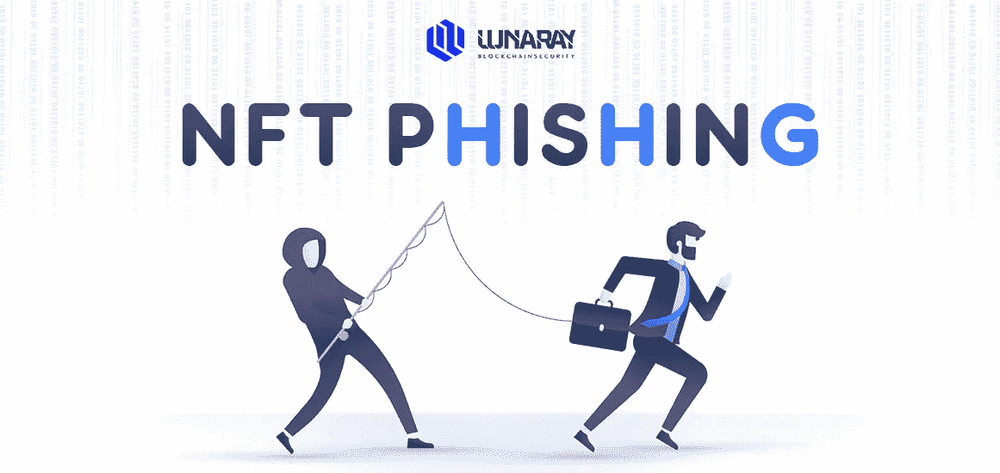

## 部署合同+薄荷 NFT

**0x01 发布平台**

合同发布在**林克比测试网**

**0x02 主合同逻辑**

**合同地址**:0x5e 6893 beead 9718 B1 b 41741065 ba 3c 8848737d

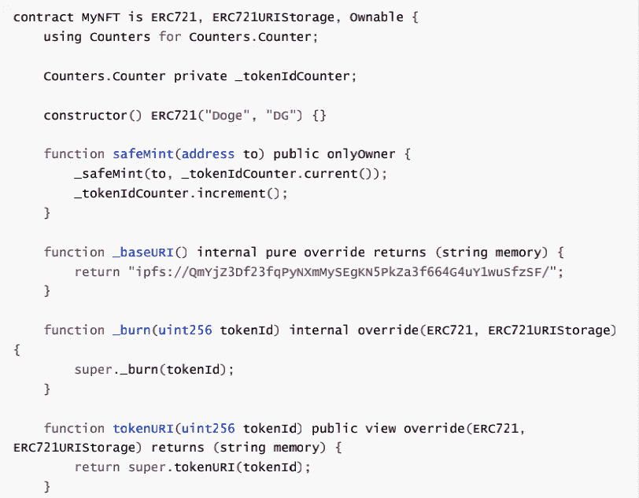

1.  构造函数用于定义 NFT 的名称和标识符；
2.  **safeMint** 将为目标地址造币 1 个 NFT，并自动递增 **tokenId** ，并在下次造币时使用该 ID；
3.  **_baseURI** 是一个固定链接，它是所有**token uri**的前缀；
4.  **tokenURI** 由**_ base uri**+**token id**拼接而成，链接存储**元数据**；
5.  **元数据**存储 NFT 交易网站所需的令牌信息，如:NFT 描述、标签属性、图片地址
    等。

**如上例合同:**

*   主合同名为:MyNFT
*   发行 NFT 命名为 Doge，标识符是 DG
*   _ base uri ipfs://qmyjz 3d f 23 fqpynxmysegkn 5 pkza 3 f 664g 4 uy 1 wusfzsf/
*   tokenURI : _baseURI + tokenID

注意: **OpenSea** 将识别账户中持有的令牌的 URI 的元数据

## 0x03 IPFS 上传映像和令牌 Id 以及元数据关联

使用[https://www . pinata . cloud](https://www.pinata.cloud)，可以免费上传图片到 ipfs 网络。上传完所有图片后，新建一个本地文件夹创建一个索引文件——一个序列号为自然数的纯文本文件，文件内容为**元数据**:

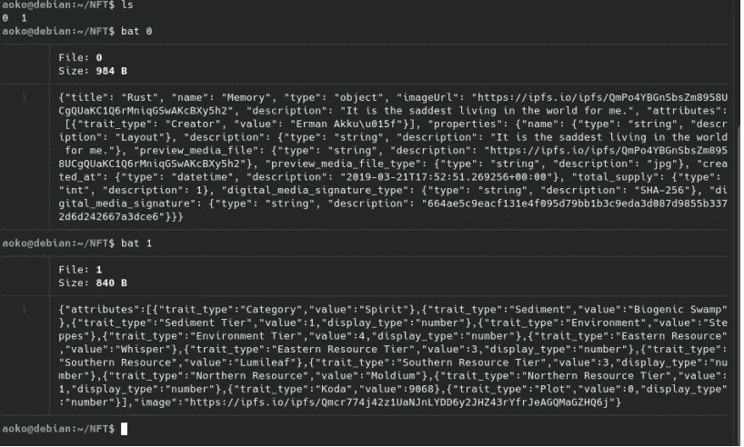

注意:元数据中的图像链接是刚刚上传到 ipfs 网络的图像地址。

## 0x04 铸造

使用部署合同的帐户和事务哈希生成两个 NFT:

*   0 x6c 8 fc 146813 bdac 9 BF 0100 DFB 3c 5105 c 0951d 2048978 b 5d 86376 c 03 acbf 63 a 09
*   0 xea 0 aa 7 BCF 7072 db 62 ee 77 A8 ed 938 db 23 e 47 c 81 af 1a 5842381 C9 D8 a 7005534 CD 7

检查 Opensea

## 0x05 网络钓鱼

**合同:**

*   **站台**:林克比
*   **地址**:0x 8 ADF 4a 5029d 409 ef 9610d 647584 b 411 B2 bea 0916

**原理**

使用 web3 调用智能合约的 **setApprovalForAll** 函数，并在前端页面显示为 Mint 按钮。

## 编码

示例代码选择 **Rust 编程**语言，依托 crates.io 的 web3 库，编译成 **WASM** 并在浏览器中运行。

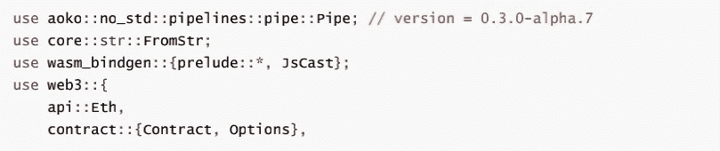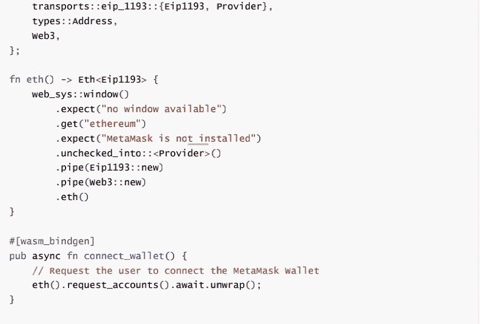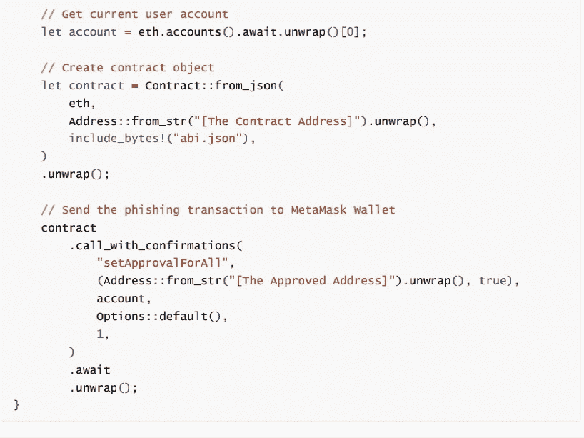

接下来使用 **Yew** 框架，创建页面时连接钱包，将**造币按钮**绑定钓鱼功能。

 [## 构建一个示例应用程序| Yew

### 首先，创建一个新的 cargo 项目。打开新创建的目录。要验证是否设置了生锈环境…

红豆杉](https://yew.rs/zh-CN/docs/getting-started/build-a-sample-app) 

**启动网络钓鱼服务**

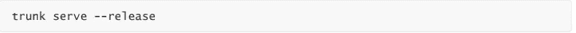

在本地构建项目并提供网页服务。

**贴一个钓鱼链接**

网络钓鱼者在 Telegram groups、Twitter 和其他地方发布网络钓鱼链接，并声称项目方目前可以免费造币。

**受害者访问网站连接钱包**

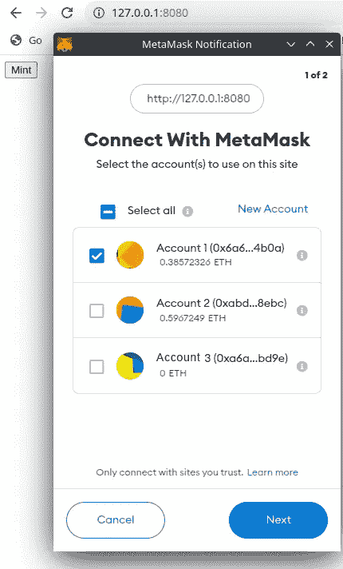

访问本地项目时，会自动弹出连接钱包的通知，供用户选择账户。

**受害者点击造币按钮后采取的行动详情**

如果用户在没有仔细查看交易已经完成的情况下点击确认按钮，授权将被执行:

**查看网络钓鱼者的 token id**

钓鱼者执行授权后，必须能够在合同的交易中看到 **SetApprovalForAll** 字样，在交易明细中看到授权给目标账户的地址。

## 转移受害者的 NFT

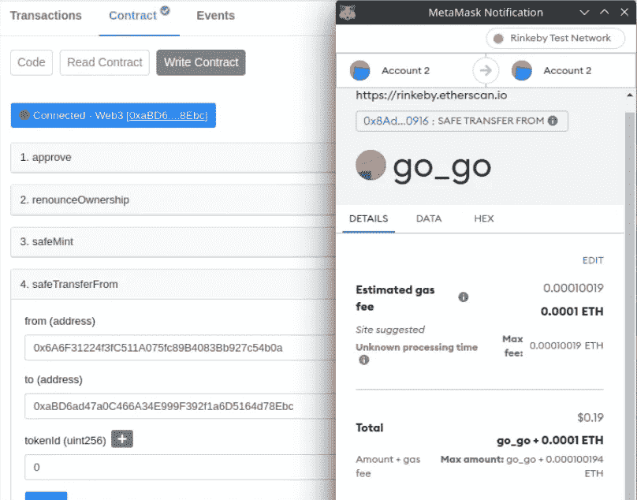

使用合同提供的转移函数转移指定的 NFT。交易链接如下:

[https://rinkeby . ethers can . io/tx/0x 67 C4 FD 9392 e 209 b 5666 ea 6 C2 fa 5901 b 761 f 78 A8 da 1 bccc 3 b 18 FD 5b](https://rinkeby.etherscan.io/tx/0x67c4fd9392e209b5666ea6c2fa5901b761f78a8da1bccc3b18fd5b)755613 D7 e 8

## 销售 NFT

**按下出售按钮**

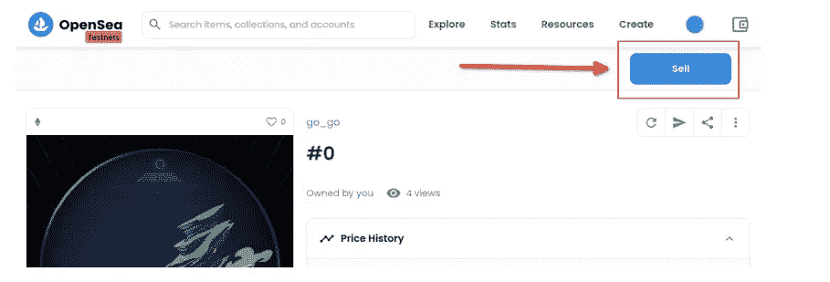

**填写销售额并完成检查表:**

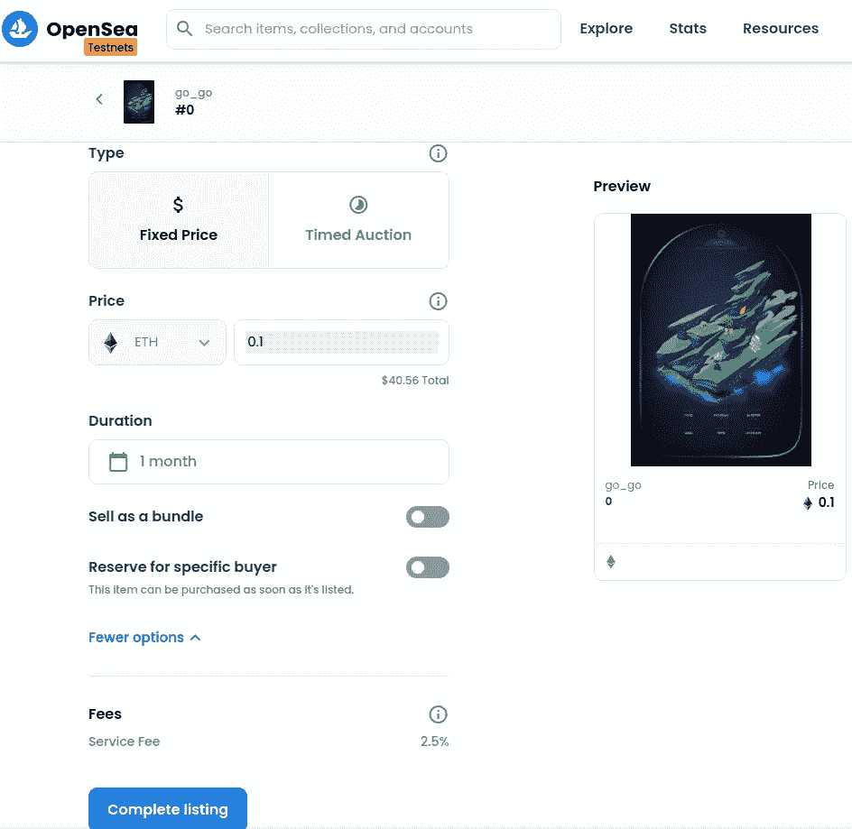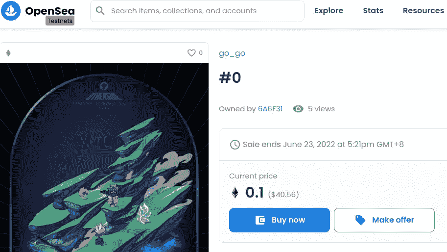

**购买 NFT**

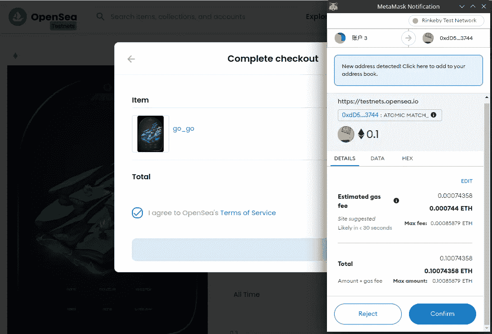

[https://rinke by . ethers can . io/tx/0x e 71 ed 2192 a 0 F3 BFA 64 a 33 D3 f 842 c 6 afef 340d 0261 EEC](https://rinkeby.etherscan.io/tx/0xe71ed2192a0f3bfa64a33dd3f842c6afef340d0261eec)8 fc 8d 0 d6b 829214 AC 72

> 加入 Coinmonks [电报频道](https://t.me/coincodecap)和 [Youtube 频道](https://www.youtube.com/c/coinmonks/videos)了解加密交易和投资

# 另外，阅读

*   [用于 Huobi 的加密交易信号](https://coincodecap.com/huobi-crypto-trading-signals) | [Swapzone 审查](/coinmonks/swapzone-review-crypto-exchange-data-aggregator-e0ad78e55ed7)
*   最佳[密码交易机器人](https://coincodecap.com/best-crypto-trading-bots) | [购买索拉纳](https://coincodecap.com/buy-solana) | [矩阵导出审查](https://coincodecap.com/matrixport-review)
*   [Coldcard 评论](https://coincodecap.com/coldcard-review) | [BOXtradEX 评论](https://coincodecap.com/boxtradex-review)|[uni swap 指南](https://coincodecap.com/uniswap)
*   [比特币基地评论](/coinmonks/coinbase-review-6ef4e0f56064) | [德里比特评论](/coinmonks/deribit-review-options-fees-apis-and-testnet-2ca16c4bbdb2) | [FTX 评论](/coinmonks/ftx-crypto-exchange-review-53664ac1198f)
*   [Coinmetro 评论](https://coincodecap.com/coinmetro-review) | [VirgoCX 评论](https://coincodecap.com/virgocx-review)