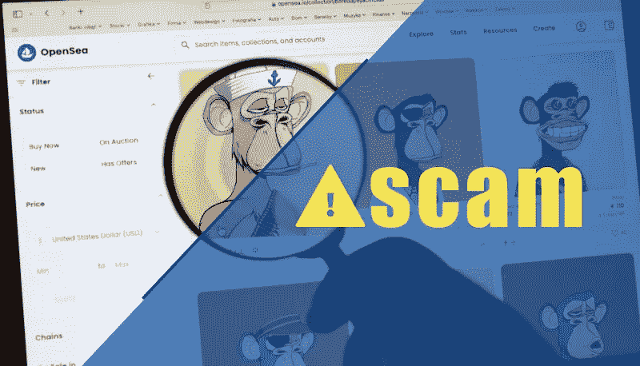

# NFT 网络钓鱼

> 原文：<https://medium.com/coinmonks/nft-phishing-96aa6488ae7e?source=collection_archive---------22----------------------->

## 0x01 电子邮件仿冒

**攻击特征**攻击者利用各种热点(nft 预售、钱包升级、空投索赔、合同升级、项目更换网站、特殊 NFT，)等。，发送含有精心模仿的官网、预售平台、app 下载链接等的钓鱼邮件。

## **例如:OpenSea**

事件描述:根据 OpenSea 官方的回复，这是在 OpenSea 合约升级的时候，黑客发起的。OpenSea 的联合创始人兼首席执行官 Devin Finzer 在推特上说，攻击者偷走了价值 170 万美元的乙醚。

## 攻击方法

攻击者利用官方升级合约时间节点，向所有用户发送合约升级成功邮件。许多用户不确定电子邮件的来源。以控制他们自己的钱包，这反过来导致钱包被盗。

## 0x02 社交媒体相关网络钓鱼

多个 NFT 项目

*   攻击者的钱包地址
*   BAYC
*   涂鸦
*   尼奥基
*   沙曼兹
*   Zooverse
*   可怕的
*   古怪的实验室
*   凯朱金兹
*   Maison 幽灵
*   MekaVerse
*   心脏项目
*   猴子王国
*   不规则碎片形
*   幻影星系
*   无限轴
*   隐体素

## 0x03 攻击方法

1.  攻击者通过社会工作者获得项目成员的不一致账户
2.  攻击者使用项目方的账号在频道上发布了一个新的公告，公告的内容是攻击者创建的一个假官网，并宣布可以独家购买一些东西
3.  受害者访问网站并点击链接，试图购买。授权后，eth 将被转移到攻击者的钱包中。
4.  攻击者用新账号加入 discord 或者冒充受害者的账号，然后说你是骗子，然后把你的 id 提供给服务器。服务器禁止受害者帐户
5.  攻击者要求远程桌面或屏幕共享以示清白，他们会让你 **Ctrl+Shirt+I** 查看控制台，在不和谐控制台会显示认证令牌
6.  一旦获得令牌，攻击者就可以接管帐户。
7.  由于 nft 的特性，一些交易平台如 nft、 **sudoswap** 、 **Nfttrader** 会鼓励用户私下交流。
    彼此 nft。
8.  攻击者会通过模仿交易平台生成订单确认网站。双方确认后，智能合约将自动执行。
9.  在通信过程中，攻击者将与受害者协商以交换那些 NFT。交易发生时，攻击者提出修改数据，然后向受害者发送诈骗链接。
10.  双方确认后，钱包里的 nft 会转到攻击者的钱包里。
11.  攻击者利用 discord 服务器向不同社区的成员批量发送私信或冒充管理员解决问题等理由进行诈骗。
    拿钱包的私钥，或者发一个假的钓鱼网站说可以免费获得 nft。一旦用户授权假冒网站，账户中的 nft 就会被盗。
12.  在一些成熟的 nft 项目中，集合往往会在一段时间后发布，并宣布攻击者会制作一个类似的集合，并使用官网的文字在 discord 社区等网站上发送购买链接，当真正的 nft 不在线时，它会首先搜索名称相似的 NFT，有些攻击者会提前创建几个交易以达到效果。为了节省平台和项目方的佣金，社区成员之间私下交易，此时用户往往忽略了 nft 的真实性。

## 0x04 骗局涉及项目

*   雷亚尔斯瓦克
*   NFTflow
*   雇佣兵
*   块状体
*   糖霜
*   无聊的兔子
*   进化的类人猿
*   图标学
*   班克斯

## 0x05 来自网络钓鱼的建议

1.  切勿点击可疑邮件中的任何链接或附件。如果您收到来自组织的可疑邮件，并怀疑该邮件是否合法，请转到您的 web 浏览器并打开一个新选项卡。然后从您保存的收藏夹或通过网络搜索到该组织的网站。
2.  如果可疑消息看起来来自您认识的人，请通过其他方式(如短信或电话)联系该人进行确认。
3.  不要在公共场所使用电脑登录电子邮件、使用即时通讯软件、网上银行或进行其他涉及敏感信息的活动。在不确定其安全性的前提下，请不要在连接 WiFi 后登录和收发邮件，谨防免费 WiFi。由于管理上的疏忽，别有用心的人利用数据拦截监控手段获取用户信息。
4.  不要向互联网发送敏感信息，用户在互联网上发布的信息和数据可能会被攻击者收集。攻击者可以通过分析这些信息和数据向用户发送有针对性的网络钓鱼电子邮件。
5.  如果电子邮件要求下载附件或安装某些软件，请谨慎判断。
6.  对于通过社交媒体平台索要密码、验证码、2fa 的，仔细识别身份，判断是否为他人伪造，账号是否被盗等。
7.  经常使用的账户密码定期更换，复杂性增强，多步验证等。

> 加入 Coinmonks [电报频道](https://t.me/coincodecap)和 [Youtube 频道](https://www.youtube.com/c/coinmonks/videos)了解加密交易和投资

# 另外，阅读

*   [火币的加密交易信号](https://coincodecap.com/huobi-crypto-trading-signals) | [Swapzone 审查](/coinmonks/swapzone-review-crypto-exchange-data-aggregator-e0ad78e55ed7)
*   最佳[密码交易机器人](https://coincodecap.com/best-crypto-trading-bots) | [购买索拉纳](https://coincodecap.com/buy-solana) | [矩阵导出评论](https://coincodecap.com/matrixport-review)
*   [Coldcard 评论](https://coincodecap.com/coldcard-review) | [BOXtradEX 评论](https://coincodecap.com/boxtradex-review)|[uni swap 指南](https://coincodecap.com/uniswap)
*   [比特币基地评论](/coinmonks/coinbase-review-6ef4e0f56064) | [德里比特评论](/coinmonks/deribit-review-options-fees-apis-and-testnet-2ca16c4bbdb2) | [FTX 评论](/coinmonks/ftx-crypto-exchange-review-53664ac1198f)
*   [联合国硬币评论](https://coincodecap.com/unocoin-review) | [最佳加密赌注硬币](https://coincodecap.com/best-crypto-staking-coins)