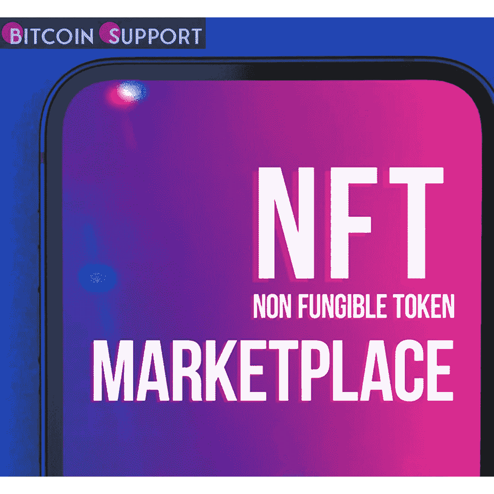
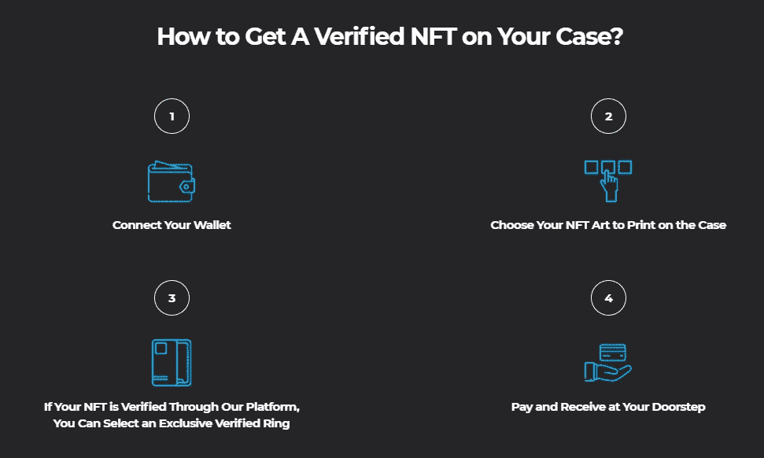

# NFT 手机壳:数字资产灵活性的全球首创

> 原文：<https://medium.com/coinmonks/nft-phone-case-a-world-first-for-digital-asset-flexibility-ca843d9ffddf?source=collection_archive---------81----------------------->

**Visit our website:-** [**https://bitcoinsupports.com/**](https://bitcoinsupports.com/)

NFT 手机壳:第一个经过认证的 NFT 手机壳是由一群艺术和技术爱好者制作的。现在，无论您走到哪里，您都可以自豪地展示您的投资以及您最喜爱的数码艺术品。

CASETiFY 是一家遍布全球的科技配件公司。他们称之为“NFT 你的箱子”是他们发布的新产品。为了设计个性化的手机壳，该平台采用了 NFT 验证技术。根据他们的说法，这一行动“标志着他们对不断增长的‘数字’空间的投资”。https://twitter.com/radiosolace/status/1497146295529926657

BAYC # 3583 最近被 CASETiFY 收购。他们为这项服务支付了 83.4 ETH(约 26 万美元)。通过这次购买，CASETiFY 向世界展示了第一个可验证的 NFT 手机壳。

**认证用 NFT 手机壳**

那么，它是如何工作的呢？为了证明真实性，用户可以使用他们的以太坊钱包来验证 NFTs。然后，可以将 NFT 印刷在手机壳上。为了生产货物并运输到他们的仓库，买方可以用瑞士法郎或美元支付。

**Visit our website:-** [**https://bitcoinsupports.com/**](https://bitcoinsupports.com/)

该公司希望消除对所有权的怀疑，解决数字资产的“截图”冲突。“证明认证对 NFT 的所有者来说是至关重要的，”CASETiFY 的联合创始人 Wes Ng 说。通过分散制造实物的验证过程，我们的平台减轻了这些顾虑。“NFT 你的案例”的出现让社区可以直接将他们的数字艺术作品交到他们手中，同时也为元宇宙打开了无限的创作空间。

[【https://twitter.com/DogeMonkeys/status/1495742133298688000】](https://twitter.com/DogeMonkeys/status/1495742133298688000)

每个手机外壳上都印有独家 NFT 二维码。这确定了 phygital 产品的来源。它还包含关于艺术品、艺术家和列表的元数据。

[https://T8 . com/ThE 90s 韭菜/status/1494675319449845760](https://twitter.com/the90sarchives/status/1494675319449845760)

NFT 手机套有 65%是可回收的，能抵挡 10 英尺的跌落，起价为 45 美元(0.014052 ETH)。NFT 的生活并不便宜。然而，这似乎是令人愉快的。所以。我想这是最近的进展。直到它不再是一个东西。NFT 很有趣。

[https://twitter.com/radiosolace/status/1494912100103524354](https://twitter.com/radiosolace/status/1494912100103524354)

**访问我们的网站:-**[**https://bitcoinsupports.com/**](https://bitcoinsupports.com/)

**免责声明:这些都是作者的意见，不应被视为投资建议。读者应该做自己的研究。**