# 创新 NFT 空间的 NFT 项目

> 原文：<https://medium.com/coinmonks/nft-projects-that-innovated-the-nft-space-fe308ebb35d9?source=collection_archive---------15----------------------->

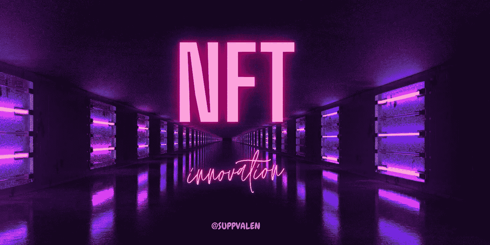

*创新。*

NFT 空间已经成为许多志同道合者的家园，我们每天都能看到新的项目。然而，有一些 NFT 项目因某些实施/战略而脱颖而出，产生了影响。

因此，经过大量的研究和提问，这里有 4 个 NFT 项目(没有特定的顺序)革新了这个领域:

1.  [核书呆子](https://www.nuclearnerds.io/)

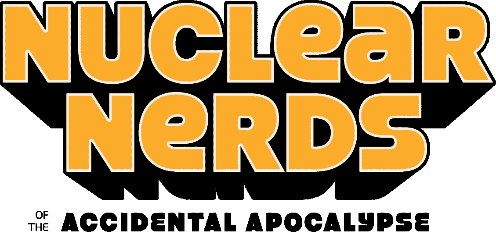

核书呆子是 2021 年 12 月 15 日推出的 8.999 NFT 系列。他们实施了:

*   **一份节能合同**
*   **取消操作系统上市费**
*   **还有最近的；一个又酷又安全的验证系统。**

让我们深入了解其中的每一项。

# **合同**

众所周知，没有人喜欢疯狂的高额油费。当他们只是想铸造一个 NFT 时，他们可能会非常讨厌持有人，而核呆子的团队希望尽可能地节省他们的持有人的费用。

而且……*成功了。*

他们的造币厂没有天然气战争，核能爱好者为他们的社区节省了 180 万美元的天然气费用。 [@nftchance](https://twitter.com/nftchance) (NN 的开发者)在这里解释了这一点:

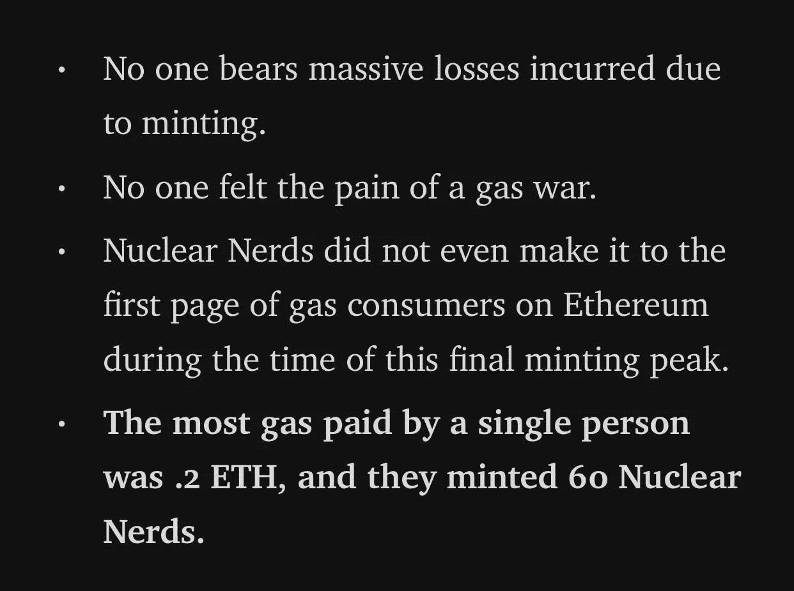

如果我们检查[统计数据](https://dune.xyz/queries/404333/772449)，我们会看到*整个*收集的失败事务的最大开销只有. 620 eth。(撰写本报告时为 2021.11 美元)

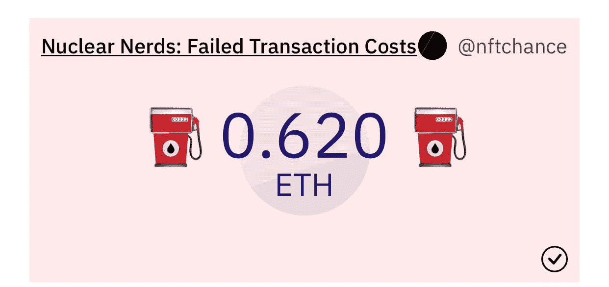

Stats of failed transaction costs

令人印象深刻，因为整个系列在不到一个小时内就销售一空，在以下情况下很难避免煤气大战:

*1)收藏量大(8.9k，差不多 10k NFTs)和*

这是一种被寄予厚望的薄荷。

**取消 OpenSea 的上市费:**

核呆子的[合同](https://etherscan.io/address/0x0f78c6eee3c89ff37fd9ef96bd685830993636f2)实现了多种功能，为持有者节省了数千美元；包括确保为他们将使用的网络添加 OpenSea 代理注册地址，在将它部署到 testnet 之前，在本地优化和测试一切。

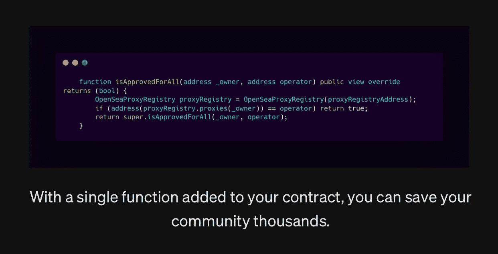

[Chance](https://medium.com/u/f72d8c5c9c23?source=post_page-----fe308ebb35d9--------------------------------)’s picture from his Medium article

Chance 在他的文章中做了更多解释，你可以在他的个人资料中找到:

 [## 机会-媒介

### 阅读媒体上偶然出现的文章。你会记得🤌.的区块链开发商每天，机会和成千上万的…

nftchance.medium.com](https://nftchance.medium.com/) 

**验证系统:**

我想我们都已经意识到骗子会让人们冒充团队成员。嗯……他们实施了一个天才的想法来保证社区的安全。

每个团队成员都有一个*一次性*验证码，用来证明是不是他们，应该是这样的:

被 DMed 的人必须向团队成员询问他们的“验证码”，以确定是他们，现在团队成员开始给出验证码。然后，这个人去:[https://www.nuclearnerds.io/verify/](https://www.nuclearnerds.io/verify/)，输入密码，检查是否真的是他们。

如果是的话，这个信息会弹出来，然后…你就安全了。

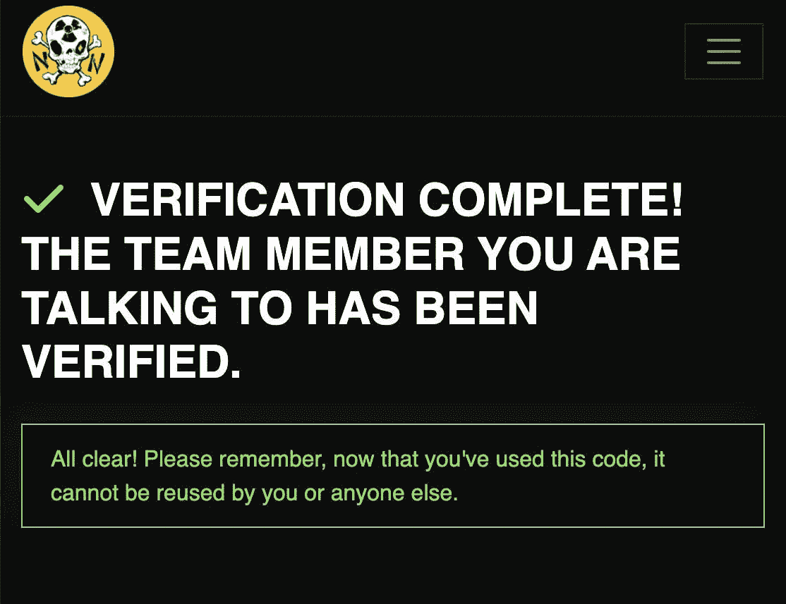

如果不是，页面会告诉你这不是一个经过验证的团队成员，你应该停止。

机会的线索:

2.[志那都红豆 ](https://www.azuki.com/)

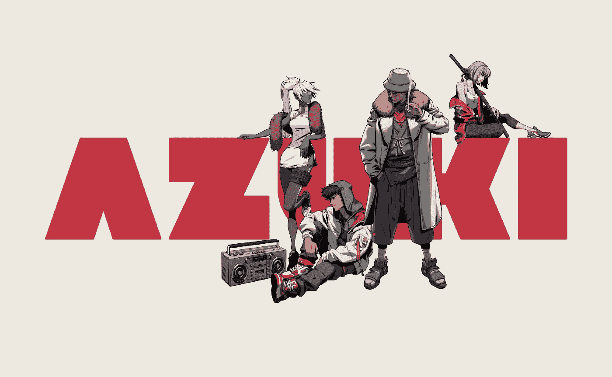

志那都红豆是 2022 年 1 月 12 日推出的 10k NFT 系列。他们发布了 IERC721 的开源实现，为他们的合同命名为 *ERC721A* 。

*   它允许铸造多个 NFT，成本与铸造一个 NFT 基本相同。

*(他们的品牌也很棒，但我会把这个留给另一篇文章)。*

志那都红豆在此比较了 OpenZeppelin 的 ERC721Enumerable 与 ERC721A 的天然气成本，假设 300 gwei 和 3500 美元/ETH(当时)。

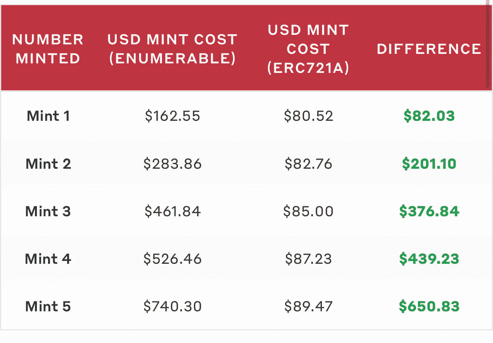

如你所见，差别是巨大的。

志那都红豆在这里深入解释了他们的优化:

 [## 志那都红豆

### 更新:我们已经公开了 ERC721A。你可以在这里找到最新版本。ERC721A 是 IERC721 的一种实现，具有…

www.azuki.com](https://www.azuki.com/erc721a) 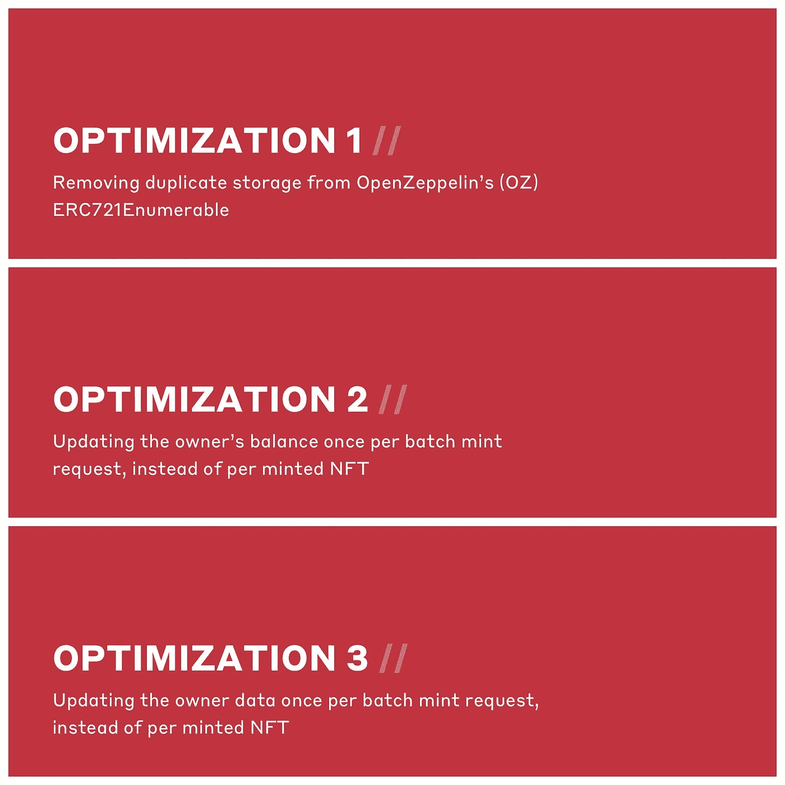

ERC721A contract optimizations

看到志那都红豆成功的节气造币厂后，很多项目开始使用 ERC721A。

下一个:[卑鄙的吸血鬼集团](https://svs.gg/) (SVS)

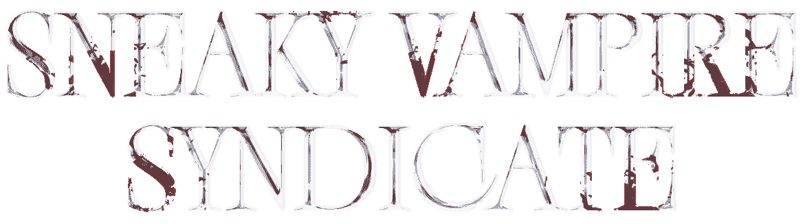

**偷偷摸摸的吸血鬼辛迪加**是由 Bored Ape 游艇俱乐部艺术家制作的 8.888 NFT 系列，于 2021 年 9 月推出。SVS 是首批实现以下功能的系列之一:

*   节约汽油的合同
*   24 小时白名单窗口，避免气体战争(意思；他们给预售人 24 小时来造币)
*   用于打桩 vamp(NFTs)的多边形桥
*   反机器人预防(见下文)

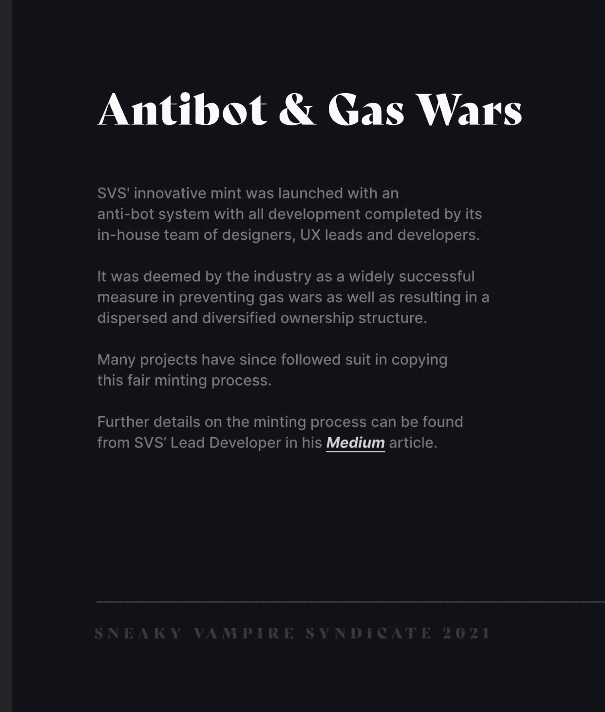

[SVS pitch deck,](https://drive.google.com/file/d/10d2ktllcIBiLezRFKRuALmOGidttOZnu/view?usp=sharing) and [Medium article](/@svswoof/mitigating-gas-wars-bots-and-network-congestion-for-ethereum-nft-projects-6cdba15b91a4)

用户被提示回答简单的问题，以便能够造币。

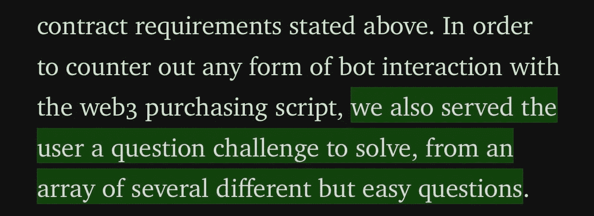

Dev’s Medium article linked above

**为什么是多边形桥？**

SVS 赌注代币持有者抱怨说，自从他们被下注后，他们无法在他们的 OpenSea 帐户中查看他们的吸血鬼/蝙蝠，因为赌注代币被发送到赌注地址，这意味着它们不再在原来的钱包中。

那么，SVS 团队做了什么呢？

开发者通过一个多边形合同把每个人的 SVS 的幽灵副本空投到他们的钱包里。现在，持有者可以在他们的操作系统配置文件上查看他们的 NFT，一旦他们退出区块链联邦理工学院，他们的 NFT 多边形版本就会被发送到烧录地址。

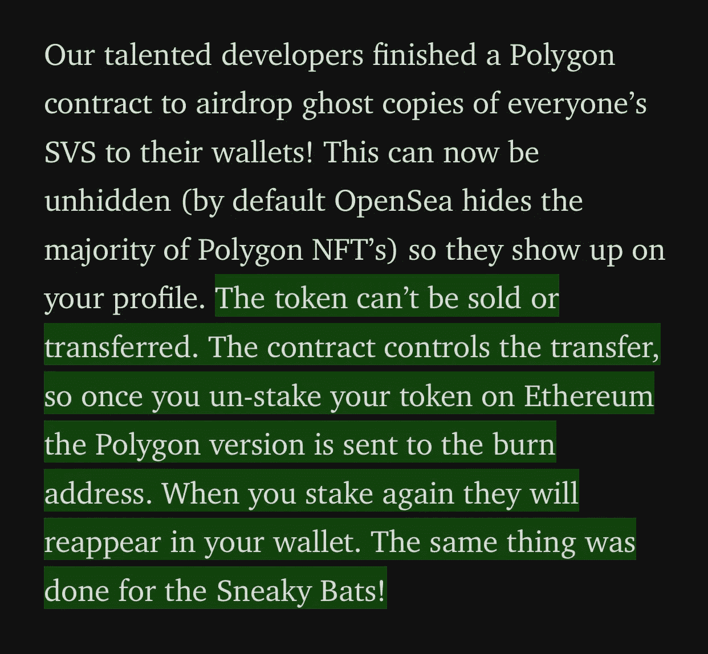

[SVS Medium article](https://svsnft.medium.com/sneaky-vampire-syndicate-exploring-cross-chain-functionality-7ba5e9ae39da)

团队**还**通过让持有者将他们的代币$BLOOD(多边形链上的血)转移来节省他们的汽油费，一旦在 PBlood 上，所有的 tx 费用都由团队处理。

接下来: [**纳米棒**](https://twitter.com/nanoverseHQ)

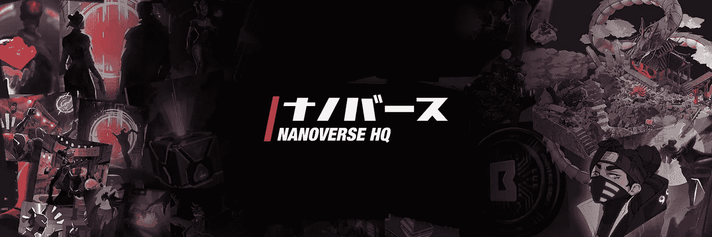

**NANOPASS** 是 2021 年推出的 5k 虚拟土地 NFT 系列。他们实施了:

*   **黑盒**

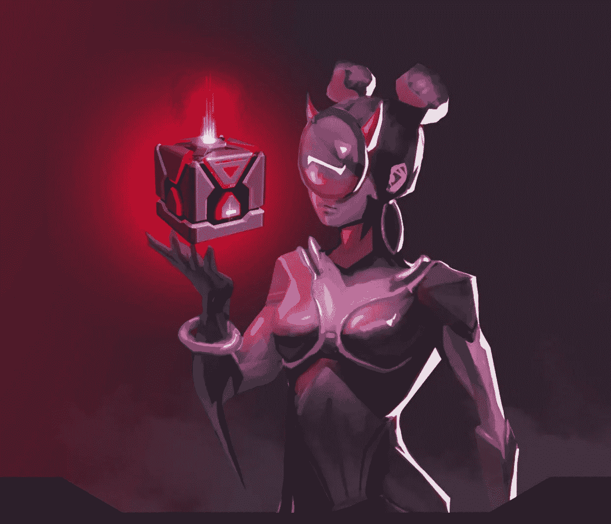

黑盒是战利品盒，由二级市场上赚取的总版税的 75%资助。它们可能包含白名单、高价 NFT 或用于慈善事业的资金、数据片段等。这都是由持有者决定的。

它们是如何工作的？

每周给社区一个黑匣子，持有者投票决定那一周应该分发什么奖品。这对他们的社区来说是很好的回报。拥有者不必支付汽油费来收集黑匣子，因为拥有者门户*(拥有者门户是每周网络被攻破时你可以认领[黑匣子]的地方，购买和查看库存项目，向伙伴代理发送片段，以及管理你的账户。)*是外链，不需要收费。需要链上空投的任何奖品的汽油费将从黑匣子的社区金库中支付。

1 个纳米通道= 1 个黑盒，以此类推。

> 铸币后，多种功能将协同创造一个正反馈循环，这有助于保持持有人的投资，并维持对纳米通行证的高水平需求。[黑盒]是循环的核心，它们将充当价值不断产生和复合的地方。
> 
> [— NANOPASS 团队](https://www.nanopass.io/blackbox/#howdoesitwork)

看起来他们是对的。

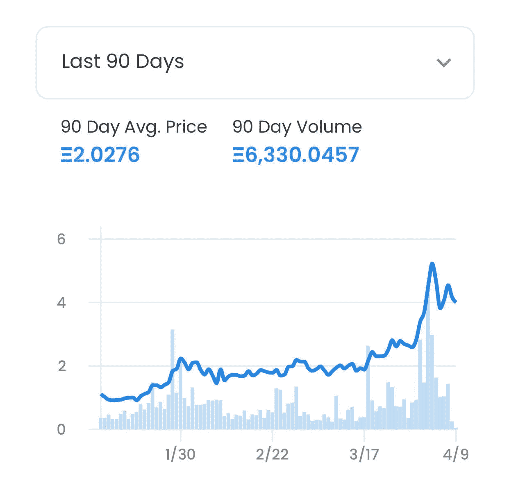

NANOPASS OpenSea’s chart (at the time of writing)

**结论**

NFT 空间是非常新的，我知道我们将会看到一个令人敬畏的未来，创新的个人和项目将他们最酷的想法付诸行动。这是*只是*的开始。

向所有这些项目的了不起的社区大声喊出来，他们友好地回答了我的问题。(特别是 SVS 和 NN)

我知道 NFT 社区还有许多其他创新者，所以随着我们的前进，我会继续撰写文章，重点介绍该领域的有效战略/团队。如果你觉得其他的 NFT 项目也应该被提及，请在下面评论或者在我的推特上告诉我。谢谢你。

通过以下方式与我联系:

https://twitter.com/suppvalen

别忘了在我的 Twitter 帖子上表示一些支持！(:

> 加入 Coinmonks [电报频道](https://t.me/coincodecap)和 [Youtube 频道](https://www.youtube.com/c/coinmonks/videos)了解加密交易和投资

# 另外，阅读

*   [如何在 FTX 交易所交易期货](https://coincodecap.com/ftx-futures-trading) | [OKEx vs 币安](https://coincodecap.com/okex-vs-binance)
*   [CoinLoan 评论](https://coincodecap.com/coinloan-review) | [YouHodler 评论](/coinmonks/youhodler-4-easy-ways-to-make-money-98969b9689f2) | [BlockFi 评论](https://coincodecap.com/blockfi-review)
*   [XT.COM 评论](https://coincodecap.com/profittradingapp-for-binance)币安评论 |
*   [SmithBot 评论](https://coincodecap.com/smithbot-review) | [4 款最佳免费开源交易机器人](https://coincodecap.com/free-open-source-trading-bots)
*   [比特币基地僵尸程序](/coinmonks/coinbase-bots-ac6359e897f3) | [AscendEX 审查](/coinmonks/ascendex-review-53e829cf75fa) | [OKEx 交易僵尸程序](/coinmonks/okex-trading-bots-234920f61e60)