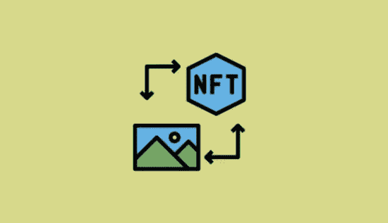

# NFT 采购 101

> 原文：<https://medium.com/coinmonks/nft-purchasing-101-7ac1dd91a6c2?source=collection_archive---------54----------------------->

我们给你带来了新人！

1.  什么是 NFT？ NFT 代表不可替代令牌。NFT 是存储在区块链上的数字资产，展示所有权的证明。NFT 可以在 OpenSea、Rarible 等平台上买卖。为了在这样的交易所购买 NFT，你需要有一个钱包。
2.  **什么是钱包？**加密货币钱包是一种数字钱包，允许用户管理、使用和交易他们的加密货币，同时也是您的 NFTs 的存储和管理工具。最受欢迎和最容易设置的钱包是 MetaMask。MetaMask 也是 NFT 项目和交易所最兼容的钱包之一。
3.  【https://metamask.io/download.html】设置你的元掩码钱包在你的浏览器上安装元掩码扩展[1。安装后会打开一个新窗口，您必须按照说明“创建新钱包”2。您的“秘密恢复短语”将被生成。这是非常重要的，你把它带到某个地方，用你的生命保护它。这是所有帐户和目的，你的钱包的主密码 3。完成后，您的钱包就设置好了，您可以通过浏览器中的元蒙版图标来访问它](https://metamask.io/download.html)
4.  **为您的元掩码钱包提供资金**有两种主要的方法为您的元掩码钱包提供资金，这两种方法将在此分享
5.  **在 MetaMask 购买加密货币** 1。单击浏览器中的扩展图标打开 meta mask wallet 2。点击“购买”，您将看到两个选项，其中两个涉及在 MetaMask 中购买加密货币:用 Wyre 购买 ETH-这允许您使用借记卡完成用 Transak 购买 ETH-这允许您使用借记卡或银行转账完成 ETH 3 的购买。完成后，检查您的交易历史以获得购买凭证，如果成功，ETH 将很快出现在您的钱包中 4。由于这些是第三方工具，MetaMask 通过上述两个选项购买 ETH 会收取额外费用。还有第三种更具成本效益的选择，如下所示:
6.  **从交易所向您的钱包发送加密货币** 1。通过在比特币基地或币安等交易所购买加密货币，您可以将受支持的货币发送到您的 MetaMask wallet 2。在您的加密货币交易所的界面上，将有一个选项供您“发送”加密货币 3。点击“发送”，选择您希望转移的加密货币，并在“收件人”字段 4 中输入您的元掩码地址。您可以通过点击按钮 5 从元掩码扩展中复制并粘贴您的地址。当向您的 MetaMask 钱包发送加密货币时，用户需要支付一定的汽油费，这相当于交易费/运费的 IRL
7.  **获得 NFT** 这分为两部分，铸造和在交易所购买
8.  **铸造你的 NFT** 1。当项目启动时，团队将宣布有关如何铸造 NFT 2 的信息。请确保您只遵循团队给出的关于如何、何时、何地铸造您的 NFT 3 的说明。在启动日，前往项目网站，在那里你将被要求遵循某些指示 4。将您的钱包连接到网站，并检查您的造币资格。如果您符合条件，请输入您想要的薄荷金额(项目通常会为每个钱包分配 1-10 枚薄荷),然后单击“薄荷”。您的浏览器扩展中将出现一个元掩码弹出窗口，告诉您:1。ETH 需要铸造你想要数量的 NFTs 2。“建议的燃气费”支付 3。铸造您的 NFTs 所需的 ETH 最大总量单击“拒绝”停止交易，或单击“确认”继续铸造。单击“确认”后，交易已发送至区块链进行确认，如果成功，您的 NFT 将很快出现在您的钱包中。
9.  **在交易所购买 NFTs】最受欢迎的交易平台是 OpenSea 1。转到 Opensea.io，单击右上角的 Opensea 个人资料图标 2。单击“Profile ”,元掩码扩展将提示您完成几个步骤 3。到达最后一个提示时，点击“签名”,您的帐户就创建好了！4.在搜索栏中，查找您希望购买其 NFT 的项目，然后进入项目页面。此时，您必须选择官方的 OpenSea 项目页面。建议您仅关注项目 Twitter 或 Discord channels 5 的官方链接。找到您想要购买的 NFT 后，点击图片/视频 6。如果可以购买，请单击“立即购买”；这将触发一个弹出窗口，要求您在单击“check out”7 之前同意 T & Cs。MetaMask 扩展中将出现一个弹出窗口，显示购买 NFT 需要支付的 ETH 以及燃气费 8 的报价。如果您有足够的加密货币，点击“确认”，您的交易将被处理 9。如果成功，你的 NFT 将出现在你的钱包和你的 OpenSea 个人资料有用资源完整 OpenSea 初学者指南(23 分钟)——【https://www.youtube.com/watch?v=eRYDefnf7jQ】T2 在 OpenSea 上购买 NFT——【https://www.youtube.com/watch?v=dS_k8gItMvU】T4 加密货币/ NFT 行话**
10.  **Gas** 是指成功完成一笔交易所需的费用，包括铸造或交易 NFT。天然气费用取决于网络计算能力的供需**天然气战争**指的是天然气价格的飙升，这是由于对计算能力的需求大大超过了供应。由大量希望在短时间内得到确认的交易引起。支付的气价越高，待确认交易的优先级越高。**铸造**数字艺术品成为区块链的一部分的过程，这是一种防篡改的公共账本。然后，艺术品就变成了 NFT，它显示了所有权的证明，可以很容易地在市场上购买和交易
11.  **白名单/预售**对 NFT 销售的修改，以便只有特定的个人/钱包地址可以创建项目的非转售/预售。这阻止了公众的参与，同时也阻止了一场天然气战争
12.  **效用**指持有 NFT 的“有用性”。一些项目具有给予特定 NFT 收藏品持有者独特额外津贴的效用，例如衍生项目、空投或独家商品

不要挣扎，如果你有任何问题，请在我们的推特@nakedheadz 上联系我们

> 加入 Coinmonks [电报频道](https://t.me/coincodecap)和 [Youtube 频道](https://www.youtube.com/c/coinmonks/videos)了解加密交易和投资

# 另外，阅读

*   [Bitsgap 审核](/coinmonks/bitsgap-review-a-crypto-trading-bot-that-makes-easy-money-a5d88a336df2) | [Quadency 审核](/coinmonks/quadency-review-a-crypto-trading-automation-platform-3068eaa374e1) | [Bitbns 审核](/coinmonks/bitbns-review-38256a07e161)
*   [加密复制交易平台](/coinmonks/top-10-crypto-copy-trading-platforms-for-beginners-d0c37c7d698c) | [Coinmama 审核](/coinmonks/coinmama-review-ace5641bde6e)
*   [印度的加密交易所](/coinmonks/bitcoin-exchange-in-india-7f1fe79715c9) | [比特币储蓄账户](/coinmonks/bitcoin-savings-account-e65b13f92451)
*   [OKEx vs KuCoin](https://coincodecap.com/okex-kucoin) | [摄氏替代品](https://coincodecap.com/celsius-alternatives) | [如何购买 VeChain](https://coincodecap.com/buy-vechain)
*   [币安期货交易](https://coincodecap.com/binance-futures-trading)|[3 commas vs Mudrex vs eToro](https://coincodecap.com/mudrex-3commas-etoro)