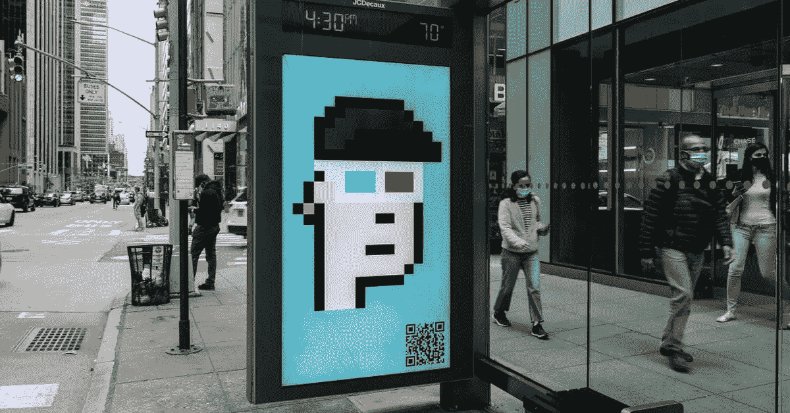

# NFT 骗局:如何避免

> 原文：<https://medium.com/coinmonks/nft-scams-how-to-avoid-them-f52fc7152242?source=collection_archive---------7----------------------->

Scams are a major issue in this industry because they erode the confidence of newcomers and ultimately destroy the ecology.

在不到一年的时间里，大多数人都不知道非功能性甲状腺炎。如今，从朋友和家人到内容制作人和媒体，每个人都在谈论这个话题，它有了全新的含义。

随着 NFT 诈骗案的增多，我们也将在本文中对此进行讨论。

由于该市场 2020 年的销售额不到 7000 万美元，第三季度增长到 107 亿美元，所以人们开始注意到这一点也不奇怪。

越来越多的人正在寻找新的收入来源；这包括艺术家和创意人员以及艺术收藏家和投资者。

骗局是这个行业的一个主要问题，因为它们侵蚀新人的信心，并最终破坏生态。

> 此外，请参见:[2022 年购买 5 家市值低于 10 亿美元的 Cryptos】](https://www.sammaiyaki.com/5-cryptos-under-1-billion-market-cap-to-buy-in-2022-b0fe530cee73?source=user_profile---------2-------------------------------)

# NFT 骗子如此狡猾的目的是什么？

大多数人都想尽可能地从中榨取利润。重申一下，购买 NFT 不同于在网上购买其他任何东西。

这一过程涉及许多阶段，使得 NFT 欺诈的时机成熟，我们必须学会识别和防范。

在网上购物时，安全的支付处理器和值得信赖的在线零售商是标准。

为了更好地保护我们的交易，一些支付处理器从企业获取信息。

可逆是指如果我们不喜欢商品，可以把它退回给零售商，从而得到退款。

如果我们无法从商家那里获得我们需要的信息，我们可以选择联系信用卡公司或我们的银行。

因为 NFT 事务是最终的，所以没有办法撤销它，没有支持，等等。

在很大程度上，我们只能靠自己，唯一的办法就是公开记录发生了什么。

换句话说，不可替代的代币骗局不仅仅是利用了人们的实验欲望。

因为他们也试图利用这个系统，所以你应该非常小心，随时了解最新的发展。

> 另外，请看:[2022 年你应该知道的关于税收和你的网上生意的事情](https://www.sammaiyaki.com/what-you-should-know-about-taxes-and-your-online-business-in-2022-24fab14303a5?source=user_profile---------4-------------------------------)

# 防止 NFT 欺诈你需要知道什么

避免成为 NFT 骗局受害者的最好方法是在进行任何投资之前精通该领域。

尽可能多地了解 NFT、支持 NFT 的技术以及它们的安全性，这对它们的成功至关重要。

## 1.控制您的收件箱

为了不让垃圾邮件进入我们的收件箱，我们必须确保只发送最重要的邮件。

事实证明，清除垃圾邮件是一个简单的过程，它将使我们处于一种更加积极、怀疑和理性的心态，使我们不太可能落入电子邮件陷阱。

> 又见: [NFT 意为](https://www.sammaiyaki.com/nft-meaning-fb598dbce4f1?source=user_profile---------0-------------------------------)

## 2.曝光...受到限制

如果我们有更多的暴露，我们将更容易受到欺诈。当我们加入来自不同 NFT 项目的不同不和谐团体时，这是常见的事情。

许多欺诈始于不和谐，因此如果我们不积极，我们应该避免加入不和谐和电报的团体。

我们应该预料到许多已经被编程的机器人会发出一连串关于即将到来的发布的信息。

一个我们希望保持活跃的不和谐社区是我们唯一的选择。

为了消除来自机器人的垃圾邮件，禁用允许用户向我们发送直接消息的隐私选项至关重要。

## 3.检查项目元素

从公司网站到社交媒体档案，创始人的个人账户和他们在互联网上的存在都可能被访问。

如果我们通过邮件、电子邮件或电报进行交流，我们将永远不必点击链接！

作为一种替代方案，我们将在谷歌上搜索，以了解该团队的社交媒体账户上是否有任何针对该项目的特别促销、首次亮相或折扣。

## 4.确定并核实区块链的地址

在付款之前，我们必须核实资金将被送往的区块链地址。

新项目的付款必须发送到智能合同的地址。一名区块链探险家可以帮助我们确认地址。

> 另请参见:[加密货币如何合法？](https://www.sammaiyaki.com/how-is-cryptocurrency-legal-782f2593e0f2?source=user_profile---------1-------------------------------)

# 作为总结

区块链探险者到底是什么？它是一种软件，从区块链中获取数据，对其进行组织，然后以某种方式输出。

NFT 本质上是链接在一起的代码块。

使用这个工具可以找到某个项目的所有信息。

> 加入 Coinmonks [电报频道](https://t.me/coincodecap)和 [Youtube 频道](https://www.youtube.com/c/coinmonks/videos)了解加密交易和投资

## 也阅读

 [## 杠杆代币[多头代币]终极指南

### 杠杆化令牌是具有杠杆化风险敞口的 ERC20 令牌，不考虑保证金、要求、管理…

medium.com](/coinmonks/leveraged-token-3f5257808b22)  [## 最佳加密交易所| 2021 年十大加密货币交易所

### 编辑描述

blog.coincodecap.com](https://blog.coincodecap.com/crypto-exchange)  [## 2021 年最佳加密交换平台| CoinCodeCap

### 如果我们看看今天的场景，许多加密货币交换平台提供了广泛的功能和深度…

blog.coincodecap.com](https://blog.coincodecap.com/best-swap-platforms)  [## 10 大最佳网上赌场[2021] |赢取免费 BTC | CoinCodeCap

### 编辑描述

blog.coincodecap.com](https://blog.coincodecap.com/best-online-casinos)  [## 2021 年最佳加密借贷平台| 6 大比特币借贷平台

### 获得比特币和其他加密货币的最佳贷款利率

medium.com](/coinmonks/top-5-crypto-lending-platforms-in-2020-that-you-need-to-know-a1b675cec3fa)  [## 2021 年 6 大最佳硬件钱包|顶级加密硬件钱包[更新]

### 最好的加密货币硬件钱包是绝对必要的。我们将在 NGRAVE、Ledger Nano X 和…

medium.com](/coinmonks/the-best-cryptocurrency-hardware-wallets-of-2020-e28b1c124069)  [## 2021 年最佳免费加密交易机器人

### 2021 年币安、比特币基地、库币和其他密码交易所的最佳密码交易机器人。四进制，位间隙…

medium.com](/coinmonks/crypto-trading-bot-c2ffce8acb2a)  [## 最佳 4 个加密交易信号电报通道

### 这是乏味的找到正确的加密交易信号提供商。因此，在本文中，我们将讨论最好的…

medium.com](/coinmonks/best-crypto-signals-telegram-5785cdbc4b2b)  [## 获取信号、交易机器人和套利

### 编辑描述

blog.coincodecap.com](https://blog.coincodecap.com/bitsgap-review)