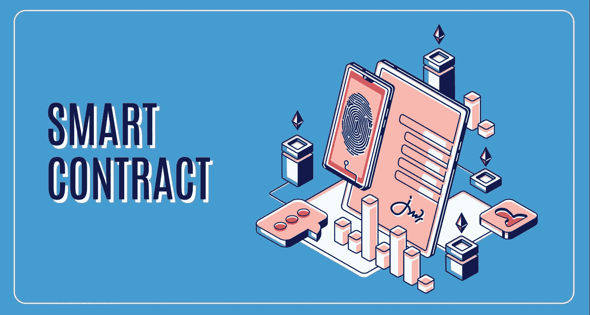
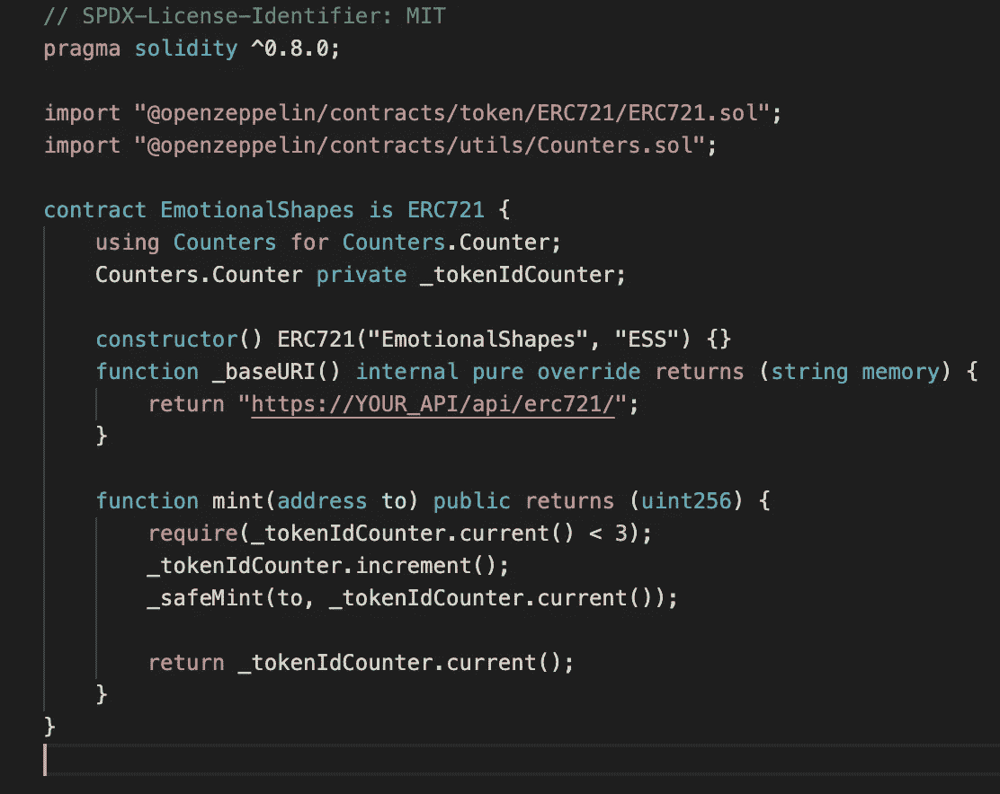

# NFT 智能合约

> 原文：<https://medium.com/coinmonks/nft-smart-contracts-521d11baa12?source=collection_archive---------48----------------------->

NFT 智能合约是关于您的数字资产的数据被保存和存储在区块链上的地方。它还允许交易发生在销售必须满足某些条件的情况下。从技术上讲，它包括一堆 if/else 语句来验证一个事务；**如果满足**这些条件，则交易被验证**，否则**没有交易发生。智能合约的美妙之处在于，它们是自动执行的，不需要中央机构来验证或执行交易。智能契约还保存关于 NFT 的信息，包括它是什么类型的 NFT、谁拥有它、证明它是独一无二的 tokenID。

智能合约是由铸造过程产生的。[铸造](https://metaversedmena.substack.com/p/creating-your-nfts?s=w)是创造 NFT 的过程。在这个过程中，智能合同被存储并链接到区块链(很可能是以太坊)。用于将智能合约链接到以太网的协议是 ERC-721 标准，我在之前的帖子[这里](https://metaversedmena.substack.com/p/erc-721-the-nft-token-standard?s=w)中已经详细讨论过。

智能合约的主要优势如下:

1.  如前所述，它们是自动执行的，不需要中央权威机构，可以节省时间和金钱。
2.  由于它们的分散性，它们是安全的并且很难被黑客攻击。
3.  它们以高速度和高精度执行。即使有错误，也是很少的。
4.  他们存储所有的历史交易，使其非常透明。任何人都可以获取这些信息。

An example of an NFT Smart Contract’s code

NFT 智能合约仍处于起步阶段。智能合约的未来是光明的，该技术可以用于以低成本、分散和透明的方式验证不同领域的交易。

> 加入 Coinmonks [电报频道](https://t.me/coincodecap)和 [Youtube 频道](https://www.youtube.com/c/coinmonks/videos)了解加密交易和投资

# 另外，阅读

*   [麻雀交换评论](https://coincodecap.com/sparrow-exchange-review) | [纳什交换评论](https://coincodecap.com/nash-exchange-review)
*   [美国最佳加密交易机器人](https://coincodecap.com/crypto-trading-bots-in-the-us) | [经常性回顾](https://coincodecap.com/changelly-review)
*   [在印度利用加密套利赚取被动收入](https://coincodecap.com/crypto-arbitrage-in-india)
*   [Godex.io 审核](/coinmonks/godex-io-review-7366086519fb) | [邀请审核](/coinmonks/invity-review-70f3030c0502) | [BitForex 审核](https://coincodecap.com/bitforex-review)
*   [5 款最佳免费加密货币制图工具](https://coincodecap.com/crypto-charting-tools)
*   [最佳比特币保证金交易](/coinmonks/bitcoin-margin-trading-exchange-bcbfcbf7b8e3) | [萝莉点评](/coinmonks/lolli-review-e6ddc7895ad8) | [比特币保证金交易](https://coincodecap.com/bityard-margin-trading)