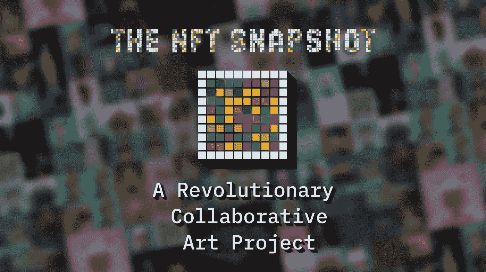
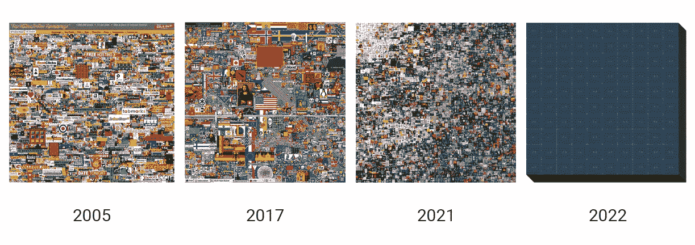
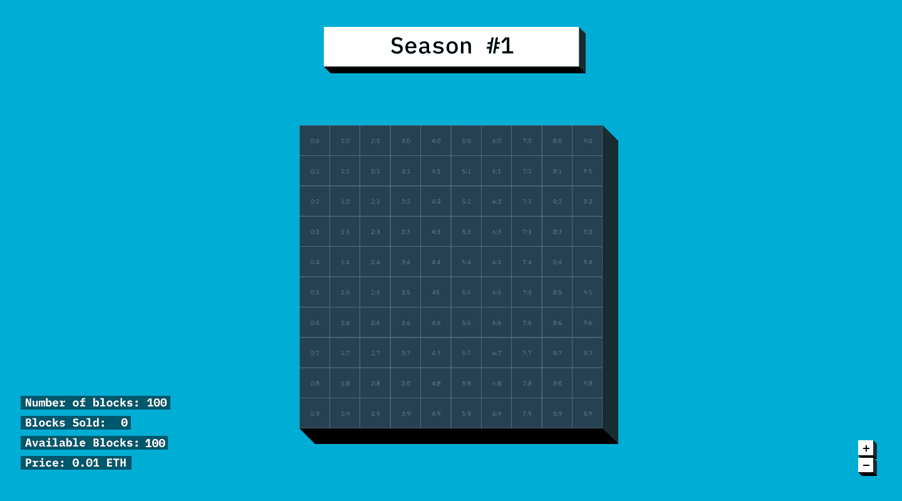
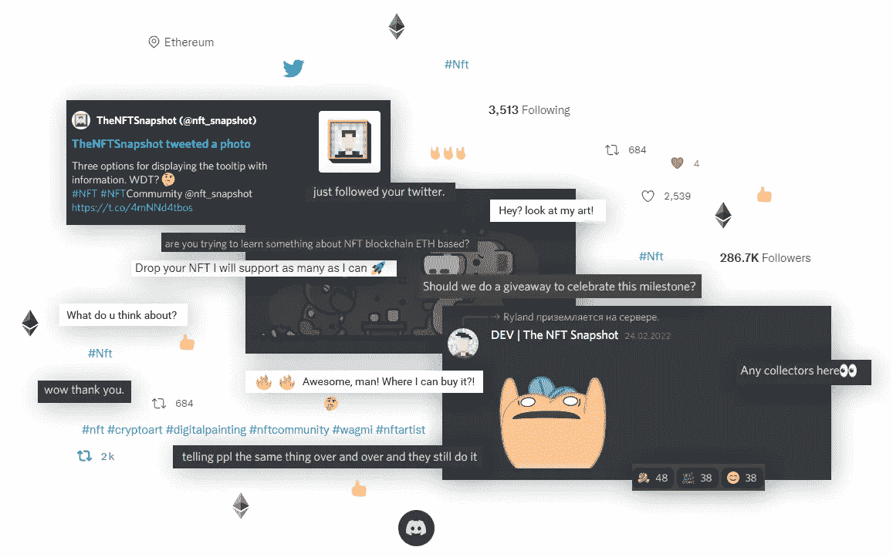

# NFT 快照:一个革命性的合作艺术项目

> 原文：<https://medium.com/coinmonks/nft-snapshot-a-revolutionary-collaborative-art-project-536780fbc33a?source=collection_archive---------20----------------------->

NFT 是一种非常流行的艺术形式，但它们不是数字艺术的第一种类型。

早在 NFTs 成为如此热门的商品之前，其他鼓舞人心的项目就让互联网变得更好，比如[百万美元主页](https://en.wikipedia.org/wiki/The_Million_Dollar_Homepage)。亚历克斯·图在 2005 年创建了这个网站，作为一种为大学赚取额外收入的创造性方法。该网页有 100 万像素，每张售价 1 美元。信不信由你，这个别出心裁的想法给图带来了惊人的成功，为他**赢得了 103.71 万美元**。

其他成功和鼓舞人心的项目将很快跟进，如 [Reddit Place](https://en.wikipedia.org/wiki/Place_(Reddit)) ，这是 2017 年进行的一项社会实验，Reddit 上有超过 100 万人改变了单个像素的颜色，在连接社区成员的同时创建了一个明亮多彩的画布。

[**《NFT 快照》**](https://thenftsnapshot.com?utm_source=medium&utm_medium=social&utm_campaign=nft-snapshot-a-revolutionary-collaborative-art-project) 期待连接一个充满热情的社区，在这个巨大的空间内一起工作，创建一个独特的基于 web3 的画板。感兴趣的社区成员可以通过 [**注册加入白名单**](https://lnk.to/nft-snapshot-formMD) 来了解更多关于 NFT 快照的信息。该项目从 Million Dollar 主页、Reddit Place 和 Everydays: The First 5000 days 等网站获得灵感，以创建一个**社区驱动的 NFT 拼贴**，成员可以实时参与其中。

From “The Million Dollar Homepage” to “The NFT Snapshot”

这个新项目致力于让艺术爱好者一起做一些独特的事情，证明任何人都可以成为 NFT 艺术家，同时还可以合作创造社区艺术。一旦完成，该项目将被铸造成 NFT，然后拍卖。收益将由所有艺术家和街区所有者分享。第一个 NFT 快照赛季将包括 100 块的限量发行。该团队将与社区合作，决定未来几季的棋盘大小、形状、名称等。

Community driven NFT collage

# 不要错过成为社区成员的机会

那么，这个不可思议的社区背后是谁呢？《NFT 快照》的团队成员包括 Dmytro Magunov、Olena Magunova 和 Serg Verbenko。这三人组成了一个团队，为 NFTs 世界带来了一些新的和令人兴奋的东西。

如果你想成为这个社区的一员，并获得在 NFT 创造历史的机会，不要浪费时间[注册加入白名单](https://lnk.to/nft-snapshot-formMD)！

[**成为你一直想成为的艺术家**](https://lnk.to/nft-snapshot-formMD) 同时加入一个充满创意者的有趣、受欢迎的社区！