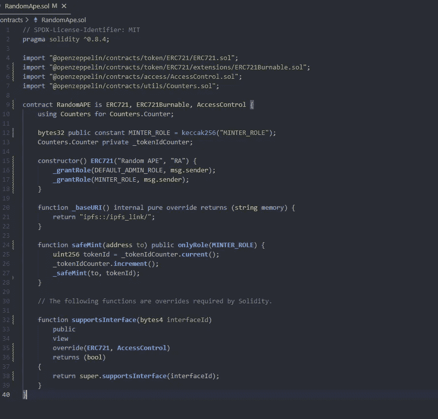

# NFT 以稳健赢得精明合约

> 原文：<https://medium.com/coinmonks/nft-staking-swith-solidity-d99f3281c5a8?source=collection_archive---------0----------------------->

作为一名 smart contract 和 dapp 开发人员，我在 Fiverr 的工作中收到的最多的任务之一就是 nft staking。我很难找到例子，所以我决定为可能正在努力实现这一点的开发人员创建这个指南。

如果你想和我合作，这里有我的链接，比如 contra 或 Fiverr，还有 Github repo:

 [## @drakenwolf | Linktree

### 链接树。让你的链接做得更多。

linktr.ee](https://linktr.ee/drakenwolf)  [## GitHub-Drakenwolf/Nft _ Staking _ System:一个开源的、Nft 的 Staking 系统。

### 这个项目演示了一个基本的安全帽用例。它附有一份合同样本，一份合同测试，一份样本…

github.com](https://github.com/Drakenwolf/Nft_Staking_System) 

但是什么是非功能性测试系统呢？

该系统将由 3 份合同组成:

1.  一个 Erc20 代币将作为奖励代币。
2.  Erc721 将是 nft 令牌。
3.  赌注合同将持有赌注 nft，并允许要求奖励。

这不会是一个自动系统，智能合同需要有人调用该功能并签署交易，这可以由用户通过 UI 或后端的 oracle 触发。

首先，我们需要使用开放的 zeppelin 契约创建 erc20 令牌。

对于这个 staking 系统，我决定使用 erc20 的 mint 函数直接为用户铸造令牌。这就是为什么我使用 open zeppelin 的 AccessControl，这样我们就可以为 staking 契约分配一个铸造角色。

然后我们需要签订 nft 合同:

现在在 Stake 系统上，我决定使用接口来调用 token 和 nft 的函数。我从 open zeppelin 导入了 IERCO、IER721 接口(记住，经过验证的代码总是更好)。

我还为我们的奖励令牌添加了一个 mint 函数，因为这个函数不在界面上。

一些实用程序变量:

由于我正在进行一些手动测试，所以我将 stakingTime 设置为 180 秒，但是为了降低时间戳风险，最好使用更长的时间，比如几天。此外，您可以使用 chainlink oracle 进行更可靠的时间管理。

然后，我们有一个结构来保存所有的 Staker 实体的信息，如果您的业务逻辑需要，您可以添加其他字段或修改这些字段。

1.  **TokenIds** :是用户用于锁定的 id 的数组
2.  **tokenstakingcludd:**是一个可以跟踪令牌索引的映射
3.  **余额:**奖励令牌用户当前的余额。
4.  **rewards release:**用户认领的奖励。

其他一些 var:

事件:

这些功能将成为合同控制的一部分，因为我们需要确保在启动系统之前一切准备就绪:

一个 get 函数:

现在让我们制作 _stake 函数和一个单个和多个 stake 函数:

如果被调用方实际上是 nft 的所有者，我们需要仔细检查系统的状态。然后，我们保存用户的所有信息，并将 nft 转移到必须拥有权限的合同中，我们可以使用 web3 来实现这一点，让用户批准允许合同中的 nft，或者在 nft 的合同中，或者在此合同中从 nft 合同中调用 approve 函数。我决定使用最后一种方法来避免前端依赖，在部署合同时，将这种方法添加到 nft 合同中可能会很棘手。

现在让我们创建 _ustake 函数。Github 资源库中提供了该软件的个人版、多版本和紧急版本。

最后一部分将使索赔和更新和奖励功能。

更新的奖励必须由用户或外部服务器调用，因为智能合约本身无法做到这一点。如果您选择使用 chainlink，您将需要修改更新功能。如果你想让我用 oracle 创建一个合同，请在评论中告诉我。

更新功能的逻辑是检查令牌是否被标桩(如果没有，冷却时间将为 0)，您可以添加一个事件来指出这一点或一个要求，然后如果令牌被标桩，您需要检查完成了多少个标桩周期并保存部分时间，否则合同将不会在下一次调用此功能时反映实际的标桩时间。

索赔奖励将为用户铸造代币，如果您有受控/有限的供应，您可以使用转移或使用奖励池合同代替。

我希望这能对你有用，留下一个赞，订阅更多区块链内容，随时问我。

谢谢！

> 交易新手？试试[加密交易机器人](/coinmonks/crypto-trading-bot-c2ffce8acb2a)或者[复制交易](/coinmonks/top-10-crypto-copy-trading-platforms-for-beginners-d0c37c7d698c)