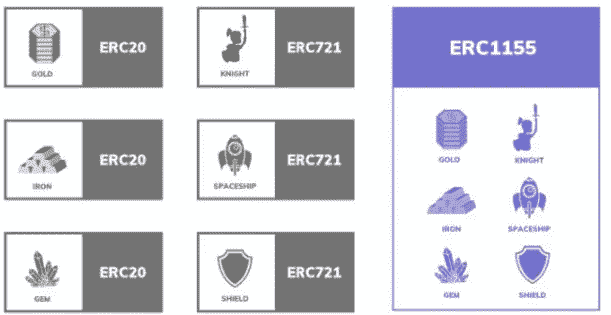
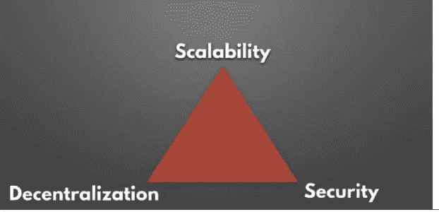
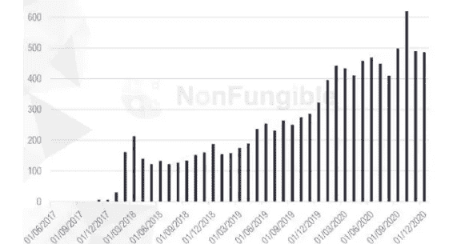
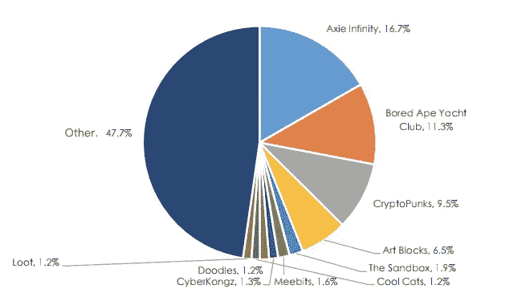

# NFT 主题

> 原文：<https://medium.com/coinmonks/nft-topics-c5e1726b270d?source=collection_archive---------24----------------------->

> 本文旨在传播区块链的知识和理念— — Lunaray，欢迎关注和讨论
> 
> 作者:[support@lunaray.co](mailto:support@lunaray.co)治安队

## **0x 01**PoW、PoS、DPoS 一致性算法比较

*   打包到区块链上确认的块中的数据不能被篡改，并将永久存储在链上。NFT 的数据信息在链条上确认后，就不能再修改了。当矿工或超级节点使用共识算法完成块生成时，会通过 P2P 协议向全网广播(P2P 协议是一种分布式网络协议，比区块链技术出现的更早)。每个节点收到广播信息的确认后，都会更新信息，这种机制实现了一种去中心化的分布式记录，并且共识算法保证了恶意节点无法
    篡改信息。
*   共识算法是区块链建立分散信任的基础。区块链从去中心化程度可以分为三种链条，分别是**公链**、**财团链**和**私链**、**比特币**、**以太坊**、**蜡、流量**等。全部是公有链，节点完全自由参与，无需认证，而联合体链主要用于组织间的群组，只有认证的节点才能参与，部分节点有权产生区块，去中心化程度降低。私有链一般在公司内部搭建，应用场景很少。从区块生产效率来看，公链最低，**财团**链相对较高，私链逻辑上最高。我们讨论的 NFT 主要是指公有链上的存储和**联合体**链上的数字资产证书。
*   目前主流的公链共识算法分为三类，分别是 **PoW** 、 **PoS** 、 **DPoS** 。
*   1) **PoW 算法**:比特币和以太坊 1.0 采用 PoW 算法。以比特币为例，不断进行 **SHA256** 计算，最终找到满足给定值的解。
    散列值以 0 开头的节点有权产生块；
*   2) **PoS 算法** : **以太坊 2.0** 采用这种算法，股权证明，股权证明，并引入了币龄的概念。持有的硬币越多，获得区块的概率越高。该算法减少了计算量，提高了 TPS(每秒(per second)。并发交易量)，牺牲了一定程度的去中心化；
*   3) **DPoS 算法**:委托赌注证明，每个节点将赌注其手中的令牌，为最有能力和信誉的节点投票。以 EOS 区块链为例，整个网络投票选择超级节点轮流产生区块，这种算法可以大大提高 TPS，但分散程度进一步降低。
*   保证数据不可篡改的 **PoW** 共识算法的核心是很难有人控制整个网络 51%以上的计算能力去做不道德的事情。如果他们有这个能力，挖掘比特币进行激励是更好的选择。PoS 算法 DPoS 共识算法的核心是拥有大量硬币的节点并不倾向于做不道德的事，而是更愿意维护环境来获取利益。
*   NFT 通过标准合同部署在区块链上，如智能合同 **ERC-721 和 ERC-1155** 。智能合约是部署在区块链上的一段可执行代码。ERC-1155 更多的是在游戏中用来识别一类道具。自动执行是由特定机制触发的，一旦上传就无法修改。可以简单理解为移动终端。话费设置为自动支付，其触发机制是手机欠费停机。一旦该状态被确认，充电操作将被自动触发。但与区块链智能合约不同的是，手机充值完全集中，规则由运营商决定。而且智能合约部署在分散的区块链上，一旦上了链，没人能篡改它。

## 0x02 ERC20、ERC721、ERC1155 智能合约标准

ENJIN

*   智能合约交易触发和执行机制:交易是连接以太坊外部世界和内部状态的桥梁，所以以太坊也是交易的状态机。NFT 的智能合约部署完成后，对外调用 RPC 接口访问以太坊主网，矿工打包交易，EVM(以太坊虚拟机)找到对应的智能合约，根据外部参数执行对应的合约功能。完成后，状态将在链上更新。
*   例:无聊猿 NFT 开发者将智能合约代码部署到以太坊，NFT 交易平台 OpenSea 收录并展示，当其中一个用户在 OpenSea 平台发起购买这款无聊猿 NFT 操作时，OpenSea 执行 RPC 接口访问以太坊主网发送交易请求，miner 打包交易找到智能合约执行，更新链上状态完成交易。

## 0x03 的功能实现

*   可以概括为:实现资产的去中心化认证和交易。传统的集中机构已经可以实现认证和交易，比如**银行**、**拍卖行**、**交易所**、**其他机构**。为什么您仍然需要 NFT 技术进行身份验证和交易？
*   1)从认证的角度:核心原因是认证具有不可篡改性和永久性，不可篡改性基于基于区块链技术的数据交易过程的公开和上传到链的分布式存储。被认证的资产是属于地址对应的个人或组织，不依赖于任何组织，具有完全的控制权和处置权。账目、数据等。存储在集中式机构中有被禁止、篡改和粗略丢失的风险，并且基于集中式机构的服务。一旦集中机构消失，认证也就不复存在。

Medium.com

*   目前基于 NFT 的区块链技术更注重去中心化和安全性，牺牲了执行效率。比如比特币采用 PoW 共识机制，每秒处理 7 笔交易，每笔交易的确认时间将近 1 小时。这种机制满足了充分安全和去中立化的需要。以太坊它每秒可处理约 20 笔交易，每笔交易的确认时间约为 4~8 分钟。
*   同时，由于共识机制算法对矿工计算能力的消耗，区块链平台会收取一定数量的代币来激励矿工生产区块。随着交易的拥挤和代币价格的不断上涨，用法币支付的费用也会计算在内。似乎越来越高，这种机制也削弱了脱媒带来的成本优势。

## 2017-2020 年以太坊每月活跃智能合约数量(单位)

nonfungible.com

*   智能合同标准的引入和改进。智能合约标准的推出有利于浏览器展示和钱包及交易市场支持。目前使用最多的以太坊 ERC-721 和 ERC-1155 标准已于 2018 年正式推出；
*   聚合交易平台降低参与门槛。在智能合约标准下，聚合交易平台 OpenSea、Rarible、SuperRare 等。已于 2017 年后推出。游戏平台 AxieInfinity、NBA 官方授权交易平台 NBA TopShot、元宇宙平台分散等垂直平台也相继上线，大大降低了 C 端用户参与门槛，为后续突破奠定了基础。
*   区块链技术更新迭代。以 Solana、Flow、BSC 为代表的公链和以 Polygon、WAX、Ronin 为代表的侧链相继推出。以太坊链，这些链在 TPS 费率、费用支出、交易确认等环节都进行了优化，性能大大提升。
*   有代表性的例子是**索拉纳**链，采用 **PoH** 和 **PoS** 相结合的共识算法，最大 **TPS** 可达 6.5 万次，交易手续费低。代表性的 NFT 项目有**堕落学院**、**索拉纳猴业**等等。

## 0x 04 NFTs 的电流限制

*   交易属性不仅可以带动行业的繁荣，资金的涌入也带来了一波炒作。NFT 市场头部效应明显，大部分交易参与者亏损；
*   NFT 交易市场的头部效应是显而易见的，78%不在白名单上的参与者在转售时会赔钱。根据不可伪造的数据，历史总成交量前 10 的 NFT 系列的成交量占 NFT 市场总成交量的 50%以上，达到 2.3%。差，市场的头部效应非常明显。
*   白名单是交易新发行的 NFT 获利的关键。NFT 创造者建立了一个“白名单”,允许 Subs 在铸造期间以比其他用户低得多的价格购买他们的 NFT。OpenSea number
    据报道，加入白名单然后出售新造 NFT 的用户有 75.7%的机会盈利，而不在白名单上的用户只有 20.8%。根据 chainalysis 的统计，78%的非白名单买家在转售时亏损，其中 59%的买家亏损超过 50%。另一方面，78%的白名单买家产生了利润，其中 51%产生了利润。投资回报率的 2 倍以上。

nonfungible.com TOP10 transaction volume NFT series proportion of total transaction volume (%)

目前的应用范围仍然更多地局限于数字藏品和数字艺术品，与现实世界资产的连接也需要在生态上进一步完善，需要相关法律法规的支持。根据 nonfungible 统计 2021 年以来的日交易量数据，将 NFTs 分为元宇宙，游戏、实用工具、数字艺术收藏分为 4 类，其中 2021 年交易量占比最大。最高的是数字收藏艺术类，达到 76.4%，如 BAYC、CryptoPunks、
Meebits、艺术块、SuperRare 等。都属于这一类，其次是游戏占比 17.8%，主要是 Axie Infinity，元宇宙和实用工具两大类不够用. 10%，其中元宇宙为 5.2%，代表项目有沙盒、分散地等。，而实用工具占 0.6%，主要是 ENS，以太坊的域名服务。

从 NFT 架构的角度来看，它可以集成到现实世界中需要资产认证、权利确认和交易的领域。我们认为随着:1 NFT 公链的不断创新和 Layer 2 带来的扩张；2)现实世界资产数字化进程的加速以及相应的法规随着 NFT 的推出，NFT 与现实世界的联系将更加紧密

目前部分 NFT 项目的投机性明显，应谨慎对待，但从另一个角度看，投机浪潮引入了大量用户，泡沫带来了巨大的交易量，对 NFT 的发展也是有利的，在市场上促进了 NFT 产业。风险控制、基础设施建设和人才吸收更进一步，推动了底层区块链技术的不断完善。

> 加入 Coinmonks [电报频道](https://t.me/coincodecap)和 [Youtube 频道](https://www.youtube.com/c/coinmonks/videos)了解加密交易和投资

# 另外，阅读

*   [如何在 Uniswap 上交换加密？](https://coincodecap.com/swap-crypto-on-uniswap) | [A-Ads 审查](https://coincodecap.com/a-ads-review)
*   [WazirX vs coin dcx vs bit bns](/coinmonks/wazirx-vs-coindcx-vs-bitbns-149f4f19a2f1)|[block fi vs coin loan vs Nexo](/coinmonks/blockfi-vs-coinloan-vs-nexo-cb624635230d)
*   [本地比特币审核](/coinmonks/localbitcoins-review-6cc001c6ed56) | [加密货币储蓄账户](https://coincodecap.com/cryptocurrency-savings-accounts)
*   [什么是保证金交易](https://coincodecap.com/margin-trading) | [美元成本平均法](https://coincodecap.com/dca)
*   [支持卡审核](https://coincodecap.com/uphold-card-review) | [信任钱包 vs 元掩码](https://coincodecap.com/trust-wallet-vs-metamask)
*   [Exness 回顾](https://coincodecap.com/exness-review)|[moon xbt Vs bit get Vs Bingbon](https://coincodecap.com/bingbon-vs-bitget-vs-moonxbt)
*   [如何开始通过加密贷款赚取被动收入](https://coincodecap.com/passive-income-crypto-lending)
*   [BigONE 交易所评论](/coinmonks/bigone-exchange-review-64705d85a1d4) | [电网交易机器人](https://coincodecap.com/grid-trading)