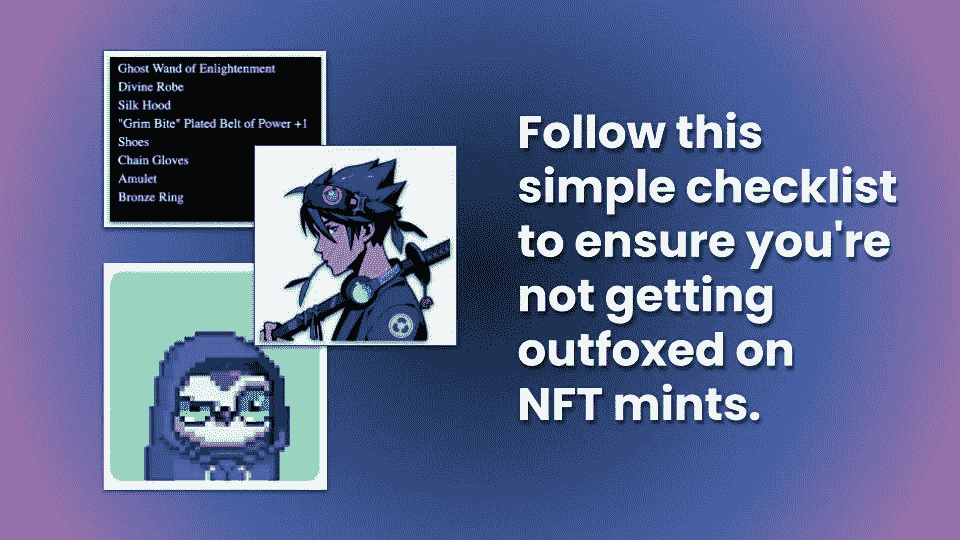

# NFT 交易员的悲哀:这不是一个公平的铸币厂开始。

> 原文：<https://medium.com/coinmonks/nft-trader-woes-its-not-a-fair-mint-to-begin-with-7950d3fc18?source=collection_archive---------17----------------------->

## 深入到阻碍你从 NFT 中获得巨大收益的障碍中去。

Loot, Azuki, and Moonbirds NFTs were offered using different auction styles. Which one was the fairest?

考虑一下为什么 NFT 项目存在“允许列表”的概念。在缺乏人工智能机制的情况下，市场采用先到先得的拍卖方式来打造 NFT 藏品。这种天然气不仅效率低下(由于大肆宣传的项目发布时激烈的天然气战争)，而且还允许老练的电力用户的不正当行为。

在 DeFi，它是 MEV 的领先者。在 NFTs 中，黑客在公开造币之前提取稀有元数据(例如，从 Testnet 或 IPFS)，然后使用该数据选择性地只铸造最稀有的项目。范式资本在这里详细解释了这个[。简而言之:](https://www.paradigm.xyz/2021/10/a-guide-to-designing-effective-nft-launches#exploitable-fairness)

> *剥削者提取集合的元数据，允许它们在一个单一的稀有度分数中代表所有特征的相对频率。利用这个分数，他们就可以确定一个收藏中价值最高的 NFT。*
> 
> *然后，剥削者打破铸造合同的随意性，只铸造他们想要的稀有的、最高价值的 NFT。*

Paradigm 的同一篇文章提供了一个清单来确定一个项目是否使用了“公平投放”的概念。来自同一篇文章:

> ***不可利用的公平性*** *:发射*必须*具有真正的随机性，以确保掠夺性用户不能以不太老练的用户为代价狙击最稀有的物品。*
> 
> **在实践中，买家竞相尽快完成交易，或者向矿商行贿以激励他们。任何其他方式的拍卖都有利于对区块链有深刻了解的人，以及能够使用机器人等电动工具、Flashbots 或 Eden 等私人继电器，甚至直接访问矿工的人。**
> 
> ***时区不可知*** *:通常，FCFS 发布会在特定的区块高度宣布，然后在很短的时间内销售一空。无论选择什么样的遮挡高度，总会对当前正在睡觉或工作的其他时区的用户不利。因此，发布时间不应该太短，这样人们就可以在不改变日常生活的情况下参与进来。*
> 
> **:在 chain 上交易(尤其是在以太坊上)是很昂贵的，所以一个好的上线应该尽量减少用户必须进行的交易数量。**
> 
> ****包容性和抗梅毒性*** *:通常，确保发行面向不同的持有人群体，符合 NFT 创造者的最大利益，即使这会导致市场最初出现小幅下跌。这是因为一个充满活力的社区最终会在二级市场上推动收藏品的价值。**
> 
> ***:当然，话虽如此，启动机制应该能够保护底层区块链的属性。这意味着它必须提供前述的好处*而不*成为保管人或对运营商要求太多的信任假设。***

**我认为 PROOF 最近为[月鸟](https://moonbirds.xyz/)举办的允许抽奖活动是“公平下降”的最好和最近的例子。”[观看这个来自凯文·罗斯本人的解说](https://www.youtube.com/watch?v=QaPzGQzZQg4)。**

**首先，据我所知，对月鸟造币厂来说，没有不可利用的公平。用户注册 PreMint.xyz allowlist，如果被选中，你就可以加入造币厂。每个钱包地址每人限购一只月鸟。我相信这消除了以不太老练的用户为代价对最稀有物品的掠夺性狙击。但是我们会在回顾铸币厂下面的智能合同后知道更多。**

**第二，月鸟超级抽奖活动意味着参与者没有比赛条件。当然，我讨厌等七天才知道我是否有位置…但是感觉很好，我没有在指定的时间困在一个设备前，不断地重新加载我的设备，不可避免地使网站崩溃和堵塞网络。(我回想起了在交易卡游戏 Parallel 上发生的一次严重错误，在那里，尽管受到 Cloudflare DDoS 服务的保护，但一次离线的造币前抢购导致他们的 web 应用程序崩溃！)**

**第三，月鸟抽奖意味着全世界都可以参与，突出了包容性的元素。另一种选择是，选择任何时间投放，这意味着世界上有一半的人无法在特定的时区实际参与。我去过那里，把闹钟设定在凌晨 3 点——结果却被一个机器人打败了。**

**第四，月鸟抽奖活动很省油。我只需要在交易上签字来证明我的资格，而不是转移金额，并可能收到一个失败的交易，只是浪费汽油。**

**第五，Moonbirds 抽奖活动确保了发行面向各种各样的持有人。月鸟的 Premint.xyz 抽奖要求每个钱包 2.5 ETH，Twitter 验证和 Discord 验证，以防止鲸鱼多次注册。当然，克服这些障碍并非不可能，但要困难得多。最终，多样化的持有人基础是一件好事，因为“一个充满活力的社区最终会推动收藏品在二级市场的价值。”身份证。**

**第六，Premint.xyz 发射机制*可能*不可信。根据 Premint 的网站副本，它“随机选择收藏家和社区成员赢得一个位置。”我还不能确认他们是否使用了 VRF 链功能，因为看起来抽奖是在链外进行的。在我收到 Premint 的补充信息之前，看来你确实需要一些信任假设。**

**也就是说，抽奖的概念公然对抗专业的 NFT 交易者，他们渴望得到阿尔法——秘密的或内部的信息，提供对抗市场的优势。如果抽奖真的是随机的，那么交易者不可能跑赢市场。他们必须走运。那么，NFT 交易员应该怎么做呢？**

**下一个最好的选择是参加需要加入允许名单的造币厂。这通常来自于帮忙、发布迷因或为项目贡献代码。或者更糟，你必须在 Twitter 和 Reddit 上发布一个项目。在某些时候，所有的努力都必须与你正在创造的项目的上升潜力相比较。不要忘记对你最宝贵的资产——时间——做一个基本的投资回报率计算。每周花 40 个小时打造几个项目是很痛苦的——但没有一个项目能成功。**

**如果我们有时间机器就好了，因为**今天的常识是昨天的阿尔法**。如果你能回到过去，用 1 ETH 买下那辆自行车会怎么样？**

**你会做吗？**

**你为什么没有？知识匮乏？缺乏信念？资金不足？**

**我想知道。[在此发表您的评论](https://twitter.com/NFT_Deals_xyz/status/1514415060902453251?s=20&t=hYomGFDu-x5vZNM_1coiqw)。**

> **加入 Coinmonks [电报频道](https://t.me/coincodecap)和 [Youtube 频道](https://www.youtube.com/c/coinmonks/videos)了解加密交易和投资**

# **另外，阅读**

*   **[3 商业评论](/coinmonks/3commas-review-an-excellent-crypto-trading-bot-2020-1313a58bec92) | [Pionex 评论](https://coincodecap.com/pionex-review-exchange-with-crypto-trading-bot) | [Coinrule 评论](/coinmonks/coinrule-review-2021-a-beginner-friendly-crypto-trading-bot-daf0504848ba)**
*   **[莱杰 vs Ngrave](/coinmonks/ledger-vs-ngrave-zero-7e40f0c1d694) | [莱杰 nano s vs x](/coinmonks/ledger-nano-s-vs-x-battery-hardware-price-storage-59a6663fe3b0) | [币安评论](/coinmonks/binance-review-ee10d3bf3b6e)**
*   **[Bybit Exchange 评论](/coinmonks/bybit-exchange-review-dbd570019b71) | [Bityard 评论](https://coincodecap.com/bityard-reivew) | [Jet-Bot 评论](https://coincodecap.com/jet-bot-review)**
*   **[3 commas vs crypto hopper](/coinmonks/3commas-vs-pionex-vs-cryptohopper-best-crypto-bot-6a98d2baa203)|[赚取加密利息](/coinmonks/earn-crypto-interest-b10b810fdda3)**
*   **最好的比特币[硬件钱包](/coinmonks/hardware-wallets-dfa1211730c6) | [BitBox02 回顾](/coinmonks/bitbox02-review-your-swiss-bitcoin-hardware-wallet-c36c88fff29)**