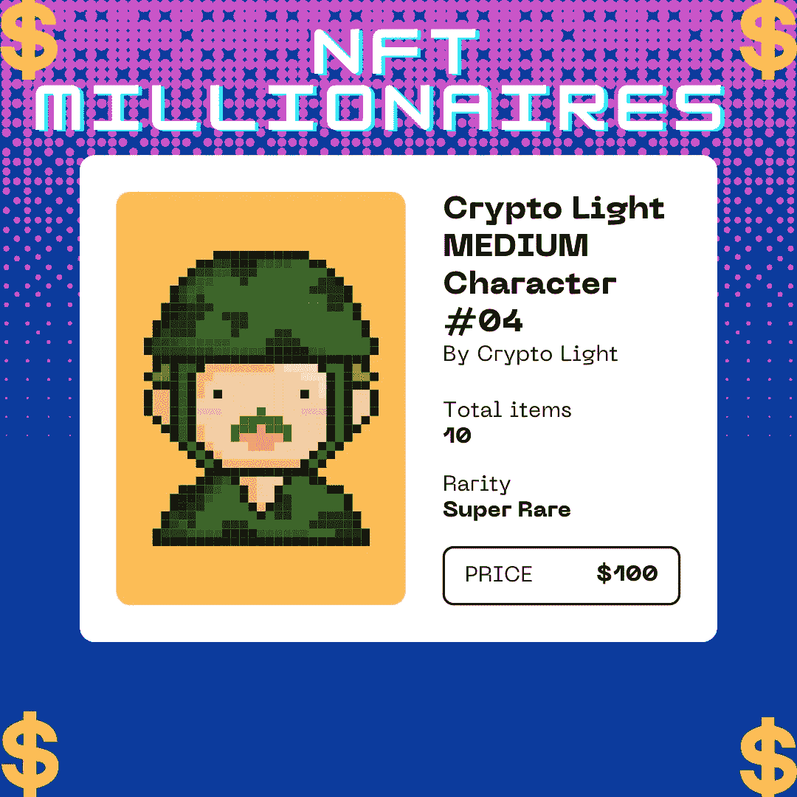
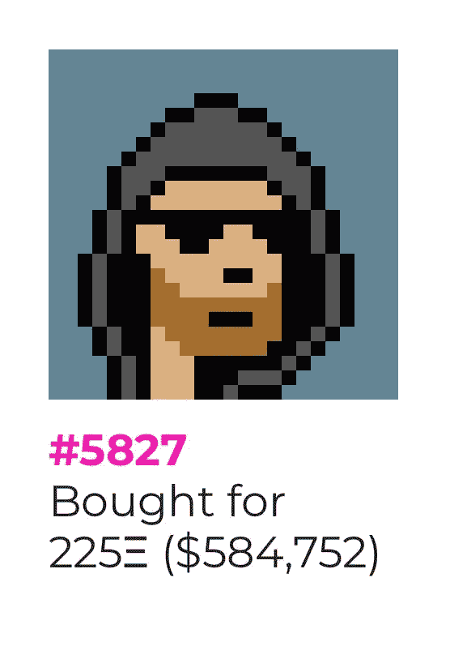
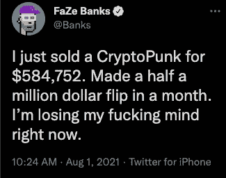

# 像 FaZe Banks 这样的 NFT 交易员赚了数百万

> 原文：<https://medium.com/coinmonks/nft-traders-like-faze-banks-are-making-millions-38a9e0a3a6b4?source=collection_archive---------38----------------------->

NFT 是真实的，不是物理的…但是**数字地**

NFT 可以是任何东西，只要是数字形式的(如绘画、音乐或门票)，但目前的热门话题是利用该技术出售数字艺术。像杰克·多西这样的人甚至已经将他们的第一条推文作为 NFT 出售了数百万美元。

大多数 NFT 都在以太坊区块链。这些 NFT 不同于普通硬币，因为它们保存了额外的信息，以使它们以不同的方式工作。以太坊是一种加密货币，像 BTC 或道奇。它的区块链也允许这些 NFT，这些 NFT 也包含额外的信息，使它们以不同于普通硬币的方式工作。值得注意的是，其他区块链技术也可以开发自己的 NFT 迭代。

对于游戏玩家、艺术家和有创造力的人来说，NFT 有很多好处，比如提供了额外的收入来源。卖家和他们的顾客之间确实有直接的沟通渠道。因此，不太需要中间商和代理商。

如果你能在 NFT 上得到一笔好交易，你就能在市场高涨时卖掉它，赚很多钱。

> 随着“骚扰部落”的所有者隐朋克 NFT 最近的销售，**骚扰银行**似乎已经扭转了他的命运，赚了惊人的财富。银行离通过交易和投资 CryptoPunk NFT 赚超过 100 万美元只有一大笔买卖之遥。

FaZe Banks 在完成一笔大交易后不到一周就实现了 25 万美元的利润。FaZe Clan 的创始人在购买 CryptoPunk 后仅 48 小时就以 25 万美元的利润将其出售。

拯救儿童'加密'泵和转储'的争议引发了许多困扰银行最近的关注。尽管没有确凿的证据证明银行有罪，但一些 FaZe 成员因参与骗局而遭受了后果。

faze NFT purchase which turned a huge profit

无论银行看起来多么无辜，他在炫耀他通过在线销售 CryptoPunk NFTs 获得的收入后的行为受到了一些支持者的批评。“拯救儿童”代币骗局让数十万人付出了金钱，而班克斯吹嘘他获得了 75 万美元的意外之财，在此过程中激怒了互联网上的许多人。但班克斯并不担心，他表示，即使一个人白手起家，投资 CryptoPunk 也可以获得百万美元的财富。

**NFT 交易最好的网站有哪些？**

***OpenSea***

NFT 的销售由 OpenSea 主导。你可以免费注册 OpenSea，阅读平台上的各种数字内容。你可以用一个简单的方法来发展你自己的 NFT，促进艺术家和创作者，以及艺术家和创作者(称为“铸造”)。该平台的名字很贴切，因为它支持 150 多种不同的支付令牌。OpenSea 是开始学习 NFTs 的好地方。

***幼虫实验室/隐朋克***

NFT 密码朋克是幼虫实验室最受欢迎的项目。自 2017 年免费赠送以来，一些加密朋克已经交易了巨额资金。除了 Autoglyphs 和其他基于以太坊区块链的应用程序开发项目，幼虫实验室目前正在进行其他数字艺术项目。

幼虫实验室的 CryptoPunks NFTs 都消失了，但是，它们仍然可以在各种第三方市场上找到，用于投标和购买。仍然值得关注幼虫实验室的众多努力，例如 Meebits，它可以通过行业的内置市场直接竞价。

***稀有***

像 OpenSea 一样，Rarible 是所有类型的 NFT 的一个大市场。在这个网站上，你可以购买、出售或创作许多类型的艺术、电影、收藏品和音乐。要在市场上购买和销售，你需要使用市场自己的加密货币令牌 Rarible (CRYPTO:RARI)，不像 OpenSea。区块链以太坊是 Rarible 的基础。

这家公司已经和一些著名的公司结成了联盟。而云软件巨头 Adobe(纳斯达克代码:ADBE)刚刚加入 Rarible，以帮助保护 NFT 艺术家和制片人的工作。

NFT 交易有潜在的危险。有许多人购买 NFT，意图在未来某个时候卖出，但市场下跌，他们被迫遭受重大损失。因此，交易非功能性交易就像投资股票市场一样，是一项有风险的工作。只有当你愿意冒险时，你才应该参与。好处是，如果你在 OpenSea 和其他平台上发现了宝石，你可以花很少的钱购买，然后获得巨大的利润。当然，说起来容易做起来难。