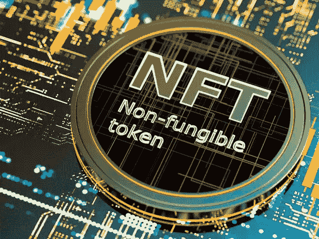

# NFT 贸易；如何安全而有利地交易非金融资产

> 原文：<https://medium.com/coinmonks/nft-trading-how-to-trade-nfts-safely-and-profitably-f0d6188e99cd?source=collection_archive---------20----------------------->

学习如何安全地进行非金融衍生品交易，并从中获取最大利润。在这篇文章中，我们将回顾所有必要的安全预防措施，以确保你不会犯任何可能让你损失金钱的错误。

## **TL；博士**

*   安全地交易 NFT 通常需要你选择正确的项目，而选择正确的项目需要你做适当的研究。
*   另一个你永远不应该忽视的安全规则是，在铸造 NFT 时，一定要使用一次性账户。
*   其他确保安全的方法包括检查造币速度、比较地板价和造币价、检查交易量。

NFT(不可替代代币)交易是目前互联网上最热门的话题之一，这已经不是什么新闻了。[根据研究，预计全球 NFT 市场的规模将从 2022 年的 30 亿美元增长到 2027 年的 136 亿美元，届时复合年增长率(CAGR)将超过 35%。](https://www.globenewswire.com/news-release/2022/05/13/2442960/0/en/The-global-NFT-market-size-is-expected-to-grow-from-USD-3-0-billion-in-2022-to-USD-13-6-billion-by-2027-at-a-Compound-Annual-Growth-Rate-CAGR-of-35-0-from-2022-to-2027.html#:~:text=filingsmedia%20partners-,The%20global%20NFT%20market%20size%20is%20expected%20to%20grow%20from,35.0%25%20from%202022%20to%202027)

如果你是 NFTs 的新手，你想了解它是如何工作的，[你可以阅读我以前的文章，在那里我解释了什么是 NFTs](/coinmonks/nfts-for-10-year-olds-what-is-an-nft-non-fungible-tokens-explained-f3b9369a038c)和[作为一个没有资金的新手，你如何交易 NFTs 获利](/coinmonks/nfts-for-10-year-olds-how-to-be-profitable-trading-nfts-as-a-newbie-b42b16844fb7)。

安全和有利可图的交易需要你采取一些措施，确保你不会陷入骗局或犯可避免的错误，导致你失去你的资本或以前拥有的非金融交易。以下是在考虑非金融交易安全时需要注意的一些因素。

# 选择正确的 NFT 项目

选择合适的 NFT 项目进行投资，是非金融交易盈利的最重要因素之一。无论是新项目还是现有项目，选择合适的项目进行投资往往决定了你的投资是否会盈利。

在选择投资 NFT 项目之前，有一些重要的因素需要考虑，其中一些列举如下:

**项目炒作和知名度:**在评估要投资的 NFT 项目时，炒作是你需要考虑的第一个要素。首先要考虑的是炒作，因为它可以揭示一个项目的受欢迎程度。这表明了有多少人渴望支持 NFT 项目，以及他们对此有多积极。

您可以通过查看他们社交媒体账户上的关注者数量、他们参与的性质(他们是农场参与还是普通参与)、他们 Discord 服务器上的活动水平以及版主如何与社区互动来评估这一点。

另一个需要注意的重要因素是关注和支持这个项目的受欢迎的 NFT 影响者和 OGs 的数量。例如，如果一个项目被像 [@frankdegods](https://twitter.com/frankdegods) 这样的受欢迎的 NFT OG 关注或谈论，它最有可能成功，因为人们对他的信任和尊重，以及他很少谈论一个项目，除非它有良好的前景。

一旦你对上述所有因素做出了回应，并且对自己的结论感到满意，你可能就满足了选择一个好项目的一个关键因素。

**基础知识、路线图或白皮书:**了解项目走向是另一件需要关注的事情。阅读项目的“关于”页面、白皮书和路线图将帮助您实现这一目标。检查你想投资的 NFT 项目的艺术品也是至关重要的；你可以在大多数 discord 服务器的#偷窥频道上这样做。

看完所有东西后，如果项目的计划和路线图仍然引起你的兴趣，你可能会决定投资它。

团队和项目合作关系:项目团队也应该被考虑在内，因为它是最重要的组成部分之一。一个先前已经成功完成 NFT 项目的团队可能会在他们选择的任何项目中取得成功。如果一个团队还不知名，确保你彻底调查他们，以确保他们过去没有与任何失败或欺诈项目有关联。

另一件需要关注的事情是项目的合作关系。他们正在与多少知名或成功推出的项目合作？像志那都红豆、OKBears、隐形朋友、BAYC 等这样的倡议。被认为是蓝筹股 NFT 项目。人们偶尔会利用这些联盟来信任一个新项目。他们持有这样的观点，“因为 OKBears 是成功的，这个新项目与他们有联盟，因此它很可能会成功。”

# 始终使用一次性账户/钱包

使用一次性钱包，用户可以使用临时密钥签署交易。钱包名称中的“burner”一词提醒用户，长期存放不安全。如果您使用一次性钱包，您应该经常将您的 NFTs 转移到安全性更高的钱包中，并销毁一次性钱包的私钥。这是短期、低面额使用的理想选择，但对于持有大量非金融债券来说并不安全。

**什么是“一次性钱包”？—** 一次性钱包与您的主钱包(您可能认为它是一个保险库)不同(被认为是临时的),主要用于铸造 NFT、处理分散应用程序或使用您可能不信任的智能合约代码。大多数新 NFT 项目都没有经过审计，当我们谈到审计时，我们指的是项目的代码，这些代码可能还没有经过安全公司的验证。

像任何其他钱包一样，一次性钱包是为特定用例创建的，例如与未经审计的项目合作或铸造 NFTs。

**一次性钱包为什么重要？—** 由于 NFT 市场的巨大扩张和兴趣，每天都有几个新的 NFT 项目被引进。大多数新项目可能不会使用经过验证的 launchpad，其中大多数项目缺乏对其铸造过程的代码审计。在这种情况下，任何黑客都能够创建一个代码，允许他们在铸造 NFT 时访问您的加密货币钱包。此外，用于与这种智能合约通信的特定钱包中的所有现有 NFTs 和加密资产可能被耗尽。

你可以通过使用一次性钱包来降低这些风险并保护自己免受此类攻击。如果你不知道如何创建一次性钱包，你可以按照本文中的[步骤学习如何创建一个。](https://blog.cryptostars.is/create-a-burner-wallet-in-30-seconds-to-sta-afd619c4591)

# 其他安全措施

除了那些已经列出的，还有其他的事情你应该在交易 NFT 的时候注意。无论你是铸造一个新的 NFT 还是在二级市场上购买，这些措施将确保你玩得安全和有利可图。

**造币前一定要查看造币速度和底价:**现在，NFT 的大多数项目都有即时挂牌功能，用户可以在 NFT 一造币就在二级市场上出售。

如果是新的 NFT 项目，在铸币当天，铸币速度和二级市场上的楼面价都要严格监控。当铸币快速移动时，它传达了许多人参与到项目中，这增加了项目成功的可能性。

在评估铸币速度时，看看已经铸币的人在二级市场上的售价也是一个好主意。

**查看成交量和市场情绪:**除了楼面价和造币速度，你要关注的另一个因素就是成交量。这一因素适用于新的和现有的 NFT 项目。

高且快速增长的交易量意味着很多人在二级市场购买特定的 NFT。这个项目将会成功，这是一个好迹象。

你也可以使用标签在 Twitter 上搜索这个项目，看看人们在 Twitter 上发布了什么。你也可以加入专为 NFTs 设计的 Twitter 空间，询问比你更有经验的人对 NFT 项目的看法。这可以帮助你做出一个明智的决定，你是否应该购买一个项目。

# 最后的想法

对于一个新手来说，交易 NFT 是非常复杂的，你可能会在学会市场如何运作之前犯一些错误(我也是，😅😅).尽管如此，应用正确和适当的措施将帮助您减少损失。努力遵循本文所述的所有标准可能不能保证 100%的盈利，但它会为你提供交易 NFT 时所需的所有安全措施。

> *如果你还有任何问题，请在下面留言，或者在推特(@lanre_aderemi)上直接给我留言，我会尽快回答。感谢您的阅读。如果你喜欢这个故事，请给我一个掌声，不要忘记订阅电子邮件时事通讯，以便在我发表下一篇文章时第一个知道！*

不要忘记点击“关注”按钮，打开电子邮件通知，以获取更多像这样的故事；-)

> 加入 Coinmonks [电报频道](https://t.me/coincodecap)和 [Youtube 频道](https://www.youtube.com/c/coinmonks/videos)了解加密交易和投资

# 另外，阅读

*   [Bookmap 评论](https://coincodecap.com/bookmap-review-2021-best-trading-software) | [美国 5 大最佳加密交易所](https://coincodecap.com/crypto-exchange-usa)
*   [如何在 FTX 交易所交易期货](https://coincodecap.com/ftx-futures-trading) | [OKEx vs 币安](https://coincodecap.com/okex-vs-binance)
*   [CoinLoan 评论](https://coincodecap.com/coinloan-review) | [YouHodler 评论](/coinmonks/youhodler-4-easy-ways-to-make-money-98969b9689f2) | [BlockFi 评论](https://coincodecap.com/blockfi-review)
*   XT.COM 评论 | [币安评论](https://coincodecap.com/xt-com-review)
*   [SmithBot 评论](https://coincodecap.com/smithbot-review) | [4 款最佳免费开源交易机器人](https://coincodecap.com/free-open-source-trading-bots)
*   [比特币基地僵尸程序](/coinmonks/coinbase-bots-ac6359e897f3) | [AscendEX 审查](/coinmonks/ascendex-review-53e829cf75fa) | [OKEx 交易僵尸程序](/coinmonks/okex-trading-bots-234920f61e60)