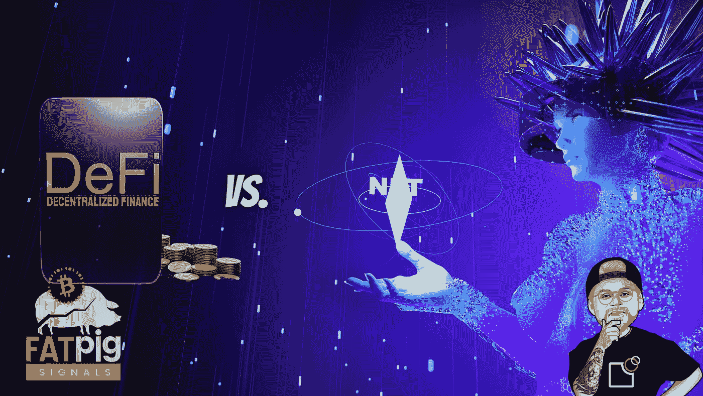

# NFT 对 DeFi——接下来是什么？

> 原文：<https://medium.com/coinmonks/nft-vs-defi-whats-next-28dd42ef02e?source=collection_archive---------8----------------------->

# 以太坊上的 NFT 活动增加——比特币在 DeFi 上输了

NFT 活动是以太坊区块链的一个重要元素。它们占网络传输的大部分。另一方面，以太坊生态系统中的比特币需求自年初以来大幅下降。