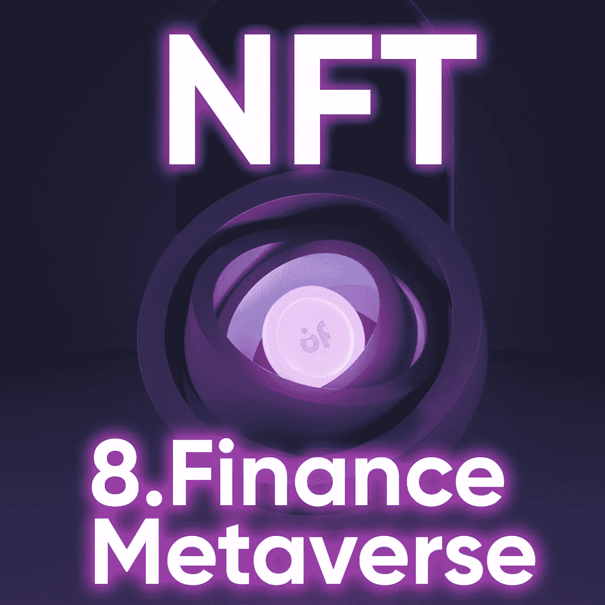

# NFT:它是什么？它将在 8 月举行。金融元宇宙？

> 原文：<https://medium.com/coinmonks/nft-what-is-it-and-will-it-be-in-8-finance-metaverse-8f62435cd9eb?source=collection_archive---------45----------------------->

您可能听说过 NFT，但是它们通常以一种复杂的方式定义。我们在 8 点。金融喜欢用简单的术语讨论复杂的事情。让我们用最简单的术语解释什么是 NFT，以及你可以用它们做什么。

NFT 代表不可替代的令牌。让我们一个一个地来研究这个问题。首先，什么是可替代的？基本上，它是你可以很容易地全部或部分交换同类东西的东西。例如，你可以把一张 100 美元的钞票换成 100 张 1 美元的钞票，或者换成 20 张 5 美元的钞票，或者换成 10 张 10 美元的钞票等等。对于 NFT，你不能这样做，因为 NFT 是不可替代的，不像加密货币本身。想象一下你最喜欢的电脑游戏，它是可替换的吗？不，你不能把它等同于任何其他电脑游戏，因为它有独特的图形，独一无二的情节，特殊的人物，等等。所以，对 NFT 来说也是一样，你不能把它换成等价的东西，但是你可以交易它，它存在于区块链。

想起了什么，不是吗？是的，这是一种资产。NFT 有唯一的编号，所以不能伪造，只能属于某个特定的人，也就是说它们是独家拥有的，但是可以公开看到和复制。与纸质资产的主要区别在于，NFT 是数字化的。这里的例子可以是绘画、游戏内购买、照片和音乐。这里的问题是，你可以复制图片，但你不能复制那张图片的 NFT，这意味着如果你有副本，你就不能成为所有者。更准确地说，如果你复制一幅画，它不会像原画那么贵，因为 NFT 和原画的所有权是独一无二的。

同样，你可以交易你的 NFT 赚钱，但是它的价格可能会根据市场而大幅波动。

# 用 NFTs 怎么赚钱？

1.  交易它。

买了卖了，轻松！其实不只是买卖，而是以更便宜的价格买入，以更高的价格卖出。这就是盈利投资的来源。为什么？首先，因为你不需要铸造它。其次，关键是要抓住合适的时机，选择合适的 NFT 购买。因此，通过购买新公司的非功能性技术来投资新公司可能是一个很好的策略。对了，想投资 8 的。金融可以有两个选择:要么购买代币(像往常一样)。或者购买在 NFT“包装”的代币。为此，您只需提供一个 BEP-20 钱包地址。顺便说一下，这种可能性将出现在 8.Finance 中。通常情况下，不可能将分配转移给另一个用户，但在 NFT 的帮助下，这是可能的。为了将分配出售给另一个用户，投资者可以在购买时通知团队，他想要在 NFT 中包装代币。他向团队提供了他的 BEP-20 钱包的地址，并在上面收到了 NFT，令牌将被“包装”在其中。然后这个位置可以卖给另一个投资者。直到 NFT 被打开，代币的归属才会开始。在这种情况下，该位置不能再出售给任何人，投资者将在 12 个月内获得令牌。授权激活是一个不可逆的过程，不可能将您的分配转回 NFT。

2.获得版税。

获得被动收入的最简单方法。想象一下，你铸造了 NFT，然后卖掉了它。首先也是最重要的，你可以很容易地证明你是最初的创造者，这些信息是被编码的，不能被伪造。你的 NFT 每卖出一次，而且可以卖出多次，你就会在你的余额上得到一个百分比。太棒了。这里复杂的是设置所有的财务问题，包括百分比本身，但这是值得的。

3.游戏。

这些游戏被称为“玩赚”(P2E)。你可以购买和交易独特的游戏物品，如头像或弹药(8。财务将引入该工具)，并获得这些项目的唯一所有权。只要你升级你的头像，NFT 的价格就会相应上涨。有些游戏甚至可以免费赠送这些 NFT，或者一开始就以很低的价格赠送。但这里值得一提的问题是，在平台之外，你仍然不拥有这些物品，但在平台之内，你可以出售它们，做任何你想做的事情。的确，这是一种更先进的赚钱方式。

4.打桩。

NFT 是收藏品。此外，这里的 staking 意味着将 NFTs 锁定在一个平台上(可以是 DeFi 平台，比如 8。Finance)来支持区块链业务以换取利润。这意味着你仍然拥有一批 NFT，同时你也因此获得了资金。8.财务部预计来自 NFT 堆栈的被动收入为项目代币的 30%。它是如何工作的？所有项目代币的 3%将在 12 个月内在持有 NFT 的用户之间进行分配。有限数量的用户可以参加:最多 10%的项目硬币可以同时下注。当 NFT 被标桩时，NFT 的所有公用设施功能保持活动状态。

# **在哪里交易 NFT**

让我们转到现有的平台，你可以交易你的非功能性交易的市场。毫无疑问，你不需要绑定到这些平台中的任何一个，你可以在没有任何中介干预的情况下出售你的 NFTs。

1.  *OpenSea* 。新手使用的最佳选择，最古老和最受欢迎的市场之一。用户可以在这里进行铸造。你可以注册免费交易现有的各种 NFT。它由以太坊、多边形、克拉廷区块链支持，接受超过 150 种加密货币。
2.  *稀有的*。第二受欢迎的平台，类似于 OpenSea。这里的主要区别是，你必须使用市场的代币 RARI 进行交易。你可以在市场上 3 个区块链中选择:以太坊，花和泰佐斯。
3.  *阿协市场*。一个游戏赚钱平台的例子。你可以在这里买头像，玩游戏升级。只要你获得新的等级或赢得新的奖励，你的 NFT 值就会上升。该市场得到了区块链以太坊的支持。
4.  *可铸造的*。要进入这个平台，你必须获得以太坊，并将你现有的钱包连接到它。但之后你就有机会免费打造自己的 NFT 了。此外，这一个非常容易使用。

# **什么是公用事业 NFT？**

基本上，这些都是有一些额外功能的非功能性食物。

1.  首先，你可以购买你的 NFT 备份的作品的物理拷贝。这里最简单的例子是一幅画。你买下这幅画(NFT)的所有权，你就得到了这幅画本身。
2.  此外，你购买 NFT 的公司可以给你提供多种发行方式。8.金融开发 NFT 赌注，参与封闭的社区活动，贵宾聊天，以及许多其他特权，也将包括在内。
3.  一般来说，升级你的游戏角色的唯一机会就是拥有一个 NFT。没有 NFT，你就不能购买游戏物品并获得更高的等级。8.如果你是 NFT 的主人，金融将免费给你神秘的蛇皮！
4.  NFT 在赌博中的另一个用途。一些赌场用 NFT 代替钱来赌博。过程是一样的，你赢得 NFT，你用 NFT 下注。

这是涵盖 NFT 话题的所有内容，我们尽了最大努力使其简单明了。8.金融仅仅处于向元宇宙引进非功能性服务业的阶段，但是他们的未来显然掌握在他们的手中！一如既往，这是一个很好的赚钱方法，但你必须做出合理的决定。或许是时候开始你自己的 NFTs 了！

> 加入 Coinmonks [电报频道](https://t.me/coincodecap)和 [Youtube 频道](https://www.youtube.com/c/coinmonks/videos)了解加密交易和投资

这篇文章中的数据已经失去了相关性；查看 [gitbook](https://8-finance.gitbook.io/wiki-eng/about/what-is-8.finance) 中的当前信息。