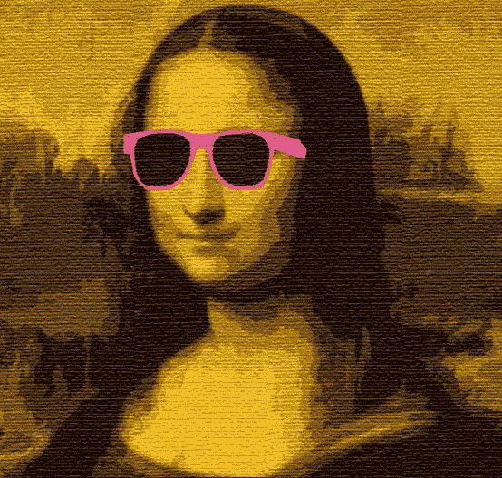

# NFTs 101

> 原文：<https://medium.com/coinmonks/nfts-101-ec0e7c8b647?source=collection_archive---------20----------------------->

“Crypto Modern Monalisa NFTs” by a digital Artist RazDazThemArtNFTS, Opensea.

看到这张图让你想起了什么？嗯，你可以说是达芬奇的《蒙娜丽莎》,我不会感到惊讶。事实上，我在想这位女士一定要去一个很棒的派对。很可能，我没有你聪明。反正来到正题，经常听到有人经常问“什么是 NFT？”

## NFTs

NFT 是不可替换令牌的首字母缩写。据 the Verge 报道，该术语…