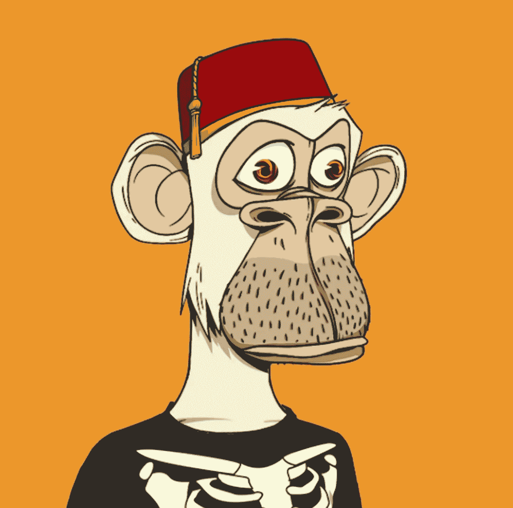

# NFTs 101:它们是什么，它们的未来是什么？

> 原文：<https://medium.com/coinmonks/nfts-101-what-are-they-and-whats-their-future-fd16f12b51f5?source=collection_archive---------47----------------------->

# 你可能听说过 NFT 氏症。在过去的 12-18 个月里，围绕它们的炒作可谓声势浩大。它们是什么？它们在未来有多重要？

NFT 主张不可替代的代币。你可以把它们想象成虚拟资产，就像棒球卡一样有价值。与一个比特币可以与另一个比特币(可替代资产)交换的加密不同，两个 NFT 不能相互交换，因为它们不具有完全相同的价值(因此有不可替代这一术语)。最受欢迎的 NFT 类型有:

1.  虚拟土地
2.  收藏品
3.  艺术
4.  域
5.  音乐
6.  摄影
7.  交易卡

你怎么能拥有一辆 NFT？为什么要拥有它？

人们可以在名为 NFT 市场的平台上购买 NFT。这些市场的例子有 [Opensea](https://opensea.io/) 、[rare](https://rarible.com/)、[币安 NFT 市场](https://www.binance.com/en/nft/home)、[比特币基地 NFT 市场](https://nft.coinbase.com/)、 [SuperRare](https://superrare.com/) 等等。你可以浏览这些市场，通过这些平台购买 NFT。两种主要的购买方式(由卖方设定)是通过拍卖或设定价格。你可以用加密货币购买 NFT，加密货币存储在与 NFT 市场链接的钱包中(例如 Metamask 钱包)。这些平台上使用的最流行的加密货币是以太，因为大多数 NFT 都存储在区块链以太坊，而以太是区块链以太坊加密货币。我将在下一节更详细地介绍这一点。

你可能想知道为什么首先要买 NFT。不同的 NFT 可以用于不同的目的，例如，有人可能会在虚拟世界和元世界中购买一块虚拟土地，如沙盒或分散土地，因为这些土地会随着时间的推移而增值，就像一块物理土地会成为一项好的投资一样。有些人购买艺术品是因为他们有一些线下世界的额外津贴，并有狂热的追随者，比如无聊猿游艇俱乐部又名 BAYC。BAYC 的所有权可以让你进入独家聚会，并允许你成为一个社区的一部分，包括史努比·道格，吉米·法伦，波斯特·马龙等人。一只无聊的猿的平均价格在 20 万美元左右。

**如何制作自己的 NFT 并出售？**

假设你是一名数字艺术家，想要将一幅作品转换成 NFT 作品，并在上述市场之一出售。将艺术品转化为 NFT 作品的过程被称为**铸造。**铸造是将您的数字资产链接到区块链的过程。生成一个代码，表示您对数字资产的所有权。将您与基础资产联系起来的代码是 NFT，存储在区块链上，但是基础资产不存储在区块链上。我将在另一篇文章中详细介绍区块链是什么，但是现在你可以把它看作一个存储信息的安全分散的网络。

一旦你的 NFT 被铸造出来，你可以选择通过拍卖或者设定一个特定的价格来出售它。**智能合约允许从一个人向另一个人出售和转让所有权的过程。**智能合同存在于区块链，基本上包括一套必须满足才能进行交易的规则。智能合同可以在不需要中介或中央机构的情况下执行。

**NFT 在中东北非地区**

阿联酋在迪拜设立了虚拟资产监管局(VARA ),开始识别和监管数字资产。根据他们的网站，他们旨在组织虚拟资产和虚拟代币的发行和交易，组织和授权虚拟资产服务提供商，确保受益人个人数据的最高保护标准，组织虚拟资产平台和投资组合的运营，监督交易和防止虚拟资产的价格操纵。

这意味着阿联酋政府将承认你拥有一个 NFT，我认为这将允许你自由买卖 NFT，以 NFT 作为抵押贷款，允许你将其传给你的子女或配偶。

**来源:**

[https://cyberscrilla.com/nft-smart-contracts-explained/](https://cyberscrilla.com/nft-smart-contracts-explained/)

[https://u . AE/en/about-the-UAE/digital-UAE/regulation-of-digital-properties](https://u.ae/en/about-the-uae/digital-uae/regulation-of-digital-properties)

 [## 无聊猿游艇俱乐部的全明星业主

### 从体育，娱乐，超越，跟踪著名的名字有买了独家…

会议室.电视](https://boardroom.tv/bored-ape-nft-celebrity-owners/) 

> 加入 Coinmonks [电报频道](https://t.me/coincodecap)和 [Youtube 频道](https://www.youtube.com/c/coinmonks/videos)了解加密交易和投资

# 另外，阅读

*   [Bitget 回顾](https://coincodecap.com/bitget-review) | [双子座 vs BlockFi](https://coincodecap.com/gemini-vs-blockfi) cmd| [OKEx 期货交易](https://coincodecap.com/okex-futures-trading)
*   [AscendEx Staking](https://coincodecap.com/ascendex-staking)|[Bot Ocean Review](https://coincodecap.com/bot-ocean-review)|[最佳比特币钱包](https://coincodecap.com/bitcoin-wallets-india)
*   [霍比审核](https://coincodecap.com/huobi-review) | [OKEx 保证金交易](https://coincodecap.com/okex-margin-trading) | [期货交易](https://coincodecap.com/futures-trading)
*   [网格交易机器人](https://coincodecap.com/grid-trading) | [Cryptohopper 审查](/coinmonks/cryptohopper-review-a388ff5bae88) | [Bexplus 审查](https://coincodecap.com/bexplus-review)
*   [7 个最佳零费用加密交易平台](https://coincodecap.com/zero-fee-crypto-exchanges)
*   [氹欞侊贸易评论](https://coincodecap.com/anny-trade-review) | [霍比保证金交易](/coinmonks/huobi-margin-trading-b3b06cdc1519)