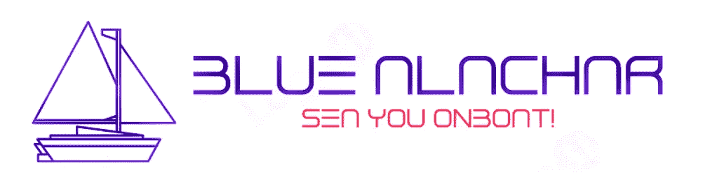
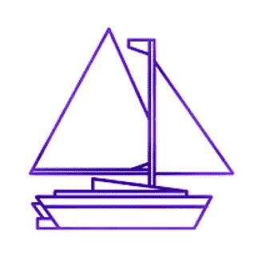

# NFT，一个新的全球资产类别:蓝色阿拉查尔项目

> 原文：<https://medium.com/coinmonks/nfts-a-new-global-asset-class-blue-alachar-project-7736f78f605a?source=collection_archive---------54----------------------->

BLUE ALACHAR 是一个利用区块链技术创造一种新型数字资产的项目:标记化的船只。该项目将船只虚拟化，作为船主和投资者的额外资产和低成本融资。在过去，很难为一个项目筹集资金。如今，正是由于区块链的技术，项目现在可以通过早期投资者和支持者筹集资金。

BLUE ALACHAR 项目正在通过 NFTs 和令牌化构建一个新的全球资产类别。这不仅仅是一艘象征性的船。这将是经济体系从根本原则上的彻底转变，是金融模式从根本上的彻底转变，甚至是数字资产类别的世界范式。

区块链支持的资产是尚未被深入探索的最有前景的新兴资产类别之一。BLUE ALACHAR 是一艘资产支持的令牌化船只，可用于在世界各地购买和交易自己的 NFT。蓝色阿拉查尔项目是一个位于区块链的项目。

BLUE ALACHAR 希望创建一个新的全球资产类别，以取代现金作为商业交易的支付手段。这些资产由固定在区块链上的实物资产(船舶)支持，从而以最小的风险和最大的安全性实现低成本交易。

BLUE ALACHAR 的目标是成为一个稳定的全球资产类别，提供多样化、低区块链费用和数字分销渠道。BLUE ALACHAR 正寻求引入一种全新的全球资产类别。BLUE ALACHAR 是加密资产生态系统中的第一个此类项目。它旨在为世界各地的人们提供一种投资工具，这种投资工具能够带来稳定性，并且区块链交易费用低于当今市场上的大多数其他加密资产。BLUE ALACHAR 项目建立在 Polygon Blockchain 之上，该项目为其用户提供了低区块链费用和许多其他好处。

**我们的社交媒体渠道:**

**网页:www.alachar.blue**

**Instagram: @alachar.blue**

**推特:@alacharblue**

**LinkedIn:@ bluealchar**

**不和:@alachar.blue**

**中等:@alachar.blue**

**GitHub: @alachar.blue**

**Tumblr: @alacharblue**

关注我们，保持关注！！

> 加入 Coinmonks [电报频道](https://t.me/coincodecap)和 [Youtube 频道](https://www.youtube.com/c/coinmonks/videos)了解加密交易和投资

# 另外，阅读

*   [3 商业评论](/coinmonks/3commas-review-an-excellent-crypto-trading-bot-2020-1313a58bec92) | [Pionex 评论](https://coincodecap.com/pionex-review-exchange-with-crypto-trading-bot) | [Coinrule 评论](/coinmonks/coinrule-review-2021-a-beginner-friendly-crypto-trading-bot-daf0504848ba)
*   [莱杰 vs n rave](/coinmonks/ledger-vs-ngrave-zero-7e40f0c1d694)|[莱杰 nano s vs x](/coinmonks/ledger-nano-s-vs-x-battery-hardware-price-storage-59a6663fe3b0) | [币安评论](/coinmonks/binance-review-ee10d3bf3b6e)
*   [Bybit Exchange 审查](/coinmonks/bybit-exchange-review-dbd570019b71) | [Bityard 审查](https://coincodecap.com/bityard-reivew) | [Jet-Bot 审查](https://coincodecap.com/jet-bot-review)
*   [3 commas vs crypto hopper](/coinmonks/3commas-vs-pionex-vs-cryptohopper-best-crypto-bot-6a98d2baa203)|[赚取加密利息](/coinmonks/earn-crypto-interest-b10b810fdda3)
*   最好的比特币[硬件钱包](/coinmonks/hardware-wallets-dfa1211730c6) | [BitBox02 回顾](/coinmonks/bitbox02-review-your-swiss-bitcoin-hardware-wallet-c36c88fff29)