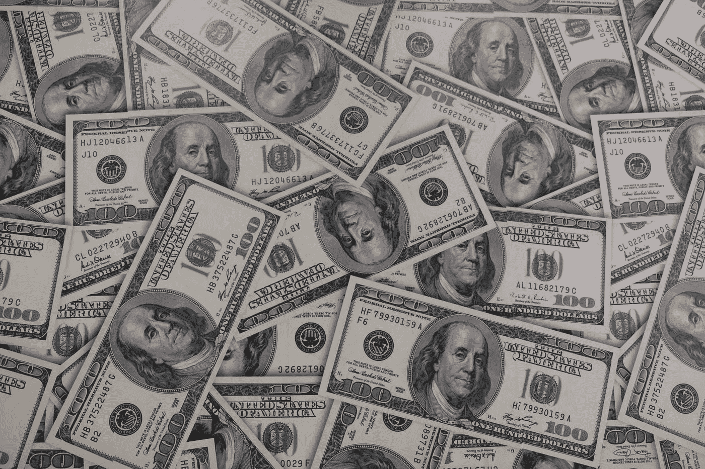

# NFTs:犯罪分子用来洗钱和资助恐怖组织的工具

> 原文：<https://medium.com/coinmonks/nfts-a-tool-used-by-criminals-to-launder-money-and-fund-terror-organisations-589ec06fe508?source=collection_archive---------33----------------------->

不可替代代币( **NFTs** )的兴起为继续探索区块链技术中的创意媒体和金融创新提供了机遇。然而，全球范围内与艺术品相关的 NFT 交易量也为将非法交易伪装成合法商业交易提供了机会。虽然人们早就知道高价值艺术品可能是清洗非法所得的渠道，但本文将试图研究非正规金融交易如何特别容易被犯罪分子滥用，以及监管当局应采取哪些措施来减少通过非正规金融交易清洗非法所得的行为。

**新兴的数字艺术市场**

2021 年，NFT 全球交易总额跃升 21，350%，超过 170 亿美元。根据《财富》杂志的文章[，在去年参与购买非功能性钱包的大约 200 万个活跃钱包中，有 473 个产生了至少 100 万美元的利润。](https://fortune.com/2022/03/10/bored-apes-cryptopunks-jolt-nft-market-to-billions-in-sales/#:~:text=According%20to%20Thursday's%20NonFungible.com,from%20%2482.5%20million%20in%202020.)

那么，为什么非功能性测试变得如此流行呢？

根据[gray Investments](https://www.globenewswire.com/news-release/2021/12/06/2346525/0/en/Grayscale-Investments-Study-Reveals-More-than-a-Quarter-of-U-S-Investors-Currently-Own-Bitcoin.html)进行的一项研究，超过 55%的投资者去年首次投资比特币。一旦你开始在数字钱包中持有比特币和以太坊等虚拟资产，个人就可以更容易地探索和交易 NFT 和其他形式的虚拟资产。

此外，在世界各地的名人和国际企业集团中出现了爆炸性的反应。昆汀·塔伦蒂诺、[威肯](https://uproxx.com/music/the-weeknd-nft-series-billboard-tom-brady-autograph/)、[宝马](https://www.adweek.com/brand-marketing/bmw-catalogues-combustion-engine-noises-as-nfts/)、[迪士尼](/veve-collectibles/disney-golden-moments-walt-disney-mickey-mouse-9821fb07fdd7)和[派拉蒙](https://www.theverge.com/2022/4/6/23013716/paramount-nft-marketplace-star-trek-collectable-ships)都加入了这股潮流，推出了自己成功的 NFT 项目。

**NFTs 及其漏洞**

> 非功能性测试的价值取决于是否有人愿意为其付费。

The Bored Ape Yacht Club is a collection of 10,000 unique Bored Ape NFTs. The most expensive BAYC NFT sold for 769 ETH (equivalent to US$ 2,185,498)

NFTs 和高价值艺术品市场具有某些固有的特征，这使得它们容易受到洗钱的影响( **ML** )。这些品质包括以下内容:

*   与其他零售商品和商品相比，艺术品的价值相对较高；
*   高价值艺术品市场的历史不透明性；
*   主观的 NFT 估值和缺乏稳定和可预测的定价；和
*   在客户保持匿名的情况下，利用第三方中介购买、出售和持有艺术品。

NFT 还可用于进行自我洗钱，犯罪分子利用非法资金购买 NFT，并与自己进行交易，从而在区块链网络上创建记录。同样，犯罪分子甚至可以创建他们自己的 NFT 项目，并向不知情的个人出售他们的 NFT。区块链交易固有的转移便利性和匿名性使非金融交易最容易受到犯罪分子的利用，因为清洗非法资金的过程可以轻而易举地进行。

此外，NFT 最大的市场 OpenSea 并不要求其客户提供了解客户的信息，许多其他 NFT 平台也是如此。这意味着买方和卖方不知道他们在和谁交易，这就产生了明显的洗钱风险。

**反洗钱/CFT 和某些 NFT 市场的风险**

在毛里求斯，反洗钱和打击资助恐怖主义(**反洗钱/CFT** )法律及其法规要求金融机构建立并实施反洗钱/CFT 计划。作为反洗钱/CFT 计划的一部分，金融机构必须查明和核实法律实体受益所有人的身份，并在知道、怀疑或有理由怀疑资金没有明显的合法目的或涉及利用金融机构进行犯罪和/或非法活动时提交可疑交易报告。

虽然法律要求作为金融机构的银行建立和维护有效的反洗钱/CFT 计划，包括基于风险的适当程序，以进行持续的客户尽职调查，但通常情况下，艺术品市场参与者不属于“金融机构”的定义范围，因此不需要遵守对金融机构施加的反洗钱/CFT 门槛。

此外，根据毛里求斯的相关反洗钱/CFT 法律，某些 NFT 市场不一定被视为金融机构，这可能会产生重大的反洗钱/CFT 缺口，应由毛里求斯金融服务委员会(**【FSC**)解决，而《2021 年虚拟资产和初始令牌提供服务法案》(**《2021 年虚拟令牌法》**)仍处于初期阶段。

**建议**

新兴的 NFT 市场带来了反洗钱/CFT 风险，FSC 必须解决这些风险，以确保毛里求斯遵守打击和减轻反洗钱和恐怖融资风险的国际倡议。《2021 年虚拟财产法》未涵盖的数字艺术市场和其他虚拟财产服务提供商存在洗钱漏洞，FSC 应该从一开始就解决这些漏洞。

因此，建议扩大《2021 年虚拟财产法》的范围，以确保《2021 年虚拟财产法》未涵盖的、寻求为非金融交易提供市场的任何虚拟资产服务提供商受到 FSC 的严格监督。这些实体应遵守与“金融机构”相同的反洗钱/CFT 标准，因为它们最容易被犯罪分子滥用。因此，建议 FSC 注意这一缺陷，并规定此类监管义务，以维护和提高毛里求斯在金融服务部门的良好声誉。

ayyan Sorefan 被授予英格兰、威尔士和毛里求斯的律师资格。他是普华永道法律部(毛里求斯)的高级助理律师。他的业务重点是金融科技、公司法以及银行和金融。

欲了解更多信息，请联系 rayyan.sorefan@pwc.com 的雷扬

*本文旨在提供信息，仅阐述出版之日适用的毛里求斯法律的一般原则。它仅提供一般概述，并不构成或取代全面的法律意见，我们建议您在就虚拟资产相关事宜采取任何行动之前寻求全面的法律意见。*

> 加入 Coinmonks [电报频道](https://t.me/coincodecap)和 [Youtube 频道](https://www.youtube.com/c/coinmonks/videos)了解加密交易和投资

# 另外，阅读

*   [Bookmap 评论](https://coincodecap.com/bookmap-review-2021-best-trading-software) | [美国 5 大最佳加密交易所](https://coincodecap.com/crypto-exchange-usa)
*   最佳加密[硬件钱包](/coinmonks/hardware-wallets-dfa1211730c6) | [Bitbns 评论](/coinmonks/bitbns-review-38256a07e161)
*   [新加坡十大最佳加密交易所](https://coincodecap.com/crypto-exchange-in-singapore) | [购买 AXS](https://coincodecap.com/buy-axs-token)
*   [红狗赌场评论](https://coincodecap.com/red-dog-casino-review) | [Swyftx 评论](https://coincodecap.com/swyftx-review) | [CoinGate 评论](https://coincodecap.com/coingate-review)
*   [投资印度的最佳密码](https://coincodecap.com/best-crypto-to-invest-in-india-in-2021)|[WazirX P2P](https://coincodecap.com/wazirx-p2p)|[Hi Dollar Review](https://coincodecap.com/hi-dollar-review)