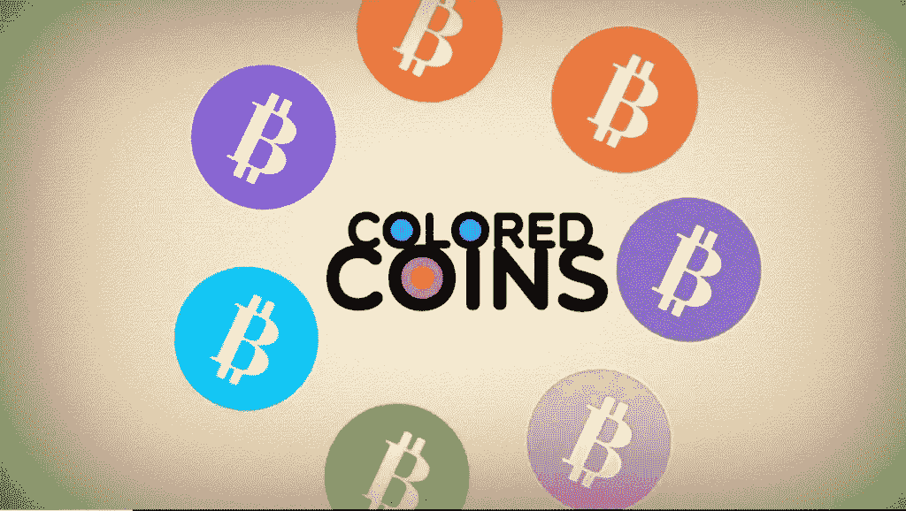
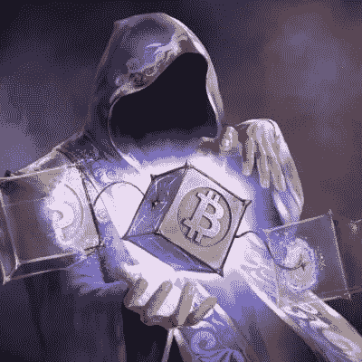

# NFTs 及其创建背后的历史

> 原文：<https://medium.com/coinmonks/nfts-and-history-behind-their-creation-8436c8be9f6a?source=collection_archive---------5----------------------->

> "我把这首关于 NFTs 的歌作为 NFT 来卖."
> 
> -埃隆·马斯克

NFT 代表不可替代的令牌。不可替换，这意味着它们不能交换/复制/替换，因为它们是唯一的。货币是一种可替代的资产——它是一种可以用货币兑换单位的东西，一张 20 美元可以换成两张 10 美元，而且价值不变。

NFT 是数字世界中正在崛起的资产。NFT 现在是主流趋势的一部分。从大品牌到创业公司，每个人都在计划或已经进入该领域。这是一个新兴市场，目前，NFT 的交易额为 100 万美元.但是，一切是如何开始的，这个上升的资产是如何被发现的？

> **NFTs 的发明**
> 
> NFT 或不可替代令牌由凯文·麦考伊和阿尼尔·达什于 2014 年 5 月 3 日在纽约新博物馆举行的七对七会议现场首次创造。这是通过链上元数据(由 Namecoin 支持)创建的第一个不可替换令牌实验，它与一件独特的艺术品相关联。

# 彩色硬币:2012 年

根据比特币维基的说法，彩色硬币描述了一类在**比特币** **区块链之上表示和管理**现实世界资产**的方法。**那么这意味着什么呢？嗯，它们是代表区块链现实世界资产的代币，就像从债券到房地产或股票的任何东西一样，我们需要的只是一项资产，并可以用来证明这些实物资产的所有权。有色硬币被认为是比特币 2.0 的开端，但它有一个问题，那就是它只能代表某些需要所有人同意的价值。因此，如果 5 个人同意 10 个彩色硬币代表 10 辆汽车，但后来如果其中一个人不同意，不把 10 个彩色硬币等同于 10 辆汽车，整个系统就会崩溃。他们失败的另一个原因是以太坊区块链的建立和相当大规模的 ERC-20 代币的采用。因为比特币区块链从来不是为此目的而创建的，而以太坊区块链是更好的解决方案。

但是失败给我们展示了新的道路，有色硬币也是如此。他们失败了，但催生了新的实验和新的研究。

# 交易对手:2014 年

在彩色硬币失败后，人们很快意识到比特币不是为了这些目的。新技术的出现只是时间问题。2014 年，Robert Dermody、Adam Krellenstein 和 Evan Wagner 成立了 Counterparty，这是一个点对点金融平台，是基于比特币区块链的分布式开源互联网协议。它催生了几个新的实验和项目。交易对手分散了交易所，还推出了本币 XCP，该货币于 2014 年 1 月问世。它有许多项目和资产，包括一个交易纸牌游戏和 meme trading。

# 交易对手的起源咒语:2015 年

《创世纪之咒》是第一款基于区块链的手机游戏。《创世纪的咒语》保持着 2017 年第一款采用区块链技术的手机游戏的记录。2015 年，他们发行了第一批可以在他们的游戏中使用的令牌化收藏品。它们是第一个推出 ICO 的项目。他们还推出了用于基金开发的游戏内货币“比特晶体”。

# 意志力:2016 年

交易对手上的卡牌游戏，2016 年 8 月，热门卡牌交易游戏《意志力》进入区块链空间。交易对手凭借意志力在交易对手平台上推出他们的卡。这款游戏在北美获得了巨大的成功。意志的力量也在 2016 年推出了他们的代币“WILLCOIN”。这是一个新事物，但它推动了 NFT 空间的发展，将这些资产放在区块链是新的、有价值的。

# 罕见的人:2016 年

正如人们开始在交易对手上交易迷因之前所讨论的。人们开始发行迷因作为交易对手的资产。你会说，迷因真的吗？，但没错，在 2016 年 9 月，第一批罕见的 Pepes 在比特币上的 428919 号区块被开采出来，这比基于以太坊的 NFT 更早。人们、艺术家、创作者尝到了秘密艺术的滋味，尽管它们只是迷因，但对交易对手和 NFT 空间来说是一个巨大的推动。

# 以太坊上的稀有人物:2017 年

以太坊在 2017 年初受到欢迎，这是一个可以处理此类数字资产的区块链，导致 Peperium 在 2017 年 3 月发布。Peperium 是一个分散的迷因市场和交易卡游戏，允许任何创造迷因的人在 IPFS 和以太坊永久存在。

# 加密朋克:2017 年 6 月

有趣且最大的 NFT 项目之一。你可能早就听说过这个项目。密码朋克是储存在[以太坊](https://beincrypto.com/price/ethereum/)区块链上的 10000 个独特的可收集角色，并附有所有权证明。也就是说，它们是 24×24 像素有趣的小波普艺术肖像，由算法生成并标记化。由两位加拿大软件开发人员 Matt Hall 和 John Watkinson 创建，他们受到了伦敦朋克场景、电子音乐和赛博朋克运动的启发。

2021 年 8 月 28 日，CryptoPunks **的销售额突破了 10 亿美元**大关**。它成为继 Axie Infinity 之后第二个实现这一里程碑的 NFT 项目。**

隐朋克为 NFT 的繁荣奠定了基础。今天，由于它们的稀有性和独特性，它们在 NFT 社区经常被用作身份的象征。这可能很难相信，但它们在 2017 年免费发布。

CryptoPunk 7523 是最罕见的外星朋克，带着金耳环、红色针织帽和医用口罩，也是有史以来最昂贵的 CryptoPunk，在 2021 年 6 月的苏富比拍卖会上，亿万富翁 Shalom Mechenzie 以疯狂的 1170 万美元的价格售出。

# crypto kitties:2017 年 10 月

CryptoKitties 是第一个建立在以太网上的游戏。CryproKitties 是一款位于区块链的虚拟游戏，允许玩家购买、出售、收养和繁殖数码猫。这款游戏是由一家名为 Axiom Zen 的加拿大公司推出的。alpha 版本是由开发人员在 ETH Waterloo Hackathon 期间发布的，ETH Waterloo Hackathon 是世界上最大的以太坊生态系统黑客马拉松。有超过 400 名开发者参加，这是介绍游戏的最佳地点和时间。CryptoKitties 团队在黑客马拉松中赢得了第一名，游戏迅速火了起来。

CryptoKitties 最初是在区块链以太坊建造的，但是它的流行凸显了区块链以太坊的几个问题。由于几个问题，CryptoKitties 决定转移到他们专用的区块链，流。此举为游戏带来了几个新功能。

> CryptoKitties 的 3D 设计和动画。

>可扩展性，使更多的人能够在任何给定时间使用网络。

>自由参与能力，因为 Flow 使用[利益证明](https://decrypt.co/resources/concensus)共识模型。

>在基于 Flow 的其他游戏中使用 CryptoKitties 的能力。

# 演进:2018 -2021 年

社区和技术每天都在发展。从 2018 年到 2021 年，NFT 慢慢进入了公众的视野。特别是 2021 年，NFT 太空事业经历了巨大的发展。

2018 年，NFT 有 100 多个项目。Opensea 和 SuperRare 等大型 NFT 市场于 2018 年推出。

2019 年 3 月 21 日，封锁，以太上的首次大规模空投——向以太坊上的 OG OpenSea 用户钱包空投了 6,150 NFTs。

2019 年 8 月，Rendar Gallery，第一街艺术 NFT 画廊在元宇宙开幕。

在这里跟随 NFT 时间线[。](https://nfttimeline.com/)

Cryptokitties 就像是太空的助推器。从无到有，NFT 空间一直在快速增长。每年项目的数量和市场的价值都在增长。如果你像我一样是一个密码爱好者，那么我猜你已经知道 2021 年对 NFTs 来说是怎样的。

我们看到一些数字艺术家一夜之间变成了百万富翁。从著名的艺术家如帕克，比尔。数码艺术家毕普是 NFT，《最初的 5000 天》——6900 万美元，是有史以来卖出的最贵 NFT 的纪录保持者。

# 2022 年—下一个

我相信这个空间会越来越大，不仅仅是 NFTs，整个区块链和加密空间都有很多机会和潜力。这仍然是开始阶段，我们有很多要注意的。我所能说的就是让你自己了解这个空间的最新情况，我不可能预测未来，但它不会和现在一样。

> 任何可以想象成供应链的东西，区块链都可以极大地提高其效率——不管是人、数字、数据还是金钱。
> 
> [-吉妮·罗梅蒂，IBM 首席执行官](https://en.wikipedia.org/wiki/Ginni_Rometty)

> 加入 Coinmonks [电报频道](https://t.me/coincodecap)和 [Youtube 频道](https://www.youtube.com/c/coinmonks/videos)了解加密交易和投资

## 另外，阅读

*   [3 商业评论](/coinmonks/3commas-review-an-excellent-crypto-trading-bot-2020-1313a58bec92) | [Pionex 评论](https://blog.coincodecap.com/pionex-review-exchange-with-crypto-trading-bot) | [Coinrule 评论](/coinmonks/coinrule-review-2021-a-beginner-friendly-crypto-trading-bot-daf0504848ba)
*   [莱杰 vs n rave](/coinmonks/ledger-vs-ngrave-zero-7e40f0c1d694)|[莱杰 nano s vs x](/coinmonks/ledger-nano-s-vs-x-battery-hardware-price-storage-59a6663fe3b0) | [币安评论](/coinmonks/binance-review-ee10d3bf3b6e)
*   [Bybit Exchange 审查](/coinmonks/bybit-exchange-review-dbd570019b71) | [Bityard 审查](https://blog.coincodecap.com/bityard-reivew) | [Jet-Bot 审查](https://blog.coincodecap.com/jet-bot-review)
*   [3 commas vs crypto hopper](/coinmonks/3commas-vs-pionex-vs-cryptohopper-best-crypto-bot-6a98d2baa203)|[赚取秘密利息](/coinmonks/earn-crypto-interest-b10b810fdda3)
*   最好的比特币[硬件钱包](/coinmonks/hardware-wallets-dfa1211730c6) | [BitBox02 回顾](/coinmonks/bitbox02-review-your-swiss-bitcoin-hardware-wallet-c36c88fff29)
*   [BlockFi vs Celsius](/coinmonks/blockfi-vs-celsius-vs-hodlnaut-8a1cc8c26630)|[Hodlnaut 点评](/coinmonks/hodlnaut-review-best-way-to-hodl-is-to-earn-interest-on-your-bitcoin-6658a8c19edf) | [KuCoin 点评](https://blog.coincodecap.com/kucoin-review)
*   [Bitsgap 审查](/coinmonks/bitsgap-review-a-crypto-trading-bot-that-makes-easy-money-a5d88a336df2) | [Quadency 审查](/coinmonks/quadency-review-a-crypto-trading-automation-platform-3068eaa374e1) | [Bitbns 审查](/coinmonks/bitbns-review-38256a07e161)
*   [密码本交易平台](/coinmonks/top-10-crypto-copy-trading-platforms-for-beginners-d0c37c7d698c) | [Coinmama 审核](/coinmonks/coinmama-review-ace5641bde6e)
*   [印度的加密交易所](/coinmonks/bitcoin-exchange-in-india-7f1fe79715c9) | [比特币储蓄账户](/coinmonks/bitcoin-savings-account-e65b13f92451)
*   [OKEx vs KuCoin](https://blog.coincodecap.com/okex-kucoin) | [摄氏替代品](https://blog.coincodecap.com/celsius-alternatives) | [如何购买 VeChain](https://blog.coincodecap.com/buy-vechain)
*   [币安期货交易](https://blog.coincodecap.com/binance-futures-trading)|[3 commas vs Mudrex vs eToro](https://blog.coincodecap.com/mudrex-3commas-etoro)
*   [如何购买 Monero](https://blog.coincodecap.com/buy-monero) | [IDEX 评论](https://blog.coincodecap.com/idex-review) | [BitKan 交易机器人](https://blog.coincodecap.com/bitkan-trading-bot)