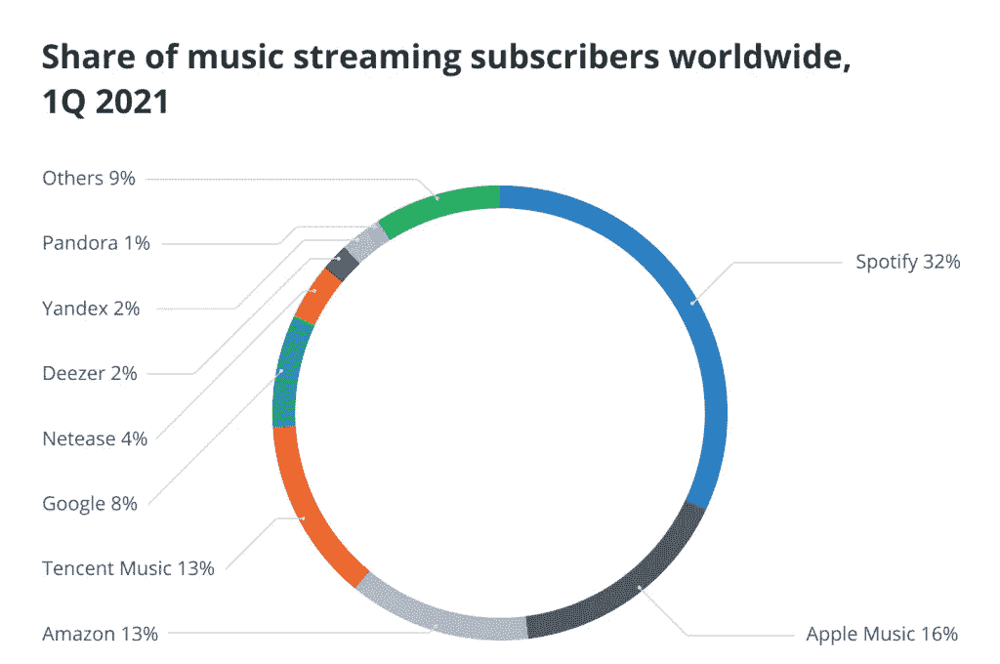
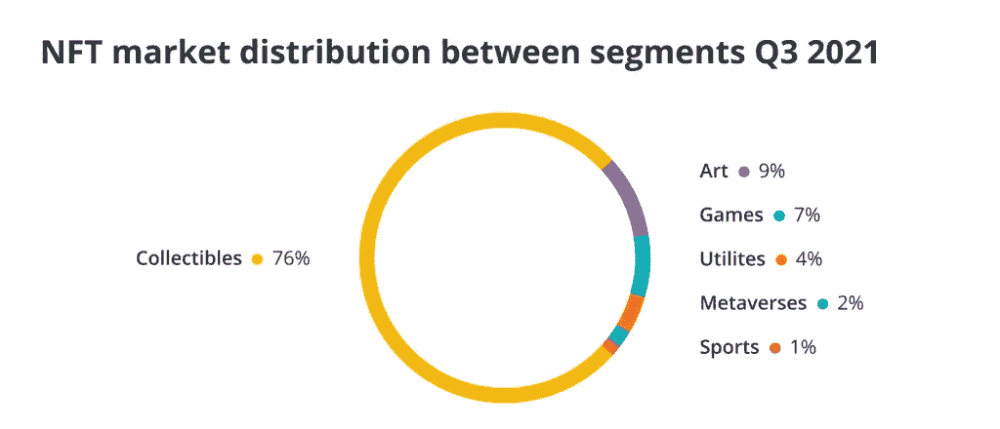
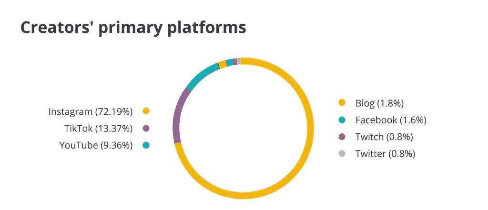

# 由于创意经济的快速增长，NFTs 和 Web3 正在成为为艺术家和音乐家提供更多财务稳定性和自主权的工具

> 原文：<https://medium.com/coinmonks/nfts-and-web3-are-becoming-tools-for-offering-artists-and-musicians-more-financial-stability-and-feba4fbb812e?source=collection_archive---------20----------------------->

**Visit our website:-** [**https://bitcoinsupports.com/**](https://bitcoinsupports.com/)

由于创意经济的快速增长，NFTs 和 Web3 正在成为为艺术家和音乐家提供更多财务稳定性和自主权的工具。

根据 IFPI 的《全球音乐报告》，音乐产业将在 2021 年创造 259 亿美元的唱片销售额，比 2020 年增长 18.5%。流媒体占了约 260 亿美元增长的大部分，比 2020 年增长了 24.3%。这些趋势对于新一代 NFT 音乐人来说是令人鼓舞的，它们强调了对音频和视频内容的需求。

流媒体将继续存在，即使它的实现方式发生了变化——从 Spotify 这样的集中式平台到分散式的 NFT 市场。随着印刷媒体迅速衰落，流媒体的兴起是媒体和娱乐向数字材料转移的一部分。几年前，数字媒体开始取代印刷媒体，对行业产生了重大影响。经济学家认为，向国家数字媒体的转变与地方报纸的崩溃有关，这有助于解释政治和对国家问题的关注。

**Visit our website:-** [**https://bitcoinsupports.com/**](https://bitcoinsupports.com/)

然而，在新兴的 Web3 时代，我们有潜力以不同的方式做事。个体音乐家现在开始铸造他们自己的 NFT 并进行营销，保留大部分收入，而不是交给唱片公司或其他中介。

**创建社区**

很多作家都已经提到了社区建设对于 NFT 创业成功的重要性。NFT 艺术家必须依靠自己的网络和个人关系来传播信息，因为没有一个集中的平台可以帮助他们大规模传播。在许多方面，这需要一套不同于音乐创作的能力，尤其是各种软技能以及一些财务知识——至少足以知道何时对机会说是或不是。

**Visit our website:-** [**https://bitcoinsupports.com/**](https://bitcoinsupports.com/)

另一方面，传统音乐节目不教授这些技能。相反，他们非常重视声音技巧和音乐史，这两者在某种程度上是有益的，但不足以成为一名成功的音乐家。这就是为什么唱片公司和中央集权的公司如此有用:它们填补了许多音乐人由于自身没有过错而产生的空白。

然而，社区建设不仅仅是一种简单的推销 NFT 的技巧；这也是一个高度复杂和动态的过程，融入到艺术家的潜在作品中。不幸的是，传统的媒体和娱乐集权模式要求音乐人不仅要放弃很大一部分潜在收入，还要放弃他们的权利和控制权。没有主人的允许，他们甚至不能决定自己的音乐。虽然有些人可能还能接受，但艺术家们一般都不愿放弃创作自由和控制，尤其是在他们没有得到足够补偿的情况下。表演艺术家的工资预计将在未来几年缓慢增长，这意味着除非我们偏离当前的道路，否则不会有什么变化。

音乐从来就不是为了中央集权。艺术家创造难忘的经历供人们分享。所有的音乐家都遭受了损失，这通常不是因为缺乏技能，而是因为缺乏金融和商业经验，导致他们与唱片公司签订了不符合他们利益的合同。幸运的是，去中心化的解决方案正变得越来越普遍，最近推出了 MuseDAO，它希望将古典音乐家联系在一起，组织本地聚会和聚会，目的是欣赏和发展文化。

**完全身临其境的数字邂逅**

我们不必走远就能见证技术娴熟的音乐人带回家的横财，贾斯汀·布劳(Justin Blau)是去年推出紫外线 NFT 专辑的先行者之一，他的艺名 3LAU 更为人所知。DJ 兼制作人 LAU 讲述他和区块链的经历。另一方面，最近的流媒体数据显示，流媒体之外的音乐非功能性传播的受众越来越多——如果这就是全部的话，我们预计会有稳定的增长，而不是指数增长。在传统印刷媒体的地方，我们看到了持续的势头，因为人们寻求更多的音频和视频材料来消费和丰富他们的生活。

NFT 有潜力在创意经济中开辟一个全新的市场。如果我们把艺术家——以及一般的内容提供者——看作是帮助他人建立体验的人，那么 NFTs 就成了传播和认证独特艺术内容的工具。

**Visit our website:-** [**https://bitcoinsupports.com/**](https://bitcoinsupports.com/)

虽然有人在谈论在元宇宙购买与音乐相关的非功能性电视节目——最主要的是为了时尚，但想象一下，如果制作人在元宇宙合作，创造身临其境的数字体验，同时集成音频、视频和其他可能的材料形式。可能性是无穷无尽的，NFTs 不仅仅可以用于娱乐目的；这种身临其境的体验也可以直接促进教育和培训需求。

虽然已经有多个例子，但亚利桑那州立大学在 2020 年与 Dreamscape Immersive 合作推出了 Dreamscape Learn 计划。正如亚利桑那州立大学校长迈克尔·克罗所说:

“我们早就认识到，将虚拟现实及其在教育和社交方面的所有功能与先进的适应性教育体验相结合，有可能为孩子们开辟新的学习视野。”

最近流媒体收入的激增和音乐行业的扩张对所有内容创作者来说都是好消息。因为数据显示需求超过供应，NFTs 和 Web3 技术能够很好地帮助创作者利用这些趋势，不仅在经济上变得可行，而且为整个社会创造更加迷人和身临其境的元宇宙体验。

**访问我们的网站:-**[**https://bitcoinsupports.com/**](https://bitcoinsupports.com/)

**免责声明:以上为作者观点，不应视为投资建议。读者应该自己做研究。**

> 加入 Coinmonks [电报频道](https://t.me/coincodecap)和 [Youtube 频道](https://www.youtube.com/c/coinmonks/videos)了解加密交易和投资

# 另外，阅读

*   [3 商业评论](/coinmonks/3commas-review-an-excellent-crypto-trading-bot-2020-1313a58bec92) | [Pionex 评论](https://coincodecap.com/pionex-review-exchange-with-crypto-trading-bot) | [Coinrule 评论](/coinmonks/coinrule-review-2021-a-beginner-friendly-crypto-trading-bot-daf0504848ba)
*   [莱杰 vs n rave](/coinmonks/ledger-vs-ngrave-zero-7e40f0c1d694)|[莱杰 nano s vs x](/coinmonks/ledger-nano-s-vs-x-battery-hardware-price-storage-59a6663fe3b0) | [币安评论](/coinmonks/binance-review-ee10d3bf3b6e)
*   [Bybit 交易所评论](/coinmonks/bybit-exchange-review-dbd570019b71) | [Bityard 评论](https://coincodecap.com/bityard-reivew) | [Jet-Bot 评论](https://coincodecap.com/jet-bot-review)
*   [3 commas vs crypto hopper](/coinmonks/3commas-vs-pionex-vs-cryptohopper-best-crypto-bot-6a98d2baa203)|[赚取加密利息](/coinmonks/earn-crypto-interest-b10b810fdda3)
*   最好的比特币[硬件钱包](/coinmonks/hardware-wallets-dfa1211730c6) | [BitBox02 回顾](/coinmonks/bitbox02-review-your-swiss-bitcoin-hardware-wallet-c36c88fff29)